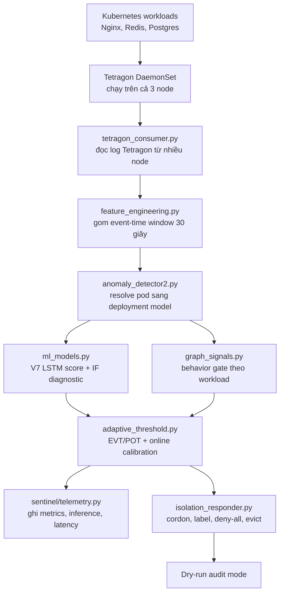

# Báo cáo kỹ thuật: eBPF Runtime Sentinel cho Kubernetes

**Ngày xác minh:** 2026-07-26, 14:50 UTC  
**Workspace local:** `/home/tndat/Downloads/eBPF-project`  
**Máy cluster:** `dat@10.1.16.234:/home/dat/ml-service`  
**Phiên bản đang deploy:** V7 phase-stratified robust-tail LSTM  
**Chế độ phản ứng:** audit/dry-run, tức là hệ thống ghi log hành động cô lập nhưng chưa thật sự cordon/evict pod

## Tóm tắt

Dự án này xây dựng một hệ thống phát hiện bất thường runtime cho Kubernetes bằng eBPF/Tetragon kết hợp machine learning. Thay vì chỉ nhìn log ứng dụng, hệ thống quan sát hành vi thật ở tầng kernel, cụ thể là syscall của container. Dòng dữ liệu từ Tetragon được đọc trên cả 3 node, gom thành cửa sổ 30 giây theo từng workload, đưa vào mô hình V7 LSTM Autoencoder để chấm điểm bất thường, sau đó kiểm tra thêm bằng behavior gate theo từng workload trước khi tạo cảnh báo.

Phiên bản hiện tại đã được promote vào thư mục production model trên cluster và chạy liên tục hơn 4 ngày. Kết quả đã xác minh qua SSH cho thấy:

- 3/3 node Kubernetes Ready;
- Tetragon chạy đủ trên 3 node;
- detector service đang active;
- model V7 đang được load từ `/home/dat/ml-service/models`;
- test trên VM pass `35/35`;
- live log mới nhất ghi hơn 108k cửa sổ đã xử lý và `anomalies=0`;
- validation attack đạt 15/15 detection trên Nginx, Redis và Postgres;
- normal validation và post-promotion soak không có false positive alert.

Điểm quan trọng nhất: latency hiện tại khoảng 58 giây không phải do model chậm. Inference của model chỉ khoảng 20 ms mỗi cửa sổ. Latency cao chủ yếu do thiết kế cố ý yêu cầu 2 cửa sổ liên tiếp, mỗi cửa sổ 30 giây, để giảm false positive.

## 1. Mục tiêu nghiên cứu

Câu hỏi nghiên cứu chính của dự án là:

> Có thể xây dựng một runtime sentinel cho Kubernetes học hành vi bình thường từ dữ liệu eBPF/Tetragon thật, phát hiện hành vi tấn công ở tầng kernel theo thời gian thực, và kích hoạt luồng cô lập pod với rủi ro false positive thấp hay không?

Phạm vi hiện tại là vertical slice ở tầng syscall. Nghĩa là hệ thống đã hoàn thiện tương đối tốt cho bài toán quan sát syscall của workload phổ biến như Nginx, Redis và Postgres. Phần MCP/TLS uprobe và Graph Attention Network trong file `Agent_Runtime_Sentinel_Build_Spec.md` vẫn là hướng mở rộng V2, chưa được claim là đã deploy.

## 2. Trạng thái hiện tại đã xác minh bằng SSH

Các thông tin dưới đây được kiểm tra trực tiếp trên `dat@10.1.16.234` vào ngày 2026-07-26.

| Thành phần | Trạng thái đã xác minh |
|---|---|
| Kubernetes cluster | 3 node Ready: `k8s-master.local`, `k8s-worker1.local`, `k8s-worker2.local` |
| Kubernetes version | v1.28.15 |
| OS/runtime | Ubuntu 24.04.4 LTS, containerd 2.2.x |
| Tetragon | 3 pod Running, mỗi node có một pod |
| Tracing policy | `sentinel-syscalls` tồn tại ở namespace `default` và `production` |
| Workload được monitor | `production/nginx`, `production/redis`, `default/postgres` đang Running |
| Load generator | `production/loadgen`, `production/redis-loadgen` đang Running; Postgres loadgen có sẵn |
| Detector service | `sentinel-detector.service` active từ 2026-07-22 10:45:24 UTC |
| Chế độ runtime | `--dry-run`, không phá hủy cluster khi có alert |
| Model production | `/home/dat/ml-service/models` |
| Vocabulary production | `/home/dat/ml-service/models/vocab.pkl`, 210 features |
| Release manifest | `/home/dat/ml-service/models/release_manifest.json` |
| Test trên VM | `35 passed in 7.23s` |

Lệnh service đang chạy trên VM:

```bash
/home/dat/ml-venv/bin/python -u /home/dat/ml-service/anomaly_detector2.py \
  --mode kubectl \
  --model-dir /home/dat/ml-service/models \
  --vocab /home/dat/ml-service/models/vocab.pkl \
  --window 30 \
  --threshold 0.80 \
  --dry-run
```

Live log mới nhất cho thấy detector vẫn score đều và chưa có anomaly:

```text
[STATS] windows=108106 | anomalies=0 | no_model=72070 | cooldown=0
```

`no_model` ở đây chủ yếu đến từ các pod không nằm trong tập target, ví dụ system pod, loadgen, workload phụ. Điều này không có nghĩa là model của Nginx/Redis/Postgres bị lỗi. Ba workload target vẫn được score liên tục.

## 3. Những gì đã cải thiện

### 3.1 Chuyển từ synthetic data sang real data

Điểm cải thiện lớn nhất là pipeline hiện tại ưu tiên dữ liệu thật từ Tetragon thay vì baseline synthetic. Lý do là synthetic data dễ làm model học phân phối không giống runtime, dẫn đến false positive.

Release V7 đang deploy được train từ các cửa sổ syscall thật:

| Workload | Số window train | Số feature | Holdout max | Holdout p95 | Vượt ngưỡng | Behavior gate |
|---|---:|---:|---:|---:|---:|---:|
| `default/postgres` | 100 | 210 | 0.1527 | 0.1046 | 0.0 | 0 |
| `production/nginx` | 100 | 210 | 0.2035 | 0.1601 | 0.0 | 0 |
| `production/redis` | 95 | 210 | 0.2282 | 0.1388 | 0.0 | 0 |

Dữ liệu normal được lấy từ 4 chế độ:

- normal 1x traffic;
- Nginx chịu tải `wrk -c50`;
- high-mixed load;
- recovery 1x sau khi scale down.

Ý nghĩa: model không chỉ học một trạng thái yên tĩnh, mà học nhiều trạng thái vận hành bình thường khác nhau. Đây là yếu tố rất quan trọng để giảm false positive.

### 3.2 Ổn định model ML

Model hiện tại là V7 LSTM Autoencoder. So với các bản cũ, các cải thiện chính gồm:

- bỏ decoder teacher-forcing shortcut để tránh autoencoder học copy input quá dễ;
- thêm floor 1% cho feature scaling để syscall hiếm không làm z-score nổ quá lớn;
- clip feature đã scale ở mức 10.0 để một feature đơn lẻ không áp đảo toàn bộ reconstruction error;
- giữ Isolation Forest làm tín hiệu diagnostic, không dùng làm score hành động;
- seed theo SHA-256 của workload để train tái lập được;
- học behavior limit riêng cho từng workload từ train set;
- tách ML score khỏi bằng chứng hành vi kernel.

V6 kiểu mixture giữa LSTM và Isolation Forest đã bị loại. Lý do: Isolation Forest không xử lý tốt các syscall luôn bằng 0 trong baseline; khi attack làm xuất hiện syscall đó, autoencoder thấy rất bất thường nhưng Isolation Forest có thể làm giảm margin. Vì vậy bản production chọn LSTM đã calibration làm score chính.

### 3.3 Giảm false positive

Detector hiện tại không alert chỉ vì một điểm score cao đơn lẻ. Một alert muốn đi tiếp phải qua nhiều lớp:

- resolve model theo namespace/deployment, nên pod restart đổi suffix vẫn tìm đúng model;
- chỉ update online calibration bằng window sạch;
- window score cao bất thường lúc startup không được đưa vào calibration;
- cần 2 cửa sổ liên tiếp đủ điều kiện;
- cần behavior gate theo từng workload;
- pod hệ thống và loadgen không được tính như workload cần phản ứng;
- live-normal validation yêu cầu không có cả raw score crossing, dù behavior gate có thể chặn alert.

Thiết kế này làm latency tăng, nhưng đổi lại false positive thấp hơn.

### 3.4 Promotion an toàn và có rollback

Script `promote_candidate.py` không copy model tùy tiện. Nó kiểm tra:

- offline training đã pass;
- dataset manifest đúng hash;
- vocabulary đúng hash với dataset, normal report và attack report;
- normal matrix pass đủ 4 regime;
- attack matrix pass đủ 15 trial;
- runtime code hash khớp giữa report và file hiện tại trên VM;
- đủ 9 file model-release;
- đúng model version V7;
- đủ 3 model cho Postgres, Nginx, Redis;
- input dimension khớp vocab 210.

Release hiện tại được promote lúc:

```text
2026-07-22T10:17:42.165209+00:00
```

Backup trên VM:

```text
/home/dat/ml-service/models.backup-20260722T101742Z
/home/dat/ml-service/calibration.json.backup-20260722T101742Z
```

## 4. Kiến trúc hệ thống

Kiến trúc đang deploy là syscall vertical slice gồm các lớp sau:



Hiện tại response layer vẫn chạy dry-run. Nghĩa là khi có alert, hệ thống tạo `AnomalyAlert` và đi qua luồng responder, nhưng chỉ log các hành động như `cordon`, `label quarantine=true`, tạo Cilium deny-all và evict pod. Nó chưa thật sự thay đổi cluster.

## 5. Luồng code runtime

Luồng chạy realtime:

1. `tetragon_consumer.py` tìm các pod Tetragon trong namespace `kube-system`.
2. Nó mở stream song song từ 3 node bằng `kubectl exec ... tail -F /var/run/cilium/tetragon/tetragon.log`.
3. Event JSON từ Tetragon được parse và đưa vào queue có giới hạn.
4. `feature_engineering.py` gom event theo event-time thành window 30 giây cho từng pod.
5. Khi một window đóng, hệ thống tạo `FeatureVector`, gồm vector feature, syscall count, node, namespace, pod, window start/end.
6. `anomaly_detector2.py` đổi pod key thật như `production/nginx-56fcf95486-hfgqj` thành model key `production/nginx`.
7. `ml_models.py` chấm điểm bằng V7 LSTM Autoencoder. Isolation Forest vẫn được tính nhưng chỉ để diagnostic.
8. `graph_signals.py` kiểm tra tỷ lệ syscall nghi vấn so với behavior limit của workload đó.
9. `adaptive_threshold.py` áp threshold offline và online calibration.
10. `sentinel/telemetry.py` ghi inference, decision, detection latency ra JSONL.
11. Nếu score, behavior gate và consecutive rule cùng pass, detector tạo alert.
12. `isolation_responder.py` chạy luồng phản ứng ở dry-run.

Nói ngắn gọn:

```text
Tetragon event -> 30s window -> feature vector -> V7 LSTM score
              -> behavior gate -> adaptive threshold -> alert -> dry-run isolation
```

## 6. Luồng train và validate model

Luồng build model:

1. Thu baseline thật bằng các script benchmark/collector.
2. `build_phase_dataset.py` kiểm tra phase, loại phase có backpressure, giữ đúng vocabulary index và tạo train/holdout theo từng phase.
3. `train_candidate.py` train một model V7 cho mỗi workload.
4. `analyze_normal_run.py` chạy detector độc lập trên traffic normal mới.
5. `run_kernel_matrix.py` chạy attack thật bên trong container.
6. `promote_candidate.py` chỉ promote nếu tất cả report và hash đều khớp.

Điểm quan trọng: attack validation không phải simulator Python. File `runtime_attack.c` được compile thành binary static, copy vào container, rồi chạy bên trong Nginx/Redis/Postgres. Vì vậy test đi qua đường kernel syscall thật -> Tetragon -> detector -> model -> alert.

## 7. Kết quả thực nghiệm

### 7.1 Offline holdout

Release được chọn pass offline holdout. Không workload nào vượt ngưỡng 0.80. Score holdout cao nhất là Redis 0.2282, vẫn thấp hơn ngưỡng rất xa.

### 7.2 Live-normal matrix

Artifact trên VM:

```text
/home/dat/ml-service/models/normal_validation_report.json
```

Kết quả:

| Workload | Window | Max score | p99 inference | p99 ingest lag | Score crossing | Behavior gate |
|---|---:|---:|---:|---:|---:|---:|
| `default/postgres` | 44 | 0.2664 | 59.184 ms | 1.757 s | 0 | 0 |
| `production/nginx` | 44 | 0.6435 | 102.515 ms | 1.693 s | 0 | 0 |
| `production/redis` | 44 | 0.2246 | 65.893 ms | 1.639 s | 0 | 0 |

Nginx có max score 0.6435 khi chịu tải `wrk -c50`, nhưng vẫn dưới threshold 0.80 và không bị alert.

### 7.3 Attack matrix thật trong container

Artifact trên VM:

```text
/home/dat/ml-service/models/attack_validation_report.json
```

Tổng hợp:

| Metric | Giá trị |
|---|---:|
| Workload test | 3 |
| Attack profile mỗi workload | 5 |
| Tổng trial attack thật | 15 |
| Trial detect thành công | 15 |
| Detection rate trong matrix này | 15/15 |
| Median kernel-to-alert latency | 57.934 s |
| Max kernel-to-alert latency | 58.499 s |
| Median inference mỗi trial | 20.532 ms |
| Alert trước khi inject attack | 0 |
| Attack process lỗi | 0 |
| Detector process lỗi | 0 |
| Sai lệch 2 đồng hồ đo latency lớn nhất | 0.000306 s |

5 attack profile:

- reverse shell;
- container escape;
- cryptomining;
- privilege escalation;
- data exfiltration.

Latency 57-58 giây là latency end-to-end từ lúc binary trong container xác nhận bắt đầu attack đến lúc detector tạo alert. Con số này gần 60 giây vì hệ thống yêu cầu 2 window liên tiếp, mỗi window 30 giây.

### 7.4 Post-promotion soak

Artifact:

```text
/home/dat/ml-service/post-promotion-clean-soak-report-20260722T1034Z.json
```

Kết quả:

| Workload | Window | Max score | p99 ingest lag | Alert | Score crossing | Behavior gate |
|---|---:|---:|---:|---:|---:|---:|
| `default/postgres` | 15 | 0.1515 | 1.134 s | 0 | 0 | 0 |
| `production/nginx` | 15 | 0.0842 | 1.635 s | 0 | 0 | 0 |
| `production/redis` | 15 | 0.0912 | 1.743 s | 0 | 0 | 0 |

Tất cả 45 decision sau promotion đều là normal.

### 7.5 Quan sát production dài ngày

Ngày 2026-07-26, service đang chạy hơn 4 ngày và đã xử lý hơn 108k window:

```text
windows=108106 | anomalies=0 | no_model=72070 | cooldown=0
```

Live score gần thời điểm kiểm tra vẫn ổn. Có một spike Postgres 0.4414 nhưng vẫn thấp hơn threshold 0.80, không có behavior gate và không alert.

### 7.6 Overhead

Artifact hợp lệ:

```text
/home/dat/ml-service/overhead-final/comparison-wrk-20260722T103530Z.json
```

Lưu ý: trên VM còn có `comparison-wrk.json`, nhưng file đó không có `experiment_id` ràng buộc 3 phase cùng một run, nên không dùng làm số liệu chính.

| Phase | Median RPS | Median p99 latency | Failed requests | Detector CPU | Detector memory |
|---|---:|---:|---:|---:|---:|
| no tracing | 61,785.49 | 4.73 ms | 0 | n/a | n/a |
| Tetragon only | 56,852.97 | 5.21 ms | 0 | n/a | n/a |
| full pipeline | 56,464.72 | 5.32 ms | 0 | 2.84% của 1 core | 380.69 MiB |

So sánh overhead:

| So sánh | Giảm throughput | Tăng p99 latency |
|---|---:|---:|
| Tetragon vs no tracing | 7.98% | 10.15% |
| Full pipeline vs no tracing | 8.61% | 12.47% |
| Detector thêm vào so với Tetragon-only | 0.68% | 2.11% |

Kết luận: phần lớn overhead đến từ tracing bằng Tetragon. ML detector thêm overhead nhỏ so với Tetragon-only trong run hợp lệ này.

## 8. Phân tích latency

Cần tách 3 loại latency:

| Loại latency | Mức hiện tại | Nguyên nhân chính |
|---|---:|---|
| Inference của model | khoảng 20 ms median | PyTorch scoring + gate logic |
| Ingest lag | khoảng 1-2 s p99 | Tetragon log delivery, queue, flush window |
| Kernel-to-alert | khoảng 58 s median | yêu cầu 2 window liên tiếp, mỗi window 30 s |

Vậy model không chậm. Muốn giảm latency end-to-end thì phải đổi thiết kế window/rule:

1. Giảm window từ 30s xuống 15s hoặc 10s.
2. Cho phép fast-path một window nếu score bão hòa và behavior gate rất mạnh.
3. Thêm early-fire counter cho syscall nguy hiểm như `execve`, `setuid`, `unshare`, `mount`, `ptrace`, `capset`, `connect`.
4. Chuyển ingestion từ `kubectl exec tail -F` sang Tetragon gRPC hoặc node-local sidecar.
5. Giữ 2-window confirmation cho trường hợp score thấp hoặc thiếu behavior evidence.

Dự kiến nếu revalidate cẩn thận:

| Thiết kế | Latency kỳ vọng |
|---|---:|
| Hiện tại: 30s window, 2-window confirmation | 58-60 s |
| 15s window, 2-window confirmation | 28-30 s |
| 10s window, 2-window confirmation | 18-20 s |
| Severity-aware one-window alert | 10-30 s tùy thời điểm flush |

Rủi ro của giảm latency là tăng false positive. Vì vậy mọi thay đổi latency phải chạy lại normal matrix và 15-trial attack matrix.

## 9. Cách chạy lại từ đầu

Phần này giả định đã SSH được vào cluster và đang ở `/home/dat/ml-service`.

### 9.1 SSH vào cluster

```bash
ssh dat@10.1.16.234
cd /home/dat/ml-service
```

### 9.2 Kiểm tra cluster

```bash
kubectl get nodes -o wide
kubectl get pods -n kube-system -l app.kubernetes.io/name=tetragon -o wide
kubectl get pods -n production -o wide
kubectl get pods -n default -l app=postgres -o wide
kubectl get tracingpolicynamespaced -A
systemctl is-active sentinel-detector
```

Kỳ vọng:

- 3 node Ready;
- Tetragon chạy trên cả 3 node;
- target workload Running;
- `sentinel-syscalls` có ở `default` và `production`;
- detector active nếu đã có release.

### 9.3 Apply policy Tetragon

```bash
kubectl apply -f tetragon-targeted-policies.yaml
```

Policy hiện tại sample syscall tần suất cao nhưng không sample các syscall nhạy cảm như `execve`, `setuid`, `unshare`, `mount`, `ptrace`.

### 9.4 Thu baseline thật

Chạy collector/benchmark:

```bash
./probe_sampled_policy.sh
./collect_sampled_baseline_matrix.sh
```

Mỗi phase tạo thư mục timestamp riêng. Không overwrite thư mục cũ vì đó là artifact để truy vết.

### 9.5 Build dataset phase-stratified

Mẫu lệnh:

```bash
/home/dat/ml-venv/bin/python build_phase_dataset.py \
  /home/dat/ml-service/<phase-normal> \
  /home/dat/ml-service/<phase-wrk> \
  /home/dat/ml-service/<phase-high> \
  /home/dat/ml-service/<phase-recovery> \
  --output /home/dat/ml-service/<dataset-output> \
  --minimum-events 100 \
  --minimum-phase-windows 20 \
  --validation-fraction 0.20 \
  --policy tetragon-targeted-policies.yaml \
  --vocab models/vocab.pkl
```

Builder sẽ fail nếu:

- thiếu workload target;
- phase có sensor backpressure;
- vocabulary mismatch;
- cố zero-pad feature mới trong khi syscall đó thật sự xuất hiện.

### 9.6 Train candidate

```bash
/home/dat/ml-venv/bin/python train_candidate.py \
  --dataset /home/dat/ml-service/<dataset-output> \
  --output /home/dat/ml-service/models_candidate_v7-<timestamp> \
  --model-version 7
```

Output cần có:

- `training_report.json`;
- `dataset_manifest.json`;
- `vocab.pkl`;
- bundle và `.pt` cho từng workload.

### 9.7 Chạy normal validation

```bash
sudo systemd-run \
  --unit=sentinel-v7-final-normal \
  --collect \
  --property=TimeoutStartSec=45min \
  --property=WorkingDirectory=/home/dat/ml-service \
  --setenv=KUBECONFIG=/home/dat/.kube/config \
  --setenv=PYTHONUNBUFFERED=1 \
  /home/dat/ml-service/run_candidate_normal_matrix.sh \
    /home/dat/ml-service/models_candidate_v7-<timestamp>
```

Điều kiện pass:

- 4 regime đều pass;
- zero detection;
- zero raw score crossing;
- zero behavior gate crossing;
- zero actionable consecutive pair;
- đủ window cho từng workload.

### 9.8 Compile và chạy attack matrix thật

```bash
gcc -O2 -static -Wall -Wextra -o runtime_attack runtime_attack.c

sudo systemd-run \
  --unit=sentinel-v7-final-attacks \
  --collect \
  --property=TimeoutStartSec=45min \
  --property=WorkingDirectory=/home/dat/ml-service \
  --setenv=KUBECONFIG=/home/dat/.kube/config \
  --setenv=PYTHONUNBUFFERED=1 \
  /home/dat/ml-venv/bin/python /home/dat/ml-service/run_kernel_matrix.py \
    --model-dir /home/dat/ml-service/models_candidate_v7-<timestamp> \
    --normal-calibration /home/dat/ml-service/<normal-calibration>.json \
    --runtime-binary /home/dat/ml-service/runtime_attack \
    --attack-seconds 70 \
    --rate 20 \
    --post-attack-wait 45 \
    --output-root /home/dat/ml-service/kernel-regression-matrix
```

Điều kiện pass:

- 15/15 trial detected;
- zero alert trước lúc inject attack;
- có start acknowledgement;
- attack exit code 0;
- detector exit code 0;
- detection latency có ở cả measured path và telemetry path;
- sai lệch 2 latency clock nằm trong tolerance.

### 9.9 Promote model

Dry-run trước:

```bash
/home/dat/ml-venv/bin/python promote_candidate.py \
  --candidate models_candidate_v7-<timestamp> \
  --production models \
  --normal-report <normal-report>.json \
  --attack-report <attack-report>.json \
  --calibration calibration.json \
  --expected-version 7 \
  --expected-attack-trials 15
```

Nếu dry-run không có failure, apply:

```bash
/home/dat/ml-venv/bin/python promote_candidate.py \
  --candidate models_candidate_v7-<timestamp> \
  --production models \
  --normal-report <normal-report>.json \
  --attack-report <attack-report>.json \
  --calibration calibration.json \
  --expected-version 7 \
  --expected-attack-trials 15 \
  --apply
```

Restart service:

```bash
sudo systemctl restart sentinel-detector
systemctl is-active sentinel-detector
tail -n 120 realtime-detector.log
```

### 9.10 Chạy soak sau promotion

```bash
date -u +%s.%N > clean-post-promotion-soak.start
```

Sau khi đủ window:

```bash
/home/dat/ml-venv/bin/python analyze_normal_run.py metrics.jsonl \
  --minimum-windows 12 \
  --minimum-events 20 \
  --threshold 0.80 \
  --max-score-exceedances 0 \
  --max-behavior-gates 0 \
  --since-ts "$(cat clean-post-promotion-soak.start)" \
  --output post-promotion-clean-soak-report-<timestamp>.json
```

### 9.11 Chạy overhead benchmark

```bash
sudo systemd-run \
  --unit=sentinel-v7-overhead \
  --collect \
  --property=TimeoutStartSec=20min \
  --property=WorkingDirectory=/home/dat/ml-service \
  --setenv=PYTHONUNBUFFERED=1 \
  /home/dat/ml-service/run_overhead_matrix.sh all
```

Chỉ dùng file comparison có `experiment_id`, ví dụ:

```text
overhead-final/comparison-wrk-20260722T103530Z.json
```

## 10. Map file trong repo

| File/thư mục | Vai trò |
|---|---|
| `ml-service/anomaly_detector2.py` | Orchestrator realtime detector |
| `ml-service/ml_models.py` | Model V7 LSTM và scoring |
| `ml-service/feature_engineering.py` | Parse event và tạo feature window |
| `ml-service/tetragon_consumer.py` | Đọc Tetragon từ nhiều node |
| `ml-service/graph_signals.py` | Behavior gate theo workload |
| `ml-service/adaptive_threshold.py` | EVT/POT và online calibration |
| `ml-service/build_phase_dataset.py` | Build dataset theo phase |
| `ml-service/train_candidate.py` | Train model candidate |
| `ml-service/run_kernel_matrix.py` | Chạy 15 attack trial |
| `ml-service/run_kernel_regression.py` | Harness attack cho một workload |
| `ml-service/promote_candidate.py` | Promote model atomically |
| `sentinel/benchmarks/runtime_attack.c` | Binary sinh syscall attack an toàn |
| `sentinel/benchmarks/VALIDATION_PROTOCOL.md` | Protocol validate |
| `sentinel/benchmarks/REGRESSION_RESULTS.md` | Tóm tắt kết quả regression |
| `sentinel/systemd/sentinel-detector.service` | Unit service production |
| `tests/` | Unit/regression tests |

## 11. Giới hạn hiện tại

Không nên claim quá tay. Hệ thống hiện tại mạnh trong phạm vi đã test, nhưng vẫn có giới hạn:

- mới validate trên Nginx, Redis, Postgres;
- chưa chứng minh cho workload bất kỳ chưa từng thấy;
- response đang dry-run, chưa bật cô lập thật;
- latency end-to-end khoảng 58 giây vì rule 2 window;
- ingestion qua `kubectl exec tail -F` chưa phải đường latency thấp nhất;
- MCP/TLS uprobe và GAT graph chưa deploy;
- attack profile là mô phỏng syscall an toàn, không phải malware phá hoại thật;
- zero false positive là kết quả thực nghiệm trên tập đã đo, không phải chứng minh toán học cho mọi tình huống.

## 12. Hướng phát triển tiếp theo

Ưu tiên nếu muốn đưa project lên mức paper mạnh hơn:

1. Giảm window xuống 10s hoặc 15s và revalidate toàn bộ.
2. Thêm severity-aware fast path cho syscall rất nguy hiểm.
3. Chuyển ingestion sang Tetragon gRPC hoặc sidecar node-local.
4. Thêm workload MCP thật chạy HTTPS.
5. Hook TLS bằng uprobe `SSL_read`/`SSL_write`.
6. Sau khi có dữ liệu MCP thật, mới đánh giá GAT/graph autoencoder.
7. Tạo figure paper từ JSON report: score distribution, latency CDF, overhead bar chart, pipeline diagram.

## 13. Claim có thể dùng trong paper

Một claim an toàn, đúng với số liệu hiện tại:

> Chúng tôi xây dựng và triển khai một Kubernetes runtime sentinel học hành vi syscall theo từng workload từ telemetry eBPF/Tetragon thật. Trên cluster 3 node, release V7 đã phát hiện 15/15 trial attack thật chạy bên trong container trên ba workload Nginx, Redis và Postgres, đồng thời không tạo false positive alert trong normal matrix bốn regime và clean post-promotion soak. Median kernel-to-alert latency là 57.934 giây, chủ yếu do rule xác nhận hai cửa sổ 30 giây, trong khi median ML inference chỉ khoảng 20 ms mỗi cửa sổ. Trong benchmark overhead hợp lệ, detector chỉ thêm 0.68% median throughput loss so với Tetragon-only.

Claim này cố ý viết theo hướng empirical. Nó không nói hệ thống đạt 100% detection hoặc 0% false positive cho mọi workload, mọi traffic và mọi kiểu tấn công.

