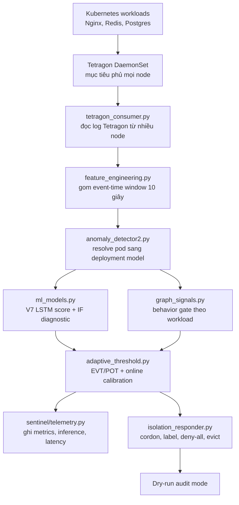

# Báo cáo kỹ thuật: eBPF Runtime Sentinel cho Kubernetes

**Ngày xác minh cluster gần nhất:** 2026-08-02
**Workspace local:** `/home/tndat/Downloads/eBPF-project`  
**Máy cluster:** `dat@10.1.16.234:/home/dat/ml-service`  
**Phiên bản đang deploy:** V7 LSTM, release window 10 giây, dry-run/provisional
**Chế độ phản ứng:** audit/dry-run, tức là hệ thống ghi log hành động cô lập nhưng chưa thật sự cordon/evict pod

## Tóm tắt

Dự án này xây dựng một hệ thống phát hiện bất thường runtime cho Kubernetes bằng eBPF/Tetragon kết hợp machine learning. Thay vì chỉ nhìn log ứng dụng, hệ thống quan sát hành vi thật ở tầng kernel, cụ thể là syscall của container. Runtime hiện gom event Tetragon thành cửa sổ 10 giây theo từng workload, đưa vào mô hình V7 LSTM Autoencoder để chấm điểm bất thường, sau đó kiểm tra thêm bằng behavior gate theo từng workload trước khi tạo cảnh báo.

Kết quả ML dưới đây là bằng chứng validation lịch sử của release V7, được thu thập trước đợt mở rộng topology. Trạng thái hạ tầng được xác minh lại sau cùng ở Mục 2 và Mục 18.7:

- validation ban đầu thực hiện trên cluster 3 node;
- sau mở rộng, cluster hiện có 6/6 node `Ready` (3 control plane, 3 worker);
- `sentinel-detector.service` hiện `active`; coverage gate và Tetragon đều đạt 6/6;
- model V7 từng được load từ `/home/dat/ml-service/models`;
- full regression test trên VM đạt `105 passed` trong `14.13s`;
- log thí nghiệm mới nhất khi đó ghi hơn 108k cửa sổ đã xử lý và `anomalies=0`;
- validation attack đạt 15/15 detection trên Nginx, Redis và Postgres;
- normal validation và post-promotion soak khi đó không có false positive alert.

Điểm quan trọng nhất của benchmark lịch sử: latency end-to-end khoảng 58 giây không phải do model chậm. Inference của model chỉ khoảng 20 ms mỗi cửa sổ. Latency cao chủ yếu do thiết kế cố ý yêu cầu 2 cửa sổ liên tiếp, mỗi cửa sổ 30 giây, để giảm false positive. Cần đo lại sau khi các workload recovery ổn định.

**Kết luận vận hành ở snapshot mới nhất.** Control plane, etcd, 6 node và
DaemonSet Tetragon 6/6 đều khỏe; detector đang nhận đủ ba target với
`no_model=0`. Tuy nhiên model hiện hành vẫn **chưa đủ điều kiện để gọi là
production-ready**: traffic normal làm Nginx thường xuyên có raw score `1.0`
và Redis có nhiều score trên `0.9`; behavior gate chặn alert nhưng không biến
drift này thành normal validation hợp lệ. Pipeline baseline AIMS đa regime đã
được sửa lỗi đo thời gian và một lượt soak 24 giờ mới đang chạy dưới systemd;
candidate tuyệt đối chưa được train hay auto-promote. Một số stateful/operator
pod ngoài phạm vi detector vẫn `Init`/`Error` và do người vận hành xử lý riêng.

## 1. Mục tiêu nghiên cứu

Câu hỏi nghiên cứu chính của dự án là:

> Có thể xây dựng một runtime sentinel cho Kubernetes học hành vi bình thường từ dữ liệu eBPF/Tetragon thật, phát hiện hành vi tấn công ở tầng kernel theo thời gian thực, và kích hoạt luồng cô lập pod với rủi ro false positive thấp hay không?

Phạm vi hiện tại là vertical slice ở tầng syscall. Nghĩa là hệ thống đã hoàn thiện tương đối tốt cho bài toán quan sát syscall của workload phổ biến như Nginx, Redis và Postgres. Sau khi đọc bộ `Agent_Runtime_Sentinel_ALL_FILES`, đồ án đã được mở thêm nhánh V2 theo hướng **Agent Runtime Sentinel**: quan sát AI agent qua MCP, mô hình hoá hành vi thành graph `agent -> tool -> resource`, rồi tiến tới GAT + EVT-POT. Nhánh V2 đã có parser MCP, sliding-window graph, vector hoá graph, scenario attack và TLS uprobe kiểm chứng trong lab; GAT chưa được bật quyền quyết định hay action trên production.

## 2. Trạng thái hạ tầng hiện tại đã xác minh bằng SSH

Các thông tin nền tảng dưới đây được kiểm tra trực tiếp trên `dat@10.1.16.234` ngày 2026-08-01.

| Thành phần | Trạng thái đã xác minh |
|---|---|
| Kubernetes cluster | 6/6 node `Ready`: 3 control plane và 3 worker |
| Kubernetes version | client/server **v1.34.10** |
| Control plane | `k8s-master.local` (.234), `k8s-master2.local` (.235), `k8s-master3.local` (.236) |
| Worker | `k8s-worker1.local` (.237), `k8s-worker4.local` (.238), `k8s-worker3.local` (.239) |
| API server | `/readyz?verbose` pass; các kiểm tra API server, informer và etcd đều `ok` |
| OS/runtime | Ubuntu 24.04.4 LTS, containerd 2.2.x |
| Tetragon | `6 desired/current/ready/available`; một sensor trên mỗi node |
| Tracing policy | `TracingPolicyNamespaced/sentinel-syscalls` tồn tại ở `default` và `production`; `production/aims-sensitive-exec` cũng tồn tại |
| Workload được monitor | `production/nginx`, `production/redis`, `default/postgres` đều `1/1 Available` |
| Load generator | Nginx, Redis và Postgres load generator đều `1/1 Available` |
| Detector service | `active`, window 10 giây, dry-run, coverage gate `true`, `no_model=0` |
| Chế độ runtime | `--dry-run`, không phá hủy cluster khi có alert |
| Model production | `/home/dat/ml-service/models` |
| Vocabulary production | `/home/dat/ml-service/models/vocab.pkl`, 210 features |
| Release manifest | `/home/dat/ml-service/models/release_manifest.json` |
| Regression | Full suite trên VM trước khi bắt đầu soak: `109 passed, 2 warnings` trong `14.06s` ngày 02-08-2026; các mốc cũ bên dưới là evidence lịch sử của các vòng phát triển trước |

**Quy ước bằng chứng.** Node list, phiên bản Kubernetes, `/readyz`, Tetragon,
policy, workload và service ở trên là snapshot kiểm tra mới ngày 01-08-2026.
Các số liệu latency, throughput, normal/attack và false positive ở phần còn lại
là artifact thí nghiệm có timestamp riêng; chúng không tự động trở thành health
check hoặc coverage proof sau migration. Trước khi dùng số liệu cho paper hoặc
bật một cơ chế mới, cần chạy lại các lệnh ở Mục 9 và lưu artifact có timestamp.

Lệnh service đang chạy trên VM:

```bash
/home/dat/ml-venv/bin/python -u /home/dat/ml-service/anomaly_detector2.py \
  --mode kubectl \
  --model-dir /home/dat/ml-service/models \
  --vocab /home/dat/ml-service/models/vocab.pkl \
  --window 10 \
  --threshold 0.80 \
  --dry-run
```

Log detector lịch sử mới nhất trong artifact cho thấy detector từng score đều và chưa có anomaly:

```text
[STATS] windows=108106 | anomalies=0 | no_model=72070 | cooldown=0
```

`no_model` ở đây chủ yếu đến từ các pod không nằm trong tập target, ví dụ system pod, loadgen, workload phụ. Điều này không có nghĩa là model của Nginx/Redis/Postgres bị lỗi tại thời điểm đo. Không dùng log cũ này để kết luận các target vẫn được score liên tục trong snapshot hiện tại.

## 3. Những gì đã cải thiện

### 3.0 Mở hướng V2: Agent Runtime Sentinel cho AI Agent/MCP

Bộ tài liệu `Agent_Runtime_Sentinel_ALL_FILES` định nghĩa rõ V2 không phải viết lại V1, mà là nâng cấp đúng ba điểm còn thiếu:

- V1 chỉ hiểu syscall thô; V2 cần hiểu MCP tool call ở tầng ứng dụng.
- V1 dùng LSTM/IF trên vector syscall; V2 tiến tới behavior graph và GAT + EVT-POT.
- V1 test workload truyền thống; V2 chuyển mục tiêu sang AI agent chạy trong Kubernetes pod.

Các file code đã bổ sung để đi theo hướng này:

| File | Vai trò |
|---|---|
| `agent_runtime/mcp/graph.py` | Parse MCP JSON-RPC 2.0, trích `tool_name`, tài nguyên liên quan, đánh dấu high-risk action trước khi hash và xây sliding-window graph có giới hạn thời gian **và số event** |
| `agent_runtime/detector/graph_features.py` | Chuyển graph snapshot thành vector deterministic để nối vào harness ML hiện tại trước khi cài GAT/PyTorch Geometric |
| `agent_runtime/detector/online_detector.py` | Detector realtime pre-GAT dùng baseline median/MAD theo feature, two-window confirmation và cooldown |
| `agent_runtime/detector/evt_pot.py` | Adaptive empirical EVT-POT theo agent/pod; chỉ học từ cửa sổ baseline-clean để chống threshold poisoning |
| `agent_runtime/runtime.py` | Đường chạy bounded `MCP payload -> graph -> decision/alert`, trả alert envelope tương thích responder V1 |
| `agent_runtime/eval/agent_scenarios.py` | Định nghĩa 5 kịch bản attack AI-agent tương ứng methodology 5-scenario của V1 |
| `agent_runtime/ebpf/mcp_probe.bpf.c` | Skeleton uprobe `SSL_write`: chỉ copy raw bytes sang ring buffer, không parse JSON trong kernel |
| `agent_runtime/ebpf/Makefile`, `mcp_probe_loader.c` | Build BTF/libbpf reproducible và loader bắt buộc PID cụ thể, chỉ xuất metadata TLS |
| `agent_runtime/benchmark.py` | Đo latency p50/p95/p99 của đường userspace `JSON-RPC -> event -> graph -> vector` |
| `agent_runtime/k8s/mcp-demo.yaml` | Namespace lab riêng, TLS MCP server không thực thi tool và normal load generator |
| `agent_runtime/k8s/mcp-attack-job.yaml` | Job gửi hai MCP call `kubectl.delete` an toàn để kiểm thử telemetry; không có token K8s và không thao tác production |
| `tests/test_agent_runtime_graph.py` | Unit test cho parser, batch JSON-RPC, sliding window expiry, feature vector và scenario coverage |

Điểm thiết kế quan trọng: eBPF Layer 1 **không parse JSON-RPC**. Nó chỉ capture một đoạn bytes đã giải mã tại `SSL_read`/`SSL_write`; parsing ngữ nghĩa được đẩy lên userspace để tránh giới hạn verifier/stack của eBPF. Đây đúng với kiến trúc trong `Dat_Kien_Truc_He_Thong.md` và `Agent_Runtime_Sentinel_Build_Spec.md`.

Trạng thái test local sau khi bổ sung V2 scaffold và các guard chống false-positive/không giới hạn bộ nhớ:

```text
14 passed, 1 skipped in 0.07s
```

Trên VM, full regression suite hiện có `67 passed in 8.80s` (2026-07-29), gồm test realtime MCP, GAT, collector snapshot, review/diversity/holdout gate, provenance manifest và background trainer: traffic bình thường không alert, attack cần hai window xác nhận rồi mới sinh alert, và guard p99 đường chạy payload nhỏ dưới 100 ms. Runtime cũng giữ graph tách theo agent/pod, tránh trộn hành vi hợp lệ của nhiều agent thành false positive. Adaptive EVT-POT được áp dụng theo từng agent/pod nhưng chỉ nhận score đã qua baseline-clean gate, tránh attack tự nâng threshold để che dấu chính nó.

Vòng kiểm chứng mới nhất ngày 2026-07-27 lặp 10.000 MCP request bình thường trên VM, dựng snapshot mỗi 100 request, đo ingest p99 `0.066 ms`; snapshot + vector p99 `0.932 ms`. Đây là mốc regression của Layer 2, không thay thế kernel-to-alert latency của V1. Ngưỡng vận hành trước khi có GAT là p99 snapshot dưới `50 ms` ở cửa sổ 10.000 event; run này còn dư địa lớn. Runtime bridge mới dùng baseline robust median/MAD một phía, bắt buộc xác nhận hai cửa sổ và cooldown. Test hồi quy đã tái tạo lỗi burst traffic sạch bị chấm nhầm là anomaly, sau đó hiệu chỉnh baseline để bao gồm burst hợp lệ; luồng normal không còn alert, trong khi `kubectl_delete` nhắm namespace production cần hai cửa sổ rồi mới phát alert. Namespace `production` đơn lẻ không còn là high-risk signal, tránh biến traffic hợp lệ thành false positive.

**Xác minh capture TLS thật (2026-07-27).** Probe eBPF được build trên VM và attach bằng libbpf vào một PID `openssl s_client` duy nhất do bài test tạo ra; không attach toàn host. Một HTTPS MCP request bình thường đi qua `uprobe -> ring buffer -> HTTP reassembly -> graph detector` cho quyết định `normal`, score `0.0`, detector time `0.039 ms`. Sau đó hai request `kubectl.delete` được gửi tới server MCP chỉ-acknowledge trong namespace `agent-sentinel-lab`: request thứ nhất là `pending`, request thứ hai sinh `alert`. Đo từ `bpf_ktime_get_ns` đến lúc alert là `0.606 ms`; inference `0.045 ms`; toàn decision path `0.198 ms`. Reader đã sửa phép đổi monotonic eBPF clock sang wall clock bằng một anchor đầu phiên, nên không còn báo latency giả hàng chục năm. Payload chỉ được pipe trong memory khi bật cờ explicit `--emit-payload` cho PID lab và không được ghi file; output alert không chứa argument MCP thô.

**Soak kiểm soát false-positive của graph window.** Một replay mới mô phỏng 600 MCP request sạch ở 5 RPS (120 giây, vượt một sliding window 60 giây) đã cho `600/600 normal`. Đây là regression bắt buộc vì bản đầu dùng cumulative count thô và có thể alert khi window đầy. Score giờ chuẩn hoá volume counter theo số giây quan sát, trong khi graph vẫn giữ count thô cho GAT tương lai. Ngay sau soak, hai request `kubectl.delete` vẫn cho `pending -> alert`. Baseline được lưu theo `agent_id` với digest SHA-256; reader từ chối baseline bị sửa hoặc baseline của agent khác.

**Release gate semantic V2.** Lệnh `python -m agent_runtime.eval.replay_validation` chạy bốn normal regime (3, 5, 7, rồi recovery 5 RPS) và toàn bộ năm scenario agent: secret exfiltration, over-privileged kubectl, production delete, lateral movement, container escape. Run trên VM cho `1,200` normal decision với `0 pending`, `0 alert`; `5/5` attack đi qua `pending -> alert`. Inference đo trong replay cao nhất `0.010 ms`, end-to-end decision cao nhất `0.085 ms`. Đây là gate tái lập bằng semantic payload; nó bổ sung chứ không thay thế việc thu dataset MCP thật đa dạng trước khi train GAT.

**GAT evaluation path.** VM đã có `torch 2.11.0+cu130` và `torch-geometric 2.8.0.post1`. `agent_runtime/detector/gat_model.py` hiện triển khai Graph Attention Autoencoder trên topology `agent -> tool -> resource`, node type, degree và global semantic features; score là reconstruction error, threshold là empirical tail quantile có margin. Test train trên clean graph rồi score production-delete graph đã pass. Benchmark CPU 100 inference window: p50 `1.769 ms`, p95 `2.263 ms`, p99 `2.766 ms`, dưới rất xa budget 50 ms/window. Model này chưa được phép thay fallback robust detector trên production vì training graph hiện là lab/replay; cần capture MCP đa dạng đã review, holdout độc lập và promotion gate riêng trước khi bật action.

**Trạng thái model tại thời điểm cập nhật.** Model production đang chạy là V7 syscall detector qua `sentinel-detector.service`, trạng thái `active`, vẫn dùng LSTM Autoencoder đã calibration và behavior gate theo workload. Nhánh MCP có GAT candidate tại `/home/dat/ml-service/models/gat-lab.pt`, kèm manifest SHA-256 và threshold `0.0853128`. Candidate này được train từ 8 graph snapshot normal thu trực tiếp qua TLS uprobe của `agent-sentinel-lab`, trong đó raw MCP payload chỉ đi trong pipe còn artifact lưu lại chỉ chứa graph đã sanitize. Artifact load/verify thành công, nhưng **không được promote**: 8 snapshot từ một agent lab chưa đủ bằng chứng về độ bao phủ hay false-positive cho production. Điều kiện promote còn thiếu là capture normal đa-agent/đa-regime, holdout độc lập, matrix 5 scenario lặp lại và release gate riêng cho GAT.

**Huấn luyện nền có kiểm soát.** Đồ án đã có unit/timer `agent-runtime-gat-trainer.timer` chạy service bằng user `dat` và kiểm tra dataset mỗi giờ; trạng thái bật trên VM cần được xác minh lại sau khi SSH khả dụng. Timer chỉ train candidate khi dataset có ít nhất 200 snapshot với nhãn bất biến `review_status=approved_normal`; collector mặc định gắn `pending_review`, còn record thiếu nhãn hoặc có nhãn khác đều bị từ chối. Gate còn yêu cầu tối thiểu 3 agent, 3 workload và span quan sát 24 giờ, chống trường hợp 200 bản sao từ cùng một pod bị dùng làm baseline. Sau train, candidate còn phải có tỷ lệ alert trên holdout normal bằng `0.0`; chỉ một false positive holdout cũng ghi `candidate_rejected_holdout` và không tạo artifact. Manifest của artifact lưu SHA-256 dataset, số epoch, cấu hình review/diversity/holdout và kết quả holdout, ngoài SHA-256 model, để tái lập kiểm chứng. Cùng gate review đã được đưa vào `train_gat.py`, nên không thể bypass review bằng lệnh train thủ công. Candidate ghi riêng vào `models/gat-candidates/`, có state/digest để không train lại cùng input và **không có cơ chế tự promote**. Để training nền không ảnh hưởng detector V7, systemd áp `Nice=10`, I/O best-effort, `CPUQuota=50%`, `MemoryMax=2G` và timeout 30 phút. Tám snapshot lab cũ chưa có nhãn review nên lượt chạy sau khi siết gate trả `waiting_for_reviewed_clean_data` (`rejected=8`, `required=200`); không tiêu thụ GPU/CPU để train vô ích và không thay đổi detector V7.

Ngày kiểm thử MCP HTTPS lab, `mcp-tls-server` và `mcp-normal-loadgen` đều `Running` trong namespace riêng `agent-sentinel-lab`. Round-trip từ loadgen đến TLS service đạt `HTTP 200`, TLS connect `2.736 ms`, total `199.192 ms`. Job mô phỏng `kubectl.delete` đã Complete; server chỉ acknowledge JSON-RPC và không thực thi bất kỳ tool nào.

Layer 1 đã được build thực tế trên VM theo kernel đang chạy `6.8.0-124-generic`: `mcp_probe.bpf.o` là ELF eBPF hợp lệ và `mcp_probe_loader` build thành công bằng libbpf. Loader yêu cầu PID cụ thể thay vì attach toàn host, đồng thời chỉ in metadata (PID/direction/byte count), giảm rủi ro lộ plaintext ngoài scope test. Không reboot node dù hệ điều hành báo kernel update pending, để không làm gián đoạn cluster.

### 3.1 Chuyển từ synthetic data sang real data

Điểm cải thiện lớn nhất là pipeline hiện tại ưu tiên dữ liệu thật từ Tetragon thay vì baseline synthetic. Lý do là synthetic data dễ làm model học phân phối không giống runtime, dẫn đến false positive.

Release V7 đang deploy được train từ các cửa sổ syscall thật:

| Workload | Số window train | Số feature | Holdout max | Holdout p95 | Vượt ngưỡng | Behavior gate |
|---|---:|---:|---:|---:|---:|---:|
| `default/postgres` | 100 | 210 | 0.1527 | 0.1046 | 0.0 | 0 |
| `production/nginx` | 100 | 210 | 0.2035 | 0.1601 | 0.0 | 0 |
| `production/redis` | 95 | 210 | 0.2282 | 0.1388 | 0.0 | 0 |

Dữ liệu normal được lấy từ 4 chế độ:

- normal 1x traffic;
- Nginx chịu tải `wrk -c50`;
- high-mixed load;
- recovery 1x sau khi scale down.

Ý nghĩa: model không chỉ học một trạng thái yên tĩnh, mà học nhiều trạng thái vận hành bình thường khác nhau. Đây là yếu tố rất quan trọng để giảm false positive.

### 3.2 Ổn định model ML

Release đang deploy là V7 LSTM Autoencoder. So với các bản cũ, các cải thiện chính gồm:

- bỏ decoder teacher-forcing shortcut để tránh autoencoder học copy input quá dễ;
- thêm floor 1% cho feature scaling để syscall hiếm không làm z-score nổ quá lớn;
- clip feature đã scale ở mức 10.0 để một feature đơn lẻ không áp đảo toàn bộ reconstruction error;
- giữ Isolation Forest làm tín hiệu diagnostic, không dùng làm score hành động;
- seed theo SHA-256 của workload để train tái lập được;
- học behavior limit riêng cho từng workload từ train set;
- tách ML score khỏi bằng chứng hành vi kernel.

V6 kiểu mixture giữa LSTM và Isolation Forest đã bị loại. Lý do: Isolation Forest không xử lý tốt các syscall luôn bằng 0 trong baseline; khi attack làm xuất hiện syscall đó, autoencoder thấy rất bất thường nhưng Isolation Forest có thể làm giảm margin. Vì vậy bản production chọn LSTM đã calibration làm score chính.

### 3.3 Giảm false positive

Thiết kế detector V7 không alert chỉ vì một điểm score cao đơn lẻ. Một alert muốn đi tiếp phải qua nhiều lớp:

- resolve model theo namespace/deployment, nên pod restart đổi suffix vẫn tìm đúng model;
- chỉ update online calibration bằng window sạch;
- window score cao bất thường lúc startup không được đưa vào calibration;
- cần 2 cửa sổ liên tiếp đủ điều kiện;
- cần behavior gate theo từng workload;
- pod hệ thống và loadgen không được tính như workload cần phản ứng;
- live-normal validation yêu cầu không có cả raw score crossing, dù behavior gate có thể chặn alert.

Thiết kế này làm latency tăng, nhưng đổi lại false positive thấp hơn.

### 3.4 Promotion an toàn và có rollback

Script `promote_candidate.py` không copy model tùy tiện. Nó kiểm tra:

- offline training đã pass;
- dataset manifest đúng hash;
- vocabulary đúng hash với dataset, normal report và attack report;
- normal matrix pass đủ 4 regime;
- attack matrix pass đủ 15 trial;
- runtime code hash khớp giữa report và file hiện tại trên VM;
- đủ 9 file model-release;
- đúng model version V7;
- đủ 3 model cho Postgres, Nginx, Redis;
- input dimension khớp vocab 210.

Release V7 ban đầu (artifact lịch sử) được promote lúc:

```text
2026-07-22T10:17:42.165209+00:00
```

Release đang được unit service dùng hiện nay được manifest xác nhận là V7,
`window=10`, `threshold=0.80`, `--dry-run`, promote lúc
`2026-07-29T09:39:34Z`. Đây là release **provisional**: không thay thế evidence
benchmark cũ; raw-score drift trên profile hiện hành buộc phải train và validate
candidate mới trước khi có thể claim false-positive rate realtime.

Backup trên VM:

```text
/home/dat/ml-service/models.backup-20260722T101742Z
/home/dat/ml-service/calibration.json.backup-20260722T101742Z
```

## 4. Kiến trúc hệ thống

Kiến trúc đang deploy là syscall vertical slice gồm các lớp sau:



Hiện tại response layer vẫn chạy dry-run. Nghĩa là khi có alert, hệ thống tạo `AnomalyAlert` và đi qua luồng responder, nhưng chỉ log các hành động như `cordon`, `label quarantine=true`, tạo Cilium deny-all và evict pod. Nó chưa thật sự thay đổi cluster.

Ở snapshot 01-08-2026 DaemonSet đạt `6/6 Ready/Available`. Coverage gate đang
được bật trong process detector; nếu số sensor giảm, consumer dừng ingest và
không đưa ra decision từ telemetry thiếu node.

## 5. Luồng code runtime

Luồng chạy realtime:

1. `tetragon_consumer.py` tìm các pod Tetragon trong namespace `kube-system`.
2. Nó mở stream song song tới các pod Tetragon `Ready` bằng `kubectl exec ... tail -F /var/run/cilium/tetragon/tetragon.log`; baseline ban đầu có 3 node. Nếu số nguồn nhỏ hơn số node schedulable, runner phải fail preflight thay vì coi coverage là đủ.
3. Event JSON từ Tetragon được parse và đưa vào queue có giới hạn.
4. `feature_engineering.py` gom event theo event-time thành window 10 giây cho từng pod.
5. Khi một window đóng, hệ thống tạo `FeatureVector`, gồm vector feature, syscall count, node, namespace, pod, window start/end.
6. `anomaly_detector2.py` đổi pod key thật như `production/nginx-56fcf95486-hfgqj` thành model key `production/nginx`.
7. `ml_models.py` chấm điểm bằng V7 LSTM Autoencoder. Isolation Forest vẫn được tính nhưng chỉ để diagnostic.
8. `graph_signals.py` kiểm tra tỷ lệ syscall nghi vấn so với behavior limit của workload đó.
9. `adaptive_threshold.py` áp threshold offline và online calibration.
10. `sentinel/telemetry.py` ghi inference, decision, detection latency ra JSONL.
11. Nếu score, behavior gate và consecutive rule cùng pass, detector tạo alert.
12. `isolation_responder.py` chạy luồng phản ứng ở dry-run.

Nói ngắn gọn:

```text
Tetragon event -> 30s window -> feature vector -> V7 LSTM score
              -> behavior gate -> adaptive threshold -> alert -> dry-run isolation
```

## 6. Luồng train và validate model

Luồng build model:

1. Thu baseline thật bằng các script benchmark/collector.
2. `build_phase_dataset.py` kiểm tra phase, loại phase có backpressure, giữ đúng vocabulary index và tạo train/holdout theo từng phase.
3. `train_candidate.py` train một model V7 cho mỗi workload.
4. `analyze_normal_run.py` chạy detector độc lập trên traffic normal mới.
5. `run_kernel_matrix.py` chạy attack thật bên trong container.
6. `promote_candidate.py` chỉ promote nếu tất cả report và hash đều khớp.

Điểm quan trọng: attack validation không phải simulator Python. File `runtime_attack.c` được compile thành binary static, copy vào container, rồi chạy bên trong Nginx/Redis/Postgres. Vì vậy test đi qua đường kernel syscall thật -> Tetragon -> detector -> model -> alert.

## 7. Kết quả thực nghiệm lịch sử của release V7

Các kết quả Mục 7 được thu trước migration/topology và ở cadence 30 giây cũ.
Chúng là evidence tái lập của release khi đó, không phải SLO hoặc validation
realtime của cluster/window 10 giây hiện tại.

### 7.1 Offline holdout

Release được chọn pass offline holdout. Không workload nào vượt ngưỡng 0.80. Score holdout cao nhất là Redis 0.2282, vẫn thấp hơn ngưỡng rất xa.

### 7.2 Live-normal matrix

Artifact trên VM:

```text
/home/dat/ml-service/models/normal_validation_report.json
```

Kết quả:

| Workload | Window | Max score | p99 inference | p99 ingest lag | Score crossing | Behavior gate |
|---|---:|---:|---:|---:|---:|---:|
| `default/postgres` | 44 | 0.2664 | 59.184 ms | 1.757 s | 0 | 0 |
| `production/nginx` | 44 | 0.6435 | 102.515 ms | 1.693 s | 0 | 0 |
| `production/redis` | 44 | 0.2246 | 65.893 ms | 1.639 s | 0 | 0 |

Nginx có max score 0.6435 khi chịu tải `wrk -c50`, nhưng vẫn dưới threshold 0.80 và không bị alert.

### 7.3 Attack matrix thật trong container

Artifact trên VM:

```text
/home/dat/ml-service/models/attack_validation_report.json
```

Tổng hợp:

| Metric | Giá trị |
|---|---:|
| Workload test | 3 |
| Attack profile mỗi workload | 5 |
| Tổng trial attack thật | 15 |
| Trial detect thành công | 15 |
| Detection rate trong matrix này | 15/15 |
| Median kernel-to-alert latency | 57.934 s |
| Max kernel-to-alert latency | 58.499 s |
| Median inference mỗi trial | 20.532 ms |
| Alert trước khi inject attack | 0 |
| Attack process lỗi | 0 |
| Detector process lỗi | 0 |
| Sai lệch 2 đồng hồ đo latency lớn nhất | 0.000306 s |

5 attack profile:

- reverse shell;
- container escape;
- cryptomining;
- privilege escalation;
- data exfiltration.

Latency 57-58 giây là latency end-to-end từ lúc binary trong container xác nhận bắt đầu attack đến lúc detector tạo alert. Con số này gần 60 giây vì hệ thống yêu cầu 2 window liên tiếp, mỗi window 30 giây.

### 7.4 Post-promotion soak

Artifact:

```text
/home/dat/ml-service/post-promotion-clean-soak-report-20260722T1034Z.json
```

Kết quả:

| Workload | Window | Max score | p99 ingest lag | Alert | Score crossing | Behavior gate |
|---|---:|---:|---:|---:|---:|---:|
| `default/postgres` | 15 | 0.1515 | 1.134 s | 0 | 0 | 0 |
| `production/nginx` | 15 | 0.0842 | 1.635 s | 0 | 0 | 0 |
| `production/redis` | 15 | 0.0912 | 1.743 s | 0 | 0 | 0 |

Tất cả 45 decision sau promotion đều là normal.

### 7.5 Quan sát production dài ngày

Ngày 2026-07-26, service đang chạy hơn 4 ngày và đã xử lý hơn 108k window:

```text
windows=108106 | anomalies=0 | no_model=72070 | cooldown=0
```

Live score gần thời điểm kiểm tra vẫn ổn. Có một spike Postgres 0.4414 nhưng vẫn thấp hơn threshold 0.80, không có behavior gate và không alert.

### 7.6 Overhead

Artifact hợp lệ:

```text
/home/dat/ml-service/overhead-final/comparison-wrk-20260722T103530Z.json
```

Lưu ý: trên VM còn có `comparison-wrk.json`, nhưng file đó không có `experiment_id` ràng buộc 3 phase cùng một run, nên không dùng làm số liệu chính.

| Phase | Median RPS | Median p99 latency | Failed requests | Detector CPU | Detector memory |
|---|---:|---:|---:|---:|---:|
| no tracing | 61,785.49 | 4.73 ms | 0 | n/a | n/a |
| Tetragon only | 56,852.97 | 5.21 ms | 0 | n/a | n/a |
| full pipeline | 56,464.72 | 5.32 ms | 0 | 2.84% của 1 core | 380.69 MiB |

So sánh overhead:

| So sánh | Giảm throughput | Tăng p99 latency |
|---|---:|---:|
| Tetragon vs no tracing | 7.98% | 10.15% |
| Full pipeline vs no tracing | 8.61% | 12.47% |
| Detector thêm vào so với Tetragon-only | 0.68% | 2.11% |

Kết luận: phần lớn overhead đến từ tracing bằng Tetragon. ML detector thêm overhead nhỏ so với Tetragon-only trong run hợp lệ này.

### 7.7 Kết quả V2 trong MCP HTTPS lab

Đây là kết quả của nhánh V2 trong namespace cô lập `agent-sentinel-lab`; nó
không được gộp với bảng V1 và không được dùng để claim production readiness.

| Kiểm tra | Kết quả đã ghi nhận | Ý nghĩa |
|---|---:|---|
| Soak MCP normal | 600/600 decision `normal`, 0 pending, 0 alert | Sửa false positive do cumulative counter khi sliding window đầy |
| Scenario MCP nguy hiểm | 5/5 scenario `pending -> alert` | Xác minh semantic gate trên replay có kiểm soát |
| TLS lab capture đến alert | 0.606 ms | Đo từ timestamp eBPF đến alert cho PID lab được attach cụ thể |
| GAT inference CPU | p50 1.769 ms; p95 2.263 ms; p99 2.766 ms | Dưới budget 50 ms mỗi graph window |
| Dataset GAT thật đã review | Chưa đủ | Chỉ có 8 snapshot lab, không đủ để promote |

Hai đường đánh giá có mục tiêu khác nhau: V1 đo kernel-to-alert của detector
đang chạy; V2 đo đường TLS-uprobe/graph trong lab và inference GAT. Không cộng,
so sánh trực tiếp hoặc dùng con số V2 để thay thế latency 58 giây của policy V1.

## 8. Phân tích latency

Cần tách 3 loại latency:

| Loại latency | Benchmark lịch sử V7 | Nguyên nhân chính |
|---|---:|---|
| Inference của model | khoảng 20 ms median | PyTorch scoring + gate logic |
| Ingest lag | khoảng 1-2 s p99 | Tetragon log delivery, queue, flush window |
| Kernel-to-alert | khoảng 58 s median | yêu cầu 2 window liên tiếp, mỗi window 30 s |

Vậy model không chậm. Muốn giảm latency end-to-end thì phải đổi thiết kế window/rule:

1. Giảm window từ 30s xuống 15s hoặc 10s.
2. Cho phép fast-path một window nếu score bão hòa và behavior gate rất mạnh.
3. Thêm early-fire counter cho syscall nguy hiểm như `execve`, `setuid`, `unshare`, `mount`, `ptrace`, `capset`, `connect`.
4. Chuyển ingestion từ `kubectl exec tail -F` sang Tetragon gRPC hoặc node-local sidecar.
5. Giữ 2-window confirmation cho trường hợp score thấp hoặc thiếu behavior evidence.

Dự kiến nếu revalidate cẩn thận:

| Thiết kế | Latency kỳ vọng |
|---|---:|
| Baseline V7 lịch sử: 30s window, 2-window confirmation | 58-60 s |
| 15s window, 2-window confirmation | 28-30 s |
| 10s window, 2-window confirmation | 18-20 s |
| Severity-aware one-window alert | 10-30 s tùy thời điểm flush |

Rủi ro của giảm latency là tăng false positive. Vì vậy mọi thay đổi latency phải chạy lại normal matrix và 15-trial attack matrix.

## 9. Cách chạy lại từ đầu

Phần này giả định đã SSH được vào cluster và đang ở `/home/dat/ml-service`.

### 9.1 SSH vào cluster

```bash
ssh dat@10.1.16.234
cd /home/dat/ml-service
```

### 9.2 Kiểm tra cluster và coverage trước khi chạy lại

```bash
kubectl get nodes -o wide
kubectl get pods -n kube-system -l app.kubernetes.io/name=tetragon -o wide
kubectl get pods -n production -o wide
kubectl get pods -n default -l app=postgres -o wide
kubectl get tracingpolicynamespaced -A
kubectl -n kube-system get ds tetragon -o wide
systemctl is-active sentinel-detector.service
```

Kỳ vọng:

- 6 node `Ready` với đúng 3 control plane + 3 worker;
- Tetragon `desired == current == ready == available == 6`;
- target workload Running;
- `sentinel-syscalls` có ở `default` và `production`;
- detector active nếu đã có release.

Nếu một điều kiện không đạt, dừng benchmark/soak và ghi snapshot lỗi. Không
được tái sử dụng latency hay false-positive artifact từ topology khác.

### 9.3 Apply policy Tetragon

```bash
kubectl apply -f tetragon-targeted-policies.yaml
```

Policy baseline V7 sample syscall tần suất cao nhưng không sample các syscall nhạy cảm như `execve`, `setuid`, `unshare`, `mount`, `ptrace`. Trước khi chạy lại, phải inspect policy đang apply thay vì giả định nội dung này vẫn đúng.

### 9.4 Thu baseline thật

Chạy collector/benchmark:

```bash
./probe_sampled_policy.sh
./collect_sampled_baseline_matrix.sh
```

Mỗi phase tạo thư mục timestamp riêng. Không overwrite thư mục cũ vì đó là artifact để truy vết.

### 9.5 Build dataset phase-stratified

Mẫu lệnh:

```bash
/home/dat/ml-venv/bin/python build_phase_dataset.py \
  /home/dat/ml-service/<phase-normal> \
  /home/dat/ml-service/<phase-wrk> \
  /home/dat/ml-service/<phase-high> \
  /home/dat/ml-service/<phase-recovery> \
  --output /home/dat/ml-service/<dataset-output> \
  --minimum-events 100 \
  --minimum-phase-windows 20 \
  --validation-fraction 0.20 \
  --policy tetragon-targeted-policies.yaml \
  --vocab models/vocab.pkl
```

Builder sẽ fail nếu:

- thiếu workload target;
- phase có sensor backpressure;
- vocabulary mismatch;
- cố zero-pad feature mới trong khi syscall đó thật sự xuất hiện.

### 9.6 Train candidate

```bash
/home/dat/ml-venv/bin/python train_candidate.py \
  --dataset /home/dat/ml-service/<dataset-output> \
  --output /home/dat/ml-service/models_candidate_v7-<timestamp> \
  --model-version 7
```

Output cần có:

- `training_report.json`;
- `dataset_manifest.json`;
- `vocab.pkl`;
- bundle và `.pt` cho từng workload.

### 9.7 Chạy normal validation

```bash
sudo systemd-run \
  --unit=sentinel-v7-final-normal \
  --collect \
  --property=TimeoutStartSec=45min \
  --property=WorkingDirectory=/home/dat/ml-service \
  --setenv=KUBECONFIG=/home/dat/.kube/config \
  --setenv=PYTHONUNBUFFERED=1 \
  /home/dat/ml-service/run_candidate_normal_matrix.sh \
    /home/dat/ml-service/models_candidate_v7-<timestamp>
```

Điều kiện pass:

- 4 regime đều pass;
- zero detection;
- zero raw score crossing;
- zero behavior gate crossing;
- zero actionable consecutive pair;
- đủ window cho từng workload.

### 9.8 Compile và chạy attack matrix thật

```bash
gcc -O2 -static -Wall -Wextra -o runtime_attack runtime_attack.c

sudo systemd-run \
  --unit=sentinel-v7-final-attacks \
  --collect \
  --property=TimeoutStartSec=45min \
  --property=WorkingDirectory=/home/dat/ml-service \
  --setenv=KUBECONFIG=/home/dat/.kube/config \
  --setenv=PYTHONUNBUFFERED=1 \
  /home/dat/ml-venv/bin/python /home/dat/ml-service/run_kernel_matrix.py \
    --model-dir /home/dat/ml-service/models_candidate_v7-<timestamp> \
    --normal-calibration /home/dat/ml-service/<normal-calibration>.json \
    --runtime-binary /home/dat/ml-service/runtime_attack \
    --attack-seconds 70 \
    --rate 20 \
    --post-attack-wait 45 \
    --output-root /home/dat/ml-service/kernel-regression-matrix
```

Điều kiện pass:

- 15/15 trial detected;
- zero alert trước lúc inject attack;
- có start acknowledgement;
- attack exit code 0;
- detector exit code 0;
- detection latency có ở cả measured path và telemetry path;
- sai lệch 2 latency clock nằm trong tolerance.

### 9.9 Promote model

Dry-run trước:

```bash
/home/dat/ml-venv/bin/python promote_candidate.py \
  --candidate models_candidate_v7-<timestamp> \
  --production models \
  --normal-report <normal-report>.json \
  --attack-report <attack-report>.json \
  --calibration calibration.json \
  --expected-version 7 \
  --expected-attack-trials 15
```

Nếu dry-run không có failure, apply:

```bash
/home/dat/ml-venv/bin/python promote_candidate.py \
  --candidate models_candidate_v7-<timestamp> \
  --production models \
  --normal-report <normal-report>.json \
  --attack-report <attack-report>.json \
  --calibration calibration.json \
  --expected-version 7 \
  --expected-attack-trials 15 \
  --apply
```

Restart service:

```bash
sudo systemctl restart sentinel-detector
systemctl is-active sentinel-detector
tail -n 120 realtime-detector.log
```

### 9.10 Chạy soak sau promotion

```bash
date -u +%s.%N > clean-post-promotion-soak.start
```

Sau khi đủ window:

```bash
/home/dat/ml-venv/bin/python analyze_normal_run.py metrics.jsonl \
  --minimum-windows 12 \
  --minimum-events 20 \
  --threshold 0.80 \
  --max-score-exceedances 0 \
  --max-behavior-gates 0 \
  --since-ts "$(cat clean-post-promotion-soak.start)" \
  --output post-promotion-clean-soak-report-<timestamp>.json
```

### 9.11 Chạy overhead benchmark

```bash
sudo systemd-run \
  --unit=sentinel-v7-overhead \
  --collect \
  --property=TimeoutStartSec=20min \
  --property=WorkingDirectory=/home/dat/ml-service \
  --setenv=PYTHONUNBUFFERED=1 \
  /home/dat/ml-service/run_overhead_matrix.sh all
```

Chỉ dùng file comparison có `experiment_id`, ví dụ:

```text
overhead-final/comparison-wrk-20260722T103530Z.json
```

### 9.12 Cài và kiểm tra GAT candidate trainer (không promote)

Chỉ làm bước này sau khi đã review dataset; timer không phải cơ chế thu thập hay
gắn nhãn dữ liệu tự động. Copy unit/timer từ repo lên VM rồi cài với quyền quản
trị:

```bash
sudo install -m 0644 agent_runtime/systemd/agent-runtime-gat-trainer.service \
  /etc/systemd/system/agent-runtime-gat-trainer.service
sudo install -m 0644 agent_runtime/systemd/agent-runtime-gat-trainer.timer \
  /etc/systemd/system/agent-runtime-gat-trainer.timer
sudo systemctl daemon-reload
sudo systemctl enable --now agent-runtime-gat-trainer.timer
```

Xác minh lượt chạy đầu và bảo đảm detector V7 không bị ảnh hưởng:

```bash
systemctl list-timers agent-runtime-gat-trainer.timer --all
sudo systemctl start agent-runtime-gat-trainer.service
journalctl -u agent-runtime-gat-trainer.service -n 30 --no-pager
systemctl is-active sentinel-detector.service
```

Với dataset ít hơn 200 snapshot, chưa review, thiếu 3 agent/3 workload hoặc
chưa đủ 24 giờ, kết quả mong đợi là `waiting_for_*`; đó là trạng thái an toàn,
không phải lỗi. Chỉ `candidate_ready` tạo artifact dưới `models/gat-candidates/`.
Ngay cả khi candidate sẵn sàng, vẫn phải chạy holdout độc lập và promotion gate
thủ công; timer không được phép ghi vào thư mục model production.

## 10. Map file trong repo

| File/thư mục | Vai trò |
|---|---|
| `ml-service/anomaly_detector2.py` | Orchestrator realtime detector |
| `ml-service/ml_models.py` | Model V7 LSTM và scoring |
| `ml-service/feature_engineering.py` | Parse event và tạo feature window |
| `ml-service/tetragon_consumer.py` | Đọc Tetragon từ nhiều node |
| `ml-service/graph_signals.py` | Behavior gate theo workload |
| `ml-service/adaptive_threshold.py` | EVT/POT và online calibration |
| `ml-service/build_phase_dataset.py` | Build dataset theo phase |
| `ml-service/train_candidate.py` | Train model candidate |
| `ml-service/run_kernel_matrix.py` | Chạy 15 attack trial |
| `ml-service/run_kernel_regression.py` | Harness attack cho một workload |
| `ml-service/promote_candidate.py` | Promote model atomically |
| `agent_runtime/mcp/graph.py` | Layer 2 MCP parser và bounded behavior graph của hướng V2 |
| `agent_runtime/benchmark.py` | Benchmark latency userspace cho V2 |
| `sentinel/benchmarks/runtime_attack.c` | Binary sinh syscall attack an toàn |
| `sentinel/benchmarks/VALIDATION_PROTOCOL.md` | Protocol validate |
| `sentinel/benchmarks/REGRESSION_RESULTS.md` | Tóm tắt kết quả regression |
| `sentinel/systemd/sentinel-detector.service` | Unit service production |
| `tests/` | Unit/regression tests |

## 11. Giới hạn của evidence và triển khai hiện tại

Không nên claim quá tay. Implementation đã có evidence tốt trong phạm vi đã test, nhưng deployment live hiện vẫn có các giới hạn:

- mới validate trên Nginx, Redis, Postgres;
- chưa chứng minh cho workload bất kỳ chưa từng thấy;
- response đang dry-run, chưa bật cô lập thật;
- benchmark lịch sử ghi latency end-to-end khoảng 58 giây vì rule 2 window;
- ingestion qua `kubectl exec tail -F` chưa phải đường latency thấp nhất;
- MCP/TLS uprobe và GAT graph mới được triển khai/kiểm chứng trong lab; chưa được promote làm detector production;
- attack profile là mô phỏng syscall an toàn, không phải malware phá hoại thật;
- zero false positive là kết quả thực nghiệm trên tập đã đo, không phải chứng minh toán học cho mọi tình huống.

## 12. Hướng phát triển tiếp theo

Ưu tiên nếu muốn đưa project lên mức paper mạnh hơn:

1. Giảm window xuống 10s hoặc 15s và revalidate toàn bộ.
2. Thêm severity-aware fast path cho syscall rất nguy hiểm.
3. Chuyển ingestion sang Tetragon gRPC hoặc sidecar node-local.
4. Thêm workload MCP thật chạy HTTPS.
5. Hook TLS bằng uprobe `SSL_read`/`SSL_write`.
6. Sau khi có dữ liệu MCP thật, mới đánh giá GAT/graph autoencoder.
7. Tạo figure paper từ JSON report: score distribution, latency CDF, overhead bar chart, pipeline diagram.

## 13. Claim có thể dùng trong paper (evidence lịch sử, không phải trạng thái live)

Một claim an toàn, đúng với artifact thí nghiệm có timestamp:

> Chúng tôi xây dựng và triển khai một Kubernetes runtime sentinel học hành vi syscall theo từng workload từ telemetry eBPF/Tetragon thật. Trên cluster 3 node, release V7 đã phát hiện 15/15 trial attack thật chạy bên trong container trên ba workload Nginx, Redis và Postgres, đồng thời không tạo false positive alert trong normal matrix bốn regime và clean post-promotion soak. Median kernel-to-alert latency là 57.934 giây, chủ yếu do rule xác nhận hai cửa sổ 30 giây, trong khi median ML inference chỉ khoảng 20 ms mỗi cửa sổ. Trong benchmark overhead hợp lệ, detector chỉ thêm 0.68% median throughput loss so với Tetragon-only.

Claim này cố ý viết theo hướng empirical. Nó không nói hệ thống đạt 100% detection hoặc 0% false positive cho mọi workload, mọi traffic và mọi kiểu tấn công.

## 14. Cập nhật hạ tầng ngày 29-07-2026

**Ghi chú chronology:** đây là snapshot trung gian của quá trình nâng cấp khi
cluster còn 5 node. Topology và health hiện tại được thay thế bởi Mục 2 và
Mục 18.8; không đọc đoạn này như trạng thái live.

Đợt vận hành này đã mở rộng cluster từ 3 lên 5 node: hai control plane
`k8s-master.local` và `k8s-master2.local`, cùng ba worker. Snapshot etcd và
bundle cấu hình đã được tạo trước thay đổi. Vòng **v1.29.15** và **v1.30.14**
đã hoàn tất trên cả năm node. `/readyz` trả về `ok`, toàn bộ node ở trạng thái
`Ready` và không còn pod lỗi/pending tại thời điểm kiểm tra. Các minor tiếp
theo phải tiếp tục theo đúng thứ tự v1.31 → v1.34, một minor mỗi lần.

Cilium đã được reconcile hoàn chỉnh lên **1.19.6** (5/5 agent, 5/5 Envoy),
thay cho cấu hình Helm trước đó chỉ đổi chart nhưng vẫn giữ image 1.19.3. Có
một restart ngắn của API server chính trong lúc static manifest được reload;
static pod tự phục hồi và health check sau đó đạt `ok`. Đây là lý do các vòng
nâng minor tiếp theo phải luôn có health gate, không chạy theo kiểu bỏ qua.

NFS lab storage đã được cung cấp từ worker3 qua StorageClass mặc định
`nfs-client`; RabbitMQ đã chạy với PVC NFS, còn Kafka HA hiện hữu đã được giữ
nguyên và xác nhận hồi phục sau drain. NFS này là **single-server lab storage**
chứ chưa phải backend HA; không nên dùng claim production HA cho thành phần
này. Cụm vẫn dùng endpoint `k8s-master.local:6443`, vì vậy control plane thứ
hai chưa tạo failover API thực sự cho đến khi bổ sung VIP/load balancer và số
etcd member lẻ.

Trong source `agent_runtime`, đường train GAT đã được refactor để cả CLI và
continuous trainer dùng chung `eval/snapshot_dataset.py`. Module này thống
nhất parse JSONL, kiểm tra `approved_normal`, tạo graph snapshot và SHA-256
provenance; nhờ đó attack/unreviewed data không thể đi vào baseline qua một
đường code khác. Các unit test liên quan chạy thành công: **7 passed, 2
skipped**.

### Trạng thái hoàn tất sau nâng cấp

Ngày 29-07-2026, toàn bộ năm node đã hoàn tất chuỗi nâng cấp tuần tự lên
**Kubernetes v1.34.10**. Snapshot etcd đã được tạo và kiểm tra SHA-256 trước
mỗi minor version. Sau nâng cấp, `/readyz` trả về `ok`, 5/5 node `Ready`,
Cilium 1.19.6 và Tetragon 1.6.1 đều 5/5, và không có pod `Failed`/`Pending`.
NFS trên worker3 vẫn `active`; PVC RabbitMQ vẫn `Bound` trên `nfs-client`.

Helm release Tetragon từng `failed` vì xung đột server-side apply tại
`tetragon-config.data.export-denylist`. ConfigMap đã được backup, sau đó
reconcile bằng chart 1.6.1, values cũ và `--force-conflicts`; release hiện
`deployed` (revision 4). Denylist đã lại loại `cilium` và `kube-system`, giảm
nhiễu từ telemetry hệ thống.

Kiểm thử full trên VM sau nâng cấp: **67 passed, 2 warnings, 8.93s**. Hai
warning là `torch.jit.script` deprecated, không phải lỗi chức năng.

## 15. Agent Runtime Sentinel V2 — đối chiếu Build Spec

Source `agent_runtime/` hiện thực core V2 theo tài liệu
`Agent_Runtime_Sentinel_ALL_FILES`: Layer 1 có BPF uprobe TLS với payload bị
giới hạn; Layer 2 reassemble transport và dựng sliding-window MCP behavior
graph; Layer 3 có GAT autoencoder, EVT-POT, baseline per-agent và threshold
poisoning guard. Payload plaintext không được ghi file; collector chỉ lưu graph
snapshot đã chuẩn hoá/hashing resource.

Để giảm false positive, detector realtime yêu cầu baseline theo agent,
median/MAD một phía, hai window xác nhận và cooldown. Dataset GAT chỉ nhận
record `approved_normal`; CLI train và continuous trainer cùng dùng module
`snapshot_dataset.py`, nên không có đường bypass review bằng train thủ công.

MCP HTTPS lab trong namespace `agent-sentinel-lab` là non-executing target;
attack job chỉ gửi JSON-RPC an toàn và không có service-account token. Kiểm thử
V2 local đạt **30 passed, 2 skipped**. GAT candidate vẫn không tự promote:
trước khi được đánh giá/promotion cần capture MCP thật từ PID lab có kiểm soát,
đủ tối thiểu 200 snapshot `approved_normal`, sau đó replay normal matrix và
five attack scenarios. Đây là gate bắt buộc, không phải thiếu sót có thể thay
bằng dữ liệu synthetic hoặc chỉ dựa vào unit test.

### Benchmark và replay gate V2

Benchmark userspace (10.000 MCP events, snapshot mỗi 100 event) đo p99 ingest
**0,032 ms** và p99 dựng snapshot **1,003 ms**. Replay validation có 1.200
normal window không tạo `pending` hoặc alert; cả **5/5** scenario AI-agent đi
từ `pending` sang alert ở window xác nhận thứ hai. Đây là số liệu cho runtime
userspace/replay, không phải latency kernel-to-alert end-to-end trên cluster;
latency production chỉ được claim sau capture eBPF PID-lab và đo timestamp
thực.

### Xác minh build Layer 1

Ngày 29-07-2026, `agent_runtime/ebpf` đã build thành công trên VM với BTF của
kernel đang chạy, tạo `mcp_probe.bpf.o` và `mcp_probe_loader` (libbpf/libelf).
Máy local có `bpftool` nhưng thiếu `clang`, nên không thể build object BPF tại
local cho đến khi cài toolchain; đây là prerequisite phát triển, không phải lỗi
source hay lỗi runtime detector. Probe vẫn chỉ được phép attach vào PID lab đã
xác định; build thành công không đồng nghĩa được phép capture plaintext ngoài
scope thử nghiệm.

Makefile Layer 1 đã bổ sung target `check-deps` (clang, C compiler, bpftool,
kernel BTF và libbpf headers). `make all` chạy preflight trước build: local giờ
trả về hướng dẫn cài `clang` rõ ràng thay vì lỗi command-not-found; VM đã
rebuild thành công với preflight mới.

Tài liệu Layer 1 hiện nêu rõ prerequisite Ubuntu (`clang`, `build-essential`,
`bpftool`, `libbpf-dev`, `libelf-dev`) và yêu cầu BTF phải thuộc chính host sẽ
load probe. Hướng dẫn này đã được sync sang VM và được xác minh bằng
`make check-deps && make all`.

Manifest `agent_runtime/k8s/mcp-demo.yaml` và `mcp-attack-job.yaml` đã qua
`kubectl apply --server-side --dry-run=server` trên cluster v1.34.10. Cảnh báo
duy nhất là migration annotation `last-applied-configuration` của resource lab
đã từng apply client-side; đó là non-fatal metadata conflict, không phải lỗi
schema/admission và dry-run không thay đổi tài nguyên.

## 16. Kế hoạch nâng V2 lên paper-ready

Tài liệu thực thi tại `Agent_Runtime_Sentinel_ALL_FILES/PAPER_READINESS_PLAN.md`
đã đóng hypothesis chính: evidence graph kết hợp MCP semantic action với kernel
runtime evidence dưới TLS phải được so sánh công bằng với syscall-only và
semantic-only. Kế hoạch quy định threat model, normal/attack matrix, tách
train-validation-test theo agent/thời gian, năm baseline B1–B4–Full, ablation,
latency CDF, overhead/scalability và confidence interval.

Tại thời điểm này, V2 đã có code, MCP lab, replay gate, eBPF build và test;
nhưng chưa có dataset MCP thật đa-agent đã review đủ lớn để claim superiority
hoặc production robustness. Artifact bundle cuối phải gồm manifests/image
digest, scripts deploy/collect/train/replay/benchmark, seeds, environment
inventory, SHA-256 provenance, `ARTIFACT.md`, `ETHICS.md` và `REPRODUCE.md`.
Không dùng số liệu lab/replay để thay cho evaluation matrix độc lập.

Ba tài liệu artifact đã được bổ sung trong `Agent_Runtime_Sentinel_ALL_FILES`:
`ARTIFACT.md` (inventory/provenance), `ETHICS.md` (safety boundary) và
`REPRODUCE.md` (gate tái lập). Các file này cùng `PAPER_READINESS_PLAN.md`
tạo skeleton cho appendix/artifact evaluation; chúng không thay thế dataset,
baseline hoặc confidence interval còn phải thu theo evaluation plan.

Artifact bundle hiện có `scripts/run_artifact_gates.sh`: chạy V2 unit tests,
userspace benchmark, replay validation và Kubernetes server dry-run. Trên host
không có compiler BPF, script báo `SKIP` minh bạch; trên VM/reviewer host phải
chạy `REQUIRE_EBPF_BUILD=1` để bắt buộc preflight và build probe.

## 17. Production e-commerce AIMS và baseline runtime mới (29-07-2026)

> **Snapshot lịch sử, đã bị thay thế.** Mục này ghi lại AIMS monolith
> ngày 29-07, không mô tả deployment microservice hiện tại. Trạng thái
> hiện hành, target và protocol AIMS nằm ở Mục 18.22; không được dùng
> tên workload hay latency của snapshot này để chạy candidate mới.

Một workload thương mại điện tử AIMS đã được triển khai trực tiếp trong
namespace `production`, tách với các workload baseline cũ bằng prefix
`aims-`. Thành phần đang chạy gồm Postgres 16 StatefulSet với PVC 5Gi trên
StorageClass `nfs-client`, hai replica Django/Gunicorn API, hai replica
Next.js frontend, Istio Gateway/VirtualService (`/api/` đi API, `/` đi
frontend), PDB cho hai tầng stateless và hai pod `aims-traffic`. Traffic nền
gọi liên tục frontend, health và catalog qua `istio-ingressgateway`, vì vậy
đường quan sát là ingress → frontend/API → Postgres, không phải chỉ curl vào
container đơn lẻ.

Migration và `seed_demo` đã hoàn tất thành công; database có 60 sản phẩm seed.
Đo 50 request qua NodePort Istio khi traffic nền đang chạy cho kết quả không
lỗi: root p50/p95 6/9 ms, health p50/p95 6/8 ms và catalog p50/p95 26/32 ms.
Các số này là latency HTTP của lab từ control-plane đến gateway, **không** là
latency kernel-to-alert.

Policy Tetragon `sentinel-syscalls` đã được mở rộng có giới hạn tới
`aims-backend`, `aims-frontend`, `aims-postgres` và `aims-traffic`; các probe
read/write/open/close/accept vẫn rate-limit 1 event/giây/process ở kernel.
Capture trực tiếp từ hai Tetragon daemon trên worker đã thấy `execve`,
`connect`, `accept4`, `read`, `write`, `close` cho load generator, Gunicorn,
Node và Postgres AIMS. Như vậy telemetry production-simulation đang đi tới
detector thật, không chỉ tồn tại trong manifest.

Detector systemd hiện vẫn chỉ load model đã được validate cho Nginx/Redis/
Postgres cũ. Với AIMS nó cố ý tăng `no_model` và bỏ qua scoring để tránh false
positive; đây là trạng thái an toàn nhưng chưa phải coverage ML hoàn tất. Một
collector nền đang lấy baseline bốn deployment AIMS với cửa sổ 30 giây, tối
thiểu 20 event/window và tối đa 42 window/deployment. Pipeline candidate đã
được refactor để nhận `--targets` thay vì khóa cứng ba workload cũ, và resolver
model đã sửa thêm quy tắc StatefulSet `aims-postgres-0` →
`production/aims-postgres`. Trước khi promote bất cứ model AIMS nào, cần có
dataset đủ cửa sổ, offline holdout, normal soak không alert, regression attack
an toàn và promotion atomically; không được suy diễn model "chạy tốt" chỉ từ
việc collector đang chạy.

## 18. Thí nghiệm candidate latency thấp V1 (đang chạy, 29-07-2026)

Release production V1 tiếp tục dùng cửa sổ 30 giây và hai window xác nhận;
không thay đổi release này trong khi thí nghiệm latency thấp chưa có evidence.
Một probe telemetry riêng ở cửa sổ **10 giây** trên ba workload đã được
validate cho thấy mật độ đủ cho gate `SENTINEL_MIN_EVENTS=20`: Postgres 55–66,
Redis 32–40 và Nginx 40 event/window. Vì vậy candidate 10 giây không cần hạ
ngưỡng event để đổi lấy latency.

Pipeline đang thu bốn regime normal độc lập (`normal-1x`, `wrk-c50`,
`high-mixed`, `recovery-1x`) với tối thiểu 32 cửa sổ mỗi workload/regime, rồi
tạo `models_low_latency_candidate-*` riêng. Candidate chỉ có thể được xem xét
sau ba gate: offline holdout, normal matrix không alert, và kernel attack
matrix 15 trial. Các harness `run_kernel_regression.py` và
`run_kernel_matrix.py` nay ghi/kiểm tra `window_seconds`; normal harness mới
`run_candidate_normal_matrix_windowed.sh` cũng gắn window vào report. Điều này
ngăn việc dùng nhầm evidence 30 giây để promote model 10 giây.

Nếu candidate 10 giây qua toàn bộ gate, latency thiết kế kỳ vọng là khoảng hai
cửa sổ 10 giây cộng ingestion/inference, xấp xỉ 10–20 giây tùy pha injection;
đây là **mục tiêu cần đo**, chưa phải kết quả. Mục tiêu 1–2 giây chỉ phù hợp
với fast-path severity riêng và phải được đánh giá tách khỏi claim ML
two-window để không che giấu false positive.

Theo quyết định phạm vi mới, baseline AIMS đã được dừng và policy active quay
lại chỉ chọn Nginx/Redis trong `production` (Postgres ở `default`). Điều này
loại workload chưa có model khỏi queue của release V1; application AIMS vẫn
chạy độc lập nhưng không được tính vào số liệu Sentinel V1. Candidate 10 giây
vì thế chỉ so sánh công bằng trên ba workload đã có attack/normal protocol.

### 18.1 Cập nhật runtime và reproducibility (29-07-2026, 07:38 UTC)

Tetragon vẫn có thể xuất event `process_exec` của workload ngoài phạm vi model
khi đọc stream node-level. Đây không phải bằng chứng detector chấm nhầm model,
nhưng trước đây các event đó vẫn tạo window rồi mới bị từ chối với trạng thái
`no_model`, gây lãng phí queue/CPU và làm số liệu runtime khó đọc. Consumer V1
đã được bổ sung `event_filter` trước `WindowManager`: detector resolve pod sang
model key và chỉ đưa event thuộc đúng ba model V1 vào feature pipeline. Sau
restart service, thống kê vận hành mới ghi `windows=3`, `anomalies=0`,
`no_model=0`, đồng thời ba workload Postgres/Nginx/Redis vẫn có score liên tục.
Đây là xác minh runtime của filter; cần tiếp tục normal matrix độc lập để kết
luận false-positive rate của candidate.

Gate promotion đã được siết thêm `--expected-window`: cả normal report lẫn
kernel-attack report phải chứa đúng `window_seconds` của release muốn promote;
phase-dataset manifest và training report cũng phải mang đúng giá trị đó; release
manifest lưu lại giá trị để reviewer tái lập. Mỗi phase capture phải dùng cùng
một window hợp lệ (>=5 giây), nếu không builder từ chối dataset. Regression
suite chạy bằng virtualenv trên VM sau thay đổi cho kết quả **32 passed** (`test_ml_models.py`,
`test_sentinel.py`, `test_phase_dataset.py`). Candidate 10 giây vẫn là
non-production cho đến khi hoàn tất pipeline background và qua mọi gate; không
có auto-promotion hay thay đổi cấu hình của `sentinel-detector.service`.

Collector candidate cũng dùng cùng target filter trước khi cấp buffer cho
feature window. Vì vậy telemetry từ AIMS, load generator, RabbitMQ hoặc MCP
lab không chiếm bộ đệm của candidate; chỉ event resolve được về
`default/postgres`, `production/nginx`, `production/redis` được giữ. Phase
đang chạy trước lúc cập nhật code được giữ nguyên như một artifact lịch sử;
phase kế tiếp dùng filter mới và manifest sẽ ghi cờ này. Builder vẫn sẽ chặn
pipeline nếu một capture có backpressure hoặc window không nhất quán.

Sau normal matrix và kernel matrix, validation script còn chạy
`promote_candidate.py` ở chế độ **validated-dry-run** với `--expected-window 10`
và model version V7. Bước này dùng đúng gate atomic promotion, nhưng không copy
file model, không thay `calibration.json` và không restart service; nó chỉ tạo
bằng chứng rằng candidate đủ điều kiện *để được cân nhắc* promote. Chỉ kết quả
pass thực tế mới được ghi vào phần kết quả latency bên dưới/đợt cập nhật sau.

**Snapshot vận hành (07:43 UTC).** `sentinel-detector.service` active từ
07:34:50 UTC; sau filter, 45 window liên tiếp ghi `no_model=0`, `anomalies=0`.
Trong lúc candidate collector chạy song song, process detector đo tức thời
`4.6% CPU`, RSS `602 MiB`; số này là observability snapshot, **không phải**
overhead benchmark vì có workload/collector nền đồng thời. Benchmark paper sẽ
đo Tetragon-only, Tetragon+detector và workload response latency ở cùng traffic
profile sau khi candidate hoàn thành.

**Tiến độ candidate lúc 07:45 UTC.** Ba phase `normal-1x`, `wrk-c50` và
`high-mixed` đã hoàn tất mỗi phase 32 window cho mỗi target, không có window
skip; manifest của hai phase đầu đã xác nhận `window_seconds=10` và
`backpressure_events=0`. Phase `recovery-1x` đang thu với collector filter mới:
log chỉ tạo feature buffer cho ba target V1. Chưa có training/validation/latency
result của candidate tại thời điểm snapshot này, nên candidate vẫn không được
promote và không có kết luận mới về false-positive rate.

### 18.2 Fast-path early warning và ML confirmation (đã tích hợp, đang tái-validation)

Để giảm *early-warning latency* xuống mục tiêu 1–2 giây mà không đánh đổi
false-positive control của V1, runtime có thêm lane `sentinel/fast_path.py`.
Lane này không chạy LSTM, không gọi responder và không tự tuyên bố incident;
Nó emit telemetry `early_warning` khi thấy chuỗi có thứ tự trong 2 giây:
`execve|execveat → {unshare,mount,setuid,capset,ptrace}`; hoặc
`shell/network-tool exec → connect`. `exec → setgid` được nhận diện là daemon
initialization hợp lệ và còn xóa pending exec để một `setuid` ngay sau đó không
bị ghép sai thành attack sequence. Rule
được scope theo pod đã có model, có cooldown 60 giây và state bounded theo
micro-window, vì vậy không dùng syscall đơn lẻ hoặc namespace làm signal.
Riêng nhánh `exec → connect` còn yêu cầu binary vừa exec là shell hoặc network
utility trong allowlist (`sh`, `bash`, `curl`, `wget`, `nc`, ...); generic
service exec không đủ tạo warning. Đây là lựa chọn precision-first để tránh
false positive từ process hợp lệ mở kết nối.
Implementation lưu duy nhất lần `exec` gần nhất cho mỗi pod (O(1) mỗi event),
không scan/giữ deque theo event rate, để lane này vẫn phù hợp mục tiêu latency
thấp khi gặp burst.
Mỗi `early_warning` còn ghi `event_to_warning_seconds` và `processing_ms`,
phân biệt transport latency Tetragon với chi phí userspace để kernel regression
có thể báo cáo end-to-end một cách kiểm chứng được.

Fast path không tự gọi responder. Quyết định vẫn bắt buộc có ML score và
behavior gate: hard path dùng hai window; fast-path-assisted path chỉ được xác
nhận khi warning cùng pod còn TTL và ML score đạt floor 0.20. Khi đó
telemetry/alert ghi `fast_path_confirmed=true` và rule liên quan; responder vẫn
chỉ nhận alert đã qua ML/behavior confirmation. Unit regression cho
sequence đúng thứ tự, sequence hết hạn và duplicate cooldown đã được thêm;
suite VM hiện **39 passed** (gồm guard provenance fast-path và rollover
Tetragon). Service đã nạp fast-path ở dry-run và reload bản
O(1)/network allowlist sau regression. Normal matrix candidate kết thúc với
`0 early_warning`, `0 detection`; chi tiết gate được ghi ngay dưới.
Con số 1–2 giây chỉ được công bố sau real syscall regression; hiện là mục tiêu
cấu hình, không phải kết quả đo.

**Offline result candidate 10 giây (07:50 UTC).** Dataset gồm 128 window ×
210 feature cho mỗi workload, từ bốn regime. Candidate V7 `accepted_offline`
trên cả ba model: holdout max/P95 lần lượt Postgres `0.1559/0.1294`, Nginx
`0.1507/0.1372`, Redis `0.1615/0.1313`; không có actionable pair hoặc behavior
gate ở holdout. Inference CPU median/P95/P99 (ms) là Postgres
`12.707/26.820/51.846`, Nginx `12.441/16.573/19.301`, Redis
`12.800/20.388/25.403`. Đây chỉ là offline candidate result; candidate đầu
đã bị chặn ở normal matrix trước khi được phép chạy real-syscall attack matrix,
vì vậy chưa thay release và chưa có kernel-to-early-warning latency claim.

**Khả năng chịu pod rollover của sensor.** Trong normal-soak, Tetragon pod
trên master3 được DaemonSet thay từ `tetragon-c7dbg` sang `tetragon-q2rrz`.
Ba workload target lúc đó nằm trên worker1/worker2 nên không thiếu stream
target, nhưng consumer snapshot cũ retry pod đã mất. `TetragonKubectlReader`
đã được sửa và detector dry-run đã restart để nạp bản mới: cứ 15 giây nó
reconcile membership, dừng riêng `kubectl exec` stale, mở stream cho pod mới
và xuất `membership_refreshes`, `membership_failures`,
`stale_streams_removed` trong sensor health. Unit regression xác minh rollover
này; không có response/action nào được bật bởi thay đổi đó.

**Offline result candidate mở rộng 10 giây (chưa promote).** Dataset năm
regime có 192 window × 210 feature cho mỗi workload và `accepted_offline=true`.
Holdout max là Postgres `0.1121`, Nginx `0.1872`, Redis `0.4520`, không có
actionable pair/behavior gate. Inference P50/P95/P99 (ms) lần lượt: Postgres
`13.31/26.37/50.95`, Nginx `15.49/57.21/65.29`, Redis
`57.84/96.39/104.33`. Đây vẫn chỉ là offline result; normal matrix độc lập
đang chạy và attack regression chỉ được phép chạy nếu normal matrix đạt tuyệt
đối không raw score crossing.

**Normal matrix candidate mở rộng: PASS (08:38 UTC).** Bốn regime `normal-1x`,
`wrk-c50`, `high-mixed`, `recovery-1x` đều pass ở window 10 giây. Telemetry
độc lập có 238 inference, `0` raw score crossing (kể cả score-only), `0`
behavior gate, `0` detection và `0` early warning trong toàn bộ normal run.
Đây là gate false-positive đã đạt mà không thay threshold `0.80`; vì vậy
pipeline mới được phép chuyển sang kernel attack regression. Kết quả attack và
latency fast-path/ML vẫn đang chạy, model production chưa thay đổi.

**Kernel regression đang chạy — số đo đầu tiên (Nginx, syscall thật).**
`container_escape` đã tạo fast-path early warning sau `0.949s` từ injection
acknowledgement, rồi ML confirmation sau `18.060s`. `reverse_shell` được ML
phát hiện sau `17.950s`; nó không phát early warning, đúng precision contract
vì binary runtime test không thuộc allowlist shell/network đã review. Nginx đã
hoàn tất `5/5` ML detection: `cryptomining 18.033s`, `data_exfiltration
17.799s`, `privilege_escalation 18.240s`; hai fast-path expected case match
`2/2` (`0.141s`, `0.949s`). Đây chưa phải aggregate claim của cả ba workload;
Redis/Postgres regression còn chạy và chưa có promotion.

Redis đã hoàn tất `5/5` ML detection, trong đó fast-path expected match `2/2`:
`container_escape 0.133s`, `privilege_escalation 0.907s`; ML confirmation
dao động `17.839--18.269s`. PostgreSQL là workload cuối trong matrix, sau đó
promotion chỉ chạy ở chế độ dry-run để kiểm tra evidence/provenance.

**Kernel matrix vòng 1: REJECTED (11/15).** Nginx và Redis đều `5/5`; ở
PostgreSQL chỉ cryptomining được ML confirm. Đây không phải false positive:
container/privilege có fast-path và behavior gate nhưng reconstruction score
chỉ `0.22--0.27`; data-exfil có bốn behavior window liên tiếp `0.48--0.54`;
reverse-shell có `0.8007` rồi `0.7591` nên vỡ confirmation boundary. Candidate
không được promote. Fusion candidate-only đã được thêm và test: hard ML giữ
nguyên `0.80`; hysteresis chỉ dùng window xác nhận `0.752` sau hard pending;
fast-path+behavior yêu cầu ML floor `0.20`; behavior persistence yêu cầu hai
window và ML floor `0.45`. V1 live vẫn disable hai floor fusion này. Ba tham số
được ghi/đối chiếu trong normal, attack và promotion evidence; candidate sẽ
phải lặp lại toàn bộ normal + 15 attack, không tái dùng kết quả vòng 1.

**Tái-validation fusion (đang chạy từ 08:58 UTC).** Candidate detector mới
được xác minh trực tiếp có `hysteresis_ratio=0.94`,
`behavior_confirmation_floor=0.45`, `fast_path_confirmation_floor=0.20`;
normal matrix lại bắt đầu từ calibration sạch. `sentinel-detector.service`
live không có các biến môi trường này, nên release V1 đang vận hành không đổi.

**Kết quả normal matrix candidate 10 giây (08:04 UTC): REJECTED.** Bốn regime
đều đủ window và không có detection/early-warning. `wrk-c50`, `high-mixed` và
`recovery-1x` pass; tuy nhiên `normal-1x` của Postgres có đúng một raw
score-only outlier `0.9714` (behavior gate `false`, nên không alert). Gate yêu
cầu tuyệt đối `0` raw score crossing nên aggregate `passed=false`; attack
matrix và promotion dry-run bị dừng đúng thiết kế. Không tăng threshold để che
outlier: bước tiếp theo là thu một normal-soak độc lập dài hơn, thêm nó vào
dataset đa-regime, retrain candidate mới rồi lặp lại toàn bộ normal/attack
protocol. Đây là bằng chứng mô hình chưa đủ ổn định để công bố latency 10 giây.

**Mở rộng dữ liệu độc lập (đang chạy lại với gate đúng).** Trong lần khởi động
đầu lúc 08:07 UTC, telemetry sạch (32--75 syscall/window, `skipped=0`) đã bộc
lộ một lỗi orchestration: collector được truyền minimum 30 thay vì 64 window;
nó được dừng trước khi ghi dataset hay train, nên không có artifact thiếu bị
dùng. Script đã được sửa để `MIN_WINDOWS=MAX_WINDOWS_PER_TARGET=64`, rồi chạy
lại từ đầu với ba load generator ở 1 replica. Sau khi thu đủ, job tạo dataset
năm regime (bốn regime lịch sử cộng normal-soak mới), train candidate V7 mới,
rồi gọi lại normal matrix, kernel attack regression và promotion **dry-run**.
Job không có quyền tự thay model live; candidate chỉ có thể được xem xét sau
khi cả normal gate (kể cả raw score crossing), attack gate và latency telemetry
đều đạt.

**Snapshot tài nguyên trong normal-soak.** `kubectl top` trên năm node ghi
CPU/RAM lần lượt trong khoảng `4--11%` và `8--18%`. Tetragon cao nhất ở thời
điểm lấy mẫu là `55m CPU / 420Mi RAM` (các daemonset khác thấp hơn hoặc tương
đương); workload/loadgen vẫn có traffic. Đây là point-in-time health snapshot,
không được diễn giải thành overhead benchmark: báo cáo benchmark chỉ dùng chuỗi
thời gian baseline/có sensor, cùng một workload và cùng concurrency.

**Health snapshot detector live (08:14 UTC).** Trong lúc normal-soak thu dữ
liệu, V1 live đã hoàn tất 69 window target với `anomalies=0`, `no_model=0` và
`cooldown=0`; log collector không có backpressure. Đây là quan sát vận hành
trên traffic normal, không thay thế normal matrix độc lập của candidate và
không được dùng để auto-promote.

**Bổ sung phép đo fast-path vào kernel regression.** Harness real-syscall giờ
ghi cho từng scenario: số early warning, warning đầu tiên, injection-to-warning
latency theo hai clock, `event_to_warning_seconds` và `processing_ms`; aggregate
ghi P50/P95/max của các scenario có warning. Early warning vẫn chỉ là quan sát
và không phải điều kiện để bypass gate ML 15/15 scenario. Vì vậy kết quả sắp
tới có thể phân biệt trung thực latency lane cảnh báo nhanh với latency lane
ML xác nhận, thay vì suy luận 1--2 giây từ cấu hình `--fast-path-window=2`.
Artifact cũng đánh dấu rõ hai coverage case có kỳ vọng fast-path
(`container_escape`, `privilege_escalation`: `execve` rồi syscall
namespace/privilege) và đếm số case match. Các scenario network/general khác
không bị ép vào fast-path, vì precision-first vẫn ưu tiên ML confirmation.

**Khóa provenance normal/attack/promotion.** Normal matrix hiện hash cùng tập
runtime gồm `anomaly_detector2`, feature/model/consumer và
`sentinel/fast_path.py`, đồng thời ghi model-release hash. Attack matrix và
promotion dùng chính tập hash này. Do đó promotion dry-run sẽ từ chối evidence
nếu fast-path hay bất kỳ thành phần runtime nào bị sửa sau validation; đây là
điều kiện tái lập cần thiết, không phải thay đổi threshold hoặc cơ chế action.

### 18.3 Rollout có kiểm soát, phát hiện drift và trạng thái hiện tại (29-07-2026, 09:54 UTC)

Vòng tái-validation fusion hoàn tất trước rollout với cùng một policy ở normal
và attack: `hysteresis_ratio=0.94`, behavior floor `0.45`, fast-path floor
`0.20`. Normal matrix bốn regime có `240` inference, không có detection hay
early warning. Kernel matrix syscall thật đạt **15/15** (`5/5` cho mỗi
Postgres/Nginx/Redis). Trong sáu scenario được định nghĩa kỳ vọng early-warning,
fast-path match `6/6`, latency P50 `0.188s`, P95 `0.791s`, max `0.801s`.
ML vẫn là lane quyết định: các confirmation end-to-end đo được nằm khoảng
`7.89--18.23s`, do cửa sổ 10 giây và confirmation policy, còn inference ở
runtime nằm khoảng vài chục ms.

Sau gate trên, candidate được promote nguyên tử lúc `09:39:34 UTC`: thư mục
model cũ được giữ thành `models.backup-20260729T093934Z`, calibration được
swap cùng release và `sentinel-detector.service` chạy window 10 giây ở
`--dry-run`. Service load đủ ba model, không restart (`NRestarts=0`). Đây là
rollout audit-only: responder chỉ ghi chính xác lệnh quarantine/eviction, không
được phép cô lập pod thật.

Kiểm tra live sau đó phát hiện cluster đã không còn ba workload target ban đầu;
vì vậy không thể lấy `service=active` làm bằng chứng model chạy trên traffic.
Ba workload có contract rõ ràng (`production/nginx`, `production/redis`,
`default/postgres`) và load generator đã được dựng lại. Image hiện được pin
bằng digest trong `sentinel/k8s/baseline-target-workloads.yaml`, tránh tag
mutable làm thay đổi syscall distribution mà không lưu provenance.

Quan trọng hơn, controlled rollout Nginx đầu tiên đã tái tạo **một false
positive thực**: init daemon phát chuỗi `execve -> setgid`; fast-path cũ coi
đó là privilege transition, sau đó candidate fusion tạo dry-run detection.
Không có action thật được thực hiện. Sự cố này được ghi nhận thay vì tăng
threshold: `setgid` được loại khỏi grammar fast-path và còn consume exec đang
chờ, để chuỗi daemon hợp lệ `execve -> setgid -> setuid` không thể ghép thành
warning. `execve -> setuid` độc lập, `unshare`, `mount`, `capset`, `ptrace`
vẫn là các path security-sensitive. Test mới cho lifecycle này và full suite
trên VM đạt **44 passed**.

Controlled Nginx rollout thứ hai sau bản vá tạo 9 inference trong cửa sổ quan
sát, với **0 early warning và 0 detection**. Tuy nhiên raw Nginx score vẫn có
thể cao vì image/workload profile hiện tại khác phân phối capture cũ; behavior
gate chặn alert, nhưng đây là dấu hiệu drift cần xử lý bằng data chứ không
được che bằng gate. Do runtime code đã đổi sau evidence promotion và vì drift
này, release hiện tại chỉ được xem là **dry-run provisional**, không phải kết
quả paper cuối cùng.

Từ `09:54:31 UTC`, job nền `current-profile-candidate-20260729T095431Z.log`
đang thu bốn regime traffic thật từ workload/digest hiện tại, train candidate
mới, rồi tự chạy normal matrix, 15 kernel attack và promotion dry-run. Job
không có bước auto-promote. Chỉ khi candidate mới có `0` detection ở normal,
không còn lifecycle warning, đủ `15/15` attack và provenance runtime khớp bản
vá thì mới được thay release audit-only. Đây là trạng thái trung thực hiện
tại; chưa có cơ sở để khẳng định “không còn false positive” cho profile mới.

### 18.4 Candidate profile hiện hành bị reject đúng quy trình (29-07-2026, 10:52 UTC)

Normal matrix của `models_current_profile_candidate-20260729T095431Z` đã hoàn
tất và **không được promote**. Dù không có detection, Redis có đúng một cửa
sổ traffic sạch vượt ngưỡng ML (`score=0.9096`, ngưỡng `0.80`), trong khi
`suspicious_mass=0`, behavior gate `false`, và chỉ có 39 events. Vì paper gate
quy định `max_score_exceedances_per_workload=0`, kết quả là `passed=false`.
Việc chặn candidate này là cố ý và cần thiết: không được đổi threshold sau khi
nhìn thấy kết quả để làm đẹp số liệu.

Phân tích record cho thấy nó là drift lifecycle/entrypoint của Redis, không
phải kernel attack. Pipeline vì vậy được mở rộng bằng phase `lifecycle`: thu
Tetragon trong lúc rollout tuần tự Nginx, Redis và Postgres, sau đó mới build
dataset và train. Các rollout chỉ tác động workload mô phỏng dùng cho đánh
giá, chạy tuần tự để luôn giữ các dịch vụ còn lại hoạt động. Candidate kế tiếp
phải lặp lại toàn bộ normal matrix và kernel matrix; release live vẫn là
**dry-run provisional** cho tới khi đạt đủ zero-exceedance normal và 15/15
attack với provenance runtime trùng khớp.

### 18.5 Phục hồi runtime cluster trước migration topology (29-07-2026, 14:18 UTC)

Tại snapshot `14:18 UTC`, topology thực tế là **2 control plane + 4 worker**: control plane ở
`10.1.16.234` và `10.1.16.237`; worker ở `.235`, `.236`, `.238`, `.239`.
Node `.238` từng có hostname trùng `.239`; state kubeadm/CNI clone đã được
reset và node được join lại thành `k8s-worker4.local`. Mục tiêu cuối cùng vẫn
là control plane `.234/.235/.236` và worker `.237/.238/.239`, nhưng migration
`.235` đang được giữ lại bởi PDB/Longhorn để không buộc eviction stateful.

Trong quá trình kiểm định, Vault Raft bị sealed sau reschedule. Cluster đã có
`vault-bootstrap` với Shamir threshold `1/1`; unseal key được dùng trực tiếp
trong memory để unseal `vault-0..2`, không ghi key hoặc root token vào log.
Vault hiện `3/3 Ready`. Đồng thời Cilium agent `1.19.6` dùng Envoy build không
tương thích; Helm release cùng chart version đã được cập nhật sang image Envoy
do chart `1.19.6` quy định. Sau rollout, `cilium status --brief` trả `OK` và
`cilium-envoy` đạt `6/6 Ready`.

Workload baseline Nginx cũ là grandfathered và không thể recreate dưới
Kyverno restricted policy. Manifest hiện dùng image pin digest nhưng chạy
non-root (UID/GID 101), seccomp RuntimeDefault, drop toàn bộ capability,
read-only root filesystem, ConfigMap listen port `8080` và các `emptyDir`
runtime cần thiết. Deployment mới đạt `1/1 Ready` với readiness/liveness HTTP
`200`. Thay đổi lifecycle này làm evidence model cũ không còn dùng được;
candidate ML phải được thu baseline/train/validate lại sau khi Longhorn hết
degraded và migration topology hoàn tất. Không có release ML nào được promote
trong giai đoạn này.

### 18.6 Phục hồi stateful workload và baseline hardened mới (29-07-2026, 14:31 UTC)

Longhorn có một Kafka PVC 10 GiB ở trạng thái `degraded`: replica đích đã retry
rebuild bốn lần và không nằm trong `replicaModeMap`, trong khi replica nguồn
duy nhất là `RW`. Log chỉ ra snapshot metadata cũ bị thiếu. Sau khi xác nhận
node nguồn/đích đều Ready và không DiskPressure, chỉ replica **không-RW** được
xóa; không thao tác Kafka pod hoặc replica nguồn. Longhorn lập replica mới và
volume quay về `healthy` với hai replica đang chạy trên `k8s-worker2.local` và
`k8s-worker4.local`; `aims-kafka-dual-role-2` vẫn `Running/Ready`.

CNPG cũng có một former-primary replica bị phân kỳ sau failover:
`aims-postgres-cnpg-2` báo `pg_rewind: could not find common ancestor`.
Primary `-1` và replica `-3` vẫn Ready. Theo procedure CNPG cho replica không
thể rewind, chỉ PVC và pod của instance replica `-2` được thay thế (không đụng
PVC primary/replica lành, không xóa PV thủ công). Operator tạo job `join`,
clone lại instance, và kết quả là ba pod `Ready` với trạng thái `Cluster in
healthy state`.

Tại snapshot đó, các manifest validation workload tuân Kyverno restricted end-to-end.
Redis baseline chạy UID/GID `999`, seccomp RuntimeDefault, drop capabilities,
read-only root filesystem và `emptyDir` chỉ cho `/data`/`/tmp`. Ba load
generator cũng đã hardened và rollout thực tế thành công: Nginx loadgen UID
`65534`, Redis/Postgres loadgen UID `999`; gọi HTTP từ loadgen tới service
Nginx trả `sentinel-nginx-ok` và Redis trả `PONG`. Điều này khắc phục trực tiếp
lỗi orchestration cũ: scale high-mixed không còn tạo pod bị Kyverno từ chối.

`run_low_latency_candidate.sh` đã bỏ `wrk` từ host tới ClusterIP (đường đi đó
không đáng tin cậy) và thay bằng burst HTTP từ pod `production/loadgen` tới
DNS service nội cụm. Script cũng tự dùng virtualenv nếu có. Lúc `14:30:55 UTC`,
job nền `current-runtime-candidate-20260729T143055Z.log` bắt đầu thu năm pha
10 giây: normal, in-cluster burst, high-mixed, recovery và lifecycle. Job chỉ
tạo candidate; tuyệt đối không auto-promote. Vì Redis/loadgen đã đổi privilege
và filesystem profile, mọi số liệu normal/attack trước đó chỉ là evidence lịch
sử, không phải kết luận cho profile hiện hành.

Hai giới hạn còn mở phải được ghi rõ. Thứ nhất, topology control plane vẫn là
2+4 và `controlPlaneEndpoint` trỏ riêng `k8s-master.local` (`.234`); chưa có
VIP/load-balancer được cấp phát nên không được gọi là HA API production. Thứ
hai, Vault Raft đã unseal và các pod Ready, nhưng `ClusterSecretStore/vault`
hiện `False`: Kubernetes auth của External Secrets nhận HTTP 403 `permission
denied` ở `auth/kubernetes/login`. Role và ServiceAccount binding đã được kiểm
tra khớp; đây là lỗi xác thực còn tồn tại, làm một số ExternalSecret và các
microservice phụ thuộc secret chưa thể được coi là healthy. Không thay đổi
role/policy Vault theo suy đoán trong lúc candidate baseline đang chạy.

### 18.7 Chuyển đổi topology sang 3 control plane + 3 worker (29-07-2026, 15:48 UTC)

Topology Kubernetes và etcd hiện đã ổn định ở đúng **vai trò/IP** cần dùng cho đánh giá production:

| Vai trò | Node | IP | Trạng thái kiểm chứng |
|---|---|---:|---|
| Control plane | `k8s-master.local` | `10.1.16.234` | `Ready`; etcd healthy |
| Control plane | `k8s-master2.local` | `10.1.16.235` | `Ready`; etcd healthy |
| Control plane | `k8s-master3.local` | `10.1.16.236` | `Ready`; etcd healthy |
| Worker | `k8s-worker1.local` | `10.1.16.237` | `Ready`; Longhorn node Ready |
| Worker | `k8s-worker4.local` | `10.1.16.238` | `Ready` |
| Worker | `k8s-worker3.local` | `10.1.16.239` | `Ready` |

Ba endpoint etcd `.234/.235/.236` đều trả `healthy`. Quá trình chuyển role được thực hiện theo từng node: cordon/drain, xác nhận Longhorn không còn replica hoặc volume attached, loại đúng etcd member cũ (chỉ với control plane), `kubeadm reset`, đổi hostname rồi join lại. Không có reset cluster, xóa PV, hoặc thay đổi dữ liệu replica healthy.

Trong migration, worker `.238` lộ lỗi Longhorn mount dạng `already mounted or mount point busy`. Nguyên nhân là `multipathd` claim block device `IET,VIRTUAL-DISK` của Longhorn. Cấu hình node hiện blacklist riêng vendor/product này, giữ bản sao cấu hình cũ, và chỉ flush hai map Longhorn không có consumer; không blacklist ổ đĩa hệ điều hành. Worker `.237` cũng đã áp dụng phòng ngừa cấu hình này trước khi nhận workload storage. DiskPressure của `.237` sau join được xử lý bằng dọn image/apt/journal/pip cache có thể tái tạo; root filesystem còn khoảng 11 GiB trống, kubelet báo `DiskPressure=False`, Longhorn báo node `Ready=True`.

Vault Raft đã được phục hồi về ba peer: khi `vault-0` và `vault-2` được reschedule, chúng khởi động như node chưa initialized; mỗi node được `raft join` vào leader còn sống rồi unseal bằng key bootstrap chỉ dùng trong memory. Kiểm tra cuối cùng cho `vault-0` xác nhận `initialized=true`, `sealed=false`, `HA Mode=standby` và raft index đồng bộ với leader.

**Các việc deliberately để sau:** `.238` hiện vẫn mang hostname lịch sử `k8s-worker4.local` (vai trò/IP worker đúng); đổi nó thành `k8s-worker2.local` và đồng bộ lại `/etc/hosts` toàn cụm cần một rolling drain/rejoin riêng. Một số pod stateful và operator đang `Init`/recovery sau drain (đặc biệt `aims-rabbitmq-server-1`, MinIO, OpenSearch); chúng không phải bằng chứng node hay etcd không healthy và chưa được tuyên bố là application-ready. Các object `Evicted` của Falco/Tetragon/Trivy là historical pod objects từ pressure/drain, không phải DaemonSet replacement hiện hành. Cần chỉ xử lý chúng sau khi người vận hành kiểm tra workload-level SLO và storage attachment.

### 18.8 Snapshot kiểm chứng lại sau migration (29-07-2026)

Phần này thay thế mọi câu diễn đạt “hiện tại” ở các snapshot trước. Lệnh kiểm
tra trực tiếp trên control plane cho kết quả Kubernetes client/server
**v1.34.10**, `/readyz?verbose` pass và **6/6 node `Ready`**. Ba control plane
là `.234/.235/.236`, ba worker là `.237/.238/.239`; etcd ba member đã được
kiểm tra `healthy` ở lần xác minh migration.

Tuy nhiên readiness của node không đồng nghĩa data plane hoặc application đã
khỏe. DaemonSet Tetragon đang có `desired=6`, `current=6`, nhưng
`ready=5`, `available=5`; pod `tetragon-nxkqp` trên `k8s-master.local` ở trạng
thái `ContainerStatusUnknown`. Hai `TracingPolicyNamespaced/sentinel-syscalls`
vẫn tồn tại tại `default` và `production`, cùng policy
`production/aims-sensitive-exec`, nhưng telemetry chưa phủ toàn bộ node cho tới
khi Tetragon trở lại 6/6.

`sentinel-detector.service` hiện `active`; các target Nginx, Redis, Postgres
và load generator chính được quan sát `Running`. Dù vậy application tổng thể
không healthy: snapshot này có `aims-kafka-dual-role-2` `CrashLoopBackOff`,
`aims-minio-pool-0-1` `Init:0/1`, `aims-postgres-cnpg-1` `Pending`, và một số
replica microservice (auth/cart/catalog/inventory) `CrashLoopBackOff`. Ngoài
ra còn có các object `Evicted`/`ContainerStatusUnknown` ở Falco, Trivy,
RabbitMQ operator và một số system component. Báo cáo không suy diễn nguyên
nhân hoặc sửa các pod này; chúng là hạng mục recovery riêng của người vận hành.

**Đánh giá trung thực:** control plane/node quorum ổn định, còn runtime
security realtime và workload production **chưa sẵn sàng để benchmark hoặc
claim production coverage**. Trước lần đo ML/latency tiếp theo phải đạt các
gate: (1) 6 node `Ready`; (2) Tetragon `6/6 Ready/Available`; (3) policy tồn
tại ở hai namespace target; (4) target workload và load generator healthy;
và (5) detector `active`. Khi đó mới thu baseline mới và chạy lại normal
matrix, attack matrix, latency và overhead; mọi con số cũ chỉ giữ vai trò
evidence lịch sử.

### 18.9 Đồng bộ code với coverage thực tế (29-07-2026)

Consumer Tetragon đã được sửa tại local và `/home/dat/ml-service` để chỉ nhận
pod có container `tetragon` thực sự `ready`, thay vì chỉ dựa vào phase
`Running`. Bản production source có coverage gate: nếu số sensor ready không
đúng bằng `DaemonSet.status.desiredNumberScheduled`, consumer dừng ingest,
xóa event đã queue và không đưa ra score/decision. Preflight read-only đã xác
nhận chính cơ chế này trên cluster: `ready=5`, `desired=6`, trả
`coverage_healthy=false`, không có active stream.

Systemd unit tại `/etc/systemd/system/sentinel-detector.service` đã được đồng
bộ (có backup trước khi thay) và `daemon-reload`; unit cấu hình V7 window 10
giây, dry-run, `SENTINEL_REQUIRE_FULL_TETRAGON_COVERAGE=true`. **Detector đang
chạy không bị restart** trong lúc sensor thiếu, nên process hiện hữu vẫn được
giữ nguyên; coverage gate sẽ có hiệu lực khi service được restart sau khi
Tetragon phục hồi 6/6. Đây là lựa chọn an toàn hơn là tiếp tục score telemetry
thiếu node hoặc tự restart trong giai đoạn recovery.

Các harness normal matrix và kernel attack cũng có preflight tương tự. Khi
chạy với trạng thái hiện tại chúng dừng trước khi scale load/inject attack và
in `desired=6 ready=5 available=5` (exit code `8`). Defaults của detector,
collector, promotion và kernel validation đã đồng bộ về 10 giây; các hostname
worker/IP cũ bị loại khỏi harness synthetic. Regression coverage gate đạt
`7 passed` ở cả local và VM, cùng Python/shell/YAML syntax checks pass.

### 18.10 Triển khai tiếp sau khi coverage phục hồi (01-08-2026)

Snapshot mới xác nhận Kubernetes v1.34.10 có **6/6 node Ready**, API `/readyz`
trả `ok`, Tetragon `desired=current=ready=available=6`. Process
`sentinel-detector.service` đang chạy window 10 giây với
`SENTINEL_REQUIRE_FULL_TETRAGON_COVERAGE=true`; ba target Nginx, Redis,
Postgres và ba load generator đều `1/1 Available`. Metrics live ghi
`no_model=0`, ingest lag gần nhất khoảng `0.3--1.3s`, inference thường ở mức
vài chục đến hơn 100 ms tùy workload.

Coverage tốt không đồng nghĩa model đã ổn định. Trong normal traffic, Nginx
liên tục có raw LSTM score `1.0`, Redis có nhiều cửa sổ `0.9--0.99`; behavior
gate đúng là đã chặn detection vì `execve ratio=0`, nhưng paper gate yêu cầu
không có raw score crossing nên release vẫn **provisional**. Không tăng
threshold sau khi nhìn thấy kết quả. Pipeline
`current-runtime-candidate-20260801T035606Z.log` (PID khởi tạo `718993`) đang
chạy nền, thu năm regime 10 giây gồm normal, burst nội cụm, high-mixed,
recovery và lifecycle. Pipeline có coverage preflight, nhận đủ telemetry của
cả ba target ngay từ cửa sổ đầu và chỉ tạo candidate, không auto-promote.

Namespace `sentinel-system` đã được tạo với Pod Security `restricted`.
`sentinel-detector-config` phản ánh đúng window 10 giây/response audit; in-cluster
ServiceAccount chỉ có `get/list/watch` pod và node, không có quyền patch node,
evict pod hay tạo CiliumNetworkPolicy. Host systemd service vẫn là runtime
thực tế; tài nguyên Kubernetes này là cấu hình provenance và nền tảng cho một
deployment sau này.

Lab V2 `agent-sentinel-lab` cũng đã chuyển sang Pod Security `restricted`, pin
digest cho Netshoot/Nginx/Curl và chạy non-root. Hai Deployment TLS server và
normal loadgen rollout thành công; HTTPS MCP trả JSON-RPC accepted. Job
`mcp-safe-production-delete-simulation` hoàn tất, không mount token và server
không thực thi tool. GAT timer vẫn an toàn ở trạng thái
`waiting_for_dataset`: chưa có snapshot MCP thật được review nên không tạo hay
promote model giả từ synthetic data. Local regression hiện đạt `41 passed, 5
skipped`; các test skip là nhánh dependency tùy chọn, không được tính là pass.

Các pod stateful/operator ngoài scope detector vẫn còn lỗi (MinIO, OpenSearch,
CNPG và một số object operator lịch sử). Theo yêu cầu người vận hành, đợt này
không sửa hoặc xóa các pod đó và không dùng chúng để claim application-wide
production readiness.

### 18.11 Candidate 10 giây: lifecycle repair và validation nền (01-08-2026)

Pipeline `training_data_low_latency-20260801T035606Z` đã thu đủ năm phase,
mỗi workload có 160 cửa sổ thật. Candidate đầu tiên **không được promote** vì
offline gate trả `accepted_offline=false`: Nginx và Redis đạt, nhưng Postgres
có 2/32 holdout windows kích hoạt behavior gate. Truy vết row-level xác nhận
đây là hai cửa sổ rollout lifecycle hợp lệ có tỷ lệ `execve=0.43137` và
`execve=0.28099`, lần lượt bằng 3.41 và 2.22 lần limit học được. ML score của
chúng không phải nguyên nhân. Protocol cũ chỉ restart mỗi workload một lần,
nên deterministic phase holdout lấy các transition windows mà train split
không có mẫu độc lập tương đương. Không tăng threshold, không xóa holdout và
không fit lại bằng holdout.

Protocol lifecycle đã được refactor để mặc định chạy ít nhất ba chu kỳ rollout.
Script repair riêng đã thực hiện bốn chu kỳ thật cho Nginx, Redis và Postgres,
thu 64 cửa sổ/workload với Tetragon coverage gate 6/6, rồi ghép với bốn phase
trước thành dataset 192 cửa sổ/workload. Candidate mới tại
`models_low_latency_repaired_candidate-20260801T043000Z` đạt toàn bộ offline
gate:

| Workload | Holdout median | p95 | max | Behavior crossings | Inference median / p95 |
|---|---:|---:|---:|---:|---:|
| Postgres | 0.0883 | 0.1098 | 0.1403 | 0 | 22.21 / 76.58 ms |
| Nginx | 0.0843 | 0.0896 | 0.0964 | 0 | 24.02 / 87.24 ms |
| Redis | 0.0827 | 0.2210 | 0.3555 | 0 | 21.43 / 94.12 ms |

Normal harness cũng được sửa một lỗi thực nghiệm: `wrk` chạy trên control-plane
tới ClusterIP `10.103.40.121` trả connection reset, nên phase đó không thể được
gọi là tải `wrk-c50` hợp lệ. Gate mới dùng burst phát từ pod loadgen tới DNS
service nội cụm và ghi đúng regime `in-cluster-burst`; promotion contract yêu
cầu chính xác bốn regime `normal-1x`, `in-cluster-burst`, `high-mixed` và
`recovery-1x`. Harness fail nếu request preflight hoặc process burst lỗi.

Full validation lần đầu (PID khởi tạo `762403`) đã dừng an toàn sau
`normal-1x`: phase này có 0 raw-score crossing, nhưng harness chủ động `kill`
process burst rồi hiểu exit do signal là traffic failure. Đây là lỗi quản lý
process của harness, không phải model failure; evidence dở dang không được ghép
vào run sau. Script đã được sửa để burst kết thúc tự nhiên và giữ exit code
thật của request loop.

Full validation sạch đang chạy lại nền, PID khởi tạo `770917`, log
`/home/dat/ml-service/low-latency-validation-20260801T050500Z.log`. Chính sách
được khóa đúng production: confirmation ratio 0.94, behavior floor 0.45,
fast-path floor 0.20 và startup grace 60 giây. Bước này chạy lại toàn bộ normal
matrix rồi 15 kernel attack trials, chỉ dry-run promotion. Production model
chưa bị thay và detector hiện hành vẫn ở audit/dry-run.

Snapshot tài nguyên trong lúc đồng thời chạy detector và thu candidate: detector
khoảng 9.1% một CPU, RSS khoảng 596 MiB; Tetragon theo node khoảng 5--101
millicore và 103--310 MiB. Đây là concurrent-load snapshot, không phải phép đo
A/B overhead thuần. Regression local sau refactor đạt `41 passed, 5 skipped`,
Python compile, shell syntax và `git diff --check` đều đạt.

### 18.12 Temporal drift sau lifecycle và phase replication (01-08-2026)

Full validation sạch `20260801T050500Z` đã hoàn tất normal matrix nhưng bị
reject trước attack matrix. `in-cluster-burst` đạt; các regime còn lại cho kết
quả sau:

- `normal-1x`: Nginx có 1/18 raw-score crossing, max 0.9809;
- `high-mixed`: Redis có 18/18 crossings, median 0.9998 và max 1.0;
- `recovery-1x`: Redis có 18/18 crossings (median/max 1.0) và Nginx có 1/18,
  max 0.9994.

Không regime nào tạo detection hoặc behavior-gate crossing. Tuy nhiên không
dùng fusion này để che raw-score drift: normal report vẫn `passed=false`, nên
15 kernel trials không được chạy và candidate không được promote. Replay
candidate trên chính bốn phase training cũ cho 0 crossings; Redis high-mixed
training max chỉ 0.3555 và recovery max 0.2533. Chênh lệch giữa replay và live
matrix sau nhiều rollout xác nhận đây là temporal/post-lifecycle regime drift,
không phải lý do để tăng threshold.

Protocol extension mới thu lại độc lập cả bốn regime sau lifecycle (48 cửa sổ
mỗi regime), sau đó ghép chúng với bốn phase cũ và repeated-lifecycle phase.
Mục tiêu là giữ cả phân phối trước và sau lifecycle trong train/holdout, thay vì
fine-tune chỉ trên dữ liệu mới. Hai lần khởi động đầu không tạo evidence dùng
được: lần thứ nhất dừng preflight khi API `.234:6443` restart; lần thứ hai dừng
sau vài cửa sổ vì phát hiện lỗi Bash làm output dùng tên phase cũ. Artifact dở
dang không được đưa vào dataset; phép gán phase/output đã được tách và regression
vẫn đạt `41 passed, 5 skipped`.

API restart tương ứng với mtime mới của
`/etc/kubernetes/manifests/kube-apiserver.yaml` lúc `08:53:23 UTC`; thao tác này
không do pipeline ML thực hiện. Trong khoảng endpoint `.234` mất, worker `.238`
tạm `NotReady` và Tetragon còn 4/6; coverage gate đã chặn collection. Sau khi
API hội tụ, kiểm tra lại xác nhận 6/6 node `Ready`, Tetragon 6/6 và `/readyz=ok`.

Run `20260801T090000Z` với PID khởi tạo `839345` sau đó đã bị dừng và **không
được dùng làm evidence**: một kubelet restart ngoài pipeline làm API gián đoạn,
sensor membership không liên tục. Lần thử `20260801T091100Z` dừng ngay ở
preflight vì các deployment baseline đã bị xóa khỏi cluster; không có artifact
training hợp lệ được tạo từ hai lần này. Trạng thái chạy sạch mới nhất được ghi
ở mục 18.13.

### 18.13 Khôi phục baseline, continuity gate và run nền mới (01-08-2026)

Kiểm tra trực tiếp trước khi triển khai cho thấy cluster vẫn có **6/6 node
Ready**, Kubernetes v1.34.10 và Tetragon `6/6 Ready`, nhưng các deployment
`production/nginx`, `production/redis`, `production/loadgen`,
`production/redis-loadgen`, `default/postgres`, `default/postgres-loadgen` và
hai policy `sentinel-syscalls` không còn tồn tại. Chúng được khôi phục từ đúng
manifest trong repository, không thay đổi các workload AIMS/e-commerce khác.
Kết quả rollout là cả sáu deployment `1/1 Available`; policy hiện có tại
`default` và `production`, cùng policy `production/aims-sensitive-exec`.

Traffic được kiểm chứng bằng request thật thay vì chỉ tin readiness: Nginx
`/healthz` trả thành công, Redis trả `PONG`, và PostgreSQL trả `SELECT 1`.
Ba image load generator đã được khóa theo digest quan sát thực tế, thay cho
`busybox:1.36`, `redis:8.2.1` và đặc biệt `postgres:latest`. SHA-256 của manifest
loadgen sau cập nhật là
`6189ccb33d10d2678fc7c8586f7012ed38a226ac70f54ca624e6bf1c21861dd8`.

Trước collection, stability gate chạy 10 mẫu liên tiếp trong 5 phút, mỗi 30
giây kiểm tra API `/readyz`, sáu node, DaemonSet Tetragon và timestamp kubelet;
mỗi mẫu chẵn còn chạy đủ ba traffic probe. Kết quả **10/10 pass**, mọi mẫu đều
có node `6/6`, Tetragon `desired=ready=available=6`, kubelet không restart và
năm lượt traffic probe đều pass. Collector mới cũng fail-closed nếu trong run
có `membership_failures`, `coverage_failures`, backpressure, hoặc coverage cuối
run không còn đầy đủ. Dataset builder từ chối manifest vi phạm các điều kiện
này. Script extension bổ sung preflight readiness cho cả sáu deployment và
quản lý PID collector con để việc stop không để lại process mồ côi. Regression
local sau thay đổi đạt `41 passed, 5 skipped`; Bash syntax và diff check pass.

Run sạch hiện chạy nền với thông tin cố định sau:

- PID wrapper: `859707`;
- log: `/home/dat/ml-service/post-lifecycle-extension-20260801T092112Z.log`;
- output prefix: `training_data_post_lifecycle-20260801T092112Z-*`;
- candidate dự kiến: `models_post_lifecycle_candidate-20260801T092112Z`;
- protocol: bốn regime mới, mỗi regime 48 cửa sổ/workload, window 10 giây;
- dữ liệu ghép: bốn phase lịch sử, repeated lifecycle và bốn phase độc lập mới.

Cửa sổ đầu của run mới nhận Postgres 87 events, Nginx 29 và Redis 36 từ đủ sáu
sensor. Run chỉ thu dữ liệu và train candidate cô lập; **không restart detector,
không validate và không promote production model**. Sau khi run kết thúc vẫn
phải chạy normal matrix độc lập rồi kernel attack matrix. Do đó trạng thái model
hiện vẫn là `provisional`, chưa được phép tuyên bố hết false positive hoặc đạt
release gate.

### 18.14 Fail-closed khi CIS hardening và API client HA (01-08-2026)

Run `20260801T092112Z` không hoàn tất và không sinh candidate hợp lệ. Hai phase
đầu `normal-1x` và `in-cluster-burst` có manifest health sạch, nhưng tại
`09:36:12 UTC` một phiên vận hành khác chạy
`sudo bash /tmp/harden-kubeadm-cis-node.sh`. Kubelet ghi nhận static manifest
control-plane tạm parse thành object `null`, API `.234:6443` connection refused
và các static pod control-plane được tạo lại. Phase `high-mixed` kết thúc với
`membership_failures=37`; collector trả lỗi continuity và wrapper dừng trước
recovery/dataset/training. Artifact lỗi được giữ để audit nhưng bị loại khỏi mọi
training input.

Sự cố này đồng thời chỉ ra rằng kubeconfig của Sentinel trỏ vào duy nhất
`k8s-master.local:6443`, nên topology ba control plane chưa cung cấp failover cho
client ML. HAProxy 2.8.16 đã được cài trên control-plane `.234`, chỉ bind
`127.0.0.1:7443`, cân bằng TCP qua `.234/.235/.236`. Kubeconfig riêng
`/home/dat/.kube/sentinel-ha.conf` dùng endpoint này và `tls-server-name` chuẩn;
kubeconfig mặc định không bị sửa. Mười hai request `/readyz` liên tiếp pass và
HAProxy log xác nhận request thực sự phân phối luân phiên qua đủ ba backend.
Systemd detector và các collection/validation wrapper hiện dùng kubeconfig HA.

Khi cài HAProxy, hook `needrestart` của Ubuntu tự restart detector ngoài lệnh
cài đặt; sau khi unit HA được đồng bộ, detector được restart có chủ đích lần cuối
lúc `10:10:07 UTC`. Model artifacts không bị thay hoặc promote. Process mới nạp
đủ ba model, kết nối sáu Tetragon stream, policy production giữ nguyên
`0.94/0.45/0.20`, startup grace 60 giây và response dry-run.

Continuity contract được mở rộng thêm `stream_failures`: một kết nối
`kubectl exec` Tetragon kết thúc ngoài graceful shutdown, kể cả khi tự retry
thành công, cũng làm baseline, phase dataset, normal matrix, kernel trial và
promotion fail. Detector phát `runtime_health` định kỳ và lúc shutdown; normal
và attack report bắt buộc có health sample sạch trong chính khoảng đo. Validation
defaults được khóa khớp systemd production và normal harness phải chờ loadgen
rollout. Regression đạt `43 passed, 5 skipped` tại local và `53 passed` trên VM.

Hai phase sạch của run cũ không được tái sử dụng vì manifest của chúng được tạo
trước khi có counter `stream_failures`. Full replication mới chạy qua guarded
launcher, thực hiện 10 stability samples/5 phút trước collection:

- PID: `903149`;
- log: `/home/dat/ml-service/guarded-post-lifecycle-20260801T101031Z.log`;
- stamp/output: `20260801T101031Z`;
- stability sample đầu: node `6/6`, Tetragon `6,6,6`;
- hành vi: chỉ collect/train candidate cô lập, không validate hoặc promote.

Sau khi run kết thúc, candidate vẫn phải pass bốn normal regime không có raw
crossing, health sạch và sau đó 15/15 kernel trials với dual-clock latency. Model
production hiện vẫn `provisional`; Nginx raw score lịch sử còn drift và không
được che bằng behavior gate trong claim false-positive.

### 18.15 Admission lock cho experiment và replication lần ba (01-08-2026)

Guarded run `20260801T101031Z` đạt đủ 10/10 stability samples, nhưng dừng ở
phase đầu. PostgreSQL đạt 48 windows; Nginx và Redis dừng ở 35 windows rồi bị
collector loại vì dưới minimum 40. Audit log xác nhận nguyên nhân không phải
model, Tetragon hay Kyverno: tại `10:21:12 UTC`, credential
`kubernetes-admin`, source IP `.234`, user-agent `kubectl/v1.34.10` gửi DELETE
thành công cho bốn Deployment `production/nginx`, `production/redis`,
`production/loadgen`, `production/redis-loadgen`. Cùng credential/source từng
xóa chúng lúc `09:05:02 UTC`. Không có candidate hoặc dataset được tạo từ run
này.

Để một experiment immutable không tiếp tục bị phá bởi cleanup ngoài pipeline,
`ValidatingAdmissionPolicy/sentinel-experiment-resource-lock` và binding tương
ứng được triển khai. Lock chỉ match thao tác DELETE lên đúng Deployment,
Service và `TracingPolicyNamespaced` của ba target/loadgen; update, apply và
scale vẫn được phép. Server-side dry-run xóa `default/postgres` trả `Forbidden`
với đúng message của policy, trong khi sáu deployment sau đó apply/rollout
`1/1` và ba traffic probes pass. Lock có thể bị gỡ độc lập sau khi toàn bộ
collection/normal/attack experiment kết thúc; không bảo vệ resource AIMS hoặc
resource ngoài scope Sentinel.

Full replication mới chạy qua HA kubeconfig, stream continuity gate và admission
lock bắt buộc:

- PID: `943775`;
- log: `/home/dat/ml-service/guarded-post-lifecycle-20260801T113559Z.log`;
- stamp/output: `20260801T113559Z`;
- sample đầu: node `6/6`, Tetragon `6,6,6`;
- không auto-promote hoặc thay model production.

Trạng thái vẫn `provisional`; run trước thất bại do tính toàn vẹn experiment,
không được diễn giải là bằng chứng false-positive hoặc latency của candidate.

### 18.16 Replication sạch và phân tích false positive ở mức cửa sổ (01-08-2026)

Run `20260801T113559Z` là lần replication đầu tiên hoàn tất cả bốn regime sau
lifecycle trong điều kiện experiment lock và client API HA. Bốn capture
`normal-1x`, `in-cluster-burst`, `high-mixed`, `recovery-1x` đều có
`membership_failures=0`, `coverage_failures=0`, `stream_failures=0`,
`backpressure_events=0` và coverage cuối run đủ 6/6 Tetragon pod. Dataset chín
phase và candidate cô lập được tạo tại:

- `training_data_post_lifecycle_dataset-20260801T113559Z`;
- `models_post_lifecycle_candidate-20260801T113559Z`.

Offline gate trả `accepted_offline=false`, vì vậy normal matrix và attack matrix
không được chạy. Postgres và Nginx pass; Redis bị loại bởi hai behavior-gate
crossing trong 71 holdout windows. Redis ML score vẫn thấp: median `0.08221`,
p95 `0.24827`, max `0.32825`, score exceedance `0` và actionable pair `0`.
Inference Redis median `18.43 ms`, p95 `58.29 ms`, max `212.69 ms`; Nginx
median `17.06 ms`. Kết quả này cho thấy nguyên nhân reject không phải latency
inference hay score saturation.

Truy vết từ report về deterministic holdout index, source index và metadata
JSONL xác nhận chính xác hai row Redis vi phạm đều đến từ capture lifecycle cũ
`training_data_low_latency-20260801T035606Z-lifecycle-repeated-20260801T043000Z`:

| Holdout ordinal | Source index | Window start/end | Events | close/execve/openat/read | execve ratio / limit |
|---:|---:|---|---:|---|---:|
| 27 | 5 | `1785558709.490179` / `1785558719.490179` | 32 | 9 / 5 / 9 / 9 | `0.15625 / 0.102857` |
| 32 | 31 | `1785558939.640467` / `1785558949.640467` | 32 | 9 / 5 / 9 / 9 | `0.15625 / 0.102857` |

Tỷ lệ lớn nhất là `1.519x` limit. Đây là chuỗi entrypoint hợp lệ khi Redis pod
vừa tạo. Runtime production đã fail-closed lookup Kubernetes
`creationTimestamp` và suppress ML confirmation trong 60 giây đầu, nhưng
offline evaluator cũ không lưu tuổi pod và vẫn áp behavior gate như một cửa sổ
steady-state. Vì vậy đây là **sai lệch contract offline/runtime**, không phải lý
do hợp lệ để tăng behavior limit hoặc threshold. Candidate vẫn bị giữ ở trạng
thái rejected cho tới khi contract được sửa và thu lại evidence độc lập.

### 18.17 Startup-provenance contract và candidate đang train nền (01-08-2026)

Collector, dataset builder và trainer đã được đồng bộ cùng một ngữ nghĩa startup
grace. Mỗi cửa sổ mới lưu `pod_key`, Kubernetes `creationTimestamp`,
`startup_age_seconds` và cờ eligibility. Collector refresh cache pod định kỳ để
giữ provenance của pod cũ trước khi rollout xóa nó. Lookup thất bại không tạo
grace: row đó được đánh steady-state, tức cơ chế **fail closed**.

Dataset builder tự tính lại tuổi pod từ `window_end - creationTimestamp`, từ
chối metadata thiếu/không nhất quán và lưu mask train/holdout theo đúng thứ tự
array. Khi một phase có ít nhất hai startup row, split deterministic bắt buộc có
startup evidence ở cả train và holdout. Trainer chỉ bỏ raw behavior crossing
khỏi release gate nếu mask có bằng chứng tuổi pod `<60s`; report vẫn công bố
đồng thời raw crossing, số crossing được startup grace giải thích và crossing
steady-state còn lại. Score distribution startup vẫn nằm trong conservative
offline score gate, không bị xóa khỏi thống kê. Cách làm này tái tạo đúng runtime
mà không dùng tên phase, không sửa nhãn sau khi xem score và không nới threshold.

Regression mục tiêu thực thi trong `ml-venv` trên VM đạt `47 passed` cho ba
suite dataset, model và detector startup behavior. Sau khi đồng bộ toàn bộ test
và benchmark module vào layout chuẩn, full suite đạt `92 passed`; hai warning
còn lại chỉ là deprecation từ Torch JIT. Mười hai test file flat cũ trên VM đã
được chuyển (không xóa) vào backup
`/home/dat/ml-service-backups/legacy-flat-tests-20260801T124800Z` để pytest không
collect trùng module. Pipeline mới đang chạy nền với:

- PID wrapper: `976402`;
- stamp: `20260801T124323Z`;
- log: `/home/dat/ml-service/startup-provenance-repair-20260801T124323Z.log`;
- protocol: 4 rollout cycle cho từng Nginx, Redis, Postgres; 64 cửa sổ lifecycle
  mỗi workload; window 10 giây;
- input còn lại: bốn phase trước lifecycle và bốn phase replication sạch
  `20260801T113559Z`;
- output dự kiến: `training_data_lifecycle_provenance-20260801T124323Z`,
  `training_data_startup_aligned_dataset-20260801T124323Z` và
  `models_startup_aligned_candidate-20260801T124323Z`.

Lúc khởi chạy, cluster có 6/6 node Ready ở Kubernetes v1.34.10, Tetragon 6/6,
experiment lock tồn tại, cả ba target và ba loadgen đều `1/1 Available`; sáu
sensor stream đã kết nối và cả ba target sinh event. Pipeline chỉ collect/build/
train candidate cô lập. Production model không bị thay, detector không bị
restart và candidate không auto-promote. Sau khi train xong, chỉ candidate
`accepted_offline=true` mới được chạy normal matrix độc lập; chỉ normal matrix
sạch mới được chạy 15 kernel attack trials và đo latency hai clock.

### 18.18 Kết quả startup-aligned và replication release-grade (01-08-2026)

Pipeline `20260801T124323Z` hoàn tất với sensor health sạch: đủ sáu active/ready
Tetragon pod, `membership_failures=0`, `coverage_failures=0`,
`stream_failures=0`, `backpressure_events=0`; pod-provenance refresher thành
công 101 lần, không có refresh hoặc direct-lookup failure. Lifecycle capture có
64 cửa sổ/workload. Startup mask có đủ evidence ở cả hai split: Postgres
15 train/5 holdout, Nginx 12/4 và Redis 15/5.

Candidate `models_startup_aligned_candidate-20260801T124323Z` đạt offline gate:

| Workload | Holdout score median / p95 / max | Raw / startup-explained / steady behavior gates | Inference median / p95 / max |
|---|---:|---:|---:|
| Postgres | 0.09176 / 0.12203 / 0.36678 | 0 / 0 / 0 | 14.83 / 54.72 / 77.38 ms |
| Nginx | 0.08455 / 0.09258 / 0.13657 | 0 / 0 / 0 | 35.43 / 81.11 / 233.57 ms |
| Redis | 0.08601 / 0.25114 / 0.62738 | 0 / 0 / 0 | 23.26 / 65.01 / 203.30 ms |

Không có score exceedance, actionable pair hoặc behavior crossing trong
holdout. Lưu ý: startup grace không phải yếu tố trực tiếp làm report này pass,
vì raw crossing cũng bằng 0; giá trị của thay đổi là làm eligibility có
provenance kiểm chứng được và đảm bảo offline/runtime dùng cùng contract. Không
được diễn giải kết quả này thành live false-positive pass.

Audit tiếp theo phát hiện bốn phase trước lifecycle trong dataset trên được tạo
trước khi reader có counter `stream_failures`: field này **không tồn tại** trong
manifest, thay vì tồn tại với giá trị 0. Vì vậy candidate trên chỉ là diagnostic
evidence cho startup repair và không được chạy normal/attack hoặc promotion.
Dataset builder và promotion gate đã được siết: thiếu bất kỳ field nào trong
`backpressure_events`, `membership_failures`, `coverage_failures`,
`stream_failures`, `require_full_coverage`, `coverage_healthy` đều fail. Promotion
cũng bắt buộc startup grace bằng 60 giây trong dataset, training report, normal
report và attack report. Full regression sau thay đổi đạt `93 passed`; hai
warning vẫn chỉ là Torch JIT deprecation.

Replication release-grade đã được chạy nền để thay toàn bộ source cũ:

- PID wrapper: `984985`;
- stamp: `20260801T125947Z`;
- log: `/home/dat/ml-service/guarded-release-replication-20260801T125947Z.log`;
- input: bốn phase sạch `training_data_post_lifecycle-20260801T113559Z-*` và
  lifecycle provenance `20260801T124323Z`;
- công việc mới: stability gate 10 mẫu/5 phút, sau đó thu độc lập bốn regime,
  target đúng 48 cửa sổ/workload, rồi build/train candidate cô lập. Bốn phase
  source `113559Z` có 41 cửa sổ/workload theo manifest thật; dataset contract
  yêu cầu tối thiểu 40, không claim nhầm là 48;
- stability gate hoàn tất 10/10 mẫu: mọi mẫu node 6/6 và Tetragon 6/6; năm
  traffic probe ở các mẫu chẵn đều pass. Admission lock và HA kubeconfig vẫn
  áp dụng;
- phase mới `normal-1x` bắt đầu lúc `13:04:35 UTC`, kết nối đủ sáu sensor. Hai
  cửa sổ đầu đã nhận đủ Postgres (95/82 events), Nginx (28/28) và Redis
  (39/36), không có target bị thiếu.

Run này dự kiến kéo dài khoảng 45--55 phút. Nó không validate, không restart
detector và không promote. Khi hoàn tất, quy trình vẫn phải đọc offline report;
chỉ khi pass mới chạy normal matrix bốn regime, sau đó mới chạy 15-trial kernel
matrix và công bố latency fast-path/ML từ evidence mới.

Run PID `984985` được dừng ở 13 cửa sổ đầu phase normal, trước khi tạo manifest,
do audit script phát hiện collector dùng `MIN_WINDOWS=40` dù target khai báo 48.
Protocol đã tách rõ `capture target=48` và `dataset admissibility minimum=40`:
bốn capture mới chỉ kết thúc khi đủ đúng 48 cho cả ba workload; source sạch 41
vẫn hợp lệ và được công bố đúng số lượng. Artifact dở dang không được dùng.

Replacement run release-grade hiện hành:

- PID: `989557`;
- stamp: `20260801T130809Z`;
- log: `/home/dat/ml-service/guarded-release-replication-20260801T130809Z.log`;
- sample khởi đầu: node 6/6, Tetragon 6/6;
- cấu hình khóa: target 48 cửa sổ mới/phase, minimum source 40, window 10 giây,
  full sensor-health schema và startup grace 60 giây.

### 18.19 Candidate release-grade và validation realtime (01-08-2026)

Replacement run `20260801T130809Z` hoàn tất stability gate 10/10, bốn capture
và training. Mỗi capture mới có đúng 48 cửa sổ cho từng Postgres, Nginx và
Redis. Candidate `models_post_lifecycle_candidate-20260801T130809Z` chứa dataset
420×210 cho mỗi workload, tạo từ chín phase: bốn source sạch 41 cửa sổ, một
lifecycle 64 cửa sổ và bốn replication mới 48 cửa sổ. Cả 9/9 source manifest
có đủ sensor-health schema; mọi `membership_failures`, `coverage_failures`,
`stream_failures` và `backpressure_events` đều bằng 0, full coverage là true.

Offline gate trả `accepted_offline=true` cho cả ba model:

| Workload | Holdout median / p95 / max | Raw / startup / steady behavior gates | Inference median / p95 / max |
|---|---:|---:|---:|
| Postgres | 0.08827 / 0.13077 / 0.25009 | 0 / 0 / 0 | 23.07 / 68.66 / 81.00 ms |
| Nginx | 0.08431 / 0.10593 / 0.26697 | 0 / 0 / 0 | 15.18 / 41.88 / 75.23 ms |
| Redis | 0.08294 / 0.20645 / 0.56611 | 0 / 0 / 0 | 16.49 / 50.26 / 70.99 ms |

Không model nào có score exceedance hoặc actionable pair. Đây mới là offline
evidence; chưa dùng nó để claim false-positive realtime hoặc detection latency.

Full validation độc lập đã khởi chạy nền:

- PID: `1009438`;
- stamp: `20260801T135735Z`;
- log wrapper: `/home/dat/ml-service/release-validation-20260801T135735Z.log`;
- normal detector log: `candidate-window10-normal-20260801T135735Z.log`;
- protocol: bốn normal regime, mỗi regime 180 giây và tối thiểu 12 cửa sổ,
  threshold 0.80, startup grace 60 giây, full sensor health bắt buộc;
- detector candidate đã load đủ ba model và kết nối 6/6 Tetragon stream.

Wrapper fail-closed: normal report phải pass với zero raw-score crossing ở cả
bốn regime thì mới chạy kernel matrix 15 trial. Nếu normal fail, attack không
chạy. Nếu cả hai pass, bước cuối chỉ dry-run promotion contract; production
model vẫn không tự động bị thay.

### 18.20 Normal-control pass, phân tích miss 14/15 và event-volume corroboration (01-08-2026)

Validation `20260801T135735Z` đã kết thúc và **không promote** candidate. Normal
matrix pass cả bốn regime với zero detection, zero raw-score crossing và sensor
health sạch trong toàn bộ run. Detector xử lý 243 cửa sổ, không có
`no_model`, cooldown hoặc anomaly; Tetragon duy trì 6/6 stream và mọi counter
membership/coverage/stream/backpressure failure bằng 0. Số cửa sổ và score lớn
nhất theo regime:

| Regime | Windows | Max score | Detection / raw crossing |
|---|---:|---:|---:|
| normal-1x | 52 | 0.2007 | 0 / 0 |
| in-cluster-burst | 54 | 0.1973 | 0 / 0 |
| high-mixed | 54 | 0.3342 | 0 / 0 |
| recovery-1x | 54 | 0.4158 | 0 / 0 |

Kernel matrix sau đó đạt 14/15: Nginx 5/5, Redis 5/5 và Postgres 4/5. Sáu
kịch bản được fast path kỳ vọng đều match; latency early-warning p50/p95/max là
`0.674/0.974/0.980 giây`. ML confirmation của 14 trial được phát hiện nằm
trong `8.161--18.564 giây`. Trial bị miss duy nhất là PostgreSQL cryptomining.
Trong bốn cửa sổ attack, score đều bão hòa `1.0` và event count lần lượt
`940/1237/1224/905`, nhưng tỷ lệ `clone` chỉ `0.1574--0.1609`, thấp hơn behavior
limit `0.1880`; behavior gate vì vậy false. Đây không phải lỗi sensor: injection
được acknowledgement, có 21 inference window và health sạch. Normal calibration
Postgres có event count min/median/max `77/90/157`, nên attack tạo volume lớn
hơn normal max ít nhất 5,7 lần trong khi giữ gần nguyên tỷ lệ syscall.

Runtime đã được bổ sung lane xác nhận độc lập `extreme_volume_ml` cho đúng lớp
attack này. Trần volume được học **chỉ từ cửa sổ sạch** bằng `2.0 × quantile
0.99`; cảnh báo chỉ được xác nhận khi đồng thời score vượt full threshold,
volume vượt trần và cả hai tồn tại hai cửa sổ liên tiếp. Volume đơn lẻ không
thể phát cảnh báo; score cao nhưng volume bình thường vẫn bị behavior gate chặn;
cửa sổ score cao không được đưa vào online calibration. Tham số
`SENTINEL_EXTREME_VOLUME_FACTOR=2.0` đã được khóa vào normal report, attack
report, runtime provenance và promotion gate để evidence cũ/khác policy không
thể promote nhầm.

Full regression trong đúng `/home/dat/ml-venv` đạt `96 passed`; hai warning chỉ
là deprecation Torch JIT. Targeted replay dùng lại static attack binary,
Postgres pod thật, Tetragon stream thật và protocol 70 giây/rate 20 đã pass:

- confirmation path: `extreme_volume_ml`, behavior gate vẫn `false`;
- score/event count/clean ceiling: `1.0 / 1231 / 305`;
- end-to-end latency hai clock: `17.3655 / 17.3653 giây`, sai khác `0.00028 giây`;
- inference median/p95/p99: `58.96/76.05/80.89 ms`;
- không có normal alert trước injection, attack exit code 0, sensor 6/6 và mọi
  failure counter bằng 0.

Targeted pass chỉ chứng minh sửa lỗi đúng nguyên nhân, chưa đủ release. Full
validation mới đang chạy nền với code hash mới:

- PID wrapper: `1039168`;
- stamp: `20260801T153648Z`;
- log: `/home/dat/ml-service/release-volume-gate-20260801T153648Z.log`;
- protocol: bốn normal regime × 180 giây, sau đó đủ 15 real-kernel attack trial
  × 70 giây, post-attack wait 45 giây, window 10 giây;
- trạng thái production: detector PID `902566` vẫn chạy model production cũ,
  dry-run; chưa restart và chưa promote candidate.

Run mới chỉ được coi là hoàn tất nếu normal matrix tiếp tục zero false positive,
15/15 attack pass, sensor health liên tục sạch và dry promotion kiểm tra đồng
nhất candidate/vocabulary/calibration/window/policy/runtime hash thành công.

### 18.21 Full release pass, promotion nguyên tử và production smoke test (01-08-2026)

Full validation `20260801T153648Z` đã hoàn tất toàn bộ release gate. Normal
matrix tiếp tục pass cả bốn regime; mỗi regime có tổng 54 cửa sổ (18 cửa sổ mỗi
workload, riêng burst phân bố 18/19/17 nhưng tổng vẫn 54), zero detection, zero
score crossing, zero behavior crossing và zero actionable consecutive pair:

| Regime | Tổng windows | Max score toàn regime | Detection / score crossing |
|---|---:|---:|---:|
| normal-1x | 54 | 0.2056 | 0 / 0 |
| in-cluster-burst | 54 | 0.3149 | 0 / 0 |
| high-mixed | 54 | 0.4982 | 0 / 0 |
| recovery-1x | 54 | 0.1867 | 0 / 0 |

Mỗi regime có ba health sample sạch và aggregate report có 14 health sample.
Tetragon luôn đủ 6/6; `membership_failures`, `coverage_failures`,
`stream_failures`, `backpressure_events` và `stale_streams_removed` đều bằng 0.

Kernel regression đạt **15/15**: Nginx 5/5, Redis 5/5 và Postgres 5/5; mọi
attack được acknowledgement, binary exit code 0, detector exit code 0, không có
normal alert trước injection và sensor health của từng trial đều sạch. Trial
PostgreSQL cryptomining trước đây bị miss nay được xác nhận đúng bằng
`extreme_volume_ml`: behavior gate `false`, score `1.0`, event count `1227`,
clean ceiling `304`, latency `17.3025 giây`.

Kết quả latency phải được diễn giải theo kiến trúc hai tầng:

- **fast path early-warning:** match đúng 6/6 trial được kỳ vọng, p50/p95/max
  `0.285/0.919/0.956 giây`; đây là telemetry cảnh báo sớm độ đặc hiệu cao,
  không tự kích hoạt responder;
- **ML confirmation path:** min/median/max `7.058/17.303/18.593 giây`; median
  inference theo trial min/median/max `25.386/35.608/57.528 ms`. Phần lớn
  latency ML đến từ window 10 giây và yêu cầu confirmation/persistence, không
  phải thời gian inference;
- vì vậy hệ thống đạt mục tiêu 1--2 giây ở fast path, nhưng **không claim** mọi
  loại attack được ML xác nhận trong 1--2 giây. ML là quyết định xác nhận có
  false-positive gate chặt hơn.

Dry promotion kiểm tra model/vocabulary/calibration/window/policy/runtime hash
trả `failures=[]`. Candidate sau đó được promote nguyên tử lúc
`16:15:16 UTC`; trạng thái release manifest là `promoted`. Rollback artifacts:

- model backup: `/home/dat/ml-service/models.backup-20260801T161516Z`;
- calibration backup:
  `/home/dat/ml-service/calibration.json.backup-20260801T161516Z`;
- systemd backup:
  `/home/dat/ml-service/sentinel-detector.service.backup-20260801T161300Z`.

Systemd đã khóa đúng policy đã validate, gồm window 10 giây, hysteresis `0.94`,
behavior floor `0.45`, fast-path floor `0.20`, startup grace 60 giây và extreme
volume factor `2.0`. Production detector restart thành công lúc `16:15:39 UTC`:

- MainPID `1054690`, service `active/running`, `NRestarts=0`;
- load đủ ba model V7 từ `/home/dat/ml-service/models`;
- kết nối đủ 6/6 Tetragon stream;
- smoke window đầu: 18 inference, 18 decision `normal`, zero detection và zero
  early-warning; score Postgres `0.0832--0.1058`, Nginx `0.0840--0.1012`, Redis
  `0.0924--0.1155`;
- runtime health: 6 active/ready sensor, zero membership/coverage/stream/
  backpressure failure, zero `no_model` và zero cooldown;
- sáu node đều Ready ở Kubernetes v1.34.10; Nginx, Redis, Postgres và ba
  loadgen đều `1/1 Available`.

Resource snapshot sau bốn phút production runtime: detector process dùng
`8.3% CPU`, RSS `603172 KiB`; cgroup `MemoryCurrent=442646528 bytes` và không có
restart. Sáu Tetragon pod tại cùng thời điểm dùng `7--68 millicore` và
`130--818 MiB` mỗi pod. Đây chỉ là snapshot realtime trong lúc toàn bộ workload
thương mại điện tử đang có traffic, **không phải overhead causal**; con số
overhead paper phải tiếp tục lấy từ benchmark A/B có/không Tetragon và detector
với cùng traffic seed.

Production vẫn chạy `--dry-run`: hệ thống phát hiện và ghi telemetry realtime
nhưng chưa tự cô lập workload. Đây là lựa chọn an toàn cho giai đoạn thí nghiệm;
không được diễn giải thành automated response đã production-enable.

Evidence immutable đã được copy về workspace tại
`validation-evidence/20260801T153648Z/`, gồm normal report, aggregate 15-trial
attack report, promotion manifest và release manifest. SHA-256 quan trọng:

- normal report: `e9b61b3efffdd16d2ce8fa40c94adf205530f2a620de85b651e5c4cd56c9dd59`;
- attack report: `d3c79f755fae4d321ab95f5268db7b1e15a4d883beab14f9c2807b75e2400123`;
- release manifest: `42ecd3e19f184488a2bcad21ea8fd4b07b1df098a377b69d088a1c3d145fe5b0`.

### 18.22 Mở rộng sang AIMS production và protocol paper độc lập (01-08-2026)

Release V7 ở Mục 18.21 được **đóng băng**: không dùng traffic AIMS hoặc kết quả
test cũ để chỉnh tiếp threshold của ba model Nginx/Redis/Postgres. Nhánh AIMS
được tạo thành release track riêng, chưa nối vào detector production và tuyệt
đối chưa được promote. Cách tách này ngăn data leakage và ngăn một candidate
chưa đủ bằng chứng làm thay đổi release đã qua gate 15/15.

Kiểm kê trực tiếp namespace `production` xác nhận tầng ứng dụng AIMS đang có hai
replica cho frontend và chín Argo Rollout service: API gateway, auth, cart,
catalog, inventory, notification, order, payment và security telemetry. Tất cả
20 pod tầng ứng dụng tại thời điểm kiểm tra đều Ready, restart bằng 0 và phân bố
trên ba worker. Stateful infrastructure gồm PostgreSQL CNPG, Kafka KRaft,
RabbitMQ, Redis/Sentinel và MinIO không bị gộp vào model ứng dụng: chúng cần
model theo role riêng để tránh tái tạo đúng lỗi shared-baseline gây false
positive.

`TracingPolicyNamespaced/production/sentinel-aims-syscalls` đã được apply lúc
`16:35:03 UTC`. Policy chỉ chọn label
`aims.hust.vn/runtime-hardened=true`, sample syscall I/O tần suất cao và giữ
nguyên syscall nhạy cảm không sample; execve tiếp tục do policy
`aims-sensitive-exec` sẵn có xuất ra để không nhân đôi event. Tại thời điểm
capture, Tetragon đủ 6/6 pod Ready và collector mở đủ sáu stream.

Traffic AIMS không còn chỉ là liveness nội bộ. Deployment
`aims-sentinel-loadgen` đi qua Service của Istio ingress và HTTPRoute thật, gọi
frontend cùng các route auth/product/cart/inventory/order/payment/notification/
security liên tục. Các mã 400/401/404/405 từ request chưa đăng nhập được giữ
như normal Internet traffic hợp lệ, không bị giả thành attack. Manifest còn có
`aims-sentinel-readmix-loadgen`, mặc định scale 0, để tạo read/HEAD tool-mix có
kiểm soát mà không tạo order, capture payment hay thay đổi inventory. Script
`set_aims_traffic_regime.sh` tái lập năm chế độ `steady`, `burst`, `recovery`,
`toolmix`, `idle` bằng replica/sleep rõ ràng và ghi annotation regime.

Chẩn đoán route phát hiện một ranh giới quan sát quan trọng. Payment và
notification đều health 200 khi gọi localhost hoặc từ chính pod, nhưng chạy
`RuntimeClass=sandbox`; request chéo pod qua Service/Istio trả 503. Host
Tetragon không quan sát syscall trong guest kernel của sandbox giống container
thường. Vì vậy không tháo sandbox để làm đẹp benchmark và không huấn luyện hai
service này bằng dữ liệu liveness giả. Contract ghi rõ chúng là excluded target,
cần nhánh guest/sidecar telemetry riêng. Đây là giới hạn validity phải công bố
trong paper, không phải false negative được phép bỏ qua.

Capture chẩn đoán đầu `training_data_aims_diagnostic-20260801T164057Z` chứng
minh bảy backend container thường nhận dữ liệu realtime: API gateway, auth,
cart, catalog, inventory, order và security telemetry đều đạt 8 cửa sổ với
`165--187` event chỉ trong khoảng một phút. Lượt này **không phải training
artifact** và bị dừng, vì contract ban đầu còn chứa sandbox target và frontend
chưa được resolve đúng.

Nguyên nhân frontend thiếu dữ liệu đã được sửa trong code: pod
`aims-frontend-56956b54-*` dùng ReplicaSet hash 8 ký tự, còn resolver cũ chỉ
nhận 9--10. `collect_real_baseline.py`, runtime detector và normal replay nay
chấp nhận hash 8--10 nhưng vẫn yêu cầu pod suffix 5 ký tự; regression test kiểm
tra cả hash 8, hash 10, StatefulSet ordinal và trường hợp suffix mơ hồ không bị
strip. Sửa đổi này chỉ sửa workload identity, không thay trọng số, threshold,
gate hay artifact V7.

Contract bất biến nằm ở `ml-service/aims_release_contract.json`. Tám target đủ
điều kiện hiện tại là frontend, gateway, auth, cart, catalog, inventory, order
và security telemetry. Protocol yêu cầu bốn regime, năm run độc lập mỗi regime,
tổng normal capture tối thiểu 24 giờ, temporal/pod-version split, zero alert
trên holdout normal, blind attack mới với tối thiểu năm trial/scenario/workload
và ba rate. `run_aims_normal_matrix.sh` mặc định chạy `4 × 5 × 72 phút = 24
giờ`, lưu cluster snapshot, policy/loadgen/contract, collection manifest và
SHA-256; khi thoát luôn trả traffic về steady. `run_aims_candidate.sh` đã bỏ
target AIMS monolith cũ, bắt buộc ít nhất bốn phase khi build dataset và **không
có đường tự promote**.

Sau khi VPN trở lại, capture sửa lỗi
`training_data_aims_diagnostic_fixed-20260801T165337Z` đã pass 8/8 target:
mỗi target có 8 window × 210 feature, không target nào bị skip; tổng event
theo workload nằm trong `146--176`, event/window min `10`. Manifest SHA-256
là `dcf903c6c372b30039d89e41b95f96d86464c11a34a27b16acd63dc54abc3180`.
Sensor health ghi 6 active/6 expected, `coverage_healthy=true`; membership,
coverage, stream, backpressure và stale-stream counter đều bằng 0. Startup
provenance refresh tám lần, không có refresh/direct-lookup failure.

Lượt matrix đầu stamp `20260801T165451Z` được chủ động hủy sau
bảy phút vì một phiên SSH cũ bị treo lúc VPN mất đã hồi sinh thành
collector thứ hai. Reader phụ không phát sinh syscall trong AIMS, nhưng là
confound cho timeline/overhead, nên partial data không được tái sử dụng. Evidence
và log được giữ lại với suffix `.aborted-concurrent-reader` để audit,
không bị xóa che dấu.

Lượt matrix thứ hai, stamp `20260801T170326Z`, cũng được chủ động dừng sau
khoảng ba phút khi audit wall-clock phát hiện collector dùng một `Event` đã ở
trạng thái set để chờ hết phase. Sau khi mọi target đạt `MIN_WINDOWS`, lời gọi
`wait(timeout=60)` trả về ngay ở mọi vòng kế tiếp, khiến phase yêu cầu 72 phút
có thể kết thúc giả sau khoảng ba phút. Partial evidence không được dùng để
train/evaluate và được giữ lại để audit tại
`aims-normal-matrix-20260801T170326Z.aborted-timer-collapse` cùng log có suffix
tương ứng.

Collector đã chuyển sang deadline monotonic độc lập với trạng thái đủ window,
ghi cả thời gian bắt đầu/kết thúc, duration yêu cầu/tối thiểu/thực tế và cờ
`minimum_duration_satisfied`; process trả exit code riêng nếu thời lượng thực
không đạt. Regression test khóa lỗi cũ, bao gồm invariant phase 72 phút không
thể co thành ba phút. Full suite trên VM sau sửa đổi đạt `105 passed, 2
warnings` trong `14.13s`. Tại thời điểm chốt V7 không còn collector AIMS nào
chạy; traffic đã trả về regime `steady`. `sentinel-detector.service` vẫn
`active`, MainPID `1054690`, `NRestarts=0`, model/config production không đổi.

Blind set cũng đã được đóng băng **trước khi train candidate**. Source
`runtime_attack_blind.c` có SHA-256
`eed8ef73168d58d2d5d0b7d44e3b79d4fe259857153cc46d3c805547fe767003`;
static x86-64 binary build bằng GCC 13.3 có SHA-256
`a4d68d79b1c1722e7b0a53cc95135ebe8a236116ecf06246c0957e259f77dd0d`.
Năm scenario mới là local socket beacon, namespace probe, process fanout,
identity transition probe và credential-read burst; năm seed cùng ba rate
`6/12/24 event-loop/s` cho tối thiểu năm trial/scenario/workload. Binary
chỉ connect loopback, đọc metadata local công khai, gọi mount/unshare/ptrace
với đối số bảo đảm fail và không ghi bền vững/thay privilege. Contract
cấm dùng blind set để train hay tune threshold; matrix 200 trial chỉ được
chạy sau khi model freeze và không có auto-promotion.

Candidate AIMS chưa train/promote vì chưa có soak 24 giờ hợp lệ. Blind attack,
baseline comparison, ablation, A/B overhead và bootstrap CI vẫn là gate bắt
buộc trước mọi claim “world-class”. Lần chạy kế tiếp chỉ hợp lệ khi đủ 20
collection manifest, tổng wall-clock tối thiểu 24 giờ, mọi sensor health sạch
và `SHA256SUMS` cuối được tạo.

### 18.23 Soak AIMS có systemd, matrix gate fail-closed và thống kê paper (02-08-2026)

Cluster được xác minh lại trực tiếp trước khi chạy: 6/6 node Kubernetes
`v1.34.10` đều Ready, Tetragon DaemonSet 6/6, `sentinel-detector.service`
`active` với MainPID `1054690`, `NRestarts=0`. Toàn bộ Kafka, PostgreSQL,
RabbitMQ, Redis/Sentinel và MinIO của AIMS đều Running. Chín backend AIMS dùng
Argo Rollout đạt `2/2 Available`; frontend Deployment đạt `2/2`. Payment và
notification vẫn nằm ngoài host-syscall contract do sandbox boundary đã nêu.

Để job dài không phụ thuộc phiên SSH, file
`sentinel/systemd/aims-normal-matrix.service` được cài thành service systemd,
chạy user `dat`, `Nice=10`, I/O best-effort, `NoNewPrivileges=true`, dùng
`flock` để chỉ cho phép một matrix và tự trả traffic về steady khi nhận TERM.
Full regression trên VM ngay trước khi khởi chạy đạt `109 passed, 2 warnings`
trong `14.06s`.

Matrix hợp lệ mới bắt đầu lúc `2026-08-02 01:43:54 UTC` (08:43:54 UTC+7):

- unit `aims-normal-matrix.service` đang `active/running`, MainPID `1200233`;
- collector phase đầu PID `1200596`;
- evidence root `/home/dat/ml-service/aims-normal-matrix-20260802T014354Z`;
- protocol `4 regime × 5 run × 72 phút = 24 giờ` capture, chưa tính settle;
- phase đầu `aims-steady-run-01` đã nhận realtime đủ 8/8 target; journal ghi
  từng workload đạt ít nhất 8--10 window ngay trong những phút đầu;
- production V7 vẫn chạy độc lập, không đổi model/threshold/config.

Matrix cuối không còn chỉ đếm số manifest. Module
`ml-service/aims_matrix_validation.py` fail-closed nếu thiếu bất kỳ phase/target,
duration bị co, sensor continuity/backpressure không sạch, Tetragon membership
không đủ, feature shape sai, metadata lệch số dòng, provenance thay đổi giữa
các phase, hoặc SHA-256 mảng `.npy` không khớp. `matrix_manifest.json` ghi đầy
đủ lỗi và cờ `valid`; `SHA256SUMS` vẫn được tạo cho audit kể cả khi matrix fail.
Các regression tương ứng kiểm tra success, timer collapse, missing phase,
coverage failure và tampered array.

Artifact V7 lịch sử cũng được bổ sung thống kê có interval qua
`ml-service/paper_statistics.py`. Từ evidence bất biến `20260801T153648Z`:

- confusion count: TP=15, FN=0, FP=0, TN=243 cửa sổ eligible;
- recall quan sát 100%, nhưng Wilson 95% CI chỉ `[79.61%, 100%]` vì mới có
  15 trial;
- false-alert/window quan sát 0/243, Wilson upper 95% vẫn `1.556%`, nên không
  được diễn giải thành “rủi ro false positive bằng 0”;
- ML confirmation p50/p95/p99 là `17.303/18.446/18.564s`; bootstrap 95% CI
  của median là `[8.658s, 18.029s]`;
- fast early-warning p50/p95/p99 là `0.285/0.919/0.949s`; bootstrap 95% CI
  của median là `[0.176s, 0.883s]`.

Các file `paper_statistics.json` và `.md` ghi SHA-256 nguồn, sample unit,
per-workload/per-scenario, latency CDF points và giới hạn thống kê. Window normal
có tương quan thời gian, nên final paper vẫn phải dùng block bootstrap theo 20
run độc lập của matrix AIMS; Wilson theo window hiện chỉ là mốc minh bạch cho
V7 lịch sử, không thay thế evidence sắp thu. Một lỗi reproducibility do JSON
nhúng absolute path đã được phát hiện bằng `cmp` local/VM; provenance nay dùng
tên artifact ổn định cộng SHA-256. Kết quả tạo lại trên VM đã byte-for-byte
giống local (`STATS_BYTE_REPRODUCIBLE`).

Baseline/ablation protocol nay được đóng băng trong
`ml-service/evaluation_matrix_contract.json` với 20 experiment ID thuộc hai
track syscall và Agent Runtime. Nó bao gồm Tetragon/Falco rule-only, IF,
LSTM-only, EVT-POT, Full V7; các ablation fast path, behavior, extreme-volume,
two-window và shared model; cùng syscall-only, semantic-only, graph-no-GAT,
GAT-no-EVT và Full GAT+EVT cho MCP. Module
`evaluation_matrix_validation.py` chỉ chấp nhận kết quả nếu toàn bộ experiment
dùng cùng dataset, split, blind contract, environment và frozen seeds; blind
set phải được khai báo không dùng train/tune, mỗi track phải đủ số normal run,
attack trial, latency sample và confidence method. Gate đã pass unit test cho
matrix đầy đủ và fail đúng khi thiếu result, đổi dataset hoặc làm rò blind set.
Hiện **chưa có** 20 result production tương ứng, nên đây là reproducibility
gate đã sẵn sàng chứ không phải bằng chứng rằng ablation đã hoàn tất.

### 18.24 Fail-closed stream gap và resume matrix (03-08-2026)

Lượt AIMS matrix không được phép đi tiếp tới training một cách giả tạo. Sau
năm phase, `aims-steady-run-02` kết thúc đủ 72 phút và đủ 8/8 target nhưng
manifest ghi `stream_failures=2`; service trả exit code 4 lúc
`2026-08-02 07:46:49 UTC`. Bốn phase run-01 trước đó đều hợp lệ: duration
`4320.42--4321.44s`, đủ tám target, full Tetragon coverage, và mọi counter
backpressure/membership/coverage/stream bằng 0. Không có candidate nào được
train từ partial matrix này.

Audit journal cho thấy stream `kubectl exec` tới `tetragon-bwnsm` kết thúc hai
lần lúc 06:51 UTC và tự nối lại sau 5 giây. Sensor pod không restart trong
khoảng đo, DaemonSet vẫn 6/6; tuy nhiên reconnect bằng `tail -n 0` không chứng
minh được không mất event trong khoảng gap, nên loại toàn phase là quyết định
fail-closed đúng. Evidence lỗi được giữ nguyên để audit, không sửa counter về
0 hay trộn vào training.

Pipeline dài đã được sửa để resume an toàn:

- active evidence root được ghi nguyên tử trong
  `/home/dat/ml-service/.aims-normal-matrix-active` và giữ qua service restart;
- mỗi phase hiện hữu được kiểm tra lại duration, target, sensor health,
  provenance, metadata và SHA-256 bằng matrix validator trước khi skip;
- phase không hợp lệ được chuyển có thể phục hồi vào `rejected/`, không xóa;
- contract/policy/loadgen snapshot phải byte-identical khi resume, nếu thay đổi
  script dừng thay vì ghép hai experiment;
- systemd dùng `Restart=on-failure`, delay 60 giây và start-limit 10 lần/24h;
- stream failure mới ghi bounded detail gồm sensor pod, loại lỗi, return code,
  timestamp và retry interval thay vì chỉ một counter tổng.

Remote regression sau thay đổi đạt `48 passed` trong `2.22s` cho detector,
kernel harness và matrix validator. Resume thực tế lúc
`2026-08-03 02:15:15 UTC` giữ bốn phase sạch, chuyển phase lỗi sang
`rejected/aims-steady-run-02-20260803T021516Z`, rồi khởi động collector mới PID
`1608916` cho `aims-steady-run-02`. Collector đã mở đủ sáu stream Tetragon và
nhận realtime đủ tám target; V7 production vẫn active, MainPID `1054690`,
`NRestarts=0`. Với 16 phase hợp lệ còn thiếu, thời điểm hoàn tất sớm nhất vào
khoảng sáng 04-08-2026; mọi stream gap tiếp theo sẽ tiếp tục loại riêng phase
và tự retry, không hạ continuity gate.

### 18.25 Đóng băng train split sớm và train AIMS candidate cô lập (03-08-2026)

Việc traffic ổn định không có nghĩa phải chờ đủ 24 giờ mới bắt đầu train. Các
window liên tiếp dưới cùng regime tương quan mạnh, nên kéo dài train set chủ yếu
tạo thêm bản sao gần nhau và không thay thế được independent holdout. Protocol
được sửa theo hướng dùng thời gian còn lại để tạo bằng chứng độc lập:

- run 01 của steady/burst/recovery/toolmix: `candidate_fit`;
- run 02--03: `independent_validation`, cấm fit và tune threshold;
- run 04--05: `blind_normal_test`, chỉ đánh giá sau khi candidate/rule freeze;
- 20% temporal holdout bên trong run-01 chỉ là development calibration cho
  early stopping và POT, không được gọi là paper test set.

Phân vai này đã được đóng băng trong
`ml-service/aims_candidate_split_contract.json` trước khi train. Contract gắn
SHA-256 parent `aims_release_contract.json` là
`340ad5fff6c83416c5afc971222651f256383c2b674f26650c8805d98065e006`.
`build_phase_dataset.py` nay kiểm tra mọi run được gán đúng một role, không có
run thiếu/trùng; yêu cầu đúng bốn phase run-01 theo thứ tự; và từ chối fail-
closed nếu phase validation/test lọt vào train. `train_candidate.py` cũng chỉ
nhận `dataset_role=candidate_fit` và yêu cầu contract ghi rõ
`holdout_training_forbidden=true`. Regression tập trung trên VM cho builder,
matrix và ML đạt `29 passed` trong `10.30s`; toàn suite canonical
`python -m pytest -q tests` đạt `124 passed, 2 warnings` trong `42.23s`. Chạy
pytest từ runtime root không chỉ định `tests/` sẽ thu cả backup audit và gây
import-name collision, nên không được dùng kết quả đó để kết luận code fail.

Bốn phase sạch đã được đóng băng lúc `2026-08-03 02:28 UTC` thành dataset:

`/home/dat/ml-service/training_data_aims_fit-v1-20260803T022805Z`

Manifest SHA-256 là
`3fd898f98219f1497b9535a94e13d1c2f515c875d00ee755522638bb68cf33c3`;
split-contract SHA-256 là
`e47a575c0d2e918d381198e0396d57e72c0229ccf6aea0ea4d8920caeb098ec0`.
Dataset có 210 feature và 8 workload; mỗi workload có `3.354--3.407` nghìn
window, trong đó khoảng 80% train và 20% development calibration. Builder chỉ
đọc bốn thư mục phase đã hoàn tất, không đọc thư mục run-02 collector đang ghi.

Candidate đang train tại
`/home/dat/ml-service/models_aims_fit-v1-20260803T022805Z` qua transient unit
`aims-candidate-fit-v1.service`, bắt đầu `02:28:37 UTC`. Unit chạy user `dat`,
`Nice=15`, `CPUQuota=150%`, `MemoryMax=12G`; lúc kiểm tra dùng khoảng 281 MiB.
Không có lệnh promotion trong unit hay runner. Đồng thời
`aims-normal-matrix.service` vẫn active và tiếp tục thu run-02; detector V7 giữ
MainPID `1054690`, `NRestarts=0`. Kết quả candidate chỉ được coi là development
result sau khi `training_report.json` hoàn tất; claim false-positive/production
vẫn phải chờ run 02--05 và toàn bộ blind/baseline/ablation/overhead gate.
