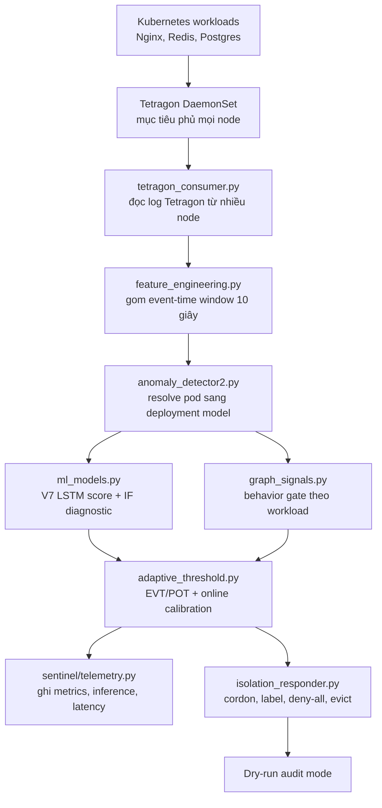

# Báo cáo kỹ thuật: eBPF Runtime Sentinel cho Kubernetes

**Ngày xác minh cluster gần nhất:** 2026-08-12
**Workspace local:** `/home/tndat/Downloads/eBPF-project`  
**Máy cluster:** `dat@10.1.16.234:/home/dat/ml-service`  
**Phiên bản đang deploy:** Syscall Runtime Release V7, window 10 giây,
dry-run; AIMS V8 là campaign candidate riêng, chưa được promote
**Chế độ phản ứng:** audit/dry-run, tức là hệ thống ghi log hành động cô lập nhưng chưa thật sự cordon/evict pod

## Tóm tắt

Dự án này xây dựng một hệ thống phát hiện bất thường runtime cho Kubernetes bằng eBPF/Tetragon kết hợp machine learning. Thay vì chỉ nhìn log ứng dụng, hệ thống quan sát hành vi thật ở tầng kernel, cụ thể là syscall của container. Runtime hiện gom event Tetragon thành cửa sổ 10 giây theo từng workload, đưa vào mô hình V7 LSTM Autoencoder để chấm điểm bất thường, sau đó kiểm tra thêm bằng behavior gate theo từng workload trước khi tạo cảnh báo.

Kết quả ML dưới đây là bằng chứng validation lịch sử của release V7, được thu thập trước đợt mở rộng topology. Trạng thái hạ tầng được xác minh lại sau cùng ở Mục 2 và Mục 18.7:

- validation ban đầu thực hiện trên cluster 3 node;
- sau mở rộng, cluster hiện có 6/6 node `Ready` (3 control plane, 3 worker);
- `sentinel-detector.service` hiện `active`; coverage gate và Tetragon đều đạt 6/6;
- model V7 từng được load từ `/home/dat/ml-service/models`;
- full canonical regression gần nhất trên VM đạt `151 passed, 2 warnings`;
- log thí nghiệm mới nhất khi đó ghi hơn 108k cửa sổ đã xử lý và `anomalies=0`;
- validation attack đạt 15/15 detection trên Nginx, Redis và Postgres;
- normal validation và post-promotion soak khi đó không có false positive alert.

Điểm quan trọng nhất của benchmark lịch sử: latency end-to-end khoảng 58 giây không phải do model chậm. Inference của model chỉ khoảng 20 ms mỗi cửa sổ. Latency cao chủ yếu do thiết kế cố ý yêu cầu 2 cửa sổ liên tiếp, mỗi cửa sổ 30 giây, để giảm false positive. Cần đo lại sau khi các workload recovery ổn định.

**Kết luận vận hành ở snapshot mới nhất.** Sáu node và Tetragon 6/6 khỏe,
detector production V7 vẫn `active/running`, `NRestarts=0`, dry-run. Campaign
AIMS V8 đã hoàn tất capture 24/24 phase (165.499 window, khoảng 28,81 giờ),
train 8/8 model và calibration fit-only. Independent normal evaluation đã pass
đủ 20/20 phase với 122.639 window và zero observed alert; report
`status=complete`, `passed=true` và
`POST_CAPTURE_COMPLETE` đã được tạo. Blind attack V8 hiện đang chạy nền;
ablation, overhead và promotion chưa chạy. Vì vậy candidate **chưa
production-ready** và không được suy diễn “không có false positive” từ
checkpoint giữa chừng. Kết quả fit-v2 195/200 là campaign lịch sử khác, không
phải kết quả V8 hiện tại.

## Quy ước tên phiên bản và research track

Tài liệu lịch sử từng dùng cùng ký hiệu `Vx` cho release runtime, thử nghiệm
model và hướng kiến trúc; cách gọi đó không tạo thành chuỗi release đầy đủ
V1--V8. Báo cáo này dùng quy ước sau:

- **V7**: syscall runtime release đang chạy production dry-run;
- **V8**: AIMS syscall candidate/evaluation campaign, không bao gồm MCP/GAT;
- **Agent Runtime research track**: prototype MCP/behavior-graph/GAT trong
  namespace `agent-sentinel-lab`; tên cũ trong artifact là “V2”;
- **V9 generalization protocol**: contract nghiên cứu tương lai, chưa phải
  release đã deploy.

Không có artifact release hoàn chỉnh cho V3, V4 hay V5. V6 chỉ là thử nghiệm
ensemble LSTM/Isolation Forest đã bị loại. Cụm từ “đã triển khai Agent Runtime”
trong lịch sử chỉ có nghĩa **đã deploy prototype lab**: MCP server chỉ
acknowledge, không có AI Agent/executor thực thi SSH hoặc Kubernetes tool thật,
GAT không tham gia quyết định production và không thuộc campaign V8.

## 1. Mục tiêu nghiên cứu

Câu hỏi nghiên cứu chính của dự án là:

> Có thể xây dựng một runtime sentinel cho Kubernetes học hành vi bình thường từ dữ liệu eBPF/Tetragon thật, phát hiện hành vi tấn công ở tầng kernel theo thời gian thực, và kích hoạt luồng cô lập pod với rủi ro false positive thấp hay không?

Phạm vi chính hiện tại là vertical slice ở tầng syscall. Sau khi đọc bộ
`Agent_Runtime_Sentinel_ALL_FILES`, đồ án mở thêm **Agent Runtime research
track** (tên lịch sử: V2): quan sát MCP trong lab, mô hình hoá graph
`agent -> tool -> resource`, rồi thử nghiệm GAT + EVT-POT. Track này mới có
prototype parser, graph, scenario replay và TLS uprobe; chưa có AI Agent thực
thi tool thật, chưa được bật quyền quyết định/action production và không thuộc
V8.

## 2. Trạng thái hạ tầng hiện tại đã xác minh bằng SSH

Các thông tin nền tảng dưới đây được kiểm tra trực tiếp trên `dat@10.1.16.234` ngày 2026-08-11.

| Thành phần | Trạng thái đã xác minh |
|---|---|
| Kubernetes cluster | 6/6 node `Ready`: 3 control plane và 3 worker |
| Kubernetes version | client/server **v1.34.10** |
| Control plane | `k8s-master.local` (.234), `k8s-master2.local` (.235), `k8s-master3.local` (.236) |
| Worker | `k8s-worker1.local` (.237), `k8s-worker4.local` (.238), `k8s-worker3.local` (.239) |
| API server | `/readyz?verbose` pass; các kiểm tra API server, informer và etcd đều `ok` |
| OS/runtime | Ubuntu 24.04.4 LTS, containerd 2.2.x |
| Tetragon | `6 desired/current/ready/available`; một sensor trên mỗi node |
| Tracing policy | `TracingPolicyNamespaced/sentinel-syscalls` tồn tại ở `default` và `production`; `production/aims-sensitive-exec` cũng tồn tại |
| Workload được monitor | `production/nginx`, `production/redis`, `default/postgres` đều `1/1 Available` |
| Load generator | Nginx, Redis và Postgres load generator đều `1/1 Available` |
| Detector service | `active`, window 10 giây, dry-run, coverage gate `true`, `no_model=0` |
| Chế độ runtime | `--dry-run`, không phá hủy cluster khi có alert |
| Model production | `/home/dat/ml-service/models` |
| Vocabulary production | `/home/dat/ml-service/models/vocab.pkl`, 210 features |
| Release manifest | `/home/dat/ml-service/models/release_manifest.json` |
| Workload/cluster pod | 225/225 pod toàn cụm ở trạng thái `Running` hoặc `Completed`; không có pod lỗi tại snapshot 12:40Z |
| Falco | DaemonSet `6 desired/6 ready`, image `falcosecurity/falco:0.44.1`; collector evidence riêng đang đọc đủ sáu stream |
| Regression | Full canonical suite đã deploy trên VM: `151 passed, 2 warnings`; local source suite hiện tại: `115 passed, 7 skipped`; focused V8 VM suites: `68`, `11`, `31`; staging V8 hậu kỳ + blind attack đạt `53 passed` |

**Quy ước bằng chứng.** Node list, phiên bản Kubernetes, `/readyz`, Tetragon,
policy, workload và service ở trên là snapshot kiểm tra mới ngày 11-08-2026.
Các số liệu latency, throughput, normal/attack và false positive ở phần còn lại
là artifact thí nghiệm có timestamp riêng; chúng không tự động trở thành health
check hoặc coverage proof sau migration. Trước khi dùng số liệu cho paper hoặc
bật một cơ chế mới, cần chạy lại các lệnh ở Mục 9 và lưu artifact có timestamp.

Lệnh service đang chạy trên VM:

```bash
/home/dat/ml-venv/bin/python -u /home/dat/ml-service/anomaly_detector2.py \
  --mode kubectl \
  --model-dir /home/dat/ml-service/models \
  --vocab /home/dat/ml-service/models/vocab.pkl \
  --window 10 \
  --threshold 0.80 \
  --dry-run
```

Log detector lịch sử mới nhất trong artifact cho thấy detector từng score đều và chưa có anomaly:

```text
[STATS] windows=108106 | anomalies=0 | no_model=72070 | cooldown=0
```

`no_model` ở đây chủ yếu đến từ các pod không nằm trong tập target, ví dụ system pod, loadgen, workload phụ. Điều này không có nghĩa là model của Nginx/Redis/Postgres bị lỗi tại thời điểm đo. Không dùng log cũ này để kết luận các target vẫn được score liên tục trong snapshot hiện tại.

## 3. Những gì đã cải thiện

### 3.0 Agent Runtime research track (prototype MCP/GAT trong lab)

Bộ tài liệu `Agent_Runtime_Sentinel_ALL_FILES` gọi hướng này là V2. Đây là tên
lịch sử của một research track, không phải successor production của V7/V8 và
không chứng minh đã có AI Agent thật. Prototype nghiên cứu ba điểm:

- V1 chỉ hiểu syscall thô; V2 cần hiểu MCP tool call ở tầng ứng dụng.
- V1 dùng LSTM/IF trên vector syscall; V2 tiến tới behavior graph và GAT + EVT-POT.
- V1 test workload truyền thống; V2 chuyển mục tiêu sang AI agent chạy trong Kubernetes pod.

Các file code đã bổ sung để đi theo hướng này:

| File | Vai trò |
|---|---|
| `agent_runtime/mcp/graph.py` | Parse MCP JSON-RPC 2.0, trích `tool_name`, tài nguyên liên quan, đánh dấu high-risk action trước khi hash và xây sliding-window graph có giới hạn thời gian **và số event** |
| `agent_runtime/detector/graph_features.py` | Chuyển graph snapshot thành vector deterministic để nối vào harness ML hiện tại trước khi cài GAT/PyTorch Geometric |
| `agent_runtime/detector/online_detector.py` | Detector realtime pre-GAT dùng baseline median/MAD theo feature, two-window confirmation và cooldown |
| `agent_runtime/detector/evt_pot.py` | Adaptive empirical EVT-POT theo agent/pod; chỉ học từ cửa sổ baseline-clean để chống threshold poisoning |
| `agent_runtime/runtime.py` | Đường chạy bounded `MCP payload -> graph -> decision/alert`, trả alert envelope tương thích responder V1 |
| `agent_runtime/eval/agent_scenarios.py` | Định nghĩa 5 kịch bản attack AI-agent tương ứng methodology 5-scenario của V1 |
| `agent_runtime/ebpf/mcp_probe.bpf.c` | Skeleton uprobe `SSL_write`: chỉ copy raw bytes sang ring buffer, không parse JSON trong kernel |
| `agent_runtime/ebpf/Makefile`, `mcp_probe_loader.c` | Build BTF/libbpf reproducible và loader bắt buộc PID cụ thể, chỉ xuất metadata TLS |
| `agent_runtime/benchmark.py` | Đo latency p50/p95/p99 của đường userspace `JSON-RPC -> event -> graph -> vector` |
| `agent_runtime/k8s/mcp-demo.yaml` | Namespace lab riêng, TLS MCP server không thực thi tool và normal load generator |
| `agent_runtime/k8s/mcp-attack-job.yaml` | Job gửi hai MCP call `kubectl.delete` an toàn để kiểm thử telemetry; không có token K8s và không thao tác production |
| `tests/test_agent_runtime_graph.py` | Unit test cho parser, batch JSON-RPC, sliding window expiry, feature vector và scenario coverage |

Điểm thiết kế quan trọng: eBPF Layer 1 **không parse JSON-RPC**. Nó chỉ capture một đoạn bytes đã giải mã tại `SSL_read`/`SSL_write`; parsing ngữ nghĩa được đẩy lên userspace để tránh giới hạn verifier/stack của eBPF. Đây đúng với kiến trúc trong `Dat_Kien_Truc_He_Thong.md` và `Agent_Runtime_Sentinel_Build_Spec.md`.

Trạng thái test local sau khi bổ sung V2 scaffold và các guard chống false-positive/không giới hạn bộ nhớ:

```text
14 passed, 1 skipped in 0.07s
```

Trên VM, full regression suite hiện có `67 passed in 8.80s` (2026-07-29), gồm test realtime MCP, GAT, collector snapshot, review/diversity/holdout gate, provenance manifest và background trainer: traffic bình thường không alert, attack cần hai window xác nhận rồi mới sinh alert, và guard p99 đường chạy payload nhỏ dưới 100 ms. Runtime cũng giữ graph tách theo agent/pod, tránh trộn hành vi hợp lệ của nhiều agent thành false positive. Adaptive EVT-POT được áp dụng theo từng agent/pod nhưng chỉ nhận score đã qua baseline-clean gate, tránh attack tự nâng threshold để che dấu chính nó.

Vòng kiểm chứng mới nhất ngày 2026-07-27 lặp 10.000 MCP request bình thường trên VM, dựng snapshot mỗi 100 request, đo ingest p99 `0.066 ms`; snapshot + vector p99 `0.932 ms`. Đây là mốc regression của Layer 2, không thay thế kernel-to-alert latency của V1. Ngưỡng vận hành trước khi có GAT là p99 snapshot dưới `50 ms` ở cửa sổ 10.000 event; run này còn dư địa lớn. Runtime bridge mới dùng baseline robust median/MAD một phía, bắt buộc xác nhận hai cửa sổ và cooldown. Test hồi quy đã tái tạo lỗi burst traffic sạch bị chấm nhầm là anomaly, sau đó hiệu chỉnh baseline để bao gồm burst hợp lệ; luồng normal không còn alert, trong khi `kubectl_delete` nhắm namespace production cần hai cửa sổ rồi mới phát alert. Namespace `production` đơn lẻ không còn là high-risk signal, tránh biến traffic hợp lệ thành false positive.

**Xác minh capture TLS thật (2026-07-27).** Probe eBPF được build trên VM và attach bằng libbpf vào một PID `openssl s_client` duy nhất do bài test tạo ra; không attach toàn host. Một HTTPS MCP request bình thường đi qua `uprobe -> ring buffer -> HTTP reassembly -> graph detector` cho quyết định `normal`, score `0.0`, detector time `0.039 ms`. Sau đó hai request `kubectl.delete` được gửi tới server MCP chỉ-acknowledge trong namespace `agent-sentinel-lab`: request thứ nhất là `pending`, request thứ hai sinh `alert`. Đo từ `bpf_ktime_get_ns` đến lúc alert là `0.606 ms`; inference `0.045 ms`; toàn decision path `0.198 ms`. Reader đã sửa phép đổi monotonic eBPF clock sang wall clock bằng một anchor đầu phiên, nên không còn báo latency giả hàng chục năm. Payload chỉ được pipe trong memory khi bật cờ explicit `--emit-payload` cho PID lab và không được ghi file; output alert không chứa argument MCP thô.

**Soak kiểm soát false-positive của graph window.** Một replay mới mô phỏng 600 MCP request sạch ở 5 RPS (120 giây, vượt một sliding window 60 giây) đã cho `600/600 normal`. Đây là regression bắt buộc vì bản đầu dùng cumulative count thô và có thể alert khi window đầy. Score giờ chuẩn hoá volume counter theo số giây quan sát, trong khi graph vẫn giữ count thô cho GAT tương lai. Ngay sau soak, hai request `kubectl.delete` vẫn cho `pending -> alert`. Baseline được lưu theo `agent_id` với digest SHA-256; reader từ chối baseline bị sửa hoặc baseline của agent khác.

**Release gate semantic V2.** Lệnh `python -m agent_runtime.eval.replay_validation` chạy bốn normal regime (3, 5, 7, rồi recovery 5 RPS) và toàn bộ năm scenario agent: secret exfiltration, over-privileged kubectl, production delete, lateral movement, container escape. Run trên VM cho `1,200` normal decision với `0 pending`, `0 alert`; `5/5` attack đi qua `pending -> alert`. Inference đo trong replay cao nhất `0.010 ms`, end-to-end decision cao nhất `0.085 ms`. Đây là gate tái lập bằng semantic payload; nó bổ sung chứ không thay thế việc thu dataset MCP thật đa dạng trước khi train GAT.

**GAT evaluation path.** VM đã có `torch 2.11.0+cu130` và `torch-geometric 2.8.0.post1`. `agent_runtime/detector/gat_model.py` hiện triển khai Graph Attention Autoencoder trên topology `agent -> tool -> resource`, node type, degree và global semantic features; score là reconstruction error, threshold là empirical tail quantile có margin. Test train trên clean graph rồi score production-delete graph đã pass. Benchmark CPU 100 inference window: p50 `1.769 ms`, p95 `2.263 ms`, p99 `2.766 ms`, dưới rất xa budget 50 ms/window. Model này chưa được phép thay fallback robust detector trên production vì training graph hiện là lab/replay; cần capture MCP đa dạng đã review, holdout độc lập và promotion gate riêng trước khi bật action.

**Trạng thái model tại thời điểm cập nhật.** Model production đang chạy là V7 syscall detector qua `sentinel-detector.service`, trạng thái `active`, vẫn dùng LSTM Autoencoder đã calibration và behavior gate theo workload. Nhánh MCP có GAT candidate tại `/home/dat/ml-service/models/gat-lab.pt`, kèm manifest SHA-256 và threshold `0.0853128`. Candidate này được train từ 8 graph snapshot normal thu trực tiếp qua TLS uprobe của `agent-sentinel-lab`, trong đó raw MCP payload chỉ đi trong pipe còn artifact lưu lại chỉ chứa graph đã sanitize. Artifact load/verify thành công, nhưng **không được promote**: 8 snapshot từ một agent lab chưa đủ bằng chứng về độ bao phủ hay false-positive cho production. Điều kiện promote còn thiếu là capture normal đa-agent/đa-regime, holdout độc lập, matrix 5 scenario lặp lại và release gate riêng cho GAT.

**Huấn luyện nền có kiểm soát.** Đồ án đã có unit/timer `agent-runtime-gat-trainer.timer` chạy service bằng user `dat` và kiểm tra dataset mỗi giờ; trạng thái bật trên VM cần được xác minh lại sau khi SSH khả dụng. Timer chỉ train candidate khi dataset có ít nhất 200 snapshot với nhãn bất biến `review_status=approved_normal`; collector mặc định gắn `pending_review`, còn record thiếu nhãn hoặc có nhãn khác đều bị từ chối. Gate còn yêu cầu tối thiểu 3 agent, 3 workload và span quan sát 24 giờ, chống trường hợp 200 bản sao từ cùng một pod bị dùng làm baseline. Sau train, candidate còn phải có tỷ lệ alert trên holdout normal bằng `0.0`; chỉ một false positive holdout cũng ghi `candidate_rejected_holdout` và không tạo artifact. Manifest của artifact lưu SHA-256 dataset, số epoch, cấu hình review/diversity/holdout và kết quả holdout, ngoài SHA-256 model, để tái lập kiểm chứng. Cùng gate review đã được đưa vào `train_gat.py`, nên không thể bypass review bằng lệnh train thủ công. Candidate ghi riêng vào `models/gat-candidates/`, có state/digest để không train lại cùng input và **không có cơ chế tự promote**. Để training nền không ảnh hưởng detector V7, systemd áp `Nice=10`, I/O best-effort, `CPUQuota=50%`, `MemoryMax=2G` và timeout 30 phút. Tám snapshot lab cũ chưa có nhãn review nên lượt chạy sau khi siết gate trả `waiting_for_reviewed_clean_data` (`rejected=8`, `required=200`); không tiêu thụ GPU/CPU để train vô ích và không thay đổi detector V7.

Ngày kiểm thử MCP HTTPS lab, `mcp-tls-server` và `mcp-normal-loadgen` đều `Running` trong namespace riêng `agent-sentinel-lab`. Round-trip từ loadgen đến TLS service đạt `HTTP 200`, TLS connect `2.736 ms`, total `199.192 ms`. Job mô phỏng `kubectl.delete` đã Complete; server chỉ acknowledge JSON-RPC và không thực thi bất kỳ tool nào.

Layer 1 đã được build thực tế trên VM theo kernel đang chạy `6.8.0-124-generic`: `mcp_probe.bpf.o` là ELF eBPF hợp lệ và `mcp_probe_loader` build thành công bằng libbpf. Loader yêu cầu PID cụ thể thay vì attach toàn host, đồng thời chỉ in metadata (PID/direction/byte count), giảm rủi ro lộ plaintext ngoài scope test. Không reboot node dù hệ điều hành báo kernel update pending, để không làm gián đoạn cluster.

### 3.1 Chuyển từ synthetic data sang real data

Điểm cải thiện lớn nhất là pipeline hiện tại ưu tiên dữ liệu thật từ Tetragon thay vì baseline synthetic. Lý do là synthetic data dễ làm model học phân phối không giống runtime, dẫn đến false positive.

Release V7 đang deploy được train từ các cửa sổ syscall thật:

| Workload | Số window train | Số feature | Holdout max | Holdout p95 | Vượt ngưỡng | Behavior gate |
|---|---:|---:|---:|---:|---:|---:|
| `default/postgres` | 100 | 210 | 0.1527 | 0.1046 | 0.0 | 0 |
| `production/nginx` | 100 | 210 | 0.2035 | 0.1601 | 0.0 | 0 |
| `production/redis` | 95 | 210 | 0.2282 | 0.1388 | 0.0 | 0 |

Dữ liệu normal được lấy từ 4 chế độ:

- normal 1x traffic;
- Nginx chịu tải `wrk -c50`;
- high-mixed load;
- recovery 1x sau khi scale down.

Ý nghĩa: model không chỉ học một trạng thái yên tĩnh, mà học nhiều trạng thái vận hành bình thường khác nhau. Đây là yếu tố rất quan trọng để giảm false positive.

### 3.2 Ổn định model ML

Release đang deploy là V7 LSTM Autoencoder. So với các bản cũ, các cải thiện chính gồm:

- bỏ decoder teacher-forcing shortcut để tránh autoencoder học copy input quá dễ;
- thêm floor 1% cho feature scaling để syscall hiếm không làm z-score nổ quá lớn;
- clip feature đã scale ở mức 10.0 để một feature đơn lẻ không áp đảo toàn bộ reconstruction error;
- giữ Isolation Forest làm tín hiệu diagnostic, không dùng làm score hành động;
- seed theo SHA-256 của workload để train tái lập được;
- học behavior limit riêng cho từng workload từ train set;
- tách ML score khỏi bằng chứng hành vi kernel.

V6 kiểu mixture giữa LSTM và Isolation Forest đã bị loại. Lý do: Isolation Forest không xử lý tốt các syscall luôn bằng 0 trong baseline; khi attack làm xuất hiện syscall đó, autoencoder thấy rất bất thường nhưng Isolation Forest có thể làm giảm margin. Vì vậy bản production chọn LSTM đã calibration làm score chính.

### 3.3 Giảm false positive

Thiết kế detector V7 không alert chỉ vì một điểm score cao đơn lẻ. Một alert muốn đi tiếp phải qua nhiều lớp:

- resolve model theo namespace/deployment, nên pod restart đổi suffix vẫn tìm đúng model;
- chỉ update online calibration bằng window sạch;
- window score cao bất thường lúc startup không được đưa vào calibration;
- cần 2 cửa sổ liên tiếp đủ điều kiện;
- cần behavior gate theo từng workload;
- pod hệ thống và loadgen không được tính như workload cần phản ứng;
- live-normal validation yêu cầu không có cả raw score crossing, dù behavior gate có thể chặn alert.

Thiết kế này làm latency tăng, nhưng đổi lại false positive thấp hơn.

### 3.4 Promotion an toàn và có rollback

Script `promote_candidate.py` không copy model tùy tiện. Nó kiểm tra:

- offline training đã pass;
- dataset manifest đúng hash;
- vocabulary đúng hash với dataset, normal report và attack report;
- normal matrix pass đủ 4 regime;
- attack matrix pass đủ 15 trial;
- runtime code hash khớp giữa report và file hiện tại trên VM;
- đủ 9 file model-release;
- đúng model version V7;
- đủ 3 model cho Postgres, Nginx, Redis;
- input dimension khớp vocab 210.

Release V7 ban đầu (artifact lịch sử) được promote lúc:

```text
2026-07-22T10:17:42.165209+00:00
```

Release đang được unit service dùng hiện nay được manifest xác nhận là V7,
`window=10`, `threshold=0.80`, `--dry-run`, promote lúc
`2026-07-29T09:39:34Z`. Đây là release **provisional**: không thay thế evidence
benchmark cũ; raw-score drift trên profile hiện hành buộc phải train và validate
candidate mới trước khi có thể claim false-positive rate realtime.

Backup trên VM:

```text
/home/dat/ml-service/models.backup-20260722T101742Z
/home/dat/ml-service/calibration.json.backup-20260722T101742Z
```

## 4. Kiến trúc hệ thống

Kiến trúc đang deploy là syscall vertical slice gồm các lớp sau:



Hiện tại response layer vẫn chạy dry-run. Nghĩa là khi có alert, hệ thống tạo `AnomalyAlert` và đi qua luồng responder, nhưng chỉ log các hành động như `cordon`, `label quarantine=true`, tạo Cilium deny-all và evict pod. Nó chưa thật sự thay đổi cluster.

Ở snapshot 01-08-2026 DaemonSet đạt `6/6 Ready/Available`. Coverage gate đang
được bật trong process detector; nếu số sensor giảm, consumer dừng ingest và
không đưa ra decision từ telemetry thiếu node.

## 5. Luồng code runtime

Luồng chạy realtime:

1. `tetragon_consumer.py` tìm các pod Tetragon trong namespace `kube-system`.
2. Nó mở stream song song tới các pod Tetragon `Ready` bằng `kubectl exec ... tail -F /var/run/cilium/tetragon/tetragon.log`; baseline ban đầu có 3 node. Nếu số nguồn nhỏ hơn số node schedulable, runner phải fail preflight thay vì coi coverage là đủ.
3. Event JSON từ Tetragon được parse và đưa vào queue có giới hạn.
4. `feature_engineering.py` gom event theo event-time thành window 10 giây cho từng pod.
5. Khi một window đóng, hệ thống tạo `FeatureVector`, gồm vector feature, syscall count, node, namespace, pod, window start/end.
6. `anomaly_detector2.py` đổi pod key thật như `production/nginx-56fcf95486-hfgqj` thành model key `production/nginx`.
7. `ml_models.py` chấm điểm bằng V7 LSTM Autoencoder. Isolation Forest vẫn được tính nhưng chỉ để diagnostic.
8. `graph_signals.py` kiểm tra tỷ lệ syscall nghi vấn so với behavior limit của workload đó.
9. `adaptive_threshold.py` áp threshold offline và online calibration.
10. `sentinel/telemetry.py` ghi inference, decision, detection latency ra JSONL.
11. Nếu score, behavior gate và consecutive rule cùng pass, detector tạo alert.
12. `isolation_responder.py` chạy luồng phản ứng ở dry-run.

Nói ngắn gọn:

```text
Tetragon event -> 30s window -> feature vector -> V7 LSTM score
              -> behavior gate -> adaptive threshold -> alert -> dry-run isolation
```

## 6. Luồng train và validate model

Luồng build model:

1. Thu baseline thật bằng các script benchmark/collector.
2. `build_phase_dataset.py` kiểm tra phase, loại phase có backpressure, giữ đúng vocabulary index và tạo train/holdout theo từng phase.
3. `train_candidate.py` train một model V7 cho mỗi workload.
4. `analyze_normal_run.py` chạy detector độc lập trên traffic normal mới.
5. `run_kernel_matrix.py` chạy attack thật bên trong container.
6. `promote_candidate.py` chỉ promote nếu tất cả report và hash đều khớp.

Điểm quan trọng: attack validation không phải simulator Python. File `runtime_attack.c` được compile thành binary static, copy vào container, rồi chạy bên trong Nginx/Redis/Postgres. Vì vậy test đi qua đường kernel syscall thật -> Tetragon -> detector -> model -> alert.

## 7. Kết quả thực nghiệm lịch sử của release V7

Các kết quả Mục 7 được thu trước migration/topology và ở cadence 30 giây cũ.
Chúng là evidence tái lập của release khi đó, không phải SLO hoặc validation
realtime của cluster/window 10 giây hiện tại.

### 7.1 Offline holdout

Release được chọn pass offline holdout. Không workload nào vượt ngưỡng 0.80. Score holdout cao nhất là Redis 0.2282, vẫn thấp hơn ngưỡng rất xa.

### 7.2 Live-normal matrix

Artifact trên VM:

```text
/home/dat/ml-service/models/normal_validation_report.json
```

Kết quả:

| Workload | Window | Max score | p99 inference | p99 ingest lag | Score crossing | Behavior gate |
|---|---:|---:|---:|---:|---:|---:|
| `default/postgres` | 44 | 0.2664 | 59.184 ms | 1.757 s | 0 | 0 |
| `production/nginx` | 44 | 0.6435 | 102.515 ms | 1.693 s | 0 | 0 |
| `production/redis` | 44 | 0.2246 | 65.893 ms | 1.639 s | 0 | 0 |

Nginx có max score 0.6435 khi chịu tải `wrk -c50`, nhưng vẫn dưới threshold 0.80 và không bị alert.

### 7.3 Attack matrix thật trong container

Artifact trên VM:

```text
/home/dat/ml-service/models/attack_validation_report.json
```

Tổng hợp:

| Metric | Giá trị |
|---|---:|
| Workload test | 3 |
| Attack profile mỗi workload | 5 |
| Tổng trial attack thật | 15 |
| Trial detect thành công | 15 |
| Detection rate trong matrix này | 15/15 |
| Median kernel-to-alert latency | 57.934 s |
| Max kernel-to-alert latency | 58.499 s |
| Median inference mỗi trial | 20.532 ms |
| Alert trước khi inject attack | 0 |
| Attack process lỗi | 0 |
| Detector process lỗi | 0 |
| Sai lệch 2 đồng hồ đo latency lớn nhất | 0.000306 s |

5 attack profile:

- reverse shell;
- container escape;
- cryptomining;
- privilege escalation;
- data exfiltration.

Latency 57-58 giây là latency end-to-end từ lúc binary trong container xác nhận bắt đầu attack đến lúc detector tạo alert. Con số này gần 60 giây vì hệ thống yêu cầu 2 window liên tiếp, mỗi window 30 giây.

### 7.4 Post-promotion soak

Artifact:

```text
/home/dat/ml-service/post-promotion-clean-soak-report-20260722T1034Z.json
```

Kết quả:

| Workload | Window | Max score | p99 ingest lag | Alert | Score crossing | Behavior gate |
|---|---:|---:|---:|---:|---:|---:|
| `default/postgres` | 15 | 0.1515 | 1.134 s | 0 | 0 | 0 |
| `production/nginx` | 15 | 0.0842 | 1.635 s | 0 | 0 | 0 |
| `production/redis` | 15 | 0.0912 | 1.743 s | 0 | 0 | 0 |

Tất cả 45 decision sau promotion đều là normal.

### 7.5 Quan sát production dài ngày

Ngày 2026-07-26, service đang chạy hơn 4 ngày và đã xử lý hơn 108k window:

```text
windows=108106 | anomalies=0 | no_model=72070 | cooldown=0
```

Live score gần thời điểm kiểm tra vẫn ổn. Có một spike Postgres 0.4414 nhưng vẫn thấp hơn threshold 0.80, không có behavior gate và không alert.

### 7.6 Overhead

Artifact hợp lệ:

```text
/home/dat/ml-service/overhead-final/comparison-wrk-20260722T103530Z.json
```

Lưu ý: trên VM còn có `comparison-wrk.json`, nhưng file đó không có `experiment_id` ràng buộc 3 phase cùng một run, nên không dùng làm số liệu chính.

| Phase | Median RPS | Median p99 latency | Failed requests | Detector CPU | Detector memory |
|---|---:|---:|---:|---:|---:|
| no tracing | 61,785.49 | 4.73 ms | 0 | n/a | n/a |
| Tetragon only | 56,852.97 | 5.21 ms | 0 | n/a | n/a |
| full pipeline | 56,464.72 | 5.32 ms | 0 | 2.84% của 1 core | 380.69 MiB |

So sánh overhead:

| So sánh | Giảm throughput | Tăng p99 latency |
|---|---:|---:|
| Tetragon vs no tracing | 7.98% | 10.15% |
| Full pipeline vs no tracing | 8.61% | 12.47% |
| Detector thêm vào so với Tetragon-only | 0.68% | 2.11% |

Kết luận: phần lớn overhead đến từ tracing bằng Tetragon. ML detector thêm overhead nhỏ so với Tetragon-only trong run hợp lệ này.

### 7.7 Kết quả Agent Runtime prototype trong MCP HTTPS lab

Đây là kết quả prototype (tên lịch sử: V2) trong namespace cô lập
`agent-sentinel-lab`; nó không có AI Agent/executor tool thật, không được gộp
với syscall release và không được dùng để claim production readiness.

| Kiểm tra | Kết quả đã ghi nhận | Ý nghĩa |
|---|---:|---|
| Soak MCP normal | 600/600 decision `normal`, 0 pending, 0 alert | Sửa false positive do cumulative counter khi sliding window đầy |
| Scenario MCP nguy hiểm | 5/5 scenario `pending -> alert` | Xác minh semantic gate trên replay có kiểm soát |
| TLS lab capture đến alert | 0.606 ms | Đo từ timestamp eBPF đến alert cho PID lab được attach cụ thể |
| GAT inference CPU | p50 1.769 ms; p95 2.263 ms; p99 2.766 ms | Dưới budget 50 ms mỗi graph window |
| Dataset GAT thật đã review | Chưa đủ | Chỉ có 8 snapshot lab, không đủ để promote |

Hai đường đánh giá có mục tiêu khác nhau: syscall track đo kernel-to-alert của
detector đang chạy; Agent Runtime prototype đo TLS-uprobe/graph trong lab và
inference GAT. Không cộng, so sánh trực tiếp hoặc dùng số lab để thay thế
latency của syscall release.

## 8. Phân tích latency

Cần tách 3 loại latency:

| Loại latency | Benchmark lịch sử V7 | Nguyên nhân chính |
|---|---:|---|
| Inference của model | khoảng 20 ms median | PyTorch scoring + gate logic |
| Ingest lag | khoảng 1-2 s p99 | Tetragon log delivery, queue, flush window |
| Kernel-to-alert | khoảng 58 s median | yêu cầu 2 window liên tiếp, mỗi window 30 s |

Vậy model không chậm. Muốn giảm latency end-to-end thì phải đổi thiết kế window/rule:

1. Giảm window từ 30s xuống 15s hoặc 10s.
2. Cho phép fast-path một window nếu score bão hòa và behavior gate rất mạnh.
3. Thêm early-fire counter cho syscall nguy hiểm như `execve`, `setuid`, `unshare`, `mount`, `ptrace`, `capset`, `connect`.
4. Chuyển ingestion từ `kubectl exec tail -F` sang Tetragon gRPC hoặc node-local sidecar.
5. Giữ 2-window confirmation cho trường hợp score thấp hoặc thiếu behavior evidence.

Dự kiến nếu revalidate cẩn thận:

| Thiết kế | Latency kỳ vọng |
|---|---:|
| Baseline V7 lịch sử: 30s window, 2-window confirmation | 58-60 s |
| 15s window, 2-window confirmation | 28-30 s |
| 10s window, 2-window confirmation | 18-20 s |
| Severity-aware one-window alert | 10-30 s tùy thời điểm flush |

Rủi ro của giảm latency là tăng false positive. Vì vậy mọi thay đổi latency phải chạy lại normal matrix và 15-trial attack matrix.

## 9. Cách chạy lại từ đầu

Phần này giả định đã SSH được vào cluster và đang ở `/home/dat/ml-service`.

### 9.1 SSH vào cluster

```bash
ssh dat@10.1.16.234
cd /home/dat/ml-service
```

### 9.2 Kiểm tra cluster và coverage trước khi chạy lại

```bash
kubectl get nodes -o wide
kubectl get pods -n kube-system -l app.kubernetes.io/name=tetragon -o wide
kubectl get pods -n production -o wide
kubectl get pods -n default -l app=postgres -o wide
kubectl get tracingpolicynamespaced -A
kubectl -n kube-system get ds tetragon -o wide
systemctl is-active sentinel-detector.service
```

Kỳ vọng:

- 6 node `Ready` với đúng 3 control plane + 3 worker;
- Tetragon `desired == current == ready == available == 6`;
- target workload Running;
- `sentinel-syscalls` có ở `default` và `production`;
- detector active nếu đã có release.

Nếu một điều kiện không đạt, dừng benchmark/soak và ghi snapshot lỗi. Không
được tái sử dụng latency hay false-positive artifact từ topology khác.

### 9.3 Apply policy Tetragon

```bash
kubectl apply -f tetragon-targeted-policies.yaml
```

Policy baseline V7 sample syscall tần suất cao nhưng không sample các syscall nhạy cảm như `execve`, `setuid`, `unshare`, `mount`, `ptrace`. Trước khi chạy lại, phải inspect policy đang apply thay vì giả định nội dung này vẫn đúng.

### 9.4 Thu baseline thật

Chạy collector/benchmark:

```bash
./probe_sampled_policy.sh
./collect_sampled_baseline_matrix.sh
```

Mỗi phase tạo thư mục timestamp riêng. Không overwrite thư mục cũ vì đó là artifact để truy vết.

### 9.5 Build dataset phase-stratified

Mẫu lệnh:

```bash
/home/dat/ml-venv/bin/python build_phase_dataset.py \
  /home/dat/ml-service/<phase-normal> \
  /home/dat/ml-service/<phase-wrk> \
  /home/dat/ml-service/<phase-high> \
  /home/dat/ml-service/<phase-recovery> \
  --output /home/dat/ml-service/<dataset-output> \
  --minimum-events 100 \
  --minimum-phase-windows 20 \
  --validation-fraction 0.20 \
  --policy tetragon-targeted-policies.yaml \
  --vocab models/vocab.pkl
```

Builder sẽ fail nếu:

- thiếu workload target;
- phase có sensor backpressure;
- vocabulary mismatch;
- cố zero-pad feature mới trong khi syscall đó thật sự xuất hiện.

### 9.6 Train candidate

```bash
/home/dat/ml-venv/bin/python train_candidate.py \
  --dataset /home/dat/ml-service/<dataset-output> \
  --output /home/dat/ml-service/models_candidate_v7-<timestamp> \
  --model-version 7
```

Output cần có:

- `training_report.json`;
- `dataset_manifest.json`;
- `vocab.pkl`;
- bundle và `.pt` cho từng workload.

### 9.7 Chạy normal validation

```bash
sudo systemd-run \
  --unit=sentinel-v7-final-normal \
  --collect \
  --property=TimeoutStartSec=45min \
  --property=WorkingDirectory=/home/dat/ml-service \
  --setenv=KUBECONFIG=/home/dat/.kube/config \
  --setenv=PYTHONUNBUFFERED=1 \
  /home/dat/ml-service/run_candidate_normal_matrix.sh \
    /home/dat/ml-service/models_candidate_v7-<timestamp>
```

Điều kiện pass:

- 4 regime đều pass;
- zero detection;
- zero raw score crossing;
- zero behavior gate crossing;
- zero actionable consecutive pair;
- đủ window cho từng workload.

### 9.8 Compile và chạy attack matrix thật

```bash
gcc -O2 -static -Wall -Wextra -o runtime_attack runtime_attack.c

sudo systemd-run \
  --unit=sentinel-v7-final-attacks \
  --collect \
  --property=TimeoutStartSec=45min \
  --property=WorkingDirectory=/home/dat/ml-service \
  --setenv=KUBECONFIG=/home/dat/.kube/config \
  --setenv=PYTHONUNBUFFERED=1 \
  /home/dat/ml-venv/bin/python /home/dat/ml-service/run_kernel_matrix.py \
    --model-dir /home/dat/ml-service/models_candidate_v7-<timestamp> \
    --normal-calibration /home/dat/ml-service/<normal-calibration>.json \
    --runtime-binary /home/dat/ml-service/runtime_attack \
    --attack-seconds 70 \
    --rate 20 \
    --post-attack-wait 45 \
    --output-root /home/dat/ml-service/kernel-regression-matrix
```

Điều kiện pass:

- 15/15 trial detected;
- zero alert trước lúc inject attack;
- có start acknowledgement;
- attack exit code 0;
- detector exit code 0;
- detection latency có ở cả measured path và telemetry path;
- sai lệch 2 latency clock nằm trong tolerance.

### 9.9 Promote model

Dry-run trước:

```bash
/home/dat/ml-venv/bin/python promote_candidate.py \
  --candidate models_candidate_v7-<timestamp> \
  --production models \
  --normal-report <normal-report>.json \
  --attack-report <attack-report>.json \
  --calibration calibration.json \
  --expected-version 7 \
  --expected-attack-trials 15
```

Nếu dry-run không có failure, apply:

```bash
/home/dat/ml-venv/bin/python promote_candidate.py \
  --candidate models_candidate_v7-<timestamp> \
  --production models \
  --normal-report <normal-report>.json \
  --attack-report <attack-report>.json \
  --calibration calibration.json \
  --expected-version 7 \
  --expected-attack-trials 15 \
  --apply
```

Restart service:

```bash
sudo systemctl restart sentinel-detector
systemctl is-active sentinel-detector
tail -n 120 realtime-detector.log
```

### 9.10 Chạy soak sau promotion

```bash
date -u +%s.%N > clean-post-promotion-soak.start
```

Sau khi đủ window:

```bash
/home/dat/ml-venv/bin/python analyze_normal_run.py metrics.jsonl \
  --minimum-windows 12 \
  --minimum-events 20 \
  --threshold 0.80 \
  --max-score-exceedances 0 \
  --max-behavior-gates 0 \
  --since-ts "$(cat clean-post-promotion-soak.start)" \
  --output post-promotion-clean-soak-report-<timestamp>.json
```

### 9.11 Chạy overhead benchmark

```bash
sudo systemd-run \
  --unit=sentinel-v7-overhead \
  --collect \
  --property=TimeoutStartSec=20min \
  --property=WorkingDirectory=/home/dat/ml-service \
  --setenv=PYTHONUNBUFFERED=1 \
  /home/dat/ml-service/run_overhead_matrix.sh all
```

Chỉ dùng file comparison có `experiment_id`, ví dụ:

```text
overhead-final/comparison-wrk-20260722T103530Z.json
```

### 9.12 Cài và kiểm tra GAT candidate trainer (không promote)

Chỉ làm bước này sau khi đã review dataset; timer không phải cơ chế thu thập hay
gắn nhãn dữ liệu tự động. Copy unit/timer từ repo lên VM rồi cài với quyền quản
trị:

```bash
sudo install -m 0644 agent_runtime/systemd/agent-runtime-gat-trainer.service \
  /etc/systemd/system/agent-runtime-gat-trainer.service
sudo install -m 0644 agent_runtime/systemd/agent-runtime-gat-trainer.timer \
  /etc/systemd/system/agent-runtime-gat-trainer.timer
sudo systemctl daemon-reload
sudo systemctl enable --now agent-runtime-gat-trainer.timer
```

Xác minh lượt chạy đầu và bảo đảm detector V7 không bị ảnh hưởng:

```bash
systemctl list-timers agent-runtime-gat-trainer.timer --all
sudo systemctl start agent-runtime-gat-trainer.service
journalctl -u agent-runtime-gat-trainer.service -n 30 --no-pager
systemctl is-active sentinel-detector.service
```

Với dataset ít hơn 200 snapshot, chưa review, thiếu 3 agent/3 workload hoặc
chưa đủ 24 giờ, kết quả mong đợi là `waiting_for_*`; đó là trạng thái an toàn,
không phải lỗi. Chỉ `candidate_ready` tạo artifact dưới `models/gat-candidates/`.
Ngay cả khi candidate sẵn sàng, vẫn phải chạy holdout độc lập và promotion gate
thủ công; timer không được phép ghi vào thư mục model production.

## 10. Map file trong repo

| File/thư mục | Vai trò |
|---|---|
| `ml-service/anomaly_detector2.py` | Orchestrator realtime detector |
| `ml-service/ml_models.py` | Model V7 LSTM và scoring |
| `ml-service/feature_engineering.py` | Parse event và tạo feature window |
| `ml-service/tetragon_consumer.py` | Đọc Tetragon từ nhiều node |
| `ml-service/graph_signals.py` | Behavior gate theo workload |
| `ml-service/adaptive_threshold.py` | EVT/POT và online calibration |
| `ml-service/build_phase_dataset.py` | Build dataset theo phase |
| `ml-service/train_candidate.py` | Train model candidate |
| `ml-service/run_kernel_matrix.py` | Chạy 15 attack trial |
| `ml-service/run_kernel_regression.py` | Harness attack cho một workload |
| `ml-service/promote_candidate.py` | Promote model atomically |
| `agent_runtime/mcp/graph.py` | Layer 2 MCP parser và bounded behavior graph của hướng V2 |
| `agent_runtime/benchmark.py` | Benchmark latency userspace cho V2 |
| `sentinel/benchmarks/runtime_attack.c` | Binary sinh syscall attack an toàn |
| `sentinel/benchmarks/VALIDATION_PROTOCOL.md` | Protocol validate |
| `sentinel/benchmarks/REGRESSION_RESULTS.md` | Tóm tắt kết quả regression |
| `sentinel/systemd/sentinel-detector.service` | Unit service production |
| `tests/` | Unit/regression tests |

## 11. Giới hạn của evidence và triển khai hiện tại

Không nên claim quá tay. Implementation đã có evidence tốt trong phạm vi đã test, nhưng deployment live hiện vẫn có các giới hạn:

- mới validate trên Nginx, Redis, Postgres;
- chưa chứng minh cho workload bất kỳ chưa từng thấy;
- response đang dry-run, chưa bật cô lập thật;
- benchmark lịch sử ghi latency end-to-end khoảng 58 giây vì rule 2 window;
- ingestion qua `kubectl exec tail -F` chưa phải đường latency thấp nhất;
- MCP/TLS uprobe và GAT graph mới được triển khai/kiểm chứng trong lab; chưa được promote làm detector production;
- attack profile là mô phỏng syscall an toàn, không phải malware phá hoại thật;
- zero false positive là kết quả thực nghiệm trên tập đã đo, không phải chứng minh toán học cho mọi tình huống.

## 12. Hướng phát triển tiếp theo

Ưu tiên nếu muốn đưa project lên mức paper mạnh hơn:

1. Giảm window xuống 10s hoặc 15s và revalidate toàn bộ.
2. Thêm severity-aware fast path cho syscall rất nguy hiểm.
3. Chuyển ingestion sang Tetragon gRPC hoặc sidecar node-local.
4. Thêm workload MCP thật chạy HTTPS.
5. Hook TLS bằng uprobe `SSL_read`/`SSL_write`.
6. Sau khi có dữ liệu MCP thật, mới đánh giá GAT/graph autoencoder.
7. Tạo figure paper từ JSON report: score distribution, latency CDF, overhead bar chart, pipeline diagram.

## 13. Claim có thể dùng trong paper (evidence lịch sử, không phải trạng thái live)

Một claim an toàn, đúng với artifact thí nghiệm có timestamp:

> Chúng tôi xây dựng và triển khai một Kubernetes runtime sentinel học hành vi syscall theo từng workload từ telemetry eBPF/Tetragon thật. Trên cluster 3 node, release V7 đã phát hiện 15/15 trial attack thật chạy bên trong container trên ba workload Nginx, Redis và Postgres, đồng thời không tạo false positive alert trong normal matrix bốn regime và clean post-promotion soak. Median kernel-to-alert latency là 57.934 giây, chủ yếu do rule xác nhận hai cửa sổ 30 giây, trong khi median ML inference chỉ khoảng 20 ms mỗi cửa sổ. Trong benchmark overhead hợp lệ, detector chỉ thêm 0.68% median throughput loss so với Tetragon-only.

Claim này cố ý viết theo hướng empirical. Nó không nói hệ thống đạt 100% detection hoặc 0% false positive cho mọi workload, mọi traffic và mọi kiểu tấn công.

## 14. Cập nhật hạ tầng ngày 29-07-2026

**Ghi chú chronology:** đây là snapshot trung gian của quá trình nâng cấp khi
cluster còn 5 node. Topology và health hiện tại được thay thế bởi Mục 2 và
Mục 18.8; không đọc đoạn này như trạng thái live.

Đợt vận hành này đã mở rộng cluster từ 3 lên 5 node: hai control plane
`k8s-master.local` và `k8s-master2.local`, cùng ba worker. Snapshot etcd và
bundle cấu hình đã được tạo trước thay đổi. Vòng **v1.29.15** và **v1.30.14**
đã hoàn tất trên cả năm node. `/readyz` trả về `ok`, toàn bộ node ở trạng thái
`Ready` và không còn pod lỗi/pending tại thời điểm kiểm tra. Các minor tiếp
theo phải tiếp tục theo đúng thứ tự v1.31 → v1.34, một minor mỗi lần.

Cilium đã được reconcile hoàn chỉnh lên **1.19.6** (5/5 agent, 5/5 Envoy),
thay cho cấu hình Helm trước đó chỉ đổi chart nhưng vẫn giữ image 1.19.3. Có
một restart ngắn của API server chính trong lúc static manifest được reload;
static pod tự phục hồi và health check sau đó đạt `ok`. Đây là lý do các vòng
nâng minor tiếp theo phải luôn có health gate, không chạy theo kiểu bỏ qua.

NFS lab storage đã được cung cấp từ worker3 qua StorageClass mặc định
`nfs-client`; RabbitMQ đã chạy với PVC NFS, còn Kafka HA hiện hữu đã được giữ
nguyên và xác nhận hồi phục sau drain. NFS này là **single-server lab storage**
chứ chưa phải backend HA; không nên dùng claim production HA cho thành phần
này. Cụm vẫn dùng endpoint `k8s-master.local:6443`, vì vậy control plane thứ
hai chưa tạo failover API thực sự cho đến khi bổ sung VIP/load balancer và số
etcd member lẻ.

Trong source `agent_runtime`, đường train GAT đã được refactor để cả CLI và
continuous trainer dùng chung `eval/snapshot_dataset.py`. Module này thống
nhất parse JSONL, kiểm tra `approved_normal`, tạo graph snapshot và SHA-256
provenance; nhờ đó attack/unreviewed data không thể đi vào baseline qua một
đường code khác. Các unit test liên quan chạy thành công: **7 passed, 2
skipped**.

### Trạng thái hoàn tất sau nâng cấp

Ngày 29-07-2026, toàn bộ năm node đã hoàn tất chuỗi nâng cấp tuần tự lên
**Kubernetes v1.34.10**. Snapshot etcd đã được tạo và kiểm tra SHA-256 trước
mỗi minor version. Sau nâng cấp, `/readyz` trả về `ok`, 5/5 node `Ready`,
Cilium 1.19.6 và Tetragon 1.6.1 đều 5/5, và không có pod `Failed`/`Pending`.
NFS trên worker3 vẫn `active`; PVC RabbitMQ vẫn `Bound` trên `nfs-client`.

Helm release Tetragon từng `failed` vì xung đột server-side apply tại
`tetragon-config.data.export-denylist`. ConfigMap đã được backup, sau đó
reconcile bằng chart 1.6.1, values cũ và `--force-conflicts`; release hiện
`deployed` (revision 4). Denylist đã lại loại `cilium` và `kube-system`, giảm
nhiễu từ telemetry hệ thống.

Kiểm thử full trên VM sau nâng cấp: **67 passed, 2 warnings, 8.93s**. Hai
warning là `torch.jit.script` deprecated, không phải lỗi chức năng.

## 15. Agent Runtime Sentinel V2 — đối chiếu Build Spec

Source `agent_runtime/` hiện thực core V2 theo tài liệu
`Agent_Runtime_Sentinel_ALL_FILES`: Layer 1 có BPF uprobe TLS với payload bị
giới hạn; Layer 2 reassemble transport và dựng sliding-window MCP behavior
graph; Layer 3 có GAT autoencoder, EVT-POT, baseline per-agent và threshold
poisoning guard. Payload plaintext không được ghi file; collector chỉ lưu graph
snapshot đã chuẩn hoá/hashing resource.

Để giảm false positive, detector realtime yêu cầu baseline theo agent,
median/MAD một phía, hai window xác nhận và cooldown. Dataset GAT chỉ nhận
record `approved_normal`; CLI train và continuous trainer cùng dùng module
`snapshot_dataset.py`, nên không có đường bypass review bằng train thủ công.

MCP HTTPS lab trong namespace `agent-sentinel-lab` là non-executing target;
attack job chỉ gửi JSON-RPC an toàn và không có service-account token. Kiểm thử
V2 local đạt **30 passed, 2 skipped**. GAT candidate vẫn không tự promote:
trước khi được đánh giá/promotion cần capture MCP thật từ PID lab có kiểm soát,
đủ tối thiểu 200 snapshot `approved_normal`, sau đó replay normal matrix và
five attack scenarios. Đây là gate bắt buộc, không phải thiếu sót có thể thay
bằng dữ liệu synthetic hoặc chỉ dựa vào unit test.

### Benchmark và replay gate V2

Benchmark userspace (10.000 MCP events, snapshot mỗi 100 event) đo p99 ingest
**0,032 ms** và p99 dựng snapshot **1,003 ms**. Replay validation có 1.200
normal window không tạo `pending` hoặc alert; cả **5/5** scenario AI-agent đi
từ `pending` sang alert ở window xác nhận thứ hai. Đây là số liệu cho runtime
userspace/replay, không phải latency kernel-to-alert end-to-end trên cluster;
latency production chỉ được claim sau capture eBPF PID-lab và đo timestamp
thực.

### Xác minh build Layer 1

Ngày 29-07-2026, `agent_runtime/ebpf` đã build thành công trên VM với BTF của
kernel đang chạy, tạo `mcp_probe.bpf.o` và `mcp_probe_loader` (libbpf/libelf).
Máy local có `bpftool` nhưng thiếu `clang`, nên không thể build object BPF tại
local cho đến khi cài toolchain; đây là prerequisite phát triển, không phải lỗi
source hay lỗi runtime detector. Probe vẫn chỉ được phép attach vào PID lab đã
xác định; build thành công không đồng nghĩa được phép capture plaintext ngoài
scope thử nghiệm.

Makefile Layer 1 đã bổ sung target `check-deps` (clang, C compiler, bpftool,
kernel BTF và libbpf headers). `make all` chạy preflight trước build: local giờ
trả về hướng dẫn cài `clang` rõ ràng thay vì lỗi command-not-found; VM đã
rebuild thành công với preflight mới.

Tài liệu Layer 1 hiện nêu rõ prerequisite Ubuntu (`clang`, `build-essential`,
`bpftool`, `libbpf-dev`, `libelf-dev`) và yêu cầu BTF phải thuộc chính host sẽ
load probe. Hướng dẫn này đã được sync sang VM và được xác minh bằng
`make check-deps && make all`.

Manifest `agent_runtime/k8s/mcp-demo.yaml` và `mcp-attack-job.yaml` đã qua
`kubectl apply --server-side --dry-run=server` trên cluster v1.34.10. Cảnh báo
duy nhất là migration annotation `last-applied-configuration` của resource lab
đã từng apply client-side; đó là non-fatal metadata conflict, không phải lỗi
schema/admission và dry-run không thay đổi tài nguyên.

## 16. Kế hoạch đưa Agent Runtime research track lên paper-ready

Tài liệu thực thi tại `Agent_Runtime_Sentinel_ALL_FILES/PAPER_READINESS_PLAN.md`
đã đóng hypothesis chính: evidence graph kết hợp MCP semantic action với kernel
runtime evidence dưới TLS phải được so sánh công bằng với syscall-only và
semantic-only. Kế hoạch quy định threat model, normal/attack matrix, tách
train-validation-test theo agent/thời gian, năm baseline B1–B4–Full, ablation,
latency CDF, overhead/scalability và confidence interval.

Tại thời điểm này, research track đã có code, MCP lab, replay gate, eBPF build
và test;
nhưng chưa có dataset MCP thật đa-agent đã review đủ lớn để claim superiority
hoặc production robustness. Artifact bundle cuối phải gồm manifests/image
digest, scripts deploy/collect/train/replay/benchmark, seeds, environment
inventory, SHA-256 provenance, `ARTIFACT.md`, `ETHICS.md` và `REPRODUCE.md`.
Không dùng số liệu lab/replay để thay cho evaluation matrix độc lập.

Ba tài liệu artifact đã được bổ sung trong `Agent_Runtime_Sentinel_ALL_FILES`:
`ARTIFACT.md` (inventory/provenance), `ETHICS.md` (safety boundary) và
`REPRODUCE.md` (gate tái lập). Các file này cùng `PAPER_READINESS_PLAN.md`
tạo skeleton cho appendix/artifact evaluation; chúng không thay thế dataset,
baseline hoặc confidence interval còn phải thu theo evaluation plan.

Artifact bundle hiện có `scripts/run_artifact_gates.sh`: chạy V2 unit tests,
userspace benchmark, replay validation và Kubernetes server dry-run. Trên host
không có compiler BPF, script báo `SKIP` minh bạch; trên VM/reviewer host phải
chạy `REQUIRE_EBPF_BUILD=1` để bắt buộc preflight và build probe.

## 17. Production e-commerce AIMS và baseline runtime mới (29-07-2026)

> **Snapshot lịch sử, đã bị thay thế.** Mục này ghi lại AIMS monolith
> ngày 29-07, không mô tả deployment microservice hiện tại. Trạng thái
> hiện hành, target và protocol AIMS nằm ở Mục 18.22; không được dùng
> tên workload hay latency của snapshot này để chạy candidate mới.

Một workload thương mại điện tử AIMS đã được triển khai trực tiếp trong
namespace `production`, tách với các workload baseline cũ bằng prefix
`aims-`. Thành phần đang chạy gồm Postgres 16 StatefulSet với PVC 5Gi trên
StorageClass `nfs-client`, hai replica Django/Gunicorn API, hai replica
Next.js frontend, Istio Gateway/VirtualService (`/api/` đi API, `/` đi
frontend), PDB cho hai tầng stateless và hai pod `aims-traffic`. Traffic nền
gọi liên tục frontend, health và catalog qua `istio-ingressgateway`, vì vậy
đường quan sát là ingress → frontend/API → Postgres, không phải chỉ curl vào
container đơn lẻ.

Migration và `seed_demo` đã hoàn tất thành công; database có 60 sản phẩm seed.
Đo 50 request qua NodePort Istio khi traffic nền đang chạy cho kết quả không
lỗi: root p50/p95 6/9 ms, health p50/p95 6/8 ms và catalog p50/p95 26/32 ms.
Các số này là latency HTTP của lab từ control-plane đến gateway, **không** là
latency kernel-to-alert.

Policy Tetragon `sentinel-syscalls` đã được mở rộng có giới hạn tới
`aims-backend`, `aims-frontend`, `aims-postgres` và `aims-traffic`; các probe
read/write/open/close/accept vẫn rate-limit 1 event/giây/process ở kernel.
Capture trực tiếp từ hai Tetragon daemon trên worker đã thấy `execve`,
`connect`, `accept4`, `read`, `write`, `close` cho load generator, Gunicorn,
Node và Postgres AIMS. Như vậy telemetry production-simulation đang đi tới
detector thật, không chỉ tồn tại trong manifest.

Detector systemd hiện vẫn chỉ load model đã được validate cho Nginx/Redis/
Postgres cũ. Với AIMS nó cố ý tăng `no_model` và bỏ qua scoring để tránh false
positive; đây là trạng thái an toàn nhưng chưa phải coverage ML hoàn tất. Một
collector nền đang lấy baseline bốn deployment AIMS với cửa sổ 30 giây, tối
thiểu 20 event/window và tối đa 42 window/deployment. Pipeline candidate đã
được refactor để nhận `--targets` thay vì khóa cứng ba workload cũ, và resolver
model đã sửa thêm quy tắc StatefulSet `aims-postgres-0` →
`production/aims-postgres`. Trước khi promote bất cứ model AIMS nào, cần có
dataset đủ cửa sổ, offline holdout, normal soak không alert, regression attack
an toàn và promotion atomically; không được suy diễn model "chạy tốt" chỉ từ
việc collector đang chạy.

## 18. Thí nghiệm candidate latency thấp V1 (đang chạy, 29-07-2026)

Release production V1 tiếp tục dùng cửa sổ 30 giây và hai window xác nhận;
không thay đổi release này trong khi thí nghiệm latency thấp chưa có evidence.
Một probe telemetry riêng ở cửa sổ **10 giây** trên ba workload đã được
validate cho thấy mật độ đủ cho gate `SENTINEL_MIN_EVENTS=20`: Postgres 55–66,
Redis 32–40 và Nginx 40 event/window. Vì vậy candidate 10 giây không cần hạ
ngưỡng event để đổi lấy latency.

Pipeline đang thu bốn regime normal độc lập (`normal-1x`, `wrk-c50`,
`high-mixed`, `recovery-1x`) với tối thiểu 32 cửa sổ mỗi workload/regime, rồi
tạo `models_low_latency_candidate-*` riêng. Candidate chỉ có thể được xem xét
sau ba gate: offline holdout, normal matrix không alert, và kernel attack
matrix 15 trial. Các harness `run_kernel_regression.py` và
`run_kernel_matrix.py` nay ghi/kiểm tra `window_seconds`; normal harness mới
`run_candidate_normal_matrix_windowed.sh` cũng gắn window vào report. Điều này
ngăn việc dùng nhầm evidence 30 giây để promote model 10 giây.

Nếu candidate 10 giây qua toàn bộ gate, latency thiết kế kỳ vọng là khoảng hai
cửa sổ 10 giây cộng ingestion/inference, xấp xỉ 10–20 giây tùy pha injection;
đây là **mục tiêu cần đo**, chưa phải kết quả. Mục tiêu 1–2 giây chỉ phù hợp
với fast-path severity riêng và phải được đánh giá tách khỏi claim ML
two-window để không che giấu false positive.

Theo quyết định phạm vi mới, baseline AIMS đã được dừng và policy active quay
lại chỉ chọn Nginx/Redis trong `production` (Postgres ở `default`). Điều này
loại workload chưa có model khỏi queue của release V1; application AIMS vẫn
chạy độc lập nhưng không được tính vào số liệu Sentinel V1. Candidate 10 giây
vì thế chỉ so sánh công bằng trên ba workload đã có attack/normal protocol.

### 18.1 Cập nhật runtime và reproducibility (29-07-2026, 07:38 UTC)

Tetragon vẫn có thể xuất event `process_exec` của workload ngoài phạm vi model
khi đọc stream node-level. Đây không phải bằng chứng detector chấm nhầm model,
nhưng trước đây các event đó vẫn tạo window rồi mới bị từ chối với trạng thái
`no_model`, gây lãng phí queue/CPU và làm số liệu runtime khó đọc. Consumer V1
đã được bổ sung `event_filter` trước `WindowManager`: detector resolve pod sang
model key và chỉ đưa event thuộc đúng ba model V1 vào feature pipeline. Sau
restart service, thống kê vận hành mới ghi `windows=3`, `anomalies=0`,
`no_model=0`, đồng thời ba workload Postgres/Nginx/Redis vẫn có score liên tục.
Đây là xác minh runtime của filter; cần tiếp tục normal matrix độc lập để kết
luận false-positive rate của candidate.

Gate promotion đã được siết thêm `--expected-window`: cả normal report lẫn
kernel-attack report phải chứa đúng `window_seconds` của release muốn promote;
phase-dataset manifest và training report cũng phải mang đúng giá trị đó; release
manifest lưu lại giá trị để reviewer tái lập. Mỗi phase capture phải dùng cùng
một window hợp lệ (>=5 giây), nếu không builder từ chối dataset. Regression
suite chạy bằng virtualenv trên VM sau thay đổi cho kết quả **32 passed** (`test_ml_models.py`,
`test_sentinel.py`, `test_phase_dataset.py`). Candidate 10 giây vẫn là
non-production cho đến khi hoàn tất pipeline background và qua mọi gate; không
có auto-promotion hay thay đổi cấu hình của `sentinel-detector.service`.

Collector candidate cũng dùng cùng target filter trước khi cấp buffer cho
feature window. Vì vậy telemetry từ AIMS, load generator, RabbitMQ hoặc MCP
lab không chiếm bộ đệm của candidate; chỉ event resolve được về
`default/postgres`, `production/nginx`, `production/redis` được giữ. Phase
đang chạy trước lúc cập nhật code được giữ nguyên như một artifact lịch sử;
phase kế tiếp dùng filter mới và manifest sẽ ghi cờ này. Builder vẫn sẽ chặn
pipeline nếu một capture có backpressure hoặc window không nhất quán.

Sau normal matrix và kernel matrix, validation script còn chạy
`promote_candidate.py` ở chế độ **validated-dry-run** với `--expected-window 10`
và model version V7. Bước này dùng đúng gate atomic promotion, nhưng không copy
file model, không thay `calibration.json` và không restart service; nó chỉ tạo
bằng chứng rằng candidate đủ điều kiện *để được cân nhắc* promote. Chỉ kết quả
pass thực tế mới được ghi vào phần kết quả latency bên dưới/đợt cập nhật sau.

**Snapshot vận hành (07:43 UTC).** `sentinel-detector.service` active từ
07:34:50 UTC; sau filter, 45 window liên tiếp ghi `no_model=0`, `anomalies=0`.
Trong lúc candidate collector chạy song song, process detector đo tức thời
`4.6% CPU`, RSS `602 MiB`; số này là observability snapshot, **không phải**
overhead benchmark vì có workload/collector nền đồng thời. Benchmark paper sẽ
đo Tetragon-only, Tetragon+detector và workload response latency ở cùng traffic
profile sau khi candidate hoàn thành.

**Tiến độ candidate lúc 07:45 UTC.** Ba phase `normal-1x`, `wrk-c50` và
`high-mixed` đã hoàn tất mỗi phase 32 window cho mỗi target, không có window
skip; manifest của hai phase đầu đã xác nhận `window_seconds=10` và
`backpressure_events=0`. Phase `recovery-1x` đang thu với collector filter mới:
log chỉ tạo feature buffer cho ba target V1. Chưa có training/validation/latency
result của candidate tại thời điểm snapshot này, nên candidate vẫn không được
promote và không có kết luận mới về false-positive rate.

### 18.2 Fast-path early warning và ML confirmation (đã tích hợp, đang tái-validation)

Để giảm *early-warning latency* xuống mục tiêu 1–2 giây mà không đánh đổi
false-positive control của V1, runtime có thêm lane `sentinel/fast_path.py`.
Lane này không chạy LSTM, không gọi responder và không tự tuyên bố incident;
Nó emit telemetry `early_warning` khi thấy chuỗi có thứ tự trong 2 giây:
`execve|execveat → {unshare,mount,setuid,capset,ptrace}`; hoặc
`shell/network-tool exec → connect`. `exec → setgid` được nhận diện là daemon
initialization hợp lệ và còn xóa pending exec để một `setuid` ngay sau đó không
bị ghép sai thành attack sequence. Rule
được scope theo pod đã có model, có cooldown 60 giây và state bounded theo
micro-window, vì vậy không dùng syscall đơn lẻ hoặc namespace làm signal.
Riêng nhánh `exec → connect` còn yêu cầu binary vừa exec là shell hoặc network
utility trong allowlist (`sh`, `bash`, `curl`, `wget`, `nc`, ...); generic
service exec không đủ tạo warning. Đây là lựa chọn precision-first để tránh
false positive từ process hợp lệ mở kết nối.
Implementation lưu duy nhất lần `exec` gần nhất cho mỗi pod (O(1) mỗi event),
không scan/giữ deque theo event rate, để lane này vẫn phù hợp mục tiêu latency
thấp khi gặp burst.
Mỗi `early_warning` còn ghi `event_to_warning_seconds` và `processing_ms`,
phân biệt transport latency Tetragon với chi phí userspace để kernel regression
có thể báo cáo end-to-end một cách kiểm chứng được.

Fast path không tự gọi responder. Quyết định vẫn bắt buộc có ML score và
behavior gate: hard path dùng hai window; fast-path-assisted path chỉ được xác
nhận khi warning cùng pod còn TTL và ML score đạt floor 0.20. Khi đó
telemetry/alert ghi `fast_path_confirmed=true` và rule liên quan; responder vẫn
chỉ nhận alert đã qua ML/behavior confirmation. Unit regression cho
sequence đúng thứ tự, sequence hết hạn và duplicate cooldown đã được thêm;
suite VM hiện **39 passed** (gồm guard provenance fast-path và rollover
Tetragon). Service đã nạp fast-path ở dry-run và reload bản
O(1)/network allowlist sau regression. Normal matrix candidate kết thúc với
`0 early_warning`, `0 detection`; chi tiết gate được ghi ngay dưới.
Con số 1–2 giây chỉ được công bố sau real syscall regression; hiện là mục tiêu
cấu hình, không phải kết quả đo.

**Offline result candidate 10 giây (07:50 UTC).** Dataset gồm 128 window ×
210 feature cho mỗi workload, từ bốn regime. Candidate V7 `accepted_offline`
trên cả ba model: holdout max/P95 lần lượt Postgres `0.1559/0.1294`, Nginx
`0.1507/0.1372`, Redis `0.1615/0.1313`; không có actionable pair hoặc behavior
gate ở holdout. Inference CPU median/P95/P99 (ms) là Postgres
`12.707/26.820/51.846`, Nginx `12.441/16.573/19.301`, Redis
`12.800/20.388/25.403`. Đây chỉ là offline candidate result; candidate đầu
đã bị chặn ở normal matrix trước khi được phép chạy real-syscall attack matrix,
vì vậy chưa thay release và chưa có kernel-to-early-warning latency claim.

**Khả năng chịu pod rollover của sensor.** Trong normal-soak, Tetragon pod
trên master3 được DaemonSet thay từ `tetragon-c7dbg` sang `tetragon-q2rrz`.
Ba workload target lúc đó nằm trên worker1/worker2 nên không thiếu stream
target, nhưng consumer snapshot cũ retry pod đã mất. `TetragonKubectlReader`
đã được sửa và detector dry-run đã restart để nạp bản mới: cứ 15 giây nó
reconcile membership, dừng riêng `kubectl exec` stale, mở stream cho pod mới
và xuất `membership_refreshes`, `membership_failures`,
`stale_streams_removed` trong sensor health. Unit regression xác minh rollover
này; không có response/action nào được bật bởi thay đổi đó.

**Offline result candidate mở rộng 10 giây (chưa promote).** Dataset năm
regime có 192 window × 210 feature cho mỗi workload và `accepted_offline=true`.
Holdout max là Postgres `0.1121`, Nginx `0.1872`, Redis `0.4520`, không có
actionable pair/behavior gate. Inference P50/P95/P99 (ms) lần lượt: Postgres
`13.31/26.37/50.95`, Nginx `15.49/57.21/65.29`, Redis
`57.84/96.39/104.33`. Đây vẫn chỉ là offline result; normal matrix độc lập
đang chạy và attack regression chỉ được phép chạy nếu normal matrix đạt tuyệt
đối không raw score crossing.

**Normal matrix candidate mở rộng: PASS (08:38 UTC).** Bốn regime `normal-1x`,
`wrk-c50`, `high-mixed`, `recovery-1x` đều pass ở window 10 giây. Telemetry
độc lập có 238 inference, `0` raw score crossing (kể cả score-only), `0`
behavior gate, `0` detection và `0` early warning trong toàn bộ normal run.
Đây là gate false-positive đã đạt mà không thay threshold `0.80`; vì vậy
pipeline mới được phép chuyển sang kernel attack regression. Kết quả attack và
latency fast-path/ML vẫn đang chạy, model production chưa thay đổi.

**Kernel regression đang chạy — số đo đầu tiên (Nginx, syscall thật).**
`container_escape` đã tạo fast-path early warning sau `0.949s` từ injection
acknowledgement, rồi ML confirmation sau `18.060s`. `reverse_shell` được ML
phát hiện sau `17.950s`; nó không phát early warning, đúng precision contract
vì binary runtime test không thuộc allowlist shell/network đã review. Nginx đã
hoàn tất `5/5` ML detection: `cryptomining 18.033s`, `data_exfiltration
17.799s`, `privilege_escalation 18.240s`; hai fast-path expected case match
`2/2` (`0.141s`, `0.949s`). Đây chưa phải aggregate claim của cả ba workload;
Redis/Postgres regression còn chạy và chưa có promotion.

Redis đã hoàn tất `5/5` ML detection, trong đó fast-path expected match `2/2`:
`container_escape 0.133s`, `privilege_escalation 0.907s`; ML confirmation
dao động `17.839--18.269s`. PostgreSQL là workload cuối trong matrix, sau đó
promotion chỉ chạy ở chế độ dry-run để kiểm tra evidence/provenance.

**Kernel matrix vòng 1: REJECTED (11/15).** Nginx và Redis đều `5/5`; ở
PostgreSQL chỉ cryptomining được ML confirm. Đây không phải false positive:
container/privilege có fast-path và behavior gate nhưng reconstruction score
chỉ `0.22--0.27`; data-exfil có bốn behavior window liên tiếp `0.48--0.54`;
reverse-shell có `0.8007` rồi `0.7591` nên vỡ confirmation boundary. Candidate
không được promote. Fusion candidate-only đã được thêm và test: hard ML giữ
nguyên `0.80`; hysteresis chỉ dùng window xác nhận `0.752` sau hard pending;
fast-path+behavior yêu cầu ML floor `0.20`; behavior persistence yêu cầu hai
window và ML floor `0.45`. V1 live vẫn disable hai floor fusion này. Ba tham số
được ghi/đối chiếu trong normal, attack và promotion evidence; candidate sẽ
phải lặp lại toàn bộ normal + 15 attack, không tái dùng kết quả vòng 1.

**Tái-validation fusion (đang chạy từ 08:58 UTC).** Candidate detector mới
được xác minh trực tiếp có `hysteresis_ratio=0.94`,
`behavior_confirmation_floor=0.45`, `fast_path_confirmation_floor=0.20`;
normal matrix lại bắt đầu từ calibration sạch. `sentinel-detector.service`
live không có các biến môi trường này, nên release V1 đang vận hành không đổi.

**Kết quả normal matrix candidate 10 giây (08:04 UTC): REJECTED.** Bốn regime
đều đủ window và không có detection/early-warning. `wrk-c50`, `high-mixed` và
`recovery-1x` pass; tuy nhiên `normal-1x` của Postgres có đúng một raw
score-only outlier `0.9714` (behavior gate `false`, nên không alert). Gate yêu
cầu tuyệt đối `0` raw score crossing nên aggregate `passed=false`; attack
matrix và promotion dry-run bị dừng đúng thiết kế. Không tăng threshold để che
outlier: bước tiếp theo là thu một normal-soak độc lập dài hơn, thêm nó vào
dataset đa-regime, retrain candidate mới rồi lặp lại toàn bộ normal/attack
protocol. Đây là bằng chứng mô hình chưa đủ ổn định để công bố latency 10 giây.

**Mở rộng dữ liệu độc lập (đang chạy lại với gate đúng).** Trong lần khởi động
đầu lúc 08:07 UTC, telemetry sạch (32--75 syscall/window, `skipped=0`) đã bộc
lộ một lỗi orchestration: collector được truyền minimum 30 thay vì 64 window;
nó được dừng trước khi ghi dataset hay train, nên không có artifact thiếu bị
dùng. Script đã được sửa để `MIN_WINDOWS=MAX_WINDOWS_PER_TARGET=64`, rồi chạy
lại từ đầu với ba load generator ở 1 replica. Sau khi thu đủ, job tạo dataset
năm regime (bốn regime lịch sử cộng normal-soak mới), train candidate V7 mới,
rồi gọi lại normal matrix, kernel attack regression và promotion **dry-run**.
Job không có quyền tự thay model live; candidate chỉ có thể được xem xét sau
khi cả normal gate (kể cả raw score crossing), attack gate và latency telemetry
đều đạt.

**Snapshot tài nguyên trong normal-soak.** `kubectl top` trên năm node ghi
CPU/RAM lần lượt trong khoảng `4--11%` và `8--18%`. Tetragon cao nhất ở thời
điểm lấy mẫu là `55m CPU / 420Mi RAM` (các daemonset khác thấp hơn hoặc tương
đương); workload/loadgen vẫn có traffic. Đây là point-in-time health snapshot,
không được diễn giải thành overhead benchmark: báo cáo benchmark chỉ dùng chuỗi
thời gian baseline/có sensor, cùng một workload và cùng concurrency.

**Health snapshot detector live (08:14 UTC).** Trong lúc normal-soak thu dữ
liệu, V1 live đã hoàn tất 69 window target với `anomalies=0`, `no_model=0` và
`cooldown=0`; log collector không có backpressure. Đây là quan sát vận hành
trên traffic normal, không thay thế normal matrix độc lập của candidate và
không được dùng để auto-promote.

**Bổ sung phép đo fast-path vào kernel regression.** Harness real-syscall giờ
ghi cho từng scenario: số early warning, warning đầu tiên, injection-to-warning
latency theo hai clock, `event_to_warning_seconds` và `processing_ms`; aggregate
ghi P50/P95/max của các scenario có warning. Early warning vẫn chỉ là quan sát
và không phải điều kiện để bypass gate ML 15/15 scenario. Vì vậy kết quả sắp
tới có thể phân biệt trung thực latency lane cảnh báo nhanh với latency lane
ML xác nhận, thay vì suy luận 1--2 giây từ cấu hình `--fast-path-window=2`.
Artifact cũng đánh dấu rõ hai coverage case có kỳ vọng fast-path
(`container_escape`, `privilege_escalation`: `execve` rồi syscall
namespace/privilege) và đếm số case match. Các scenario network/general khác
không bị ép vào fast-path, vì precision-first vẫn ưu tiên ML confirmation.

**Khóa provenance normal/attack/promotion.** Normal matrix hiện hash cùng tập
runtime gồm `anomaly_detector2`, feature/model/consumer và
`sentinel/fast_path.py`, đồng thời ghi model-release hash. Attack matrix và
promotion dùng chính tập hash này. Do đó promotion dry-run sẽ từ chối evidence
nếu fast-path hay bất kỳ thành phần runtime nào bị sửa sau validation; đây là
điều kiện tái lập cần thiết, không phải thay đổi threshold hoặc cơ chế action.

### 18.3 Rollout có kiểm soát, phát hiện drift và trạng thái hiện tại (29-07-2026, 09:54 UTC)

Vòng tái-validation fusion hoàn tất trước rollout với cùng một policy ở normal
và attack: `hysteresis_ratio=0.94`, behavior floor `0.45`, fast-path floor
`0.20`. Normal matrix bốn regime có `240` inference, không có detection hay
early warning. Kernel matrix syscall thật đạt **15/15** (`5/5` cho mỗi
Postgres/Nginx/Redis). Trong sáu scenario được định nghĩa kỳ vọng early-warning,
fast-path match `6/6`, latency P50 `0.188s`, P95 `0.791s`, max `0.801s`.
ML vẫn là lane quyết định: các confirmation end-to-end đo được nằm khoảng
`7.89--18.23s`, do cửa sổ 10 giây và confirmation policy, còn inference ở
runtime nằm khoảng vài chục ms.

Sau gate trên, candidate được promote nguyên tử lúc `09:39:34 UTC`: thư mục
model cũ được giữ thành `models.backup-20260729T093934Z`, calibration được
swap cùng release và `sentinel-detector.service` chạy window 10 giây ở
`--dry-run`. Service load đủ ba model, không restart (`NRestarts=0`). Đây là
rollout audit-only: responder chỉ ghi chính xác lệnh quarantine/eviction, không
được phép cô lập pod thật.

Kiểm tra live sau đó phát hiện cluster đã không còn ba workload target ban đầu;
vì vậy không thể lấy `service=active` làm bằng chứng model chạy trên traffic.
Ba workload có contract rõ ràng (`production/nginx`, `production/redis`,
`default/postgres`) và load generator đã được dựng lại. Image hiện được pin
bằng digest trong `sentinel/k8s/baseline-target-workloads.yaml`, tránh tag
mutable làm thay đổi syscall distribution mà không lưu provenance.

Quan trọng hơn, controlled rollout Nginx đầu tiên đã tái tạo **một false
positive thực**: init daemon phát chuỗi `execve -> setgid`; fast-path cũ coi
đó là privilege transition, sau đó candidate fusion tạo dry-run detection.
Không có action thật được thực hiện. Sự cố này được ghi nhận thay vì tăng
threshold: `setgid` được loại khỏi grammar fast-path và còn consume exec đang
chờ, để chuỗi daemon hợp lệ `execve -> setgid -> setuid` không thể ghép thành
warning. `execve -> setuid` độc lập, `unshare`, `mount`, `capset`, `ptrace`
vẫn là các path security-sensitive. Test mới cho lifecycle này và full suite
trên VM đạt **44 passed**.

Controlled Nginx rollout thứ hai sau bản vá tạo 9 inference trong cửa sổ quan
sát, với **0 early warning và 0 detection**. Tuy nhiên raw Nginx score vẫn có
thể cao vì image/workload profile hiện tại khác phân phối capture cũ; behavior
gate chặn alert, nhưng đây là dấu hiệu drift cần xử lý bằng data chứ không
được che bằng gate. Do runtime code đã đổi sau evidence promotion và vì drift
này, release hiện tại chỉ được xem là **dry-run provisional**, không phải kết
quả paper cuối cùng.

Từ `09:54:31 UTC`, job nền `current-profile-candidate-20260729T095431Z.log`
đang thu bốn regime traffic thật từ workload/digest hiện tại, train candidate
mới, rồi tự chạy normal matrix, 15 kernel attack và promotion dry-run. Job
không có bước auto-promote. Chỉ khi candidate mới có `0` detection ở normal,
không còn lifecycle warning, đủ `15/15` attack và provenance runtime khớp bản
vá thì mới được thay release audit-only. Đây là trạng thái trung thực hiện
tại; chưa có cơ sở để khẳng định “không còn false positive” cho profile mới.

### 18.4 Candidate profile hiện hành bị reject đúng quy trình (29-07-2026, 10:52 UTC)

Normal matrix của `models_current_profile_candidate-20260729T095431Z` đã hoàn
tất và **không được promote**. Dù không có detection, Redis có đúng một cửa
sổ traffic sạch vượt ngưỡng ML (`score=0.9096`, ngưỡng `0.80`), trong khi
`suspicious_mass=0`, behavior gate `false`, và chỉ có 39 events. Vì paper gate
quy định `max_score_exceedances_per_workload=0`, kết quả là `passed=false`.
Việc chặn candidate này là cố ý và cần thiết: không được đổi threshold sau khi
nhìn thấy kết quả để làm đẹp số liệu.

Phân tích record cho thấy nó là drift lifecycle/entrypoint của Redis, không
phải kernel attack. Pipeline vì vậy được mở rộng bằng phase `lifecycle`: thu
Tetragon trong lúc rollout tuần tự Nginx, Redis và Postgres, sau đó mới build
dataset và train. Các rollout chỉ tác động workload mô phỏng dùng cho đánh
giá, chạy tuần tự để luôn giữ các dịch vụ còn lại hoạt động. Candidate kế tiếp
phải lặp lại toàn bộ normal matrix và kernel matrix; release live vẫn là
**dry-run provisional** cho tới khi đạt đủ zero-exceedance normal và 15/15
attack với provenance runtime trùng khớp.

### 18.5 Phục hồi runtime cluster trước migration topology (snapshot lịch sử 29-07-2026, 14:18 UTC)

Đây là snapshot trung gian trước migration, không phải topology hiện tại. Tại
`14:18 UTC`, topology thực tế khi đó là **2 control plane + 4 worker**: control plane ở
`10.1.16.234` và `10.1.16.237`; worker ở `.235`, `.236`, `.238`, `.239`.
Node `.238` từng có hostname trùng `.239`; state kubeadm/CNI clone đã được
reset và node được join lại thành `k8s-worker4.local`. Mục tiêu cuối cùng vẫn
là control plane `.234/.235/.236` và worker `.237/.238/.239`, nhưng migration
`.235` đang được giữ lại bởi PDB/Longhorn để không buộc eviction stateful.

Trong quá trình kiểm định, Vault Raft bị sealed sau reschedule. Cluster đã có
`vault-bootstrap` với Shamir threshold `1/1`; unseal key được dùng trực tiếp
trong memory để unseal `vault-0..2`, không ghi key hoặc root token vào log.
Vault hiện `3/3 Ready`. Đồng thời Cilium agent `1.19.6` dùng Envoy build không
tương thích; Helm release cùng chart version đã được cập nhật sang image Envoy
do chart `1.19.6` quy định. Sau rollout, `cilium status --brief` trả `OK` và
`cilium-envoy` đạt `6/6 Ready`.

Workload baseline Nginx cũ là grandfathered và không thể recreate dưới
Kyverno restricted policy. Manifest hiện dùng image pin digest nhưng chạy
non-root (UID/GID 101), seccomp RuntimeDefault, drop toàn bộ capability,
read-only root filesystem, ConfigMap listen port `8080` và các `emptyDir`
runtime cần thiết. Deployment mới đạt `1/1 Ready` với readiness/liveness HTTP
`200`. Thay đổi lifecycle này làm evidence model cũ không còn dùng được;
candidate ML phải được thu baseline/train/validate lại sau khi Longhorn hết
degraded và migration topology hoàn tất. Không có release ML nào được promote
trong giai đoạn này.

### 18.6 Phục hồi stateful workload và baseline hardened mới (29-07-2026, 14:31 UTC)

Longhorn có một Kafka PVC 10 GiB ở trạng thái `degraded`: replica đích đã retry
rebuild bốn lần và không nằm trong `replicaModeMap`, trong khi replica nguồn
duy nhất là `RW`. Log chỉ ra snapshot metadata cũ bị thiếu. Sau khi xác nhận
node nguồn/đích đều Ready và không DiskPressure, chỉ replica **không-RW** được
xóa; không thao tác Kafka pod hoặc replica nguồn. Longhorn lập replica mới và
volume quay về `healthy` với hai replica đang chạy trên `k8s-worker2.local` và
`k8s-worker4.local`; `aims-kafka-dual-role-2` vẫn `Running/Ready`.

CNPG cũng có một former-primary replica bị phân kỳ sau failover:
`aims-postgres-cnpg-2` báo `pg_rewind: could not find common ancestor`.
Primary `-1` và replica `-3` vẫn Ready. Theo procedure CNPG cho replica không
thể rewind, chỉ PVC và pod của instance replica `-2` được thay thế (không đụng
PVC primary/replica lành, không xóa PV thủ công). Operator tạo job `join`,
clone lại instance, và kết quả là ba pod `Ready` với trạng thái `Cluster in
healthy state`.

Tại snapshot đó, các manifest validation workload tuân Kyverno restricted end-to-end.
Redis baseline chạy UID/GID `999`, seccomp RuntimeDefault, drop capabilities,
read-only root filesystem và `emptyDir` chỉ cho `/data`/`/tmp`. Ba load
generator cũng đã hardened và rollout thực tế thành công: Nginx loadgen UID
`65534`, Redis/Postgres loadgen UID `999`; gọi HTTP từ loadgen tới service
Nginx trả `sentinel-nginx-ok` và Redis trả `PONG`. Điều này khắc phục trực tiếp
lỗi orchestration cũ: scale high-mixed không còn tạo pod bị Kyverno từ chối.

`run_low_latency_candidate.sh` đã bỏ `wrk` từ host tới ClusterIP (đường đi đó
không đáng tin cậy) và thay bằng burst HTTP từ pod `production/loadgen` tới
DNS service nội cụm. Script cũng tự dùng virtualenv nếu có. Lúc `14:30:55 UTC`,
job nền `current-runtime-candidate-20260729T143055Z.log` bắt đầu thu năm pha
10 giây: normal, in-cluster burst, high-mixed, recovery và lifecycle. Job chỉ
tạo candidate; tuyệt đối không auto-promote. Vì Redis/loadgen đã đổi privilege
và filesystem profile, mọi số liệu normal/attack trước đó chỉ là evidence lịch
sử, không phải kết luận cho profile hiện hành.

Hai giới hạn còn mở phải được ghi rõ. Thứ nhất, topology control plane vẫn là
2+4 và `controlPlaneEndpoint` trỏ riêng `k8s-master.local` (`.234`); chưa có
VIP/load-balancer được cấp phát nên không được gọi là HA API production. Thứ
hai, Vault Raft đã unseal và các pod Ready, nhưng `ClusterSecretStore/vault`
hiện `False`: Kubernetes auth của External Secrets nhận HTTP 403 `permission
denied` ở `auth/kubernetes/login`. Role và ServiceAccount binding đã được kiểm
tra khớp; đây là lỗi xác thực còn tồn tại, làm một số ExternalSecret và các
microservice phụ thuộc secret chưa thể được coi là healthy. Không thay đổi
role/policy Vault theo suy đoán trong lúc candidate baseline đang chạy.

### 18.7 Chuyển đổi topology sang 3 control plane + 3 worker (29-07-2026, 15:48 UTC)

Topology Kubernetes và etcd hiện đã ổn định ở đúng **vai trò/IP** cần dùng cho đánh giá production:

| Vai trò | Node | IP | Trạng thái kiểm chứng |
|---|---|---:|---|
| Control plane | `k8s-master.local` | `10.1.16.234` | `Ready`; etcd healthy |
| Control plane | `k8s-master2.local` | `10.1.16.235` | `Ready`; etcd healthy |
| Control plane | `k8s-master3.local` | `10.1.16.236` | `Ready`; etcd healthy |
| Worker | `k8s-worker1.local` | `10.1.16.237` | `Ready`; Longhorn node Ready |
| Worker | `k8s-worker4.local` | `10.1.16.238` | `Ready` |
| Worker | `k8s-worker3.local` | `10.1.16.239` | `Ready` |

Ba endpoint etcd `.234/.235/.236` đều trả `healthy`. Quá trình chuyển role được thực hiện theo từng node: cordon/drain, xác nhận Longhorn không còn replica hoặc volume attached, loại đúng etcd member cũ (chỉ với control plane), `kubeadm reset`, đổi hostname rồi join lại. Không có reset cluster, xóa PV, hoặc thay đổi dữ liệu replica healthy.

Trong migration, worker `.238` lộ lỗi Longhorn mount dạng `already mounted or mount point busy`. Nguyên nhân là `multipathd` claim block device `IET,VIRTUAL-DISK` của Longhorn. Cấu hình node hiện blacklist riêng vendor/product này, giữ bản sao cấu hình cũ, và chỉ flush hai map Longhorn không có consumer; không blacklist ổ đĩa hệ điều hành. Worker `.237` cũng đã áp dụng phòng ngừa cấu hình này trước khi nhận workload storage. DiskPressure của `.237` sau join được xử lý bằng dọn image/apt/journal/pip cache có thể tái tạo; root filesystem còn khoảng 11 GiB trống, kubelet báo `DiskPressure=False`, Longhorn báo node `Ready=True`.

Vault Raft đã được phục hồi về ba peer: khi `vault-0` và `vault-2` được reschedule, chúng khởi động như node chưa initialized; mỗi node được `raft join` vào leader còn sống rồi unseal bằng key bootstrap chỉ dùng trong memory. Kiểm tra cuối cùng cho `vault-0` xác nhận `initialized=true`, `sealed=false`, `HA Mode=standby` và raft index đồng bộ với leader.

**Các việc deliberately để sau:** `.238` hiện vẫn mang hostname lịch sử `k8s-worker4.local` (vai trò/IP worker đúng); đổi nó thành `k8s-worker2.local` và đồng bộ lại `/etc/hosts` toàn cụm cần một rolling drain/rejoin riêng. Một số pod stateful và operator đang `Init`/recovery sau drain (đặc biệt `aims-rabbitmq-server-1`, MinIO, OpenSearch); chúng không phải bằng chứng node hay etcd không healthy và chưa được tuyên bố là application-ready. Các object `Evicted` của Falco/Tetragon/Trivy là historical pod objects từ pressure/drain, không phải DaemonSet replacement hiện hành. Cần chỉ xử lý chúng sau khi người vận hành kiểm tra workload-level SLO và storage attachment.

### 18.8 Snapshot kiểm chứng lại sau migration (29-07-2026)

Phần này thay thế mọi câu diễn đạt “hiện tại” ở các snapshot trước. Lệnh kiểm
tra trực tiếp trên control plane cho kết quả Kubernetes client/server
**v1.34.10**, `/readyz?verbose` pass và **6/6 node `Ready`**. Ba control plane
là `.234/.235/.236`, ba worker là `.237/.238/.239`; etcd ba member đã được
kiểm tra `healthy` ở lần xác minh migration.

Tuy nhiên readiness của node không đồng nghĩa data plane hoặc application đã
khỏe. DaemonSet Tetragon đang có `desired=6`, `current=6`, nhưng
`ready=5`, `available=5`; pod `tetragon-nxkqp` trên `k8s-master.local` ở trạng
thái `ContainerStatusUnknown`. Hai `TracingPolicyNamespaced/sentinel-syscalls`
vẫn tồn tại tại `default` và `production`, cùng policy
`production/aims-sensitive-exec`, nhưng telemetry chưa phủ toàn bộ node cho tới
khi Tetragon trở lại 6/6.

`sentinel-detector.service` hiện `active`; các target Nginx, Redis, Postgres
và load generator chính được quan sát `Running`. Dù vậy application tổng thể
không healthy: snapshot này có `aims-kafka-dual-role-2` `CrashLoopBackOff`,
`aims-minio-pool-0-1` `Init:0/1`, `aims-postgres-cnpg-1` `Pending`, và một số
replica microservice (auth/cart/catalog/inventory) `CrashLoopBackOff`. Ngoài
ra còn có các object `Evicted`/`ContainerStatusUnknown` ở Falco, Trivy,
RabbitMQ operator và một số system component. Báo cáo không suy diễn nguyên
nhân hoặc sửa các pod này; chúng là hạng mục recovery riêng của người vận hành.

**Đánh giá trung thực:** control plane/node quorum ổn định, còn runtime
security realtime và workload production **chưa sẵn sàng để benchmark hoặc
claim production coverage**. Trước lần đo ML/latency tiếp theo phải đạt các
gate: (1) 6 node `Ready`; (2) Tetragon `6/6 Ready/Available`; (3) policy tồn
tại ở hai namespace target; (4) target workload và load generator healthy;
và (5) detector `active`. Khi đó mới thu baseline mới và chạy lại normal
matrix, attack matrix, latency và overhead; mọi con số cũ chỉ giữ vai trò
evidence lịch sử.

### 18.9 Đồng bộ code với coverage thực tế (29-07-2026)

Consumer Tetragon đã được sửa tại local và `/home/dat/ml-service` để chỉ nhận
pod có container `tetragon` thực sự `ready`, thay vì chỉ dựa vào phase
`Running`. Bản production source có coverage gate: nếu số sensor ready không
đúng bằng `DaemonSet.status.desiredNumberScheduled`, consumer dừng ingest,
xóa event đã queue và không đưa ra score/decision. Preflight read-only đã xác
nhận chính cơ chế này trên cluster: `ready=5`, `desired=6`, trả
`coverage_healthy=false`, không có active stream.

Systemd unit tại `/etc/systemd/system/sentinel-detector.service` đã được đồng
bộ (có backup trước khi thay) và `daemon-reload`; unit cấu hình V7 window 10
giây, dry-run, `SENTINEL_REQUIRE_FULL_TETRAGON_COVERAGE=true`. **Detector đang
chạy không bị restart** trong lúc sensor thiếu, nên process hiện hữu vẫn được
giữ nguyên; coverage gate sẽ có hiệu lực khi service được restart sau khi
Tetragon phục hồi 6/6. Đây là lựa chọn an toàn hơn là tiếp tục score telemetry
thiếu node hoặc tự restart trong giai đoạn recovery.

Các harness normal matrix và kernel attack cũng có preflight tương tự. Khi
chạy với trạng thái hiện tại chúng dừng trước khi scale load/inject attack và
in `desired=6 ready=5 available=5` (exit code `8`). Defaults của detector,
collector, promotion và kernel validation đã đồng bộ về 10 giây; các hostname
worker/IP cũ bị loại khỏi harness synthetic. Regression coverage gate đạt
`7 passed` ở cả local và VM, cùng Python/shell/YAML syntax checks pass.

### 18.10 Triển khai tiếp sau khi coverage phục hồi (01-08-2026)

Snapshot mới xác nhận Kubernetes v1.34.10 có **6/6 node Ready**, API `/readyz`
trả `ok`, Tetragon `desired=current=ready=available=6`. Process
`sentinel-detector.service` đang chạy window 10 giây với
`SENTINEL_REQUIRE_FULL_TETRAGON_COVERAGE=true`; ba target Nginx, Redis,
Postgres và ba load generator đều `1/1 Available`. Metrics live ghi
`no_model=0`, ingest lag gần nhất khoảng `0.3--1.3s`, inference thường ở mức
vài chục đến hơn 100 ms tùy workload.

Coverage tốt không đồng nghĩa model đã ổn định. Trong normal traffic, Nginx
liên tục có raw LSTM score `1.0`, Redis có nhiều cửa sổ `0.9--0.99`; behavior
gate đúng là đã chặn detection vì `execve ratio=0`, nhưng paper gate yêu cầu
không có raw score crossing nên release vẫn **provisional**. Không tăng
threshold sau khi nhìn thấy kết quả. Pipeline
`current-runtime-candidate-20260801T035606Z.log` (PID khởi tạo `718993`) đang
chạy nền, thu năm regime 10 giây gồm normal, burst nội cụm, high-mixed,
recovery và lifecycle. Pipeline có coverage preflight, nhận đủ telemetry của
cả ba target ngay từ cửa sổ đầu và chỉ tạo candidate, không auto-promote.

Namespace `sentinel-system` đã được tạo với Pod Security `restricted`.
`sentinel-detector-config` phản ánh đúng window 10 giây/response audit; in-cluster
ServiceAccount chỉ có `get/list/watch` pod và node, không có quyền patch node,
evict pod hay tạo CiliumNetworkPolicy. Host systemd service vẫn là runtime
thực tế; tài nguyên Kubernetes này là cấu hình provenance và nền tảng cho một
deployment sau này.

Lab V2 `agent-sentinel-lab` cũng đã chuyển sang Pod Security `restricted`, pin
digest cho Netshoot/Nginx/Curl và chạy non-root. Hai Deployment TLS server và
normal loadgen rollout thành công; HTTPS MCP trả JSON-RPC accepted. Job
`mcp-safe-production-delete-simulation` hoàn tất, không mount token và server
không thực thi tool. GAT timer vẫn an toàn ở trạng thái
`waiting_for_dataset`: chưa có snapshot MCP thật được review nên không tạo hay
promote model giả từ synthetic data. Local regression hiện đạt `41 passed, 5
skipped`; các test skip là nhánh dependency tùy chọn, không được tính là pass.

Các pod stateful/operator ngoài scope detector vẫn còn lỗi (MinIO, OpenSearch,
CNPG và một số object operator lịch sử). Theo yêu cầu người vận hành, đợt này
không sửa hoặc xóa các pod đó và không dùng chúng để claim application-wide
production readiness.

### 18.11 Candidate 10 giây: lifecycle repair và validation nền (01-08-2026)

Pipeline `training_data_low_latency-20260801T035606Z` đã thu đủ năm phase,
mỗi workload có 160 cửa sổ thật. Candidate đầu tiên **không được promote** vì
offline gate trả `accepted_offline=false`: Nginx và Redis đạt, nhưng Postgres
có 2/32 holdout windows kích hoạt behavior gate. Truy vết row-level xác nhận
đây là hai cửa sổ rollout lifecycle hợp lệ có tỷ lệ `execve=0.43137` và
`execve=0.28099`, lần lượt bằng 3.41 và 2.22 lần limit học được. ML score của
chúng không phải nguyên nhân. Protocol cũ chỉ restart mỗi workload một lần,
nên deterministic phase holdout lấy các transition windows mà train split
không có mẫu độc lập tương đương. Không tăng threshold, không xóa holdout và
không fit lại bằng holdout.

Protocol lifecycle đã được refactor để mặc định chạy ít nhất ba chu kỳ rollout.
Script repair riêng đã thực hiện bốn chu kỳ thật cho Nginx, Redis và Postgres,
thu 64 cửa sổ/workload với Tetragon coverage gate 6/6, rồi ghép với bốn phase
trước thành dataset 192 cửa sổ/workload. Candidate mới tại
`models_low_latency_repaired_candidate-20260801T043000Z` đạt toàn bộ offline
gate:

| Workload | Holdout median | p95 | max | Behavior crossings | Inference median / p95 |
|---|---:|---:|---:|---:|---:|
| Postgres | 0.0883 | 0.1098 | 0.1403 | 0 | 22.21 / 76.58 ms |
| Nginx | 0.0843 | 0.0896 | 0.0964 | 0 | 24.02 / 87.24 ms |
| Redis | 0.0827 | 0.2210 | 0.3555 | 0 | 21.43 / 94.12 ms |

Normal harness cũng được sửa một lỗi thực nghiệm: `wrk` chạy trên control-plane
tới ClusterIP `10.103.40.121` trả connection reset, nên phase đó không thể được
gọi là tải `wrk-c50` hợp lệ. Gate mới dùng burst phát từ pod loadgen tới DNS
service nội cụm và ghi đúng regime `in-cluster-burst`; promotion contract yêu
cầu chính xác bốn regime `normal-1x`, `in-cluster-burst`, `high-mixed` và
`recovery-1x`. Harness fail nếu request preflight hoặc process burst lỗi.

Full validation lần đầu (PID khởi tạo `762403`) đã dừng an toàn sau
`normal-1x`: phase này có 0 raw-score crossing, nhưng harness chủ động `kill`
process burst rồi hiểu exit do signal là traffic failure. Đây là lỗi quản lý
process của harness, không phải model failure; evidence dở dang không được ghép
vào run sau. Script đã được sửa để burst kết thúc tự nhiên và giữ exit code
thật của request loop.

Full validation sạch đang chạy lại nền, PID khởi tạo `770917`, log
`/home/dat/ml-service/low-latency-validation-20260801T050500Z.log`. Chính sách
được khóa đúng production: confirmation ratio 0.94, behavior floor 0.45,
fast-path floor 0.20 và startup grace 60 giây. Bước này chạy lại toàn bộ normal
matrix rồi 15 kernel attack trials, chỉ dry-run promotion. Production model
chưa bị thay và detector hiện hành vẫn ở audit/dry-run.

Snapshot tài nguyên trong lúc đồng thời chạy detector và thu candidate: detector
khoảng 9.1% một CPU, RSS khoảng 596 MiB; Tetragon theo node khoảng 5--101
millicore và 103--310 MiB. Đây là concurrent-load snapshot, không phải phép đo
A/B overhead thuần. Regression local sau refactor đạt `41 passed, 5 skipped`,
Python compile, shell syntax và `git diff --check` đều đạt.

### 18.12 Temporal drift sau lifecycle và phase replication (01-08-2026)

Full validation sạch `20260801T050500Z` đã hoàn tất normal matrix nhưng bị
reject trước attack matrix. `in-cluster-burst` đạt; các regime còn lại cho kết
quả sau:

- `normal-1x`: Nginx có 1/18 raw-score crossing, max 0.9809;
- `high-mixed`: Redis có 18/18 crossings, median 0.9998 và max 1.0;
- `recovery-1x`: Redis có 18/18 crossings (median/max 1.0) và Nginx có 1/18,
  max 0.9994.

Không regime nào tạo detection hoặc behavior-gate crossing. Tuy nhiên không
dùng fusion này để che raw-score drift: normal report vẫn `passed=false`, nên
15 kernel trials không được chạy và candidate không được promote. Replay
candidate trên chính bốn phase training cũ cho 0 crossings; Redis high-mixed
training max chỉ 0.3555 và recovery max 0.2533. Chênh lệch giữa replay và live
matrix sau nhiều rollout xác nhận đây là temporal/post-lifecycle regime drift,
không phải lý do để tăng threshold.

Protocol extension mới thu lại độc lập cả bốn regime sau lifecycle (48 cửa sổ
mỗi regime), sau đó ghép chúng với bốn phase cũ và repeated-lifecycle phase.
Mục tiêu là giữ cả phân phối trước và sau lifecycle trong train/holdout, thay vì
fine-tune chỉ trên dữ liệu mới. Hai lần khởi động đầu không tạo evidence dùng
được: lần thứ nhất dừng preflight khi API `.234:6443` restart; lần thứ hai dừng
sau vài cửa sổ vì phát hiện lỗi Bash làm output dùng tên phase cũ. Artifact dở
dang không được đưa vào dataset; phép gán phase/output đã được tách và regression
vẫn đạt `41 passed, 5 skipped`.

API restart tương ứng với mtime mới của
`/etc/kubernetes/manifests/kube-apiserver.yaml` lúc `08:53:23 UTC`; thao tác này
không do pipeline ML thực hiện. Trong khoảng endpoint `.234` mất, worker `.238`
tạm `NotReady` và Tetragon còn 4/6; coverage gate đã chặn collection. Sau khi
API hội tụ, kiểm tra lại xác nhận 6/6 node `Ready`, Tetragon 6/6 và `/readyz=ok`.

Run `20260801T090000Z` với PID khởi tạo `839345` sau đó đã bị dừng và **không
được dùng làm evidence**: một kubelet restart ngoài pipeline làm API gián đoạn,
sensor membership không liên tục. Lần thử `20260801T091100Z` dừng ngay ở
preflight vì các deployment baseline đã bị xóa khỏi cluster; không có artifact
training hợp lệ được tạo từ hai lần này. Trạng thái chạy sạch mới nhất được ghi
ở mục 18.13.

### 18.13 Khôi phục baseline, continuity gate và run nền mới (01-08-2026)

Kiểm tra trực tiếp trước khi triển khai cho thấy cluster vẫn có **6/6 node
Ready**, Kubernetes v1.34.10 và Tetragon `6/6 Ready`, nhưng các deployment
`production/nginx`, `production/redis`, `production/loadgen`,
`production/redis-loadgen`, `default/postgres`, `default/postgres-loadgen` và
hai policy `sentinel-syscalls` không còn tồn tại. Chúng được khôi phục từ đúng
manifest trong repository, không thay đổi các workload AIMS/e-commerce khác.
Kết quả rollout là cả sáu deployment `1/1 Available`; policy hiện có tại
`default` và `production`, cùng policy `production/aims-sensitive-exec`.

Traffic được kiểm chứng bằng request thật thay vì chỉ tin readiness: Nginx
`/healthz` trả thành công, Redis trả `PONG`, và PostgreSQL trả `SELECT 1`.
Ba image load generator đã được khóa theo digest quan sát thực tế, thay cho
`busybox:1.36`, `redis:8.2.1` và đặc biệt `postgres:latest`. SHA-256 của manifest
loadgen sau cập nhật là
`6189ccb33d10d2678fc7c8586f7012ed38a226ac70f54ca624e6bf1c21861dd8`.

Trước collection, stability gate chạy 10 mẫu liên tiếp trong 5 phút, mỗi 30
giây kiểm tra API `/readyz`, sáu node, DaemonSet Tetragon và timestamp kubelet;
mỗi mẫu chẵn còn chạy đủ ba traffic probe. Kết quả **10/10 pass**, mọi mẫu đều
có node `6/6`, Tetragon `desired=ready=available=6`, kubelet không restart và
năm lượt traffic probe đều pass. Collector mới cũng fail-closed nếu trong run
có `membership_failures`, `coverage_failures`, backpressure, hoặc coverage cuối
run không còn đầy đủ. Dataset builder từ chối manifest vi phạm các điều kiện
này. Script extension bổ sung preflight readiness cho cả sáu deployment và
quản lý PID collector con để việc stop không để lại process mồ côi. Regression
local sau thay đổi đạt `41 passed, 5 skipped`; Bash syntax và diff check pass.

Run sạch hiện chạy nền với thông tin cố định sau:

- PID wrapper: `859707`;
- log: `/home/dat/ml-service/post-lifecycle-extension-20260801T092112Z.log`;
- output prefix: `training_data_post_lifecycle-20260801T092112Z-*`;
- candidate dự kiến: `models_post_lifecycle_candidate-20260801T092112Z`;
- protocol: bốn regime mới, mỗi regime 48 cửa sổ/workload, window 10 giây;
- dữ liệu ghép: bốn phase lịch sử, repeated lifecycle và bốn phase độc lập mới.

Cửa sổ đầu của run mới nhận Postgres 87 events, Nginx 29 và Redis 36 từ đủ sáu
sensor. Run chỉ thu dữ liệu và train candidate cô lập; **không restart detector,
không validate và không promote production model**. Sau khi run kết thúc vẫn
phải chạy normal matrix độc lập rồi kernel attack matrix. Do đó trạng thái model
hiện vẫn là `provisional`, chưa được phép tuyên bố hết false positive hoặc đạt
release gate.

### 18.14 Fail-closed khi CIS hardening và API client HA (01-08-2026)

Run `20260801T092112Z` không hoàn tất và không sinh candidate hợp lệ. Hai phase
đầu `normal-1x` và `in-cluster-burst` có manifest health sạch, nhưng tại
`09:36:12 UTC` một phiên vận hành khác chạy
`sudo bash /tmp/harden-kubeadm-cis-node.sh`. Kubelet ghi nhận static manifest
control-plane tạm parse thành object `null`, API `.234:6443` connection refused
và các static pod control-plane được tạo lại. Phase `high-mixed` kết thúc với
`membership_failures=37`; collector trả lỗi continuity và wrapper dừng trước
recovery/dataset/training. Artifact lỗi được giữ để audit nhưng bị loại khỏi mọi
training input.

Sự cố này đồng thời chỉ ra rằng kubeconfig của Sentinel trỏ vào duy nhất
`k8s-master.local:6443`, nên topology ba control plane chưa cung cấp failover cho
client ML. HAProxy 2.8.16 đã được cài trên control-plane `.234`, chỉ bind
`127.0.0.1:7443`, cân bằng TCP qua `.234/.235/.236`. Kubeconfig riêng
`/home/dat/.kube/sentinel-ha.conf` dùng endpoint này và `tls-server-name` chuẩn;
kubeconfig mặc định không bị sửa. Mười hai request `/readyz` liên tiếp pass và
HAProxy log xác nhận request thực sự phân phối luân phiên qua đủ ba backend.
Systemd detector và các collection/validation wrapper hiện dùng kubeconfig HA.

Khi cài HAProxy, hook `needrestart` của Ubuntu tự restart detector ngoài lệnh
cài đặt; sau khi unit HA được đồng bộ, detector được restart có chủ đích lần cuối
lúc `10:10:07 UTC`. Model artifacts không bị thay hoặc promote. Process mới nạp
đủ ba model, kết nối sáu Tetragon stream, policy production giữ nguyên
`0.94/0.45/0.20`, startup grace 60 giây và response dry-run.

Continuity contract được mở rộng thêm `stream_failures`: một kết nối
`kubectl exec` Tetragon kết thúc ngoài graceful shutdown, kể cả khi tự retry
thành công, cũng làm baseline, phase dataset, normal matrix, kernel trial và
promotion fail. Detector phát `runtime_health` định kỳ và lúc shutdown; normal
và attack report bắt buộc có health sample sạch trong chính khoảng đo. Validation
defaults được khóa khớp systemd production và normal harness phải chờ loadgen
rollout. Regression đạt `43 passed, 5 skipped` tại local và `53 passed` trên VM.

Hai phase sạch của run cũ không được tái sử dụng vì manifest của chúng được tạo
trước khi có counter `stream_failures`. Full replication mới chạy qua guarded
launcher, thực hiện 10 stability samples/5 phút trước collection:

- PID: `903149`;
- log: `/home/dat/ml-service/guarded-post-lifecycle-20260801T101031Z.log`;
- stamp/output: `20260801T101031Z`;
- stability sample đầu: node `6/6`, Tetragon `6,6,6`;
- hành vi: chỉ collect/train candidate cô lập, không validate hoặc promote.

Sau khi run kết thúc, candidate vẫn phải pass bốn normal regime không có raw
crossing, health sạch và sau đó 15/15 kernel trials với dual-clock latency. Model
production hiện vẫn `provisional`; Nginx raw score lịch sử còn drift và không
được che bằng behavior gate trong claim false-positive.

### 18.15 Admission lock cho experiment và replication lần ba (01-08-2026)

Guarded run `20260801T101031Z` đạt đủ 10/10 stability samples, nhưng dừng ở
phase đầu. PostgreSQL đạt 48 windows; Nginx và Redis dừng ở 35 windows rồi bị
collector loại vì dưới minimum 40. Audit log xác nhận nguyên nhân không phải
model, Tetragon hay Kyverno: tại `10:21:12 UTC`, credential
`kubernetes-admin`, source IP `.234`, user-agent `kubectl/v1.34.10` gửi DELETE
thành công cho bốn Deployment `production/nginx`, `production/redis`,
`production/loadgen`, `production/redis-loadgen`. Cùng credential/source từng
xóa chúng lúc `09:05:02 UTC`. Không có candidate hoặc dataset được tạo từ run
này.

Để một experiment immutable không tiếp tục bị phá bởi cleanup ngoài pipeline,
`ValidatingAdmissionPolicy/sentinel-experiment-resource-lock` và binding tương
ứng được triển khai. Lock chỉ match thao tác DELETE lên đúng Deployment,
Service và `TracingPolicyNamespaced` của ba target/loadgen; update, apply và
scale vẫn được phép. Server-side dry-run xóa `default/postgres` trả `Forbidden`
với đúng message của policy, trong khi sáu deployment sau đó apply/rollout
`1/1` và ba traffic probes pass. Lock có thể bị gỡ độc lập sau khi toàn bộ
collection/normal/attack experiment kết thúc; không bảo vệ resource AIMS hoặc
resource ngoài scope Sentinel.

Full replication mới chạy qua HA kubeconfig, stream continuity gate và admission
lock bắt buộc:

- PID: `943775`;
- log: `/home/dat/ml-service/guarded-post-lifecycle-20260801T113559Z.log`;
- stamp/output: `20260801T113559Z`;
- sample đầu: node `6/6`, Tetragon `6,6,6`;
- không auto-promote hoặc thay model production.

Trạng thái vẫn `provisional`; run trước thất bại do tính toàn vẹn experiment,
không được diễn giải là bằng chứng false-positive hoặc latency của candidate.

### 18.16 Replication sạch và phân tích false positive ở mức cửa sổ (01-08-2026)

Run `20260801T113559Z` là lần replication đầu tiên hoàn tất cả bốn regime sau
lifecycle trong điều kiện experiment lock và client API HA. Bốn capture
`normal-1x`, `in-cluster-burst`, `high-mixed`, `recovery-1x` đều có
`membership_failures=0`, `coverage_failures=0`, `stream_failures=0`,
`backpressure_events=0` và coverage cuối run đủ 6/6 Tetragon pod. Dataset chín
phase và candidate cô lập được tạo tại:

- `training_data_post_lifecycle_dataset-20260801T113559Z`;
- `models_post_lifecycle_candidate-20260801T113559Z`.

Offline gate trả `accepted_offline=false`, vì vậy normal matrix và attack matrix
không được chạy. Postgres và Nginx pass; Redis bị loại bởi hai behavior-gate
crossing trong 71 holdout windows. Redis ML score vẫn thấp: median `0.08221`,
p95 `0.24827`, max `0.32825`, score exceedance `0` và actionable pair `0`.
Inference Redis median `18.43 ms`, p95 `58.29 ms`, max `212.69 ms`; Nginx
median `17.06 ms`. Kết quả này cho thấy nguyên nhân reject không phải latency
inference hay score saturation.

Truy vết từ report về deterministic holdout index, source index và metadata
JSONL xác nhận chính xác hai row Redis vi phạm đều đến từ capture lifecycle cũ
`training_data_low_latency-20260801T035606Z-lifecycle-repeated-20260801T043000Z`:

| Holdout ordinal | Source index | Window start/end | Events | close/execve/openat/read | execve ratio / limit |
|---:|---:|---|---:|---|---:|
| 27 | 5 | `1785558709.490179` / `1785558719.490179` | 32 | 9 / 5 / 9 / 9 | `0.15625 / 0.102857` |
| 32 | 31 | `1785558939.640467` / `1785558949.640467` | 32 | 9 / 5 / 9 / 9 | `0.15625 / 0.102857` |

Tỷ lệ lớn nhất là `1.519x` limit. Đây là chuỗi entrypoint hợp lệ khi Redis pod
vừa tạo. Runtime production đã fail-closed lookup Kubernetes
`creationTimestamp` và suppress ML confirmation trong 60 giây đầu, nhưng
offline evaluator cũ không lưu tuổi pod và vẫn áp behavior gate như một cửa sổ
steady-state. Vì vậy đây là **sai lệch contract offline/runtime**, không phải lý
do hợp lệ để tăng behavior limit hoặc threshold. Candidate vẫn bị giữ ở trạng
thái rejected cho tới khi contract được sửa và thu lại evidence độc lập.

### 18.17 Startup-provenance contract và candidate đang train nền (01-08-2026)

Collector, dataset builder và trainer đã được đồng bộ cùng một ngữ nghĩa startup
grace. Mỗi cửa sổ mới lưu `pod_key`, Kubernetes `creationTimestamp`,
`startup_age_seconds` và cờ eligibility. Collector refresh cache pod định kỳ để
giữ provenance của pod cũ trước khi rollout xóa nó. Lookup thất bại không tạo
grace: row đó được đánh steady-state, tức cơ chế **fail closed**.

Dataset builder tự tính lại tuổi pod từ `window_end - creationTimestamp`, từ
chối metadata thiếu/không nhất quán và lưu mask train/holdout theo đúng thứ tự
array. Khi một phase có ít nhất hai startup row, split deterministic bắt buộc có
startup evidence ở cả train và holdout. Trainer chỉ bỏ raw behavior crossing
khỏi release gate nếu mask có bằng chứng tuổi pod `<60s`; report vẫn công bố
đồng thời raw crossing, số crossing được startup grace giải thích và crossing
steady-state còn lại. Score distribution startup vẫn nằm trong conservative
offline score gate, không bị xóa khỏi thống kê. Cách làm này tái tạo đúng runtime
mà không dùng tên phase, không sửa nhãn sau khi xem score và không nới threshold.

Regression mục tiêu thực thi trong `ml-venv` trên VM đạt `47 passed` cho ba
suite dataset, model và detector startup behavior. Sau khi đồng bộ toàn bộ test
và benchmark module vào layout chuẩn, full suite đạt `92 passed`; hai warning
còn lại chỉ là deprecation từ Torch JIT. Mười hai test file flat cũ trên VM đã
được chuyển (không xóa) vào backup
`/home/dat/ml-service-backups/legacy-flat-tests-20260801T124800Z` để pytest không
collect trùng module. Pipeline mới đang chạy nền với:

- PID wrapper: `976402`;
- stamp: `20260801T124323Z`;
- log: `/home/dat/ml-service/startup-provenance-repair-20260801T124323Z.log`;
- protocol: 4 rollout cycle cho từng Nginx, Redis, Postgres; 64 cửa sổ lifecycle
  mỗi workload; window 10 giây;
- input còn lại: bốn phase trước lifecycle và bốn phase replication sạch
  `20260801T113559Z`;
- output dự kiến: `training_data_lifecycle_provenance-20260801T124323Z`,
  `training_data_startup_aligned_dataset-20260801T124323Z` và
  `models_startup_aligned_candidate-20260801T124323Z`.

Lúc khởi chạy, cluster có 6/6 node Ready ở Kubernetes v1.34.10, Tetragon 6/6,
experiment lock tồn tại, cả ba target và ba loadgen đều `1/1 Available`; sáu
sensor stream đã kết nối và cả ba target sinh event. Pipeline chỉ collect/build/
train candidate cô lập. Production model không bị thay, detector không bị
restart và candidate không auto-promote. Sau khi train xong, chỉ candidate
`accepted_offline=true` mới được chạy normal matrix độc lập; chỉ normal matrix
sạch mới được chạy 15 kernel attack trials và đo latency hai clock.

### 18.18 Kết quả startup-aligned và replication release-grade (01-08-2026)

Pipeline `20260801T124323Z` hoàn tất với sensor health sạch: đủ sáu active/ready
Tetragon pod, `membership_failures=0`, `coverage_failures=0`,
`stream_failures=0`, `backpressure_events=0`; pod-provenance refresher thành
công 101 lần, không có refresh hoặc direct-lookup failure. Lifecycle capture có
64 cửa sổ/workload. Startup mask có đủ evidence ở cả hai split: Postgres
15 train/5 holdout, Nginx 12/4 và Redis 15/5.

Candidate `models_startup_aligned_candidate-20260801T124323Z` đạt offline gate:

| Workload | Holdout score median / p95 / max | Raw / startup-explained / steady behavior gates | Inference median / p95 / max |
|---|---:|---:|---:|
| Postgres | 0.09176 / 0.12203 / 0.36678 | 0 / 0 / 0 | 14.83 / 54.72 / 77.38 ms |
| Nginx | 0.08455 / 0.09258 / 0.13657 | 0 / 0 / 0 | 35.43 / 81.11 / 233.57 ms |
| Redis | 0.08601 / 0.25114 / 0.62738 | 0 / 0 / 0 | 23.26 / 65.01 / 203.30 ms |

Không có score exceedance, actionable pair hoặc behavior crossing trong
holdout. Lưu ý: startup grace không phải yếu tố trực tiếp làm report này pass,
vì raw crossing cũng bằng 0; giá trị của thay đổi là làm eligibility có
provenance kiểm chứng được và đảm bảo offline/runtime dùng cùng contract. Không
được diễn giải kết quả này thành live false-positive pass.

Audit tiếp theo phát hiện bốn phase trước lifecycle trong dataset trên được tạo
trước khi reader có counter `stream_failures`: field này **không tồn tại** trong
manifest, thay vì tồn tại với giá trị 0. Vì vậy candidate trên chỉ là diagnostic
evidence cho startup repair và không được chạy normal/attack hoặc promotion.
Dataset builder và promotion gate đã được siết: thiếu bất kỳ field nào trong
`backpressure_events`, `membership_failures`, `coverage_failures`,
`stream_failures`, `require_full_coverage`, `coverage_healthy` đều fail. Promotion
cũng bắt buộc startup grace bằng 60 giây trong dataset, training report, normal
report và attack report. Full regression sau thay đổi đạt `93 passed`; hai
warning vẫn chỉ là Torch JIT deprecation.

Replication release-grade đã được chạy nền để thay toàn bộ source cũ:

- PID wrapper: `984985`;
- stamp: `20260801T125947Z`;
- log: `/home/dat/ml-service/guarded-release-replication-20260801T125947Z.log`;
- input: bốn phase sạch `training_data_post_lifecycle-20260801T113559Z-*` và
  lifecycle provenance `20260801T124323Z`;
- công việc mới: stability gate 10 mẫu/5 phút, sau đó thu độc lập bốn regime,
  target đúng 48 cửa sổ/workload, rồi build/train candidate cô lập. Bốn phase
  source `113559Z` có 41 cửa sổ/workload theo manifest thật; dataset contract
  yêu cầu tối thiểu 40, không claim nhầm là 48;
- stability gate hoàn tất 10/10 mẫu: mọi mẫu node 6/6 và Tetragon 6/6; năm
  traffic probe ở các mẫu chẵn đều pass. Admission lock và HA kubeconfig vẫn
  áp dụng;
- phase mới `normal-1x` bắt đầu lúc `13:04:35 UTC`, kết nối đủ sáu sensor. Hai
  cửa sổ đầu đã nhận đủ Postgres (95/82 events), Nginx (28/28) và Redis
  (39/36), không có target bị thiếu.

Run này dự kiến kéo dài khoảng 45--55 phút. Nó không validate, không restart
detector và không promote. Khi hoàn tất, quy trình vẫn phải đọc offline report;
chỉ khi pass mới chạy normal matrix bốn regime, sau đó mới chạy 15-trial kernel
matrix và công bố latency fast-path/ML từ evidence mới.

Run PID `984985` được dừng ở 13 cửa sổ đầu phase normal, trước khi tạo manifest,
do audit script phát hiện collector dùng `MIN_WINDOWS=40` dù target khai báo 48.
Protocol đã tách rõ `capture target=48` và `dataset admissibility minimum=40`:
bốn capture mới chỉ kết thúc khi đủ đúng 48 cho cả ba workload; source sạch 41
vẫn hợp lệ và được công bố đúng số lượng. Artifact dở dang không được dùng.

Replacement run release-grade hiện hành:

- PID: `989557`;
- stamp: `20260801T130809Z`;
- log: `/home/dat/ml-service/guarded-release-replication-20260801T130809Z.log`;
- sample khởi đầu: node 6/6, Tetragon 6/6;
- cấu hình khóa: target 48 cửa sổ mới/phase, minimum source 40, window 10 giây,
  full sensor-health schema và startup grace 60 giây.

### 18.19 Candidate release-grade và validation realtime (01-08-2026)

Replacement run `20260801T130809Z` hoàn tất stability gate 10/10, bốn capture
và training. Mỗi capture mới có đúng 48 cửa sổ cho từng Postgres, Nginx và
Redis. Candidate `models_post_lifecycle_candidate-20260801T130809Z` chứa dataset
420×210 cho mỗi workload, tạo từ chín phase: bốn source sạch 41 cửa sổ, một
lifecycle 64 cửa sổ và bốn replication mới 48 cửa sổ. Cả 9/9 source manifest
có đủ sensor-health schema; mọi `membership_failures`, `coverage_failures`,
`stream_failures` và `backpressure_events` đều bằng 0, full coverage là true.

Offline gate trả `accepted_offline=true` cho cả ba model:

| Workload | Holdout median / p95 / max | Raw / startup / steady behavior gates | Inference median / p95 / max |
|---|---:|---:|---:|
| Postgres | 0.08827 / 0.13077 / 0.25009 | 0 / 0 / 0 | 23.07 / 68.66 / 81.00 ms |
| Nginx | 0.08431 / 0.10593 / 0.26697 | 0 / 0 / 0 | 15.18 / 41.88 / 75.23 ms |
| Redis | 0.08294 / 0.20645 / 0.56611 | 0 / 0 / 0 | 16.49 / 50.26 / 70.99 ms |

Không model nào có score exceedance hoặc actionable pair. Đây mới là offline
evidence; chưa dùng nó để claim false-positive realtime hoặc detection latency.

Full validation độc lập đã khởi chạy nền:

- PID: `1009438`;
- stamp: `20260801T135735Z`;
- log wrapper: `/home/dat/ml-service/release-validation-20260801T135735Z.log`;
- normal detector log: `candidate-window10-normal-20260801T135735Z.log`;
- protocol: bốn normal regime, mỗi regime 180 giây và tối thiểu 12 cửa sổ,
  threshold 0.80, startup grace 60 giây, full sensor health bắt buộc;
- detector candidate đã load đủ ba model và kết nối 6/6 Tetragon stream.

Wrapper fail-closed: normal report phải pass với zero raw-score crossing ở cả
bốn regime thì mới chạy kernel matrix 15 trial. Nếu normal fail, attack không
chạy. Nếu cả hai pass, bước cuối chỉ dry-run promotion contract; production
model vẫn không tự động bị thay.

### 18.20 Normal-control pass, phân tích miss 14/15 và event-volume corroboration (01-08-2026)

Validation `20260801T135735Z` đã kết thúc và **không promote** candidate. Normal
matrix pass cả bốn regime với zero detection, zero raw-score crossing và sensor
health sạch trong toàn bộ run. Detector xử lý 243 cửa sổ, không có
`no_model`, cooldown hoặc anomaly; Tetragon duy trì 6/6 stream và mọi counter
membership/coverage/stream/backpressure failure bằng 0. Số cửa sổ và score lớn
nhất theo regime:

| Regime | Windows | Max score | Detection / raw crossing |
|---|---:|---:|---:|
| normal-1x | 52 | 0.2007 | 0 / 0 |
| in-cluster-burst | 54 | 0.1973 | 0 / 0 |
| high-mixed | 54 | 0.3342 | 0 / 0 |
| recovery-1x | 54 | 0.4158 | 0 / 0 |

Kernel matrix sau đó đạt 14/15: Nginx 5/5, Redis 5/5 và Postgres 4/5. Sáu
kịch bản được fast path kỳ vọng đều match; latency early-warning p50/p95/max là
`0.674/0.974/0.980 giây`. ML confirmation của 14 trial được phát hiện nằm
trong `8.161--18.564 giây`. Trial bị miss duy nhất là PostgreSQL cryptomining.
Trong bốn cửa sổ attack, score đều bão hòa `1.0` và event count lần lượt
`940/1237/1224/905`, nhưng tỷ lệ `clone` chỉ `0.1574--0.1609`, thấp hơn behavior
limit `0.1880`; behavior gate vì vậy false. Đây không phải lỗi sensor: injection
được acknowledgement, có 21 inference window và health sạch. Normal calibration
Postgres có event count min/median/max `77/90/157`, nên attack tạo volume lớn
hơn normal max ít nhất 5,7 lần trong khi giữ gần nguyên tỷ lệ syscall.

Runtime đã được bổ sung lane xác nhận độc lập `extreme_volume_ml` cho đúng lớp
attack này. Trần volume được học **chỉ từ cửa sổ sạch** bằng `2.0 × quantile
0.99`; cảnh báo chỉ được xác nhận khi đồng thời score vượt full threshold,
volume vượt trần và cả hai tồn tại hai cửa sổ liên tiếp. Volume đơn lẻ không
thể phát cảnh báo; score cao nhưng volume bình thường vẫn bị behavior gate chặn;
cửa sổ score cao không được đưa vào online calibration. Tham số
`SENTINEL_EXTREME_VOLUME_FACTOR=2.0` đã được khóa vào normal report, attack
report, runtime provenance và promotion gate để evidence cũ/khác policy không
thể promote nhầm.

Full regression trong đúng `/home/dat/ml-venv` đạt `96 passed`; hai warning chỉ
là deprecation Torch JIT. Targeted replay dùng lại static attack binary,
Postgres pod thật, Tetragon stream thật và protocol 70 giây/rate 20 đã pass:

- confirmation path: `extreme_volume_ml`, behavior gate vẫn `false`;
- score/event count/clean ceiling: `1.0 / 1231 / 305`;
- end-to-end latency hai clock: `17.3655 / 17.3653 giây`, sai khác `0.00028 giây`;
- inference median/p95/p99: `58.96/76.05/80.89 ms`;
- không có normal alert trước injection, attack exit code 0, sensor 6/6 và mọi
  failure counter bằng 0.

Targeted pass chỉ chứng minh sửa lỗi đúng nguyên nhân, chưa đủ release. Full
validation mới đang chạy nền với code hash mới:

- PID wrapper: `1039168`;
- stamp: `20260801T153648Z`;
- log: `/home/dat/ml-service/release-volume-gate-20260801T153648Z.log`;
- protocol: bốn normal regime × 180 giây, sau đó đủ 15 real-kernel attack trial
  × 70 giây, post-attack wait 45 giây, window 10 giây;
- trạng thái production: detector PID `902566` vẫn chạy model production cũ,
  dry-run; chưa restart và chưa promote candidate.

Run mới chỉ được coi là hoàn tất nếu normal matrix tiếp tục zero false positive,
15/15 attack pass, sensor health liên tục sạch và dry promotion kiểm tra đồng
nhất candidate/vocabulary/calibration/window/policy/runtime hash thành công.

### 18.21 Full release pass, promotion nguyên tử và production smoke test (01-08-2026)

Full validation `20260801T153648Z` đã hoàn tất toàn bộ release gate. Normal
matrix tiếp tục pass cả bốn regime; mỗi regime có tổng 54 cửa sổ (18 cửa sổ mỗi
workload, riêng burst phân bố 18/19/17 nhưng tổng vẫn 54), zero detection, zero
score crossing, zero behavior crossing và zero actionable consecutive pair:

| Regime | Tổng windows | Max score toàn regime | Detection / score crossing |
|---|---:|---:|---:|
| normal-1x | 54 | 0.2056 | 0 / 0 |
| in-cluster-burst | 54 | 0.3149 | 0 / 0 |
| high-mixed | 54 | 0.4982 | 0 / 0 |
| recovery-1x | 54 | 0.1867 | 0 / 0 |

Mỗi regime có ba health sample sạch và aggregate report có 14 health sample.
Tetragon luôn đủ 6/6; `membership_failures`, `coverage_failures`,
`stream_failures`, `backpressure_events` và `stale_streams_removed` đều bằng 0.

Kernel regression đạt **15/15**: Nginx 5/5, Redis 5/5 và Postgres 5/5; mọi
attack được acknowledgement, binary exit code 0, detector exit code 0, không có
normal alert trước injection và sensor health của từng trial đều sạch. Trial
PostgreSQL cryptomining trước đây bị miss nay được xác nhận đúng bằng
`extreme_volume_ml`: behavior gate `false`, score `1.0`, event count `1227`,
clean ceiling `304`, latency `17.3025 giây`.

Kết quả latency phải được diễn giải theo kiến trúc hai tầng:

- **fast path early-warning:** match đúng 6/6 trial được kỳ vọng, p50/p95/max
  `0.285/0.919/0.956 giây`; đây là telemetry cảnh báo sớm độ đặc hiệu cao,
  không tự kích hoạt responder;
- **ML confirmation path:** min/median/max `7.058/17.303/18.593 giây`; median
  inference theo trial min/median/max `25.386/35.608/57.528 ms`. Phần lớn
  latency ML đến từ window 10 giây và yêu cầu confirmation/persistence, không
  phải thời gian inference;
- vì vậy hệ thống đạt mục tiêu 1--2 giây ở fast path, nhưng **không claim** mọi
  loại attack được ML xác nhận trong 1--2 giây. ML là quyết định xác nhận có
  false-positive gate chặt hơn.

Dry promotion kiểm tra model/vocabulary/calibration/window/policy/runtime hash
trả `failures=[]`. Candidate sau đó được promote nguyên tử lúc
`16:15:16 UTC`; trạng thái release manifest là `promoted`. Rollback artifacts:

- model backup: `/home/dat/ml-service/models.backup-20260801T161516Z`;
- calibration backup:
  `/home/dat/ml-service/calibration.json.backup-20260801T161516Z`;
- systemd backup:
  `/home/dat/ml-service/sentinel-detector.service.backup-20260801T161300Z`.

Systemd đã khóa đúng policy đã validate, gồm window 10 giây, hysteresis `0.94`,
behavior floor `0.45`, fast-path floor `0.20`, startup grace 60 giây và extreme
volume factor `2.0`. Production detector restart thành công lúc `16:15:39 UTC`:

- MainPID `1054690`, service `active/running`, `NRestarts=0`;
- load đủ ba model V7 từ `/home/dat/ml-service/models`;
- kết nối đủ 6/6 Tetragon stream;
- smoke window đầu: 18 inference, 18 decision `normal`, zero detection và zero
  early-warning; score Postgres `0.0832--0.1058`, Nginx `0.0840--0.1012`, Redis
  `0.0924--0.1155`;
- runtime health: 6 active/ready sensor, zero membership/coverage/stream/
  backpressure failure, zero `no_model` và zero cooldown;
- sáu node đều Ready ở Kubernetes v1.34.10; Nginx, Redis, Postgres và ba
  loadgen đều `1/1 Available`.

Resource snapshot sau bốn phút production runtime: detector process dùng
`8.3% CPU`, RSS `603172 KiB`; cgroup `MemoryCurrent=442646528 bytes` và không có
restart. Sáu Tetragon pod tại cùng thời điểm dùng `7--68 millicore` và
`130--818 MiB` mỗi pod. Đây chỉ là snapshot realtime trong lúc toàn bộ workload
thương mại điện tử đang có traffic, **không phải overhead causal**; con số
overhead paper phải tiếp tục lấy từ benchmark A/B có/không Tetragon và detector
với cùng traffic seed.

Production vẫn chạy `--dry-run`: hệ thống phát hiện và ghi telemetry realtime
nhưng chưa tự cô lập workload. Đây là lựa chọn an toàn cho giai đoạn thí nghiệm;
không được diễn giải thành automated response đã production-enable.

Evidence immutable đã được copy về workspace tại
`validation-evidence/20260801T153648Z/`, gồm normal report, aggregate 15-trial
attack report, promotion manifest và release manifest. SHA-256 quan trọng:

- normal report: `e9b61b3efffdd16d2ce8fa40c94adf205530f2a620de85b651e5c4cd56c9dd59`;
- attack report: `d3c79f755fae4d321ab95f5268db7b1e15a4d883beab14f9c2807b75e2400123`;
- release manifest: `42ecd3e19f184488a2bcad21ea8fd4b07b1df098a377b69d088a1c3d145fe5b0`.

### 18.22 Mở rộng sang AIMS production và protocol paper độc lập (01-08-2026)

Release V7 ở Mục 18.21 được **đóng băng**: không dùng traffic AIMS hoặc kết quả
test cũ để chỉnh tiếp threshold của ba model Nginx/Redis/Postgres. Nhánh AIMS
được tạo thành release track riêng, chưa nối vào detector production và tuyệt
đối chưa được promote. Cách tách này ngăn data leakage và ngăn một candidate
chưa đủ bằng chứng làm thay đổi release đã qua gate 15/15.

Kiểm kê trực tiếp namespace `production` xác nhận tầng ứng dụng AIMS đang có hai
replica cho frontend và chín Argo Rollout service: API gateway, auth, cart,
catalog, inventory, notification, order, payment và security telemetry. Tất cả
20 pod tầng ứng dụng tại thời điểm kiểm tra đều Ready, restart bằng 0 và phân bố
trên ba worker. Stateful infrastructure gồm PostgreSQL CNPG, Kafka KRaft,
RabbitMQ, Redis/Sentinel và MinIO không bị gộp vào model ứng dụng: chúng cần
model theo role riêng để tránh tái tạo đúng lỗi shared-baseline gây false
positive.

`TracingPolicyNamespaced/production/sentinel-aims-syscalls` đã được apply lúc
`16:35:03 UTC`. Policy chỉ chọn label
`aims.hust.vn/runtime-hardened=true`, sample syscall I/O tần suất cao và giữ
nguyên syscall nhạy cảm không sample; execve tiếp tục do policy
`aims-sensitive-exec` sẵn có xuất ra để không nhân đôi event. Tại thời điểm
capture, Tetragon đủ 6/6 pod Ready và collector mở đủ sáu stream.

Traffic AIMS không còn chỉ là liveness nội bộ. Deployment
`aims-sentinel-loadgen` đi qua Service của Istio ingress và HTTPRoute thật, gọi
frontend cùng các route auth/product/cart/inventory/order/payment/notification/
security liên tục. Các mã 400/401/404/405 từ request chưa đăng nhập được giữ
như normal Internet traffic hợp lệ, không bị giả thành attack. Manifest còn có
`aims-sentinel-readmix-loadgen`, mặc định scale 0, để tạo read/HEAD tool-mix có
kiểm soát mà không tạo order, capture payment hay thay đổi inventory. Script
`set_aims_traffic_regime.sh` tái lập năm chế độ `steady`, `burst`, `recovery`,
`toolmix`, `idle` bằng replica/sleep rõ ràng và ghi annotation regime.

Chẩn đoán route phát hiện một ranh giới quan sát quan trọng. Payment và
notification đều health 200 khi gọi localhost hoặc từ chính pod, nhưng chạy
`RuntimeClass=sandbox`; request chéo pod qua Service/Istio trả 503. Host
Tetragon không quan sát syscall trong guest kernel của sandbox giống container
thường. Vì vậy không tháo sandbox để làm đẹp benchmark và không huấn luyện hai
service này bằng dữ liệu liveness giả. Contract ghi rõ chúng là excluded target,
cần nhánh guest/sidecar telemetry riêng. Đây là giới hạn validity phải công bố
trong paper, không phải false negative được phép bỏ qua.

Capture chẩn đoán đầu `training_data_aims_diagnostic-20260801T164057Z` chứng
minh bảy backend container thường nhận dữ liệu realtime: API gateway, auth,
cart, catalog, inventory, order và security telemetry đều đạt 8 cửa sổ với
`165--187` event chỉ trong khoảng một phút. Lượt này **không phải training
artifact** và bị dừng, vì contract ban đầu còn chứa sandbox target và frontend
chưa được resolve đúng.

Nguyên nhân frontend thiếu dữ liệu đã được sửa trong code: pod
`aims-frontend-56956b54-*` dùng ReplicaSet hash 8 ký tự, còn resolver cũ chỉ
nhận 9--10. `collect_real_baseline.py`, runtime detector và normal replay nay
chấp nhận hash 8--10 nhưng vẫn yêu cầu pod suffix 5 ký tự; regression test kiểm
tra cả hash 8, hash 10, StatefulSet ordinal và trường hợp suffix mơ hồ không bị
strip. Sửa đổi này chỉ sửa workload identity, không thay trọng số, threshold,
gate hay artifact V7.

Contract bất biến nằm ở `ml-service/aims_release_contract.json`. Tám target đủ
điều kiện hiện tại là frontend, gateway, auth, cart, catalog, inventory, order
và security telemetry. Protocol yêu cầu bốn regime, năm run độc lập mỗi regime,
tổng normal capture tối thiểu 24 giờ, temporal/pod-version split, zero alert
trên holdout normal, blind attack mới với tối thiểu năm trial/scenario/workload
và ba rate. `run_aims_normal_matrix.sh` mặc định chạy `4 × 5 × 72 phút = 24
giờ`, lưu cluster snapshot, policy/loadgen/contract, collection manifest và
SHA-256; khi thoát luôn trả traffic về steady. `run_aims_candidate.sh` đã bỏ
target AIMS monolith cũ, bắt buộc ít nhất bốn phase khi build dataset và **không
có đường tự promote**.

Sau khi VPN trở lại, capture sửa lỗi
`training_data_aims_diagnostic_fixed-20260801T165337Z` đã pass 8/8 target:
mỗi target có 8 window × 210 feature, không target nào bị skip; tổng event
theo workload nằm trong `146--176`, event/window min `10`. Manifest SHA-256
là `dcf903c6c372b30039d89e41b95f96d86464c11a34a27b16acd63dc54abc3180`.
Sensor health ghi 6 active/6 expected, `coverage_healthy=true`; membership,
coverage, stream, backpressure và stale-stream counter đều bằng 0. Startup
provenance refresh tám lần, không có refresh/direct-lookup failure.

Lượt matrix đầu stamp `20260801T165451Z` được chủ động hủy sau
bảy phút vì một phiên SSH cũ bị treo lúc VPN mất đã hồi sinh thành
collector thứ hai. Reader phụ không phát sinh syscall trong AIMS, nhưng là
confound cho timeline/overhead, nên partial data không được tái sử dụng. Evidence
và log được giữ lại với suffix `.aborted-concurrent-reader` để audit,
không bị xóa che dấu.

Lượt matrix thứ hai, stamp `20260801T170326Z`, cũng được chủ động dừng sau
khoảng ba phút khi audit wall-clock phát hiện collector dùng một `Event` đã ở
trạng thái set để chờ hết phase. Sau khi mọi target đạt `MIN_WINDOWS`, lời gọi
`wait(timeout=60)` trả về ngay ở mọi vòng kế tiếp, khiến phase yêu cầu 72 phút
có thể kết thúc giả sau khoảng ba phút. Partial evidence không được dùng để
train/evaluate và được giữ lại để audit tại
`aims-normal-matrix-20260801T170326Z.aborted-timer-collapse` cùng log có suffix
tương ứng.

Collector đã chuyển sang deadline monotonic độc lập với trạng thái đủ window,
ghi cả thời gian bắt đầu/kết thúc, duration yêu cầu/tối thiểu/thực tế và cờ
`minimum_duration_satisfied`; process trả exit code riêng nếu thời lượng thực
không đạt. Regression test khóa lỗi cũ, bao gồm invariant phase 72 phút không
thể co thành ba phút. Full suite trên VM sau sửa đổi đạt `105 passed, 2
warnings` trong `14.13s`. Tại thời điểm chốt V7 không còn collector AIMS nào
chạy; traffic đã trả về regime `steady`. `sentinel-detector.service` vẫn
`active`, MainPID `1054690`, `NRestarts=0`, model/config production không đổi.

Blind set cũng đã được đóng băng **trước khi train candidate**. Source
`runtime_attack_blind.c` có SHA-256
`eed8ef73168d58d2d5d0b7d44e3b79d4fe259857153cc46d3c805547fe767003`;
static x86-64 binary build bằng GCC 13.3 có SHA-256
`a4d68d79b1c1722e7b0a53cc95135ebe8a236116ecf06246c0957e259f77dd0d`.
Năm scenario mới là local socket beacon, namespace probe, process fanout,
identity transition probe và credential-read burst; năm seed cùng ba rate
`6/12/24 event-loop/s` cho tối thiểu năm trial/scenario/workload. Binary
chỉ connect loopback, đọc metadata local công khai, gọi mount/unshare/ptrace
với đối số bảo đảm fail và không ghi bền vững/thay privilege. Contract
cấm dùng blind set để train hay tune threshold; matrix 200 trial chỉ được
chạy sau khi model freeze và không có auto-promotion.

Candidate AIMS chưa train/promote vì chưa có soak 24 giờ hợp lệ. Blind attack,
baseline comparison, ablation, A/B overhead và bootstrap CI vẫn là gate bắt
buộc trước mọi claim “world-class”. Lần chạy kế tiếp chỉ hợp lệ khi đủ 20
collection manifest, tổng wall-clock tối thiểu 24 giờ, mọi sensor health sạch
và `SHA256SUMS` cuối được tạo.

### 18.23 Soak AIMS có systemd, matrix gate fail-closed và thống kê paper (02-08-2026)

Cluster được xác minh lại trực tiếp trước khi chạy: 6/6 node Kubernetes
`v1.34.10` đều Ready, Tetragon DaemonSet 6/6, `sentinel-detector.service`
`active` với MainPID `1054690`, `NRestarts=0`. Toàn bộ Kafka, PostgreSQL,
RabbitMQ, Redis/Sentinel và MinIO của AIMS đều Running. Chín backend AIMS dùng
Argo Rollout đạt `2/2 Available`; frontend Deployment đạt `2/2`. Payment và
notification vẫn nằm ngoài host-syscall contract do sandbox boundary đã nêu.

Để job dài không phụ thuộc phiên SSH, file
`sentinel/systemd/aims-normal-matrix.service` được cài thành service systemd,
chạy user `dat`, `Nice=10`, I/O best-effort, `NoNewPrivileges=true`, dùng
`flock` để chỉ cho phép một matrix và tự trả traffic về steady khi nhận TERM.
Full regression trên VM ngay trước khi khởi chạy đạt `109 passed, 2 warnings`
trong `14.06s`.

Matrix hợp lệ mới bắt đầu lúc `2026-08-02 01:43:54 UTC` (08:43:54 UTC+7):

- unit `aims-normal-matrix.service` đang `active/running`, MainPID `1200233`;
- collector phase đầu PID `1200596`;
- evidence root `/home/dat/ml-service/aims-normal-matrix-20260802T014354Z`;
- protocol `4 regime × 5 run × 72 phút = 24 giờ` capture, chưa tính settle;
- phase đầu `aims-steady-run-01` đã nhận realtime đủ 8/8 target; journal ghi
  từng workload đạt ít nhất 8--10 window ngay trong những phút đầu;
- production V7 vẫn chạy độc lập, không đổi model/threshold/config.

Matrix cuối không còn chỉ đếm số manifest. Module
`ml-service/aims_matrix_validation.py` fail-closed nếu thiếu bất kỳ phase/target,
duration bị co, sensor continuity/backpressure không sạch, Tetragon membership
không đủ, feature shape sai, metadata lệch số dòng, provenance thay đổi giữa
các phase, hoặc SHA-256 mảng `.npy` không khớp. `matrix_manifest.json` ghi đầy
đủ lỗi và cờ `valid`; `SHA256SUMS` vẫn được tạo cho audit kể cả khi matrix fail.
Các regression tương ứng kiểm tra success, timer collapse, missing phase,
coverage failure và tampered array.

Artifact V7 lịch sử cũng được bổ sung thống kê có interval qua
`ml-service/paper_statistics.py`. Từ evidence bất biến `20260801T153648Z`:

- confusion count: TP=15, FN=0, FP=0, TN=243 cửa sổ eligible;
- recall quan sát 100%, nhưng Wilson 95% CI chỉ `[79.61%, 100%]` vì mới có
  15 trial;
- false-alert/window quan sát 0/243, Wilson upper 95% vẫn `1.556%`, nên không
  được diễn giải thành “rủi ro false positive bằng 0”;
- ML confirmation p50/p95/p99 là `17.303/18.446/18.564s`; bootstrap 95% CI
  của median là `[8.658s, 18.029s]`;
- fast early-warning p50/p95/p99 là `0.285/0.919/0.949s`; bootstrap 95% CI
  của median là `[0.176s, 0.883s]`.

Các file `paper_statistics.json` và `.md` ghi SHA-256 nguồn, sample unit,
per-workload/per-scenario, latency CDF points và giới hạn thống kê. Window normal
có tương quan thời gian, nên final paper vẫn phải dùng block bootstrap theo 20
run độc lập của matrix AIMS; Wilson theo window hiện chỉ là mốc minh bạch cho
V7 lịch sử, không thay thế evidence sắp thu. Một lỗi reproducibility do JSON
nhúng absolute path đã được phát hiện bằng `cmp` local/VM; provenance nay dùng
tên artifact ổn định cộng SHA-256. Kết quả tạo lại trên VM đã byte-for-byte
giống local (`STATS_BYTE_REPRODUCIBLE`).

Baseline/ablation protocol nay được đóng băng trong
`ml-service/evaluation_matrix_contract.json` với 20 experiment ID thuộc hai
track syscall và Agent Runtime. Nó bao gồm Tetragon/Falco rule-only, IF,
LSTM-only, EVT-POT, Full V7; các ablation fast path, behavior, extreme-volume,
two-window và shared model; cùng syscall-only, semantic-only, graph-no-GAT,
GAT-no-EVT và Full GAT+EVT cho MCP. Module
`evaluation_matrix_validation.py` chỉ chấp nhận kết quả nếu toàn bộ experiment
dùng cùng dataset, split, blind contract, environment và frozen seeds; blind
set phải được khai báo không dùng train/tune, mỗi track phải đủ số normal run,
attack trial, latency sample và confidence method. Gate đã pass unit test cho
matrix đầy đủ và fail đúng khi thiếu result, đổi dataset hoặc làm rò blind set.
Hiện **chưa có** 20 result production tương ứng, nên đây là reproducibility
gate đã sẵn sàng chứ không phải bằng chứng rằng ablation đã hoàn tất.

### 18.24 Fail-closed stream gap và resume matrix (03-08-2026)

Lượt AIMS matrix không được phép đi tiếp tới training một cách giả tạo. Sau
năm phase, `aims-steady-run-02` kết thúc đủ 72 phút và đủ 8/8 target nhưng
manifest ghi `stream_failures=2`; service trả exit code 4 lúc
`2026-08-02 07:46:49 UTC`. Bốn phase run-01 trước đó đều hợp lệ: duration
`4320.42--4321.44s`, đủ tám target, full Tetragon coverage, và mọi counter
backpressure/membership/coverage/stream bằng 0. Không có candidate nào được
train từ partial matrix này.

Audit journal cho thấy stream `kubectl exec` tới `tetragon-bwnsm` kết thúc hai
lần lúc 06:51 UTC và tự nối lại sau 5 giây. Sensor pod không restart trong
khoảng đo, DaemonSet vẫn 6/6; tuy nhiên reconnect bằng `tail -n 0` không chứng
minh được không mất event trong khoảng gap, nên loại toàn phase là quyết định
fail-closed đúng. Evidence lỗi được giữ nguyên để audit, không sửa counter về
0 hay trộn vào training.

Pipeline dài đã được sửa để resume an toàn:

- active evidence root được ghi nguyên tử trong
  `/home/dat/ml-service/.aims-normal-matrix-active` và giữ qua service restart;
- mỗi phase hiện hữu được kiểm tra lại duration, target, sensor health,
  provenance, metadata và SHA-256 bằng matrix validator trước khi skip;
- phase không hợp lệ được chuyển có thể phục hồi vào `rejected/`, không xóa;
- contract/policy/loadgen snapshot phải byte-identical khi resume, nếu thay đổi
  script dừng thay vì ghép hai experiment;
- systemd dùng `Restart=on-failure`, delay 60 giây và start-limit 10 lần/24h;
- stream failure mới ghi bounded detail gồm sensor pod, loại lỗi, return code,
  timestamp và retry interval thay vì chỉ một counter tổng.

Remote regression sau thay đổi đạt `48 passed` trong `2.22s` cho detector,
kernel harness và matrix validator. Resume thực tế lúc
`2026-08-03 02:15:15 UTC` giữ bốn phase sạch, chuyển phase lỗi sang
`rejected/aims-steady-run-02-20260803T021516Z`, rồi khởi động collector mới PID
`1608916` cho `aims-steady-run-02`. Collector đã mở đủ sáu stream Tetragon và
nhận realtime đủ tám target; V7 production vẫn active, MainPID `1054690`,
`NRestarts=0`. Với 16 phase hợp lệ còn thiếu, thời điểm hoàn tất sớm nhất vào
khoảng sáng 04-08-2026; mọi stream gap tiếp theo sẽ tiếp tục loại riêng phase
và tự retry, không hạ continuity gate.

### 18.25 Đóng băng train split sớm và train AIMS candidate cô lập (03-08-2026)

Việc traffic ổn định không có nghĩa phải chờ đủ 24 giờ mới bắt đầu train. Các
window liên tiếp dưới cùng regime tương quan mạnh, nên kéo dài train set chủ yếu
tạo thêm bản sao gần nhau và không thay thế được independent holdout. Protocol
được sửa theo hướng dùng thời gian còn lại để tạo bằng chứng độc lập:

- run 01 của steady/burst/recovery/toolmix: `candidate_fit`;
- run 02--03: `independent_validation`, cấm fit và tune threshold;
- run 04--05: `blind_normal_test`, chỉ đánh giá sau khi candidate/rule freeze;
- 20% temporal holdout bên trong run-01 chỉ là development calibration cho
  early stopping và POT, không được gọi là paper test set.

Phân vai này đã được đóng băng trong
`ml-service/aims_candidate_split_contract.json` trước khi train. Contract gắn
SHA-256 parent `aims_release_contract.json` là
`340ad5fff6c83416c5afc971222651f256383c2b674f26650c8805d98065e006`.
`build_phase_dataset.py` nay kiểm tra mọi run được gán đúng một role, không có
run thiếu/trùng; yêu cầu đúng bốn phase run-01 theo thứ tự; và từ chối fail-
closed nếu phase validation/test lọt vào train. `train_candidate.py` cũng chỉ
nhận `dataset_role=candidate_fit` và yêu cầu contract ghi rõ
`holdout_training_forbidden=true`. Regression tập trung trên VM cho builder,
matrix và ML đạt `29 passed` trong `10.30s`; toàn suite canonical
`python -m pytest -q tests` đạt `124 passed, 2 warnings` trong `42.23s`. Chạy
pytest từ runtime root không chỉ định `tests/` sẽ thu cả backup audit và gây
import-name collision, nên không được dùng kết quả đó để kết luận code fail.

Bốn phase sạch đã được đóng băng lúc `2026-08-03 02:28 UTC` thành dataset:

`/home/dat/ml-service/training_data_aims_fit-v1-20260803T022805Z`

Manifest SHA-256 là
`3fd898f98219f1497b9535a94e13d1c2f515c875d00ee755522638bb68cf33c3`;
split-contract SHA-256 là
`e47a575c0d2e918d381198e0396d57e72c0229ccf6aea0ea4d8920caeb098ec0`.
Dataset có 210 feature và 8 workload; mỗi workload có `3.354--3.407` nghìn
window, trong đó khoảng 80% train và 20% development calibration. Builder chỉ
đọc bốn thư mục phase đã hoàn tất, không đọc thư mục run-02 collector đang ghi.

Candidate đang train tại
`/home/dat/ml-service/models_aims_fit-v1-20260803T022805Z` qua transient unit
`aims-candidate-fit-v1.service`, bắt đầu `02:28:37 UTC`. Unit chạy user `dat`,
`Nice=15`, `CPUQuota=150%`, `MemoryMax=12G`; lúc kiểm tra dùng khoảng 281 MiB.
Không có lệnh promotion trong unit hay runner. Đồng thời
`aims-normal-matrix.service` vẫn active và tiếp tục thu run-02; detector V7 giữ
MainPID `1054690`, `NRestarts=0`. Kết quả candidate chỉ được coi là development
result sau khi `training_report.json` hoàn tất; claim false-positive/production
vẫn phải chờ run 02--05 và toàn bộ blind/baseline/ablation/overhead gate.

### 18.26 Production evaluator cho independent/blind normal split (03-08-2026)

Candidate fit-v1 vẫn train bình thường, không bị treo: frontend ghi epoch
10/20/30 lần lượt lúc `02:36:50`, `02:43:25`, `02:51:27 UTC`; train/validation
loss tiếp tục giảm (`epoch 30: 0.008987/0.007704`). CPU bị giới hạn 150% như
contract nên quá trình này cố ý chạy nền thay vì chiếm control-plane. Đây là
thời gian tối ưu model, không phải yêu cầu phải thu thêm traffic train; matrix
run-02 vẫn chạy song song và chưa bị dùng vào model.

`ml-service/evaluate_aims_normal_split.py` đã được triển khai để loại bỏ sai
khác giữa offline evaluator và production. Script load exact candidate/vocab,
xác minh training report, candidate hash, split/release contract hash, phase
duration/sensor/array provenance và model target set. Sau đó nó dựng
`FeatureVector` từ từng row capture rồi gọi chính `AnomalyDetector` production,
bao gồm per-workload EVT-POT, streaming clean calibration, minimum/event-volume
quality gate, pod startup grace, behavior gate, hysteresis và two-window
confirmation. Cooldown đặt 0 để false-alert count bảo thủ; fast-path warning
không replay trong normal gate. Report giữ cả score/inference quantile,
decision count, eligible window, per-phase/per-workload và hash metadata.

Hai invariant chống leakage được thực thi:

- `independent_validation` chỉ nhận đủ tám phase run-02--03 hợp lệ;
- `blind_normal_test` chỉ nhận đủ tám phase run-04--05 và bắt buộc một report
  validation `complete`, `passed=true`, có toàn bộ candidate SHA-256 giống hệt.

Chạy thử lúc `02:48:56 UTC` trả đúng `status=waiting_for_phases`, exit 4 và liệt
kê đủ tám phase validation còn thiếu; nó không load candidate chưa hoàn tất,
không đánh giá partial phase và không train/tune. Để quy trình không phụ thuộc
SSH, hai timer `aims-split-evaluation@independent_validation.timer` và
`@blind_normal_test.timer` đã được enable, kiểm tra mỗi 30 phút. Service chạy
user `dat`, `Nice=15`, CPUQuota 100%, MemoryMax 8G, NoNewPrivileges,
ProtectSystem strict và shared flock chờ tối đa 300 giây. Lần kích hoạt đầu phát
hiện non-blocking lock có thể làm blind job false-fail khi hai timer cùng nổ;
unit đã sửa thành bounded wait, chạy lại blind job trả success với trạng thái
đúng `WAITING: ... requires passed independent validation`.

Collector mới cũng ghi `metadata_sha256` cạnh array SHA-256; matrix validator
kiểm tra digest này nếu manifest có trường đó. Bốn phase run-01 lịch sử vẫn
được giữ nguyên, không backfill/sửa manifest; evaluator ghi digest metadata
quan sát được vào report và `SHA256SUMS` cuối matrix sẽ khóa toàn bộ legacy
artifact. Regression tập trung trên VM sau thay đổi đạt `33 passed` trong
`14.17s`; systemd unit qua `systemd-analyze verify`.

Calibration runtime cho candidate cũng được tách khỏi evaluation bằng
`build_aims_fit_calibration.py`. Script chỉ đọc source index run-01 ghi trong
immutable dataset manifest, kiểm tra lại SHA-256 array/metadata, rồi bỏ startup,
low-event, behavior-crossing và score-crossing row. Mỗi workload giữ đúng 120
clean score/event-count cuối của `StreamingThreshold`; report ghi threshold,
event floor/ceiling và source digest. Cả independent và blind evaluator nay
bắt buộc `--initial-calibration`; blind prerequisite kiểm candidate hash **và**
calibration hash. Timer tự build artifact sau khi candidate hoàn tất; trước đó
chỉ trả `WAITING`, không đọc evaluation split.

`load_calibrators()` đồng thời được tối ưu từ fit GPD lặp sau từng historical
score sang khôi phục bounded deque rồi fit đúng một lần. Final POT threshold
tương đương incremental restore và được khóa bằng regression, nhưng startup và
replay không còn chi phí gần bậc hai. Focused VM suite cho detector,
calibration, evaluator và systemd unit đạt `40 passed` trong `6.42s`. Model V7
đang chạy chưa restart, nên thay đổi source này chỉ áp dụng cho evaluator và
candidate tương lai, không âm thầm đổi release live.

Sau khi đồng bộ toàn bộ source/test canonical, full VM suite
`python -m pytest -q tests` đạt `131 passed, 2 warnings` trong `35.99s`; hai
warning vẫn là deprecation từ `torch.jit.script`, không phải test failure.

### 18.27 AIMS overhead A/B có interlock và counterbalancing (03-08-2026)

Harness overhead cũ chỉ đo Nginx/V7, dùng một phase order cố định và có thể stop
detector/xóa policy ngay khi gọi. Điều đó không được phép trong lúc AIMS normal
matrix đang thu vì sẽ làm thay đổi distribution và phá experiment. Script mới
`sentinel/benchmarks/run_aims_overhead_matrix.sh` từ chối trước mọi mutation nếu
matrix, candidate training hoặc split evaluator đang active; đồng thời yêu cầu
cả independent-validation và blind-normal report `complete/passed`.

Khi đủ gate, harness đo ingress thật
`http://10.103.205.176/api/products/` qua Istio với ba treatment: no AIMS
tracing, Tetragon-only và full frozen AIMS candidate. Mỗi phase có warm-up, 10
repetition `wrk -t4 -c50 -d30s --latency`, 60 giây settle, request error,
throughput/p99, tổng Tetragon resource, detector systemd resource và aggregate
CPU/RAM của tám AIMS workload. `measure_phase.py` nay nhận detector unit và
nhiều workload prefix thay vì hardcode Nginx.

Sáu permutation phase order đều được cho phép qua `AIMS_PHASE_ORDER`; protocol
file ghi order/experiment ID, còn environment snapshot ghi cluster/Kubernetes,
policy, candidate, calibration và source SHA-256. `compare_overhead.py` bind
environment/protocol hash và vẫn tính deterministic bootstrap 95% CI. Runtime
chỉ dùng bản sao calibration; trap luôn stop benchmark candidate, apply lại AIMS
policy và start V7. Harness chưa được chạy thật vì soak đang active. Interlock
đã được test trực tiếp trên cluster: trả exit `3` với thông báo
`refusing overhead mutation while aims-normal-matrix.service is active`; sau
test matrix/V7 vẫn active và `sentinel-aims-syscalls` vẫn tồn tại. Parser và
resource/hash test pass `6/6` cả local lẫn VM.

### 18.28 Blind matrix resumable và tách training khỏi collector host (03-08-2026)

Blind kernel runner đã được khóa thêm ba lớp trước khi được timer cho phép chạy:
blind-normal prerequisite phải `complete/passed`; toàn bộ candidate file hash,
fit-only calibration hash và split-contract hash phải trùng exact. Aggregate
ghi thêm release/attack/source/binary/prerequisite digest. Resume chỉ giữ trial
có exit 0, `all_passed=true`, report nằm dưới đúng evidence root và report
SHA-256 khớp; trial lỗi/orphan được chuyển recoverably vào `rejected/`. Partial
report được ghi nguyên tử sau từng trial. `aims-blind-attack.timer` đã enable,
service chạy user `dat`, NoNewPrivileges, CPU 200%, RAM 8G, timeout 12 giờ và
không có promotion path. Lần trigger đầu trả success với trạng thái chờ vì
normal matrix đang active. Focused blind/model/kernel suite trên VM đạt
`23 passed` trong lần chạy đồng bộ cuối `14.01s`.

Sau khi generalize `artifact_integrity.release_files()` từ ba workload cũ sang
target list trong signed training report và đưa `minimum_events=10` từ AIMS
release contract vào kernel harness, full canonical VM suite đạt
`137 passed, 2 warnings` trong `23.59s`.

Audit tiếp theo phát hiện candidate train trên cùng master1 với collector làm
load average tăng và tạo condition khác run-01. Dù chưa có stream/backpressure
failure, run-02 này bị loại chủ động thay vì chấp nhận confound. Training cũ
được pause lúc khoảng `03:13 UTC`, sau đó stop; staging chỉ 4 KiB và không có
model artifact. Phase collector bị terminate lúc `03:15:25 UTC`, không
materialize array và không được dùng train/evaluate. Rejection manifest được
lưu tại
`rejected/aims-steady-run-02-20260803T031525Z-confounded-host-training/`,
SHA-256
`0e7b84de92669ef70fcce9e99c31004ebd80400a4156dde387c23cd7936ee55d`.

Exact venv 5.0 GiB và dataset 24 MiB được truyền trực tiếp LAN sang
`k8s-master2.local` (10.1.16.235). Dataset manifest vẫn có SHA-256
`3fd898f98219f1497b9535a94e13d1c2f515c875d00ee755522638bb68cf33c3`;
environment import là NumPy 2.4.4, SciPy 1.17.1, scikit-learn 1.8.0 và PyTorch
2.11.0+cu130. Training mới bắt đầu `03:15:20 UTC`, CPUQuota 400%, RAM 12G,
batch 64/200 epoch được ghi trong report, không auto-promote. Tốc độ cải thiện
từ khoảng 8 phút/10 epoch trên master1 xuống 16--30 giây/10 epoch; frontend đã
đạt epoch 180 lúc `03:21:14 UTC`, validation loss `0.004480`, và training vẫn
tiếp tục tuần tự cho bảy workload còn lại.

Matrix trên master1 restart từ empty collector state lúc `03:15:31 UTC`, giữ
nguyên bốn run-01 hợp lệ rồi thu lại `aims-steady-run-02`; sáu stream Tetragon
đã mở và tám target nhận event lại. Việc chuyển node vừa giảm confound vừa rút
training từ quy mô gần một ngày xuống khoảng vài giờ mà không giảm epoch hay
đụng external holdout. Credential askpass tạm dùng cho LAN copy đã được xóa ở
local và xóa nội dung trên master1 sau transfer.

Đối chiếu lại lúc `03:21 UTC`: runtime production đúng tên
`sentinel-detector.service` vẫn `active/running`, MainPID `1054690`,
`NRestarts=0`, memory hiện thời khoảng 497 MiB; Tetragon DaemonSet đạt `6/6`.
Normal matrix có MainPID `1639594`, `NRestarts=0`; 44 pod namespace
`production` đều ở trạng thái `Running`. Tên `sentinel-v7.service` chỉ là tên
kiểm tra nhầm và không được dùng làm bằng chứng trạng thái.

### 18.29 Reject fit-v1, sửa finite-sample gate và khởi chạy fit-v2 (03-08-2026)

Training fit-v1 kết thúc lúc `04:06:19 UTC` sau khoảng 51 phút wall-clock và
trả exit `3` đúng theo offline gate. Bảy trong tám workload pass; riêng
`production/catalog-service` có ba holdout window behavior-gated nên toàn
candidate có `accepted_offline=false` và không được calibration, evaluate hay
promote. Candidate cùng đủ checkpoint được giữ tại
`rejected-candidates/aims-fit-v1-20260803T022805Z-offline-rejected/` trên
master1. Training report SHA-256 là
`b65c8b8ffa517f626901cf77376d36ed630783e3e26be3ca1be3228e8f0b6565`;
dataset manifest vẫn là
`3fd898f98219f1497b9535a94e13d1c2f515c875d00ee755522638bb68cf33c3`.

Phân tích row-aligned trên development holdout xác định cả ba trường hợp đều ở
phase recovery: chỉ 14--15 event/window và đúng hai `connect`. Tỷ lệ điểm
`13.33--14.29%` vừa cao hơn limit Catalog `12.297%`, tạo `max_ratio`
`1.084--1.162`; các source index là 206, 231 và 346, thuộc hai pod và không
liên tiếp. Hai window có ML score cao `0.9912/0.9997`, window còn lại `0.7580`,
nhưng `holdout_actionable_pairs=0`. Đây là sai số tỷ lệ ở mẫu nhỏ chứ không có
bằng chứng chuỗi hành vi kéo dài.

Thay vì hardcode ngoại lệ cho Catalog, behavior gate nay dùng cận dưới Wilson
một phía 95% của từng syscall proportion. Gate chỉ bật nếu cận dưới vẫn vượt
limit workload-conditioned; raw frequency và confidence lower đều được ghi để
giải thích. Dataset builder lưu `validation_event_counts` row-aligned và trainer
fail-closed nếu count thiếu/lệch, nhờ đó offline gate tái tạo đúng bất định cỡ
mẫu của runtime. Replay chỉ trên development holdout run-01 cho ba window trên
cho `0` behavior gate; sustained case 20/100 ở limit 0.12 vẫn gate, còn 2/14
không gate. Run-02--05 chưa được đọc hay dùng để chọn thay đổi này.

Dataset fit-v2 được rebuild từ đúng bốn phase run-01 và cùng deterministic
phase-stratified split, không thêm source row. Manifest mới SHA-256
`89c4776b284923de5628dcdacbd32b598494f95d72885d22371aa5563d3bfeac`,
8/8 target đều có event-count vector bằng validation count, min/max 10--63.
Unit `aims-candidate-fit-v2.service` bắt đầu trên master2 lúc `04:38:00 UTC`,
CPUQuota 400%, MemoryMax 12 GiB, batch 64, tối đa 200 epoch, không có đường
promotion.

Cùng thời điểm, clean run-02 thu đủ 72 phút nhưng collector lỗi khi materialize
manifest do `artifact_provenance()` tham chiếu nhầm biến `metadata_name` ngoài
scope. Phase được chuyển nguyên vẹn vào
`rejected/aims-steady-run-02-20260803T042907Z`; không dùng cho evaluation.
Hash `.npy` và metadata nay dùng chung helper đã unit-test. Matrix được restart
sớm sau deploy để không lãng phí thêm một phase 72 phút; bốn run-01 hợp lệ vẫn
được giữ. Full VM regression đạt `139 passed, 2 warnings` trong `20.28s`.
Thư mục test backup 184 KiB từng làm pytest import trùng module đã được chuyển
recoverably từ runtime root sang `/home/dat/ml-service-archives/`, không xóa.

### 18.30 Fit-v2 pass, khóa evaluator khỏi collector và calibration off-host (03-08-2026)

Fit-v2 kết thúc `05:28:31 UTC`, systemd exit `0`, `accepted_offline=true` cho
đủ 8/8 workload. Mọi workload có `holdout_behavior_gate_count=0` và
`holdout_actionable_pairs=0`; p95 score nằm trong `0.0982--0.1260`, tỷ lệ
score vượt 0.80 nằm trong `0--0.5891%`. Kết quả này vẫn chỉ là development
holdout, không được dùng làm claim false-positive production. Offline CPU
inference p50 theo workload là `14.925--19.741 ms`, p99 `51.061--89.271 ms`;
đây là model-call latency trên master2, không phải kernel-to-alert latency.

Candidate được copy về
`/home/dat/ml-service/models_aims_fit-v2-20260803T043100Z` trên master1.
`artifact_integrity.model_release_hashes()` xác minh đủ dataset/vocab/report,
tám bundle và tám checkpoint; training report SHA-256
`93bcd81eaf9f7eb74ed0fbcbf99a3db012ae9141ffc2797a213035f036230b78`,
dataset manifest SHA-256
`89c4776b284923de5628dcdacbd32b598494f95d72885d22371aa5563d3bfeac`.
Evaluation environment đã chuyển toàn bộ candidate/calibration/validation/blind
output sang lineage `fit-v2`; model production hiện hành không đổi.

`run_aims_split_evaluation.sh` nay kiểm tra matrix active trước cả calibration.
Live test khi collector đang chạy trả success với
`WAITING: aims-normal-matrix.service is active` và xác nhận không tạo file
calibration. Lần deploy đầu cũng phát hiện executable bit của split/blind
wrapper chưa được Git lưu; systemd fail `69/UNAVAILABLE` trước khi chạy code.
Mode `100755` được phục hồi cho hai systemd wrapper và các benchmark runner,
kèm regression test executable bit. Lần chạy lại pass `5/5` và interlock hoạt
động đúng.

Để không trì hoãn nhưng vẫn tránh confound, bốn fit-only run-01 (31 MiB) được
copy byte-for-byte sang master2 theo đúng absolute source layout. Unit
`aims-fit-v2-calibration.service` bắt đầu `08:00:37 UTC`, CPUQuota 400%, RAM
8 GiB, không evaluation/promotion. Builder tự kiểm tra array/metadata digest;
artifact chỉ được chuyển về master1 nếu service exit 0 và report hash hợp lệ.
Normal matrix trên master1 vẫn active, `NRestarts=0`, production detector PID
`1054690` và 44 pod production Running.

### 18.31 Calibration fit-v2 hoàn tất và run-02 có ba phase sạch (03-08-2026)

Off-host calibration kết thúc `08:10:32 UTC`, exit `0`, wall-clock khoảng
9 phút 55 giây, CPU time `30m54.702s`. Calibration SHA-256 là
`2fe8fabc99b1362841648bd15e0b9e475a65de6369cfa44732c015f982690c98`;
report SHA-256
`c51fe8749ba394cf8bf9baf79975b95640ce5747407f0c38bd3bd49deab45a0c`.
Report xác nhận `source_role=candidate_fit`, `evaluation_data_used=false`,
dataset digest trùng fit-v2 và đủ 8 target. Mỗi target có 3.351--3.402 clean
fit rows, giữ bounded state 120 score/event-count; threshold POT cuối vẫn 0.80.
Event guard learned min/max theo workload nằm trong `9--15` và `58--88` event;
runtime floor 10 vẫn được áp trước learned guard.

Hai artifact được copy về master1, hash sau transfer trùng master2.
`load_calibrators()` load lại đủ 8/8 target, đúng 120 score và đúng threshold/
event guard. Split evaluator được trigger lại nhưng matrix interlock vẫn trả
success/WAITING, nên chưa replay holdout và production model không đổi.

Collector fix đồng thời đã được xác nhận qua ba phase run-02 hoàn chỉnh:

- steady: `4320.590023s`;
- burst: `4321.235678s`;
- recovery: `4320.964410s`.

Cả ba phase đều đủ 8 target và 8 metadata SHA-256, full Tetragon coverage,
không backpressure, membership failure hay stream failure. Matrix đã chuyển
sang `aims-toolmix-run-02` mà không restart. Đây mới là ba trong bốn phase của
run-02; independent validation vẫn bị khóa cho tới khi toàn normal matrix dừng.

Blind/overhead wrapper đã bỏ interlock hardcode tên unit fit-v1 vì training
chạy off-host không thể quan sát qua systemd master1. Tính hoàn chỉnh candidate
được chứng minh bằng report/hash prerequisite; blind experiment ID mặc định
dẫn xuất từ basename candidate để không resume nhầm lineage. Focused VM suite
sau sửa đạt `10 passed`; local suite vẫn `69 passed, 7 skipped` do thiếu các ML
dependency tùy chọn.

### 18.32 Normal matrix 24 giờ đóng băng và independent replay resumable (04-08-2026)

`aims-normal-matrix.service` hoàn tất lúc `08:06:02 UTC` (`15:06:02 ICT`),
exit `0`, `Result=success`, `NRestarts=0`. Validator xác nhận `valid=true`, đủ
20/20 phase theo bốn traffic regime và năm run/regime, không có error. Tổng
thời gian capture thực là `86414.760802s`, vượt minimum 24 giờ `14.760802s`.
Hai mươi phase chứa tổng cộng **135.378 cửa sổ workload** của tám target AIMS;
mỗi phase dài khoảng 72 phút. Toàn bộ file được liệt kê trong `SHA256SUMS` đã
được chạy lại bằng `sha256sum -c` và đều pass, kể cả manifest, array `.npy`,
metadata row-aligned, contract và evidence bị loại được lưu dưới `rejected/`.
Evidence root bất biến là:

```text
/home/dat/ml-service/aims-normal-matrix-20260802T014354Z
```

Independent evaluator lần đầu bắt đầu trước khi matrix kết thúc và sau đó
replay run-02--03. Nó bị systemd terminate đúng giới hạn 2 giờ lúc
`08:11:50 UTC`, `Result=timeout`, sau `1h59m` CPU. Log cho thấy model vẫn chấm
điểm bình thường; nguyên nhân không phải deadlock hay model hỏng. Với khoảng
54 nghìn cửa sổ independent, production path cũ vừa ghi calibration JSON vừa
ghi INFO log sau hầu hết cửa sổ sạch. Report chỉ được ghi khi hoàn tất nên lần
chạy này không tạo claim hay artifact kết quả một phần.

Replay path đã được sửa mà không thay đổi live detector:

- thuật toán adaptive threshold và state transition vẫn chạy đầy đủ trong bộ
  nhớ, nhưng calibration tạm không persist sau từng cửa sổ;
- INFO score per-window bị tắt riêng trong evaluator; emission có cấu trúc để
  tính score, decision, alert và inference latency vẫn được giữ;
- BLAS/PyTorch của evaluator được pin một thread, phù hợp `CPUQuota=100%` và
  loại 22 thread context-switch không cần thiết;
- timeout tăng có giới hạn từ 2 giờ lên 6 giờ;
- report trạng thái `evaluating` được ghi nguyên tử sau từng phase và chỉ được
  resume nếu role, evidence root, candidate hashes, calibration hash và hai
  contract hash khớp tuyệt đối; checkpoint phải là prefix phase hợp lệ;
- blind-normal vẫn chỉ chấp nhận independent report có
  `status=complete, passed=true`, nên checkpoint không thể mở blind gate.

Job tối ưu bắt đầu lại lúc khoảng `08:22 UTC`. Checkpoint đầu tiên
`aims-steady-run-02` hoàn tất sau `262.61s`: **6.850 windows, 0 alert,
0 detection**. Inference CPU median `14.3495ms`, p95 `19.5628ms`, p99
`23.8468ms`, max `175.8488ms`. Đây mới là 1/8 independent phase; không được
dùng riêng để kết luận false-positive rate của candidate. Service tiếp tục
chạy nền với `NRestarts=0`, memory khoảng 390 MiB; ba timer independent,
blind-normal và blind-attack đã được enable lại. Nếu independent pass, timer
mới được phép chạy blind-normal; blind attack tiếp tục chờ report blind-normal
pass và exact lineage hashes.

Snapshot hạ tầng cùng thời điểm: Kubernetes v1.34.10 có 6/6 node `Ready`, đúng
3 control plane + 3 worker; Tetragon DaemonSet 6/6; production detector PID
`1054690`, `NRestarts=0`; 44/44 pod namespace `production` đều `Running` và
không có pod toàn cluster ngoài `Running/Completed`. Model production V7 cũ
không bị restart hoặc promote trong quá trình evaluate fit-v2.

Trạng thái paper sau mốc này vẫn là **chưa hoàn tất**. Các cổng còn thiếu theo
thứ tự bắt buộc là: independent validation đủ 8 phase; blind-normal đủ 8 phase;
blind attack đa workload/scenario/rate/seed; baseline và ablation; overhead A/B
có lặp; bootstrap confidence interval, significance và latency CDF. Không được
tune fit-v2 dựa trên run-02--05 nếu một external gate thất bại; khi đó phải giữ
report reject, tạo giả thuyết mới và bắt đầu candidate lineage mới.

### 18.33 Independent fit-v2 pass và mở blind-normal (04-08-2026)

Independent evaluator hoàn tất lúc `08:57:39 UTC`, systemd exit `0`,
`Result=success`, `NRestarts=0`, CPU time `35m02.640s`, peak memory 372,4 MiB.
Report SHA-256:
`c08d5bc35c48799d4963a558f6c60c19314f02619cf4f207e41e51b48b2f8fb7`.
Report bind 19 candidate artifact hash, calibration SHA-256
`2fe8fabc99b1362841648bd15e0b9e475a65de6369cfa44732c015f982690c98`
và frozen split/release contract.

Kết quả run-02--03:

| Metric | Independent result |
|---|---:|
| Phase hoàn tất | 8/8 |
| Tổng workload windows | 54.151 |
| Eligible decision windows | 54.039 |
| Alert | **0** |
| Detection trên normal data | **0** |
| Evaluation CPU time | 2.097,807 giây |
| Inference median theo phase | 14,024--15,488 ms |
| Inference p95 theo phase | 18,428--22,601 ms |
| Inference p99 theo phase | 22,941--26,632 ms |

Tổng decision gồm 209 `behavior_gated` window đơn lẻ, 17
`collection_quality_skip`, 95 `pod_startup_grace` và 53.830 `normal`. Không có
chuỗi nào thỏa điều kiện confirmation để phát alert trên normal holdout. Fast
path không được replay trong normal evaluator; vì vậy kết quả này chỉ đánh giá
ML confirmation path và không được dùng để claim false-positive của fast path.

Observed false-alert rate trên eligible window là 0/54.039. Wilson hai phía
95% có cận trên khoảng `7,1082e-5` alert/window (`0,007108%`), nhưng đây chỉ là
mô tả theo cửa sổ: các cửa sổ liên tiếp có tương quan thời gian. Ở cấp tám
phase, cận trên Wilson cho 0/8 còn khoảng 32,44%; paper cuối phải dùng run-level
block bootstrap và ghép thêm sealed blind-normal, không được quảng bá “rủi ro
false positive bằng 0”.

Sau khi xác minh `status=complete`, `passed=true`, role, candidate hashes và
calibration hash, `aims-split-evaluation@blind_normal_test.service` được mở lúc
`09:07 UTC`. Process chạy deterministic một thread, `CPUQuota=100%`, checkpoint
nguyên tử theo phase và dùng prerequisite report trên. Blind-attack vẫn chờ
blind-normal `complete/passed` và exact lineage; không có model promotion hoặc
threshold tuning trong chuỗi này.

Checkpoint blind đầu `aims-steady-run-04` hoàn tất sau `266.82s`: 6.836
windows, 0 alert, 0 detection; 6.833 decision `normal` và ba window
`behavior_gated` đơn lẻ. Inference median `14.9905ms`, p95 `20.8148ms`, p99
`24.7828ms`, max `181.8435ms`. Đây chỉ là 1/8 sealed phase nên report vẫn có
`status=evaluating` và chưa mở blind-attack gate.

Scheduler cũng được sửa để contention giữa hai role không còn tạo false
service failure. Unit dùng shared lock non-blocking với exit code riêng `75` và
khai báo `SuccessExitStatus=75`; một timer gặp evaluator đang active sẽ được ghi
nhận là busy/success thay vì chờ năm phút rồi thành `Result=exit-code`. Thay đổi
này chỉ tác động orchestration, không thay đổi report hay detector decision.

### 18.34 Blind-normal pass, blind attack tiến triển và bounded transport (05-08-2026)

Sealed blind-normal run-04--05 hoàn tất và được timer giữ bất biến. Report
SHA-256 là
`eb1d8b8b2b4424f140d0cdaf6b0ab91e0f37e3d0dad76e4d61f8d83616f6659a`;
prerequisite SHA-256 trỏ đúng independent report `c08d5bc3...`. Kết quả:

| Metric | Blind-normal result |
|---|---:|
| Phase hoàn tất | 8/8 |
| Workload windows | 54.166 |
| Eligible decision windows | 54.143 |
| Alert/detection trên normal | **0/0** |
| Evaluation CPU time | 2.123,565 giây |
| Inference median theo phase | 14,452--15,650 ms |
| Inference p95 theo phase | 19,646--23,292 ms |
| Inference p99 theo phase | 24,072--26,677 ms |

Blind split có 170 window `behavior_gated`, 23
`collection_quality_skip` và 53.973 `normal`; không có confirmation chain tạo
alert. Gộp hai external split cho 108.182 eligible windows, 0 observed alert;
cận trên Wilson hai phía 95% mô tả theo window là khoảng `3,5508e-5`
(`0,003551%`). Cửa sổ có tương quan nên con số này không phải zero-risk: nếu
lấy 16 phase làm đơn vị Bernoulli, cận trên còn 19,36%; nếu lấy bốn run sealed
làm block, cận trên còn 48,99%. Paper phải báo cáo cả cấp window và run/block.

Blind attack mở lúc `10:11:57 UTC` ngày 04-08. Bảy workload-trial đầu hoàn tất,
tương ứng 35/35 scenario detection, không pre-injection alert và toàn bộ sensor
sample khỏe. Thống kê tạm thời, chưa phải claim cuối:

- confirmed ML latency n=35: min 8,299s; p50 17,667s; p95 20,599s; p99
  20,945s; max 21,032s;
- fast-path trên 14/14 scenario được contract kỳ vọng: p50 0,525s; p95 0,763s;
  max 0,788s;
- inference median per scenario: p50 39,513ms, p95 69,122ms;
- recall tạm thời 35/35, nhưng contract cuối yêu cầu 200/200 scenario-trial.

Service không tiến triển sau trial thứ bảy và bị timeout 12 giờ. Resume lúc
`22:42 UTC` cũng đứng gần bốn giờ. Process audit xác định cả hai lần bị kẹt ở
`kubectl cp` trước khi inject vào `security-telemetry-service`; không phải model
inference hay Tetragon. Trial treo không có final report nên không được giữ như
evidence pass.

Kernel harness đã được harden theo fail-bounded semantics:

- Kubernetes read 15s, copy 30s và mutation/cleanup 15s;
- nếu tar-over-SPDY `kubectl cp` timeout, truyền cùng frozen binary bytes qua
  bounded `kubectl exec -i`, rồi ghi `binary_delivery_method` vào report;
- attack start acknowledgement dùng selector với deadline 20s thay vì
  `readline()` vô hạn;
- mỗi workload-trial ở aggregate runner có hard timeout 1.800s; timeout trở
  thành exit 124 và được checkpoint/quarantine thay vì giữ cả unit đến 12 giờ.

Focused canonical test đạt 14 pass trên VM cho kernel/blind runner sau phần sửa
transport đầu tiên. Service được stop có kiểm soát, giữ nguyên bảy report hash,
deploy harness mới và resume lúc `02:36:52 UTC` ngày 05-08. `kubectl cp` tiếp
tục timeout đúng 30s, fallback thành công và static binary bắt đầu phát syscall
trong pod đích; đây là bằng chứng bounded fallback hoạt động thật. Orphan trial
từ hai lần treo được runner chuyển recoverably dưới `rejected/`.

Thay đổi delivery harness không đổi attack source/binary hash, model,
calibration, split hay decision policy, nhưng tạo hai validation-harness hash
trong matrix. Báo cáo paper cuối phải công bố và stratify hai harness version;
không được giả vờ toàn bộ 200 trial chạy cùng một harness byte-for-byte.

Fallback trial hoàn chỉnh đầu tiên trên `security-telemetry-service`, trial 5,
rate 12/seed 503 tạo một **blind miss thật**: `namespace_probe` không có ML
detection và cũng không có fast-path warning. Attack exit 0, start ack hợp lệ,
detector exit 0, 112 inference, full sensor coverage, không stream/backpressure
failure và không pre-injection alert; vì vậy không thể gán miss cho hạ tầng.
Bốn scenario còn lại detect. Trial report SHA-256 là
`2cc7d6f3646fdc25db21d1056c9dc09ef03de05547f4b41e8c7b93a63aecce17`,
harness SHA-256
`74834ef723febcb08692c2b7a8bcaa5cfe7355e097a08ad59e56156d6302969f`,
delivery `kubectl-exec-stdin`.

Audit sau miss phát hiện resume cũ chỉ giữ row `exit_code=0` và
`all_passed=true`. Nếu để nguyên, trial khỏe nhưng miss sẽ bị quarantine rồi
rerun đến lúc pass, tạo survivorship bias và recall giả. Matrix được dừng ngay
sau khi checkpoint 8 trial. Resume nay giữ mọi trial hoàn chỉnh có report nằm
trong evidence root, hash đúng, đủ scenario và exit code 0 hoặc 4. Detection
failure exit 4 được đánh dấu completed vĩnh viễn; chỉ trial hỏng hạ tầng, thiếu
final report, hash/path sai hoặc process exit bất thường mới được retry.
Workload-trial vẫn có hard timeout 1.800s và ghi `timed_out`.

Focused VM regression sau anti-cherry-pick fix đạt `15 passed`. Resume xác nhận
giữ đúng 8 row, trong đó bảy row 5/5 và một row 4/5; complete miss report vẫn ở
nguyên đường dẫn, còn orphan từ process bị stop được chuyển vào `rejected/`.
Aggregate runner SHA-256 mới là
`72a9f2d9318edeb48080cf8d9e6e292d73b99bb52a0e07825cb6fa749f2c7a7f`.
Matrix tiếp tục các trial chưa từng hoàn tất, không rerun khóa
`production/security-telemetry-service`, trial 5.

Trial kế tiếp `production/order-service`, trial 1, rate 6/seed 101 hoàn tất
5/5, `timed_out=false`; report SHA-256
`6db971f88b515f12605412cfa8948bfa8b02ac00e22b4529aebbe7ccf93e9d3d`.
Checkpoint mới đạt 9/40 workload-trial và 44/45 scenario detection. Điều này
xác nhận runner mới vừa giữ miss cũ vừa tiếp tục tiến triển, không còn đứng ở
transport và không rerun khóa đã fail.

Vì attack contract yêu cầu recall 1,0, chỉ một blind miss đã đủ làm fit-v2
**không đạt promotion gate**, kể cả 192 scenario còn lại đều detect. Vẫn cần
chạy hết matrix để ước lượng recall/CI và failure distribution. Không được sửa
threshold/model dựa trên miss này rồi báo lại cùng run-04--05 hoặc blind attack
set như bằng chứng độc lập; cải tiến phải mang candidate lineage mới và dữ liệu
external mới.

### 18.35 Kết quả blind cuối, failure analysis và overhead campaign (05-08-2026)

Frozen AIMS blind matrix đã kết thúc lúc `05:47:54 UTC`; systemd trả exit 8 và
`Result=exit-code` đúng release contract vì candidate không đạt gate. Đây là
candidate rejection có chủ đích, không phải service crash. Aggregate report:

- đường dẫn:
  `/home/dat/ml-service/aims-blind-matrix/aims-blind-models_aims_fit-v2-20260803T043100Z/report.json`;
- SHA-256: `b14c3abdab1ac32e8c67f9c359eff3184150bc61c92e6d7b7cf4aac4dc513ea3`;
- 40/40 workload-trial, 200/200 scenario-trial có final report;
- 195 true positive, 5 false negative; `all_passed=false`;
- toàn bộ attack được start-acknowledge, toàn bộ sensor sample khỏe, không có
  pre-injection alert;
- 40/40 nested report được `paper_statistics.py` kiểm lại SHA-256 và đối chiếu
  detected/total, runtime binary hash trước khi tổng hợp.

Hai normal split không chồng phase có tổng 108.182 eligible decision window và
0 observed alert. Ghép với blind attack cho kết quả mô tả:

| Metric | Estimate | 95% interval / ghi chú |
|---|---:|---:|
| Recall | 97,500% (195/200) | Wilson 94,282--98,928% |
| Precision mô tả | 100% | Wilson 98,068--100%; trộn hai sample unit |
| F1 mô tả | 98,734% | không claim CI |
| False alert/window | 0/108.182 | Wilson upper 0,003551% |
| Fast early-warning | n=75, p50 0,453s | p95 0,761s; p99 0,891s; max 0,907s |
| Confirmed ML | n=195, p50 18,550s | p95 20,587s; p99 20,981s; max 21,085s |
| Inference median/trial | n=200, p50 40,101ms | p95 69,089ms; p99 79,607ms |

Derived JSON schema v2 mới nhất SHA-256 là
`1e4eb51ca4db7dda0486da7923c0c9a44100196fe93882c6a379af3dc5f20856`;
Markdown SHA-256 là
`2cbe4929df9a3da9093cd0da0cb064f02fa7c5991ae50dac8aa4a0062d51493a`.
Bootstrap 95% CI của median confirmed latency là 17,667--18,733s; fast path là
0,419--0,502s. Đây là bootstrap theo scenario trial; paper cuối vẫn cần
sensitivity theo run/cluster block.

Sensitivity được tính trực tiếp thay vì chỉ ghi limitation: recall bootstrap
theo 40 workload-trial block là 95,5--99,5%; theo tám workload block là
92,5--100%. Zero-alert Wilson upper bound là 19,36% nếu đơn vị là 16 phase và
48,99% nếu đơn vị là bốn independent holdout run. Vì vậy window-level upper
bound 0,003551% không được trình bày một mình.

Phân tầng cho thấy bảy workload còn lại đều 25/25. Riêng
`production/security-telemetry-service` đạt 20/25 (80%; Wilson
60,869--91,139%). Bốn scenario đạt 40/40; `namespace_probe` đạt 35/40 (87,5%;
Wilson 73,888--94,540%). Mỗi rate 6, 12 và 24 đều có recall 97,5%, do workload
này miss đúng một lần ở mỗi trial/seed chứ không phụ thuộc attack rate.

Failure analysis không hạ threshold hay sửa model theo blind set. Cả năm miss
cùng pod target `security-telemetry-service-787d55897b-qcb6x`; attack binary
exit 0, 268--1.061 iteration, detector exit 0, 111--112 inference và full
Tetragon 6/6. Tuy nhiên các post-injection decision của target có
`suspicious_mass=0`; max score ở ví dụ seed 101 chỉ 0,3367, dưới threshold 0,8.
Pod này dùng seccomp Localhost `profiles/aims-runtime.json` và AppArmor Localhost
`aims-restricted`, trong khi workload đối chứng dùng RuntimeDefault. Preventive
control có thể chặn `unshare/mount/ptrace` trước điểm probe hiện tại. Vì vậy:

1. ở metric detector end-to-end, năm trường hợp vẫn phải giữ là false negative;
2. về nguyên nhân, evidence phù hợp với sensor-visibility gap hơn là model
   compute failure;
3. V7/fit-v2 bị đóng băng và không được promote;
4. V8 phải ghi security profile, target decision count, max score,
   suspicious-mass/behavior ratio sau injection và cờ sensor-observed;
5. V8 chỉ được claim cải thiện trên normal/attack set mới, frozen trước khi fit.

`run_kernel_regression.py` đã được bổ sung provenance trên nhưng không sửa lại
artifact V7 đã đóng băng. `paper_statistics.py` schema v2 nhận nhiều normal
report, từ chối phase overlap, kiểm từng nested trial hash, giữ failure và xuất
phân tầng workload/scenario/rate. Full suite trên VM đạt `151 passed, 2
warnings`; local suite đạt `77 passed, 7 skipped`.

Overhead protocol mới chạy đủ sáu hoán vị `no_tracing`, `tetragon_only`,
`full_pipeline`, mỗi phase 10 lần `wrk -t4 -c50 -d30s`. Aggregate dùng mỗi
phase-order experiment làm paired block thay vì coi 60 repetition là độc lập.
Campaign `20260805T063700Z` được khởi chạy ngầm dưới
`aims-overhead-counterbalanced.service` lúc `06:36:59 UTC`, RuntimeMaxSec 4 giờ.
Script tự resume report hoàn chỉnh và trap khôi phục AIMS tracing policy cùng
`sentinel-detector.service`. Trong khi phase `no_tracing` chạy, detector tạm
`inactive` là trạng thái thí nghiệm có chủ đích, không phải production outage;
sau campaign phải xác minh service/policy được restore và chỉ cập nhật overhead
claim khi đủ 6/6 comparison cùng aggregate validator pass.

Trạng thái paper sau mốc này: protocol và evidence đã mạnh hơn rõ rệt nhưng
**chưa world-class complete**. Còn thiếu baseline/ablation chạy thật, campaign
overhead cuối, independent cluster/unseen version test và một blind set mới cho
V8. Không được quảng bá “100% không false positive” hoặc “1--2 giây confirmed
ML”; số đúng hiện tại là fast warning dưới một giây cho 75 case matched và ML
confirmation khoảng 18,55 giây median.

### 18.36 Overhead campaign đầu bị reject và fail-closed V2 (05-08-2026)

Campaign `20260805T063700Z` hoàn tất đủ sáu phase-order lúc `08:35:15 UTC` và
restore thành công `sentinel-aims-syscalls` cùng `sentinel-detector.service`.
Tuy nhiên audit chất lượng không chấp nhận aggregate ban đầu. `wrk` exit 0 ở cả
180 repetition nhưng nhiều phase có socket timeout/non-2xx rất lớn:

- một số phase đầu có từ vài trăm đến hàng trăm nghìn failed response;
- block 6 có 2,53--3,52 triệu failed response/phase;
- response lỗi trả nhanh làm throughput biểu kiến nhảy từ khoảng 30--60 RPS lên
  hàng nghìn hoặc hàng chục nghìn RPS;
- vì vậy CI cũ rất rộng và có “negative overhead” phi vật lý; đây là closed-loop
  coordinated-omission/error-response artifact, không phải hiệu năng tốt hơn.

Campaign này được giữ làm rejected evidence nhưng mọi overhead claim từ file
`counterbalanced-20260805T063700Z.json` bị vô hiệu. Nguyên nhân trực tiếp là
harness cũ chỉ kiểm exit code của `wrk`; `wrk` vẫn trả 0 khi server trả non-2xx.

Harness đã được harden:

1. parser tách `socket_errors` và `non_2xx_or_3xx`;
2. warm-up và từng repetition phải parse đủ RPS/mean/p99/error;
3. quality gate mặc định yêu cầu tổng failed response bằng 0; vi phạm trả exit
   8, shell dừng campaign và trap restore runtime;
4. comparison từ chối phase report không có `quality_gate.passed=true`;
5. counterbalanced aggregate tự mở 18 phase report, kiểm experiment/phase,
   đúng 10 repetition, zero error và SHA-256 khớp summary;
6. chạy validator mới trên campaign cũ fail đúng tại
   `20260805T063700Z-p01/full_pipeline`, chứng minh fail-closed hoạt động.

Load probing độc lập với concurrency 1, 2, 4 và 8 cho endpoint AIMS cho thấy c8
không có HTTP/socket error trong probe 10 giây, còn c50 gây overload/circuit
breaking. Protocol V2 dùng `wrk -t2 -c8 -d30s`, 10 repetition/phase, vẫn đủ sáu
phase-order và giữ background production traffic. Campaign mới
`20260805T093000Z` bắt đầu lúc `09:30:17 UTC` dưới unit
`aims-overhead-counterbalanced-v2.service`, timeout 4 giờ. Chỉ kết quả đủ 6/6
block với 0 failed response mới được kéo vào paper evidence.

Block đầu của V2 (`p01`) đã hoàn tất cả ba phase và pass quality gate: warm-up
cùng 30/30 repetition đều 0 socket error, 0 non-2xx/3xx. Median RPS lần lượt là
54,575 (`no_tracing`), 53,665 (`tetragon_only`) và 56,135
(`full_pipeline`); median p99 tương ứng 417,54ms, 437,975ms và 391,805ms.
Detector ở phase full pipeline dùng khoảng 26,69% một CPU core và median
431,04MiB RAM. Đây chỉ là một paired block nên khoảng tin cậy còn rộng và chưa
được dùng làm claim overhead cuối. Campaign đang tiếp tục các order còn lại.

Song song ở code path V8, detector có `SENTINEL_FEATURE_CAPTURE` opt-in với ba
mode `off|aggregate|sequence`. `aggregate` ghi sparse n-gram vector và syscall
counts; `sequence` thêm ordered syscall names để replay fast-path/rule-only.
Không mode nào ghi process argument, payload, file content hoặc network data;
mặc định `off` nên production runtime/overhead campaign không bị thay đổi. Mục
đích là chạy tất cả baseline/ablation trên đúng cùng feature windows và labels,
tránh confound do inject lại trên traffic khác nhau. Evidence V7 hiện chỉ có
decision summary nên không được dùng để tạo baseline giả hồi tố.

Kernel harness V8 cũng ghi explicit `injection` và `injection_end` dùng chung
`injection_id`, kèm pod/scenario/rate/seed và attack exit code. Dataset builder
chỉ label một feature window là attack khi interval của window giao interval
injection trên đúng pod; start/end thiếu cặp, attack exit khác 0 hoặc window
giao nhiều injection đều fail. Output có source/dataset SHA-256 và
`labels_used_for_training=false`. Local canonical suite sau các thay đổi đạt
`82 passed, 7 skipped`.

Evaluation contract draft được nâng thành `v8-paired-replay-20260805`; trước
capture, schema hardening làm release cuối đổi thành
`v8-paired-replay-20260811` và freeze seed
mới `1901,3203,4703,6701,9001` trước V8 capture. Validator giờ yêu cầu
`paired_replay=true`, shared `capture_sha256`, 20 normal traffic phase và 5
independent run; syscall/MCP được gate riêng bằng `--track` nhưng không được bỏ
experiment bên trong track. Canonical suite sau contract V2 đạt `83 passed, 7
skipped`.

### 18.37 Khóa tính bất biến của blind evidence (05-08-2026)

Audit phát hiện `aims-blind-attack.timer` vẫn gọi lại runner mỗi 30 phút sau khi
matrix đã hoàn tất nhưng thất bại promotion. Logic cũ chỉ no-op khi
`all_passed=true`, vì vậy mỗi lần gọi đã thay riêng trường `resumed_at` của
aggregate thất bại và làm SHA-256 trôi từ canonical
`b14c3abdab1ac32e8c67f9c359eff3184150bc61c92e6d7b7cf4aac4dc513ea3` sang
`c97927e782cab6940e29365a12b9493814e52167dd5bb395ef0d6e1911bb85b6`. Nội dung
40 trial và kết luận 195/200 không đổi, nhưng artifact hash drift là vi phạm
reproducibility.

Biện pháp đã thực hiện:

1. lưu bản drift vào `rejected/report-post-completion-hash-drift-c97927e7.json`;
2. khôi phục aggregate canonical byte-for-byte và xác minh lại SHA-256
   `b14c3abd...`;
3. disable/stop `aims-blind-attack.timer` sau khi experiment hoàn tất;
4. sửa runner để một matrix hoàn chỉnh, hash-valid trở thành read-only dù pass
   hay fail; kết quả fail vẫn trả exit code 8 nhưng không ghi lại report;
5. test trực tiếp trên VM: hash trước/sau đều là `b14c3abd...`, exit code 8;
6. tái sinh paper statistics từ canonical evidence trên VM và local đều cho
   cùng SHA-256
   `1e4eb51ca4db7dda0486da7923c0c9a44100196fe93882c6a379af3dc5f20856`.

Focused regression trên VM đạt `5 passed`; canonical source suite local sau
bản vá đạt `84 passed, 7 skipped`. Timer chỉ được bật cho experiment ID mới,
và phải disable sau terminal state. Việc này không thay metric ML đã công bố;
nó bảo đảm bằng chứng thất bại cũng bất biến như bằng chứng pass.

### 18.38 Capture V8 tách biệt telemetry và có provenance theo run (05-08-2026)

Review trước khi thu V8 phát hiện thiết kế ban đầu dùng chung
`SENTINEL_METRICS` cho feature capture. Từng `feature_window` không chứa payload,
nhưng cùng file còn có decision, runtime health và attack acknowledgement; vì
vậy không thể claim toàn artifact privacy-minimised. Thiết kế đã được sửa trước
khi tạo dataset V8:

- `SENTINEL_FEATURE_CAPTURE_PATH` là append-only JSONL riêng, bắt buộc khác
  general metrics;
- schema `sentinel-feature-window/v2` khóa `release_id`, `run_id`, `phase_id`
  và `traffic_regime` trên từng window để temporal/block split có thể audit;
- injection interval v2 chỉ giữ ID, pod, scenario, rate, seed, start/end và exit
  code; không chép acknowledgement/stderr;
- validator fail-closed khi gặp telemetry kind, key lạ, payload, schema cũ,
  context thiếu, injection không thành cặp, vector/count/sequence lệch hoặc
  window chồng nhau;
- kernel/AIMS harness hỗ trợ `--feature-capture-mode sequence` và khóa capture
  release ID vào immutable experiment header;
- `merge_feature_captures.py` mở và xác minh từng source, sắp thứ tự canonical,
  kiểm overlap xuyên file rồi mới atomic-freeze output cùng source hash manifest.

Tại thời điểm code được viết, các file runtime mới chưa được deploy nhằm giữ
nguyên treatment của overhead V2. Campaign sau đó đã đạt terminal success; xem
Mục 18.39 trước khi deploy capture V8.

### 18.39 Overhead V2 hoàn tất và được tái lập độc lập (11-08-2026)

Campaign `20260805T093000Z` kết thúc thành công lúc `11:28:16 UTC` ngày
05-08-2026. Sáu block bao phủ đủ sáu phase order, mỗi phase 10 repetition
`wrk -t2 -c8 -d30s`: tổng 180 repetition đều 0 socket error và 0 non-2xx/3xx.
Ngày 11-08, toàn bộ sáu protocol, sáu comparison và 18 raw phase report được
kéo về `validation-evidence/aims-overhead-v2-20260805/`. Aggregator local mở lại
từng report, kiểm quality gate/repetition/hash rồi tạo output giống
byte-for-byte output collector, SHA-256
`323bd5815ceee7a0bba5e2a9006c92cd8077930314ca0266e0f549648857b69a`.

Kết quả paired theo sáu block:

| Effect | Median throughput loss (95% CI) | Median p99 increase (95% CI) |
|---|---:|---:|
| Tetragon policy vs no tracing | -1,698% [-3,955%; 1,909%] | 1,321% [-4,002%; 8,674%] |
| Full pipeline vs no tracing | -1,545% [-3,930%; 1,376%] | 2,702% [-2,249%; 4,767%] |
| Detector increment vs Tetragon | 0,245% [-4,293%; 3,521%] | 0,573% [-8,286%; 7,901%] |

Mọi CI đều cắt 0, nên kết luận đúng là campaign này không phát hiện overhead
throughput/p99 khác 0; không được gọi loss âm là Sentinel làm hệ thống nhanh
hơn. Full detector dùng median 24,589% một CPU core (range 23,043--26,691%) và
431,019MiB RAM (429,303--431,977MiB). Đây là Metrics Server snapshot và vẫn chỉ
là một campaign trên một cluster.

Post-campaign SSH xác minh 6/6 node Ready, Tetragon đầy đủ,
`sentinel-detector.service` active và `sentinel-aims-syscalls` đã restore.
Bundle có 228 checksum entries và `SHA256SUMS` pass. Aggregator được sửa để
resolve phase report bên trong copied bundle thay vì phụ thuộc absolute path của
collector, đồng thời vẫn từ chối path escape/hash mismatch.

V8 capture contract cuối mang release ID `v8-paired-replay-20260811`, schema
feature/injection v2 và vocabulary hash cố định. Split được khóa trước capture:
`normal-run-01` chỉ dùng fit; `normal-run-02` đến `normal-run-06` là năm run
evaluation độc lập, mỗi run có bốn regime/phase 72 phút. Validator từ chối
release/schema/vocab hash lệch hoặc bất kỳ leakage giữa fit/evaluation.
Canonical local suite ở mốc này đạt `91 passed, 7 skipped`.

### 18.40 V8 paired normal capture đã chạy nền (11-08-2026)

Code V8 được deploy sau khi overhead đạt terminal state. Validator chạy trên VM
với đúng candidate vocabulary trả `valid=true`; ba digest frozen là:

- capture split: `c7e1e679974a0a842a0c657862c81f33fdd9caa7abea068bdf7142fb4aa87c30`;
- evaluation contract: `76d9db55cd00f5512d0e0081b70bdd21fea16732032f22673aba12586e1dc21e`;
- vocabulary: `62c492b4881e66d602b33eeb83e1774bd88f077434de402edfe73b4d266e92c4`.

Lần start đầu fail trước collection vì hai Sentinel-owned AIMS loadgen không
còn trên cluster. Manifest image-digest-pinned đã được apply lại. Preflight sau
đó phát hiện root chưa snapshot source code và traffic outcome provenance, nên
unit được dừng chủ động; partial 313KB chưa có collection manifest được chuyển
nguyên vẹn vào
`rejected/aims-v8-capture-v8-paired-replay-20260811-preflight-20260811T060000Z`.
Không row nào từ partial này được dùng cho fit/evaluation.

Harness cuối bổ sung:

1. snapshot 15 runtime/harness/unit source file và copy frozen `vocab.pkl`;
2. so sánh byte-for-byte mọi snapshot khi resume;
3. endpoint probe trước/sau từng phase;
4. error log của base/readmix loadgen theo phase;
5. phase resume chỉ pass khi capture/hash/context, hai probe và traffic log đều
   tồn tại; invalid phase bị quarantine;
6. output root bắt buộc bằng release-bound path, không nhận đường dẫn tùy ý;
7. cuối campaign canonical merge xác minh toàn bộ 24 source capture và atomic
   freeze output.

Campaign sạch được restart lúc `2026-08-11T06:00:57Z` dưới
`aims-v8-capture.service`, enabled và active. Live validation sau collector start
đạt `valid=true`: schema sequence v2, vector size 210, đúng release
`v8-paired-replay-20260811`, `normal-run-01`, phase `aims-steady-run-01`, không
lỗi. Snapshot source script và vocab đều trùng SHA với file đang chạy; 6/6
Tetragon reader active và tám AIMS target deployment đã phát sinh window.

Lịch tối thiểu là 6 run × 4 regime × 72 phút = 28,8 giờ, dự kiến xong khoảng
`2026-08-12T10:50Z` nếu không có retry. Run-01 chỉ là fit data; 20 phase của
run-02--06 mới là independent normal evaluation. Đây mới là collection đang
chạy, chưa phải kết quả model/false-positive mới và chưa được dùng để claim
world-class complete. Local suite hiện đạt `92 passed, 7 skipped`; focused V8
suite trên VM đạt `68 passed` rồi `11 passed` sau hardening.

### 18.41 V8 fail-closed retry và đường evaluation native (11-08-2026)

Lúc `06:44:53Z`, một reader Tetragon `kubectl exec` thoát với return code 0.
Return code thành công không được dùng để che mất continuity: collector giữ
`stream_failures=1`, kết thúc đủ 72 phút rồi trả exit 4. Systemd restart đúng
một lần lúc `07:14:35Z`; runner chuyển toàn bộ phase cũ vào
`rejected/aims-steady-run-01-20260811T071436Z` và thu lại steady từ đầu. Phase
bị loại có 6.896 window hợp lệ về schema nhưng không hợp lệ về sensor
continuity, do đó tuyệt đối không được ghép vào dataset.

Sau retry, `aims-steady-run-01` và `aims-burst-run-01` đều có đủ 72 phút,
capture validation `valid=true`, full coverage 6/6, `stream_failures=0`,
`backpressure_events=0`, cùng endpoint probe và hai traffic log. Mỗi phase có
khoảng 6.895--6.896 feature window. Tại snapshot `10:42Z`, recovery run-01 đang
tiếp tục ghi dữ liệu, namespace production không có pod lỗi. Do retry, ETA thực
tế dịch sang khoảng `2026-08-12T12:20Z` (`19:20` ICT), đã tính settle giữa
20 phase còn lại nhưng chưa tính retry mới.
Checkpoint `10:55Z`: recovery cũng kết thúc với 6.896 window,
`stream_failures=0`, `backpressure_events=0`, full coverage và capture valid;
toolmix run-01 đã bắt đầu lúc `10:53:23Z`, restart count vẫn bằng 1.

Audit post-capture phát hiện builder/evaluator V7 chỉ hiểu split năm run cũ.
Source local đã được refactor để hiểu trực tiếp schema
`sentinel-v8-capture-split/v1`: run-01 chỉ được build với role `candidate_fit`,
run-02--06 chỉ được replay một lần dưới role terminal
`independent_evaluation`. Builder bắt buộc bind parent release contract;
evaluator lấy đúng 6 run từ split V8 thay vì âm thầm bỏ run-06; timer runner từ
chối chạy khi `aims-v8-capture.service` active. Patch chưa deploy vào runtime
đang capture để bảo toàn snapshot. Test isolated bằng ML venv trên VM đạt
`31 passed`; full local regression đạt `93 passed, 7 skipped`.

`run_v8_post_capture.sh` đóng gói cùng gate thành một pipeline resumable không
promote: chỉ chạy khi capture service `Result=success`, `SHA256SUMS` sạch,
matrix đủ 24 phase và canonical merge đủ 24 source; derived dataset/model/report
được ghi ngoài evidence root. Script từ chối candidate/calibration partial và
dừng nếu offline gate hoặc terminal normal evaluation fail. Cùng experiment
lock ngăn capture restart trong khi hậu kỳ; calibration report phải hash-bind
đúng candidate training report, fit dataset và calibration bytes.

Handoff chạy dài được chuẩn bị bằng `aims-v8-post-capture.timer`. Deployer chỉ
atomic-copy staging sau khi checksum pass, capture inactive và
`Result=success`; sau đó chạy focused regression trước pipeline. Service chạy
bằng user `dat`, giữ experiment lock, `CPUQuota=100%`, `MemoryMax=8G`, nice 15,
timeout 36 giờ và không chứa promotion path. Marker `POST_CAPTURE_COMPLETE` chỉ
được systemd tạo khi toàn bộ ExecStart trả thành công.

### 18.42 Background handoff đã cài và kiểm interlock (11-08-2026)

Staging release
`/home/dat/v8-post-capture-staging/v8-paired-replay-20260811` chứa bốn file
post-capture, deployer, năm test và hai systemd unit. `STAGING_SHA256SUMS` kiểm
đủ 12/12 file; focused suite chạy bằng ML venv trên VM đạt `30 passed`.
`aims-v8-post-capture.timer` đã enabled/active từ `12:01:12Z`, chu kỳ 15 phút.

Lần start integration khi capture còn active trả đúng exit 75 nhưng systemd
coi là waiting-success; `POST_CAPTURE_COMPLETE` không tồn tại và
`aims-v8-capture.service` vẫn active. Vì cả hai giữ
`.aims-normal-matrix.lock`, post-capture không thể copy source, train hay replay
trước terminal release của collector. Timer sẽ tự thử lại sau disconnect; mọi
derived output nằm ngoài immutable capture root và model production không bị
thay đổi.

Checkpoint `12:06Z`: run-01 đã khóa đủ steady/burst/recovery/toolmix. Manifest
toolmix có 6.896 window, full coverage, capture valid, `stream_failures=0` và
`backpressure_events=0`. `aims-steady-run-02` bắt đầu lúc `12:05:59Z`; live
validator đọc 32 window đầu và xác nhận đúng `normal-run-02`, phase steady,
release V8, vector 210 chiều, privacy exclusions đầy đủ, không lỗi. Như vậy
ranh giới fit-only/evaluation đã được thực thi đúng trên dữ liệu thật; restart
count vẫn bằng 1 và production không có pod lỗi.

Đây là sửa đường thực thi hậu kỳ, không phải metric model mới. Candidate chỉ
được fit sau khi 24 phase, canonical merge và `SHA256SUMS` cùng pass; không được
xem score run-02--06 rồi quay lại chỉnh candidate.

### 18.43 Baseline Falco thật và finalizer fail-closed (11-08-2026)

Để baseline `falco_rule_only` không còn chỉ là tên trong contract, một collector
riêng đã được gắn vào DaemonSet Falco thật của cụm (`6 desired/6 ready`, image
`falcosecurity/falco:0.44.1`). Collector backfill từ đúng ranh giới run-02
`2026-08-11T12:05:59Z`, theo dõi cả sáu pod Falco và chỉ giữ decision metadata
cho pod AIMS trong namespace `production`: timestamp, rule, priority, pod/node
nguồn, pod đích, release và event ID. Raw output, command argument, file path,
payload và content không được ghi xuống artifact.

Preflight V1 thiếu khoảng timestamp theo từng reader đã bị stop và chuyển vào
`/home/dat/ml-service/rejected/aims-v8-falco-evidence-preflight-20260811T123342Z`;
thư mục này bị cấm dùng làm evidence. V2 hiện chạy tại
`/home/dat/ml-service/aims-v8-falco-evidence-v8-paired-replay-20260811` bằng
unit không đặc quyền, giới hạn 25% CPU/256 MiB. Snapshot 12:37Z có sáu reader
active, `coverage_healthy=true`, `stream_failures=0`, 660 raw Falco decision đã
được đọc và 0 privacy-safe AIMS alert được ghi. Bốn reader có log-range bắt đầu
sau boundary khoảng 4,4--78,8 giây; hai reader còn lại giữ stream active nhưng
không phát sinh log. Việc file alert chưa tồn tại ở thời điểm này biểu diễn
đúng zero row, không được tự suy diễn thành collector chết vì state vẫn chứng
minh sáu connection và 660 dòng nguồn đã được xử lý.

Provenance đã kiểm lại trực tiếp: collector snapshot
`df5671bea2e995151cf0eeb47d0f62fe246f8db7d17955f4c31afa32285231b1`,
Falco DaemonSet
`56690ac8e01c567876e977ffa06b52cfcff1da91e52302d6bd6effc7cf8ce874`,
Falco ConfigMap
`dad066521ec03f5675d9ce22b8f165ad2780a1d5476f1497108aa4c96c2b812b`
và collection contract
`c515649bebd31c836af372b09144c554665a894805e0d06051149ca0201f1237`.

`falco_evidence_finalizer.py` đã được nối vào post-capture runner. Sau terminal
capture, nó bắt buộc đủ đúng 20 phase independent run-02--06, phase không
overlap, Falco backfill không muộn hơn phase đầu, state đã qua settle 30 giây,
sáu reader ready/active, state không stale và không stream failure. Mọi alert
được kiểm schema/privacy/event digest rồi mới gán vào đúng phase; output được
atomic-publish với `SHA256SUMS` và cấm ghi đè. Trường hợp zero alert vẫn tạo một
JSONL rỗng có hash để phân biệt với file bị thiếu. Post-capture trả 75 để timer
thử lại nếu stream chưa settle và tuyệt đối không train/promote trong lần đó.

Artifact cố ý để `false_positive_rate=null`: Falco phát event alert chứ không
cung cấp mẫu số scored-opportunity tương đương ML window. Paper chỉ được báo
`normal_alert_count` và `normal_alerts_per_hour`; attack recall cần blind attack
campaign riêng chạy khi collector này còn active. Vì vậy 0 AIMS alert quan sát
hiện tại **chưa phải** claim zero false positive. Full local regression sau
thay đổi đạt `105 passed, 7 skipped`; checksum staging mới bao gồm finalizer và
test của nó. Staging 14/14 checksum đã được thay nguyên tử lúc 12:45Z và focused
VM suite đạt `35 passed`; runtime source đang capture vẫn không bị sửa. Collector
tiếp tục healthy với sáu reader, 815 dòng nguồn, 0 AIMS row tại checkpoint này.

### 18.44 Handoff blind attack V8 và canonical paired replay (11-08-2026)

Audit runner cho thấy đường blind attack cũ chỉ chấp nhận prerequisite role
`blind_normal_test` của split V7, trong khi V8 kết thúc bằng một terminal
`independent_evaluation`. Nếu không sửa, capture 28,8 giờ có thể hoàn tất nhưng
200 trial attack không thể tự khởi động. Đường V8 riêng đã được thêm mà không
sửa source runtime đang capture.

`v8_blind_attack_contract.json` khóa 5 seed
`1901,3203,4703,6701,9001` từ `evaluation_matrix_contract.json` hash
`76d9db55cd00f5512d0e0081b70bdd21fea16732032f22673aba12586e1dc21e`,
vốn đã freeze trước V8 capture. Contract attack được materialize khi normal
capture đã active nên báo rõ trường này; claim hợp lệ chỉ là seed đã
pre-register trước capture và full contract hoàn tất trước candidate training,
không được viết ngược thành toàn bộ attack contract đã tồn tại trước normal
capture. Nó cũng bind split hash
`c7e1e679974a0a842a0c657862c81f33fdd9caa7abea068bdf7142fb4aa87c30`,
source hash `eed8ef73...` và binary hash `a4d68d79...`, cấm dùng attack để
train/tune và cấm automatic promotion.

Runner V8 chỉ nhận terminal normal report có role `independent_evaluation`,
đúng candidate/calibration/split; bắt buộc sequence capture và cùng release ID.
Schedule vẫn shuffled, gồm 8 workload × 5 seed/rate × 5 scenario = 200
injection interval. Complete miss được giữ như kết quả, không rerun; chỉ trial
hỏng hạ tầng/incomplete mới được quarantine. Sau terminal matrix, toàn bộ 200
child capture phải hash-valid và nằm trong evidence root, rồi mới canonical-
merge thành `frozen-attack-feature-capture.jsonl` và label theo same-pod
injection interval thành `frozen-attack-replay.jsonl`. Dataset ghi
`labels_used_for_training=false`; merge thiếu/duplicate source hoặc injection
count khác 200 sẽ fail-closed.

`aims-v8-blind-attack.timer` đã được cài/enabled lúc 12:56Z. Service có
condition `POST_CAPTURE_COMPLETE`, giữ lock riêng, giới hạn 150% CPU/8 GiB,
timeout 72 giờ, và kiểm Falco collector active/healthy/non-stale trước attack.
Exit 8 biểu diễn matrix complete nhưng có detection miss và được systemd coi là
terminal evidence, tránh timer chạy lại đến khi pass.

Trigger đầu lúc 12:56Z không chạy attack vì marker chưa tồn tại, nhưng audit
ngay sau đó phát hiện systemd đã áp dụng `Conflicts=aims-v8-capture.service`
trước khi xét `ConditionPathExists`, làm TERM capture đang ở phút 50/72 của
`aims-steady-run-02`. Đây là lỗi orchestration của unit blind-attack mới. Partial
phase lập tức bị loại khỏi evidence; không post-capture marker/model/report nào
được tạo. `Conflicts` đã bị xóa hoàn toàn vì wrapper vốn có active-service
interlock trả 75; regression test mới cấm đưa dependency phá hủy này trở lại.
Unit sửa đã cài và daemon-reload trước khi restart capture.

Capture resume lúc 13:01:32Z giữ nguyên bốn phase run-01 đã hash-valid, chuyển
partial run-02 vào
`rejected/aims-steady-run-02-20260811T130135Z`, rồi bắt đầu thu lại phase này từ
đầu lúc 13:02:10Z. Checkpoint mới có 23 feature row, context đúng V8/run-02/
steady, vector 210, privacy exclusion rõ và sáu Tetragon reader active. Như vậy
partial 50 phút không thể lọt vào terminal matrix; ETA campaign trễ thêm khoảng
một giờ. Falco collector không bị restart và tiếp tục coverage qua cả khoảng
gián đoạn.

Staging mới có 29/29 checksum, focused ML-venv suite trên VM `53 passed`; local
suite `115 passed, 7 skipped`. Falco tại checkpoint trước restart có 6 active
reader, zero stream failure, 1.073 dòng nguồn và 0 AIMS alert row. Đây là
automation/protocol readiness, chưa phải kết quả recall/FPR mới và chưa đủ
claim world-class.

### 18.45 Falco rule-only attack recall được nối vào terminal gate (11-08-2026)

Baseline Falco trước đây chỉ có normal alert-rate. Module
`falco_attack_evidence_finalizer.py` nay đọc canonical V8 attack capture, kiểm
đúng 200 cặp injection start/end thành công, rồi ánh xạ privacy-safe Falco alert
vào cùng pod và khoảng `[attack_start, attack_end + 30s]`. Horizon cùng pod
không được overlap; source row phải pass schema/privacy/event-ID digest. Report
ghi detected trial, rule, first-alert latency, recall và Wilson 95% CI; raw
Falco output, argument, path và payload vẫn không được lưu.

Finalizer chỉ publish atomic bundle sau khi sáu Falco reader còn active, state
không stale, zero stream failure và đã đi qua horizon + settle 30 giây. Zero
Falco alert vẫn tạo empty JSONL có checksum và recall 0 với upper confidence
bound hữu hạn, thay vì coi file thiếu là bằng chứng. Output đã publish là
idempotent và checksum-gated.

Blind wrapper không còn `exec` thẳng matrix. Nó giữ mã terminal 0/8 của ML,
chạy Falco finalizer, rồi mới tạo `FALCO_ATTACK_EVIDENCE_COMPLETE`; service
condition nay chặn theo marker này thay vì chỉ thấy `report.json`. Do đó trường
hợp matrix xong nhưng Falco stream chưa settle trả 75 và timer có thể hoàn tất
baseline ở lần sau, còn complete ML miss vẫn giữ exit 8 sau khi evidence Falco
được khóa. Staging 29/29 checksum và 53 VM focused test pass; capture vẫn active
trong suốt lần cài unit sửa. Chưa có attack metric thật ở thời điểm viết.

### 18.46 Checkpoint V8 và ablation chạy đúng detector path (11-08-2026)

Checkpoint trực tiếp lúc `2026-08-11T14:57:40Z` xác nhận capture sau lần thu
lại vẫn `active/running`, `NRestarts=0`. Năm phase đã có
`collection_manifest.json` hoàn chỉnh: bốn phase run-01 và `steady-run-02`;
`burst-run-02` đang tăng dữ liệu với 4.093 feature window. `steady-run-02` sạch
có 6.896 window; partial 4.821 row do lỗi orchestration trước đó vẫn chỉ nằm
trong `rejected/` và không được tính. Sáu node K8s v1.34.10 đều Ready, snapshot
toàn cụm không có pod ngoài Running/Completed.

Falco collector cùng thời điểm vẫn có đủ sáu active reader,
`coverage_healthy=true`, `stream_failures=0`, state không stale; 3.448 dòng
nguồn đã được xử lý và 0 privacy-safe alert row thuộc AIMS được ghi. Con số này
chỉ là quan sát giữa campaign, chưa phải normal alert-rate/FPR terminal.
`POST_CAPTURE_COMPLETE`, Falco normal marker và Falco attack marker đều chưa
tồn tại, vì vậy không model V8 nào đã được train và blind attack chưa chạy.

Để ablation không còn là thay code thủ công, `AnomalyDetector` nay nhận ba
policy knob có default giữ nguyên production: `require_behavior_gate=true`,
`enable_extreme_volume_gate=true`, `confirmation_windows=2`. Evaluator có thể
đổi độc lập sang bỏ behavior gate, bỏ extreme-volume route hoặc one-window
confirmation. Telemetry vẫn ghi cả behavior quan sát thật và behavior gate hiệu
lực, tránh ablation làm mất dấu tín hiệu gốc. Checkpoint resume đã bind thêm
toàn bộ evaluation policy; một report đang dở không thể bị nối tiếp bằng policy
khác.

Các thay đổi này chưa được nạp vào process capture. Chúng được đưa vào bundle
hậu kỳ bằng atomic staging swap, giữ staging cũ làm rollback. Bundle mới pass
31/31 SHA-256 và full focused suite trên clone VM đạt `94 passed`; riêng policy
và resume guard đạt `48 passed`. Post-capture deployer chỉ copy detector mới
sau khi capture service kết thúc thành công, chạy lại test, và vẫn không có
đường promote. Đây là năng lực thực thi ablation, chưa phải kết quả
baseline/ablation hay bằng chứng world-class hoàn tất.

### 18.47 Freeze protocol và tự động hóa sáu normal replay (11-08-2026)

`syscall_evaluation_protocol.json` được materialize lúc 15:00Z, trước khi V8
candidate được fit và trước blind attack. Protocol khóa đúng 11 experiment ID
của matrix: Tetragon/Falco rule-only, IF, LSTM-only, EVT-POT, Full V7 và năm
ablation. Provenance công khai giới hạn registration: normal capture đã bắt đầu
trước khi file này tồn tại; không holdout score/alert nào đã được mở để chọn
cấu hình. Vì vậy paper chỉ được claim implementation protocol freeze trước
training/blind attack, không được gọi là pre-registration trước normal capture.

Detector/evaluator tách thêm `enable_adaptive_threshold`. IF-only và LSTM-only
dùng score component trong candidate nhưng cutoff cố định 0,80, một window,
không behavior/extreme-volume/fast path; chúng không còn vô tình kế thừa EVT.
EVT-POT dùng LSTM score cùng adaptive threshold nhưng bỏ các corroboration
gate. Adapter fixed-threshold cố ý cung cấp empty threshold-fit history, trong
khi EVT giữ nguyên fit-only baseline history. Evaluation checkpoint bind cả
`score_component` và bốn policy knob, nên không thể resume chéo phương pháp.

`run_v8_normal_ablation_matrix.sh` đã chuẩn bị sáu replay trên đúng 20 phase:
IF, LSTM-only, EVT-POT, bỏ behavior gate, bỏ extreme-volume gate và bỏ
two-window confirmation. Exit 3 do baseline sinh false alert được giữ như kết
quả hoàn chỉnh thay vì rerun cho tới khi đẹp; mọi report được resume/hash và
không có promote. Preflight thật trên cluster khi marker chưa có trả đúng 75 và
không tạo output.

Timer `aims-v8-normal-ablation.timer` đã cài/enabled nhưng chỉ mở sau cả
`POST_CAPTURE_COMPLETE` và `FALCO_ATTACK_EVIDENCE_COMPLETE`; giới hạn một CPU,
8 GiB, 36 giờ và chạy nice/idle. Như vậy replay không tranh tài nguyên với
normal capture hoặc 200 blind injection. Marker riêng
`NORMAL_ABLATION_REPLAY_COMPLETE` chỉ được tạo sau sáu report và `SHA256SUMS`.

Matrix validator nay bắt buộc cùng `evaluation_protocol_sha256` ở mọi method,
ngoài dataset/capture/split/environment/blind-contract hash. Staging hậu kỳ đã
được mở rộng lên 39 file, 39/39 checksum và focused VM suite `106 passed`;
timer condition hiện vẫn chưa thỏa và active capture không bị sửa/restart.
Fast-path normal ablation đầy đủ vẫn là gap: sequence
capture có syscall name nhưng không có privacy-safe exec binary token, nên
không thể replay trung thực nhánh `exec -> network` của fast path. Không được
suy diễn normal fast-path FPR từ replay thiếu trường này; cần evidence live hoặc
schema V9 bổ sung binary class đã allowlist trước khi claim.

### 18.48 Tetragon rule-only trở thành paired baseline thực thi được (11-08-2026)

`evaluate_tetragon_rule_replay.py` đã nối baseline `tetragon_rule_only` vào cùng
canonical normal/attack sequence thay vì tạo số liệu từ policy YAML. Evaluator
chỉ dùng năm syscall nhạy cảm đã freeze trong protocol (`capset`, `mount`,
`ptrace`, `setuid`, `unshare`), lọc đúng run-02--06 thành 5 independent run/20
phase, và bắt buộc đúng 200 injection thành công. Normal report ghi số window,
false alert, wall-clock exposure và alert/hour; attack report giữ đủ mọi trial,
recall Wilson 95% CI cùng first-rule latency. Không có train, tune hay promote.

Vì sequence V8 chỉ giữ thứ tự syscall trong window, timestamp event rule-only
được ước lượng theo vị trí đều trong window. Giới hạn này được ghi trong report;
không được trình bày latency đó như timestamp kernel chính xác. Matching attack
vẫn yêu cầu cùng pod và nằm trong injection interval cộng horizon 30 giây.
Output được publish nguyên tử, idempotent, hash cả JSONL/report và từ chối
artifact bị sửa hoặc protocol digest khác.

Runner hậu attack nay chạy Tetragon baseline trước sáu ML normal replay; thiếu
normal/attack canonical capture sẽ fail-closed. Hai test synthetic kiểm cả
detect/miss và tamper rejection. Bundle staging tăng thành 41/41 checksum,
focused VM suite `108 passed`; atomic swap không làm capture restart. Checkpoint
15:15Z vẫn có 5 phase hoàn chỉnh, `burst-run-02` tăng lên 5.760 row, Falco sáu
reader healthy/zero stream failure và toàn cụm 6/6 node Ready, zero bad pod.

### 18.49 Boundary burst → recovery của run-02 pass (11-08-2026)

Lúc `15:26:57Z`, `aims-burst-run-02` đóng đủ 4.321,59 giây và 6.896 sequence
window; embedded validation `valid=true`, zero error, context duy nhất
`v8-paired-replay-20260811/normal-run-02/aims-burst-run-02/burst`, vector 210 và
privacy exclusion explicit. SHA-256 feature capture là
`558c5c90e3f2f2de40fe3f92ed517af563623cffdd96fc3ca1a260d66f16ab22`;
validator độc lập trên runtime cũng trả `True, 6896, []`. Phase directory không
có `SHA256SUMS` riêng theo thiết kế hiện tại; hash nằm trong collection manifest
và terminal matrix mới tạo checksum toàn campaign, vì vậy không được ghi nhầm
là phase checksum đã tồn tại.

Runner chuyển sang `aims-recovery-run-02` ngay sau boundary và đã ghi 476 row
tại checkpoint 15:32Z. Capture vẫn active, `NRestarts=0`; Falco đủ sáu reader,
zero stream failure, 4.196 dòng nguồn và 0 privacy-safe AIMS alert row. Đây là
continuity evidence giữa phase, chưa phải metric FPR terminal.

### 18.50 Run-02 hoàn tất và shared-workload ablation đã thực thi được (12-08-2026)

Checkpoint trực tiếp lúc `2026-08-11T18:06:17Z` xác nhận cả bốn phase run-02
đã đóng manifest, nâng tổng số phase hoàn chỉnh lên 8/24; runner đang thu phase
thứ 9 `aims-steady-run-03` và capture service vẫn `active/running`,
`NRestarts=0`. `aims-recovery-run-02` có 6.895 window trong 4.320,93 giây,
SHA-256
`14f1744066163d118841ee1bc8473fdb3ae7c2f46f5281e30d18337d7beb990f`;
`aims-toolmix-run-02` có 6.896 window trong 4.320,76 giây, SHA-256
`cd67e24be6a6f0135dd42d47a63c75980d55f32ee568545885f51ca656db5ef9`.
Validator chạy độc lập bằng ML venv trả `valid=true`, zero error, đúng release,
run, phase, regime, vector 210 và privacy contract không lưu argument/file/
network payload cho cả hai capture. Sáu node Kubernetes v1.34.10 đều Ready và
không có pod ngoài Running/Completed ở snapshot đầu checkpoint.

Protocol trước đó đã khai báo `shared_workload_model` nhưng chưa có trainer hay
router thực tế. Khoảng trống này đã được đóng bằng
`train_shared_workload_candidate.py` và `SharedWorkloadModelManager`. Trainer
chỉ mở fit dataset run-01 đã frozen, ghép toàn bộ partition train trước toàn bộ
partition development validation, rồi fit đúng một bundle `shared/workload`.
Nó hash-bind từng source array, reference per-workload candidate, vocabulary và
dataset manifest; report ghi rõ không dùng independent-evaluation/attack row
hay label. Router ánh xạ tám workload vào cùng một object model, nhưng lấy
behavior limit đã frozen theo từng workload từ reference candidate. Như vậy
ablation chỉ thay đổi model routing, không vô tình loại bỏ behavior gate.

Shared candidate có calibration riêng, cũng chỉ được tạo từ fit rows, và dùng
chung production detector evaluator trên 20 phase run-02--06 với policy
`model_routing=shared_workload`. Resume identity bind model-routing nên không
thể nối checkpoint pooled với per-workload. Normal-ablation runner hiện chạy
thêm experiment `syscall__shared_workload_model`; không train/promote từ
holdout hay blind attack. Bundle hậu kỳ tăng lên 49 file hash-valid; focused
suite trên VM với staging ưu tiên trước runtime dependency đạt `116 passed`.
Staging được swap nguyên tử, giữ hai bản cũ làm rollback; active capture source
không bị copy, restart hay thay đổi.

### 18.51 Sửa phân loại Falco reconnect và backfill lại evidence (12-08-2026)

Audit cùng checkpoint phát hiện collector state cũ tăng đồng loạt
`stream_failures=6` lúc khoảng `16:35:43Z`, dù sáu reader đã active trở lại và
coverage hiện tại healthy. Sáu child `kubectl logs --follow` đều kết thúc với
return code 0, stderr rỗng, đúng khoảng bốn giờ sau khi collector bắt đầu. Đây
là clean EOF của long-lived API stream và collector tự reconnect từ cùng
`since_time`; implementation cũ đã ghi nhầm mọi process exit thành failure.
Nếu giữ nguyên, Falco normal/attack finalizer sẽ fail-closed dù không có bằng
chứng transport error.

Collector nay tách `stream_reconnects` khỏi `stream_failures`: chỉ exit khác 0
hoặc stderr khác rỗng mới là failure; clean EOF được ghi thành reconnect có
timestamp/pod/return code/hash stderr. Event ID vẫn de-duplicate khi backfill.
Normal và attack report công khai cả số reconnect, trong khi terminal gate vẫn
bắt buộc `stream_failures=0`. Regression test bao phủ bốn trường hợp exit; toàn
bộ staged suite đạt 116/116.

Evidence root cũ đã được giữ nguyên tại hậu tố
`rejected-stream-classification-20260811T1818Z`, không sửa state để làm đẹp số.
Collector mới được khởi động với source SHA-256
`58a749542f1619a099e1ee83c27a9fa8235af53568262a8be78bbda1519d10e9`
và backfill từ mốc frozen `2026-08-11T12:05:59Z`. Lúc `18:10:29Z`, source
runtime trùng hash với source snapshot trong evidence; 6/6 reader active,
`coverage_healthy=true`, `stream_failures=0`, 7.189 raw line đã đọc lại và 0
privacy-safe AIMS alert row.

Ba lần systemd start đầu trả `226/NAMESPACE` vì `ReadWritePaths` chưa tồn tại
sau khi archive root; thư mục rỗng được tạo rồi collector thật bắt đầu lúc
`18:10:08Z`. Vì vậy service manager đang ghi `NRestarts=3`; sự cố orchestration
này được giữ trong báo cáo, còn collector state mới bắt đầu sau sự cố và
backfill từ mốc cũ. Zero alert tại đây vẫn chỉ là số giữa campaign, không phải
FPR terminal. `POST_CAPTURE_COMPLETE`, `FALCO_ATTACK_EVIDENCE_COMPLETE` và
`NORMAL_ABLATION_REPLAY_COMPLETE` vẫn chưa tồn tại; chưa có V8 latency/recall/
false-positive result để công bố.

### 18.52 Paired attack replay cho toàn bộ ML baseline/ablation (12-08-2026)

Matrix trước checkpoint này đã có 200 live blind injection và canonical attack
capture trong kế hoạch, nhưng sáu baseline/ablation normal replay chưa có đường
chạy lại chính model policy trên cùng attack window. Vì vậy chỉ Tetragon/Falco
rule-only và Full V7 live path có thể sinh attack recall; IF/LSTM/EVT, ba gate
ablation và shared-workload chưa thể tạo kết quả paired hoàn chỉnh.

`evaluate_aims_attack_replay.py` đã đóng khoảng trống đó. Nó validate canonical
sequence capture trước khi đọc, bắt buộc đúng 200 injection hoàn tất, đúng năm
seed-rate đã freeze và đúng 8 workload × 5 scenario × 5 lần lặp. Mỗi group
`run_id/phase_id` phải có duy nhất một start/end pair; thiếu, trùng, sai pod,
failed injection hoặc workload/scenario count lệch đều fail-closed. Sparse
vector được kiểm dimension/index/duplicate/finite trước khi đưa vào production
detector path.

Live harness khởi động detector mới cho từng scenario, nên replay cũng reset
detector và copy lại cùng calibration fit-only cho từng injection group. Không
có adaptive state từ trial trước chảy sang trial sau. Evaluator bind candidate
hash, calibration/report hash, split/release/blind contract, protocol digest và
mọi policy knob vào checkpoint; resume chỉ chấp nhận đúng prefix trial. Labels
chỉ được dùng sau khi decision đã đóng để tính metric, không đi vào threshold,
training hay promotion.

Mỗi method xuất đủ 200 trial outcome, recall với Wilson 95% CI, phân tầng theo
scenario/workload, false alert ngoài attribution horizon, inference time và
confirmation latency. Latency được tính bằng captured feature-window end trừ
injection ACK cùng clock của harness; metric này phản ánh độ trễ quyết định theo
cửa sổ nhưng không được gọi là exact kernel-event latency. Fast path không thể
được replay trung thực từ schema V8 và report ghi `fast_path_replayed=false`;
Full V7 early-warning phải lấy từ live blind report riêng.

Normal-ablation runner hiện gọi attack replay cho chín ML method: IF, LSTM,
EVT-POT, Full V7 confirmation, without-fast-path, ba gate/confirmation ablation
và shared-workload. Frozen protocol policy được resolve và so với CLI trước khi
chạy, nên không thể gắn nhãn `without_behavior_gate` cho một run vẫn bật gate.
VM staging gồm 51 file hash-valid và đạt `120 passed`. Checkpoint lúc
`18:18:29Z` vẫn có 8/24 phase hoàn chỉnh, `aims-steady-run-03` đang tăng dữ
liệu; capture `NRestarts=0`, Falco 6/6 reader, zero stream failure và cluster
không có bad pod. Đây là automation readiness, chưa phải attack metric thật.

### 18.53 Ghép và khóa ma trận terminal 11 phương pháp (12-08-2026)

Các evaluator riêng lẻ trước đây có thể tạo report hợp lệ nhưng chưa có một
bước duy nhất chứng minh cả 11 phương pháp cùng dùng đúng normal capture,
attack capture, split, vocabulary, seed, protocol và environment. Module mới
`assemble_syscall_evaluation_matrix.py` chỉ chạy sau khi toàn bộ normal replay,
paired attack replay, Tetragon và Falco finalizer đã terminal. Nó ghép đúng hai
rule baseline và chín ML baseline/ablation thành 11 thư mục `result.json`, gọi
validator độc lập trước khi publish và dùng atomic rename; artifact đích đã tồn
tại chỉ được reuse nếu toàn bộ `SHA256SUMS` và contract validation còn sạch.

Mỗi result khóa SHA-256 của hai canonical capture cùng manifest, attack replay
dataset, vocabulary, split contract, blind-attack contract, evaluation
protocol và snapshot environment. `code_sha256` của ML nay được tạo từ source
hash của cả normal evaluator, attack evaluator và policy cụ thể, thay vì nhầm
model hash là code provenance. `environment.json` cũng được tự hash-check ngay
sau serialization. Precision/F1 được định nghĩa minh bạch với TP/FN từ 200
blind trial và FP từ independent normal windows; recall Wilson 95% vẫn được
giữ riêng, không bị point estimate ghi đè.

Full V7 confirmation lấy paired ML replay, còn early-warning fast path được
gắn từ đúng 200 scenario của live blind harness. Fast path được ghi rõ
`replayed=false`; ablation `without_fast_path` khóa hash report live tương ứng.
Thiết kế này không giả lập binary identity mà schema V8 không thu. Vì vậy ma
trận có thể so sánh decision path công bằng, đồng thời không biến fast-path
latency live thành một replay claim giả.

`run_v8_normal_ablation_matrix.sh` nay chỉ tạo
`NORMAL_ABLATION_REPLAY_COMPLETE` sau khi assembler sinh đủ 11 experiment,
validator báo `valid=true` và `sha256sum -c` pass. Local canonical suite đạt
`129 passed, 9 skipped`; bundle staging 53 file đạt `125 passed` trong ML venv
trên master và đã được atomic-swap, trong khi active V8 capture giữ
`NRestarts=0`.

### 18.59 Khóa compatibility trước terminal assembler (12-08-2026)

Dry review sau khi thêm renderer phát hiện Tetragon normal report dùng tên
`alerts_per_hour`, trong khi schema matrix thống nhất là
`false_alerts_per_hour`. Nếu không sửa, toàn campaign có thể hoàn tất nhưng vỡ
ở bước xuất bảng. `build_rule_result()` nay chuẩn hóa field, tự tính lại rate từ
count/exposure và fail nếu rate nguồn lệch; regression test bao phủ đúng shape
Tetragon thật.

Fast-path telemetry finalizer cũng chuyển sang bounded snapshot. Nó lấy file
size ngay khi mở, chỉ hash/parse đúng số byte đó dù detector tiếp tục append,
và trả waiting nếu snapshot kết thúc bằng partial JSONL. Như vậy report không
thể ghi source byte count sau thời điểm hash hoặc trộn hai thời điểm quan sát.

Local suite đạt `144 passed, 9 skipped`; staging 60 file đạt `137 passed` trên
VM rồi atomic-swap. Capture/detector đều zero restart. Checkpoint trực tiếp
`2026-08-12T02:22:48Z` đã có 15/24 phase; `aims-recovery-run-04` vừa terminal và
`aims-toolmix-run-04` bắt đầu với 93 row. Capture vẫn active/running.

Checkpoint trực tiếp `2026-08-11T18:36:29Z`: 8/24 phase hoàn chỉnh,
`aims-steady-run-03` có 4.175 row và vẫn tăng; capture `active/running`, cluster
6/6 node Ready, không có pod ngoài Running/Completed. Falco có 6/6 reader,
`coverage_healthy=true`, `stream_failures=0`, `stream_reconnects=0` và đã đọc
7.658 dòng. Ba marker terminal vẫn chưa tồn tại. Do đó phần này hoàn thiện
automation/provenance, chưa tạo ra latency, recall hay false-positive metric V8
terminal và chưa đủ cơ sở tuyên bố hệ thống đạt chuẩn world-class paper.

### 18.54 Paired significance và latency CDF không làm rò blind set (12-08-2026)

Ma trận 11 phương pháp nay giữ outcome chuẩn hóa cho từng `injection_id`, gồm
pod/workload, scenario, seed, rate, detection, latency và censor time. Assembler
fail nếu thiếu outcome, trùng ID hoặc không đủ đúng số trial đã khai báo. Đây là
điều kiện cần để so sánh paired; chỉ dùng recall aggregate của từng model sẽ bỏ
mất tương quan do các phương pháp cùng nhìn một attack trial.

`analyze_syscall_evaluation_matrix.py` kiểm tập injection và metadata phải giống
nhau byte-level về ngữ nghĩa giữa cả 11 method trước khi tính. Output
`paired_statistics.json` gồm 55 cặp so sánh: exact McNemar cho detection
discordance, hiệu chỉnh đa kiểm định Holm--Bonferroni, chênh recall với bootstrap
theo block workload, detected-latency CDF tại 1/2/5/10/20/30 giây và chênh
restricted time-to-detection. Với trial bị miss, restricted metric dùng đúng
censor horizon đã freeze thay vì âm thầm loại miss để làm latency đẹp hơn.

Report vẫn công khai giới hạn: bootstrap chỉ có tám workload block; McNemar
không kiểm false-alert rate; latency trên tập hai method cùng detect chỉ mang
tính mô tả do selection bias. Runner chỉ đóng marker terminal khi có 11 method,
55 comparison và toàn bundle checksum sạch. Local canonical suite sau thay đổi
đạt `133 passed, 9 skipped`. Việc này hoàn thiện statistical automation; số
liệu thật vẫn phải chờ chiến dịch V8 kết thúc và không được dùng để tune V8.

Bundle thống kê đã được kiểm lại trực tiếp trong ML venv trên master: 55/55
checksum pass, `129 passed`, sau đó atomic-swap vào staging active. Capture
không restart. Checkpoint `2026-08-11T18:47:20Z` có 8/24 phase hoàn chỉnh;
`aims-steady-run-03` đã đạt 5.213 row và tiếp tục tăng. Falco vẫn 6/6 reader,
zero stream failure/reconnect; Kubernetes 6/6 node Ready và zero bad pod.

### 18.55 False-alert inference theo run độc lập (12-08-2026)

So sánh false alert trước đây mới dựa trên aggregate count/rate. Cách đó không
đủ cho kiểm định vì các window trong cùng traffic run tương quan mạnh. Tetragon
rule replay nay xuất false-alert outcome cho từng phase; assembler chuẩn hóa
cùng outcome từ Falco và chín ML method theo một contract 20 phase/5 run. Mọi
method phải có đúng phase ID, run ID, regime và exposure lấy từ frozen
collection manifest; tổng phase alert phải bằng aggregate alert, nếu không
matrix fail-closed.

Paired statistics hiện bổ sung chênh false-alert/hour với bootstrap lấy mẫu lại
toàn bộ independent run, cùng exact two-sided sign-flip test trên năm run và
Holm--Bonferroni cho 55 cặp. Không coi 20 phase hay hàng chục nghìn window là
independent replicate. Giới hạn thống kê được công khai: với chỉ năm block,
p-value hai phía nhỏ nhất của sign-flip test là 0,0625, nên campaign V8 hiện
không đủ power để khẳng định khác biệt false-alert ở mức 0,05. Đây là lý do cần
thêm independent campaign/cross-cluster run cho paper cuối, không phải lý do để
tune hoặc lặp lại V8 theo kết quả.

Local suite vẫn `133 passed, 9 skipped`; bundle 55 file đạt `129 passed` trên
VM và đã atomic-swap. Capture source vẫn `active/running`, `NRestarts=0` trong
suốt thay đổi.

### 18.56 Freeze protocol generalization V9 trước blind attack (12-08-2026)

Kiểm tra trực tiếp một row V8 cho thấy schema hiện chỉ có release/run/phase,
pod/model key, node, vector/count/sequence và traffic regime; không có
`cluster_id`, immutable image digest hay workload version. Snapshot Kubernetes
có image hiện tại nhưng không đủ để gắn từng feature window vào version. Vì
vậy V8 chỉ chứng minh same-version/same-cluster evaluation; báo cáo không được
đổi tên kết quả đó thành unseen-version hay cross-cluster generalization.

`generalization_evaluation_contract.json` đã được materialize khi V8 normal
capture còn active, blind attack chưa bắt đầu và chưa mở holdout/attack result.
Contract hash-bind năm parent contract V8 và khóa ba track tương lai:

- tám leave-one-workload-out fold; mỗi fold fit pooled model từ đúng bảy
  workload, cấm held-out row, calibration, behavior limit và adaptive threshold;
- same-cluster workload-version shift với immutable source/target image digest
  phải khác nhau, frozen V8 model/threshold không refit;
- cross-cluster transfer với cluster ID khác source, tối thiểu năm independent
  normal run và 25 attack trial/workload/cluster, không target refit.

Schema V9 bắt buộc ba identity field privacy-safe: `cluster_id`,
`workload_image_digest`, `workload_version_id`; arguments/payload vẫn bị cấm.
Năm attack seed mới không chồng V8. Validator kiểm target/fold coverage, parent
SHA-256, leakage guard, run/trial minimum, seed separation và no-promotion.
Local contract validation pass, ba negative/positive test pass. Bundle độc lập
đã được checksum và validate lại trên master tại
`/home/dat/generalization-protocol-v9-preregistered-20260812`; nó không sửa
active V8 capture source. Đây mới là preregistered protocol, chưa phải evidence
generalization.

### 18.57 Live fast-path normal evidence không giả replay binary (12-08-2026)

Fast path `exec -> privilege/network` cần process binary identity mà sequence
schema V8 cố ý không lưu. Vì vậy nhánh này không còn bị đánh giá bằng replay
thiếu trường. `fast_path_normal_evidence_finalizer.py` thay vào đó ánh xạ
telemetry `early_warning` của detector V7 live vào đúng 20 phase independent
run-02--06 sau khi capture terminal. Derivative chỉ giữ structured warning
privacy-safe, không giữ binary path, argument hay payload.

Đây là retrospective operational evidence, không phải preregistration. Tại mốc
materialize contract, 14 phase và count early-warning hiện tại bằng 0 đã được
nhìn thấy; việc này được ghi thẳng trong
`v8_fast_path_normal_contract.json`. Artifact chỉ được dùng báo normal warning
count/rate và alert burden, không được gọi là statistical FPR, không dùng để
tune model/threshold và không thay paired ML confirmation result.

Finalizer fail-closed theo các điều kiện sau:

- source detector, source fast path và systemd unit phải khớp SHA-256 runtime
  đã chạy từ trước run-02; các hash liên kết tới commit lịch sử tương ứng;
- `sentinel-detector.service` phải active/running, start identity không đổi và
  `NRestarts=0`;
- mỗi phase phải có runtime-health coverage, khoảng snapshot tối đa 120 giây,
  đủ Tetragon active/ready reader và không tăng stream/coverage/backpressure
  counter trong phase;
- telemetry corruption chỉ được chấp nhận nếu hai timestamp kề chứng minh nó
  nằm ngoài mọi evaluation interval. Dòng NUL-corrupt duy nhất hiện có nằm giữa
  `2026-07-29T13:29:58Z` và `13:45:59Z`, trước campaign; vị trí và byte count
  vẫn được công khai trong report. Corruption có thể chồng phase sẽ làm fail.

Deployer chạy finalizer trước khi chép `anomaly_detector2.py` hậu kỳ vào runtime,
do đó không làm mất hash source V7 thực sự đã sinh telemetry. Assembler sau này
gắn normal live evidence vào `full_v7.fast_path.normal_operational_evidence`,
trong khi attack early-warning vẫn lấy từ đúng 200 live scenario; cả hai đều
ghi `replayed=false`.

Local suite đạt `141 passed, 9 skipped`; staging 58 file đạt `134 passed` trong
ML venv trên master rồi được atomic-swap. Hash runtime sau swap vẫn là
`1ce6b1...` cho detector, `0099dc...` cho fast path và `c1fe0b...` cho unit;
cả capture lẫn detector đều `NRestarts=0`. Preflight trả đúng exit 75 tại phase
thiếu `aims-recovery-run-04` và không tạo output sớm.

Checkpoint `2026-08-12T02:02:47Z`: 14/24 phase hoàn chỉnh,
`aims-recovery-run-04` có 5.137 row; Falco 6/6 reader,
`stream_failures=0`, sáu clean reconnect và zero privacy-safe AIMS alert.
Kubernetes 6/6 node Ready, zero bad pod. Ba marker terminal chưa tồn tại nên
vẫn chưa có V8 latency/recall/false-alert result cuối.

### 18.58 Render bảng kết quả paper trực tiếp từ matrix (12-08-2026)

`render_syscall_paper_results.py` đã loại bỏ bước chép số thủ công sau campaign.
Assembler chỉ sau khi có đủ 11 result và paired statistics mới sinh đồng thời
`syscall_results.md` và `syscall_results.csv`; hai file nằm trong cùng
`SHA256SUMS`. Runner không đóng terminal marker nếu một trong hai file rỗng.

Bảng cố định các trường normal exposure/window, false alert và alert/hour,
200-trial detected count, recall Wilson 95% CI, precision/F1, confirmation
latency p50/p95/p99 và inference p50. Phần paired inference đếm số cặp còn ý
nghĩa sau Holm cho cả recall và run-level false-alert test. Fast path được trình
bày thành lane live riêng: normal warning/hour từ retrospective operational
evidence và attack early-warning latency từ blind harness, không trộn vào ML
confirmation latency.

Renderer luôn chèn claim limitation ngay trong output: alert/hour không phải
statistical FPR, confirmation timestamp không phải exact kernel timestamp,
detected-only latency có selection bias, five-run sign-flip low power và fast
path không replay. Mỗi bảng cũng liệt kê hash của 11 source result cùng paired
statistics, do đó số bị sửa hoặc thiếu method sẽ fail test/checksum thay vì âm
thầm xuất bản.

Local suite đạt `143 passed, 9 skipped`; staging 60 file đạt `136 passed` trong
ML venv trên master và đã atomic-swap. Capture và detector vẫn active/running,
`NRestarts=0`.

### 18.60 Overhead V8 chỉ chạy sau evidence terminal (12-08-2026)

Campaign overhead cũ V2/V7 không chứng minh chi phí của candidate và policy V8.
Đường chạy mới vì vậy được tách thành một post-terminal campaign riêng, gồm đủ
sáu hoán vị `no_tracing`, `tetragon_only`, `full_pipeline`; mỗi phase có 10 lần
`wrk --latency`, zero socket/HTTP error gate và bootstrap theo phase-order block.
Nó không được chạy song song với normal capture, post-capture fit/evaluation,
blind attack hoặc normal ablation.

`validate_v8_overhead_prerequisites.py` chỉ mở gate khi candidate/calibration
khớp terminal independent-normal report, blind matrix có đủ 40 workload trial
và 200 scenario injection, paired capture đủ 200 interval, không dùng label để
train và đã có `NORMAL_ABLATION_REPLAY_COMPLETE`. Blind miss được giữ như một
kết quả terminal hợp lệ thay vì buộc pass rồi tạo động cơ rerun/cherry-pick;
overhead không có quyền tune hoặc promote model.

Mỗi protocol block khóa hash candidate, calibration runtime, detector source,
cluster environment, prerequisite và policy V8 chính xác
`1.0/0.80/0.80/2.0`. Aggregator kiểm lại protocol/environment/18 phase report,
đòi sáu block dùng cùng một prerequisite hash và chỉ publish marker sau khi
toàn bundle có `SHA256SUMS`. Trap của phase runner luôn khôi phục Tetragon policy
và production detector kể cả khi benchmark fail.

Bundle staging 17 file đã pass toàn bộ SHA-256; test cục bộ hiện là
`153 passed, 9 skipped`, còn pre-deploy suite trong ML venv trên master đạt
`19 passed`. `aims-v8-overhead.timer` đã enabled/active nhưng service bị systemd
skip đúng thiết kế lúc `2026-08-12T02:38:00Z` vì marker terminal chưa tồn tại;
không có benchmark process nào chạy và policy `sentinel-aims-syscalls` vẫn còn.
Capture và detector tiếp tục `active/running`, cả hai `NRestarts=0`.

Checkpoint trực tiếp `2026-08-12T02:38:16Z`: 15/24 phase có
`collection_manifest.json`; phase thứ 16 `aims-toolmix-run-04` đang chạy với
1.568 feature row. Cluster 6/6 node Ready, zero bad pod. Ba marker post-capture,
Falco attack và normal-ablation vẫn vắng mặt, nên chưa có latency/recall/
false-alert V8 terminal để công bố và overhead timer sẽ tiếp tục chỉ chờ.

### 18.61 Giữ `main` ở V8 cho đến khi stable terminal (12-08-2026)

Sau review thứ tự release, phần identity schema V9 chưa được phép đi vào nhánh
runtime chính. Commit chuẩn bị V9 `6014681` đã được giữ nguyên trên nhánh riêng
`research/v9-workload-identity`; `main` tạo revert commit `163b7b6`. Không file
V9 nào được deploy lên VM, collector V8 không đổi source và toàn test trên
`main` trở lại `153 passed, 9 skipped`. Chỉ xem xét merge V9 sau khi V8 hoàn tất
normal, blind attack, ablation, overhead và các gate terminal đều pass.

Audit trực tiếp lúc `2026-08-12T02:50Z` xác nhận V8 đang chạy ổn định ở mức
collection nhưng **chưa phải stable release**:

- 15/24 phase đã có manifest; toàn bộ 15 manifest không có phase-integrity
  error, đủ 103.436 feature window, mỗi capture đều pass privacy/integrity;
- vocabulary, Tetragon policy và loadgen manifest mỗi loại chỉ có đúng một
  digest xuyên suốt 15 phase; capture và production detector đều
  `active/running`, `NRestarts=0`;
- phase thứ 16 `aims-toolmix-run-04` tiếp tục tăng từ 1.568 lên 2.736 row;
- trong 11 completed holdout phase thuộc run-02 trở đi có 0 detection và 0
  early-warning gắn tám AIMS target, nhưng đồng thời cũng có **0 inference
  sample** cho các model key đó. Production V7 chỉ chứa model nginx, redis và
  postgres; vì vậy count bằng 0 là “chưa có AIMS model để score”, tuyệt đối
  không phải bằng chứng zero false positive. Candidate V8 chỉ được fit sau khi
  đủ 24 phase;
- Falco hiện 6/6 active reader, `coverage_healthy=true`, zero stream failure và
  zero privacy-safe alert. Ba failed service start trong 16 giây lúc
  `18:09:52--18:10:08Z` là lỗi mount namespace khi atomic staging chưa tạo xong
  output directory; collector khởi động lại với `since_time=12:05:59Z`, trước
  toàn bộ holdout boundary, để backfill log. Sự kiện này vẫn phải qua terminal
  Falco finalizer; không được bỏ qua hoặc tự tuyên bố coverage hoàn chỉnh.

Do chưa có `POST_CAPTURE_COMPLETE`, `FALCO_ATTACK_EVIDENCE_COMPLETE` và
`NORMAL_ABLATION_REPLAY_COMPLETE`, hiện chưa tồn tại model V8 terminal để kết
luận false-positive, recall hay latency. Chính sách release là giữ nguyên V8,
không tune theo holdout và không nâng V9 cho đến khi các artifact đó xuất hiện
và checksum/validator đều pass.

### 18.62 Preflight terminal V8 và diễn giải traffic đúng phạm vi (12-08-2026)

Preflight lúc `2026-08-12T03:00Z` không thay đổi active experiment. Toàn bộ 14
file source mà phase runner còn gọi khớp byte-for-byte bản đã snapshot ở đầu
campaign (`active_code_drift=0`). Bundle post-capture có 60/60 checksum pass;
bảy unit post-capture/blind/ablation/Falco khớp staging. Blind source và binary
đều khớp contract. Master còn 247 GiB disk, 54 GiB RAM available; 6/6 node
Ready và zero bad pod. Như vậy chuỗi tự động đủ tài nguyên và không có drift đã
biết trước khi handoff.

Phase 16 `aims-toolmix-run-04` tiếp tục tăng lên 3.681 row. Sáu loadgen pod đều
Ready và zero restart. Route `/`, `/api/health/`, `/api/products/` trả 200;
các GET không credential hoặc method không hỗ trợ trả 400/401/404, còn ba route
chưa expose qua gateway trả 503. Đây là traffic-error mix được manifest freeze
cố ý để đi qua response/error path, không phải zero-error benchmark. Tất cả
18 backend pod của chín Argo Rollout vẫn Running/Ready, EndpointSlice Ready và
Rollout Healthy; hai catalog pod có restart lịch sử nhưng lần cuối trước V8
boundary và count không tăng trong campaign. Benchmark overhead sau terminal
chỉ bắn `/api/products/` và fail nếu có bất kỳ socket/non-2xx/3xx response.

Production detector hiện vẫn load `/home/dat/ml-service/models`, chỉ có nginx,
redis và postgres. Thư mục `models-v8-candidate` chưa tồn tại đúng thiết kế.
Do đó không công bố bất kỳ inference latency/FPR AIMS nào trước post-capture
fit và independent replay. Sự ổn định hiện tại chỉ là collection/platform
stability; model stability phải chờ terminal normal report và blind matrix.

### 18.63 Sửa blocker provenance trước fit V8 (12-08-2026)

Dry-run chỉ bước dựng `candidate_fit` từ bốn phase run-01 đã phát hiện một
blocker trước khi nó làm timer hậu kỳ fail. CLI có truyền
`--parent-release-contract`, nhưng `build_phase_dataset.py` trước đây chỉ gán
đường dẫn parent nếu split contract tự nhúng `parent_release_contract_sha256`.
Split V8 bắt buộc argument nhưng không nhúng field đó, khiến manifest sinh
`parent_release_contract_sha256=null`; `run_v8_post_capture.sh` sau đó chủ động
từ chối training vì yêu cầu hash parent thật.

Builder nay luôn resolve/hash parent được truyền, bắt buộc target order và
feature-window contract của parent khớp dataset V8, đồng thời vẫn kiểm expected
digest nếu split tương lai có nhúng hash. Hai regression mới chứng minh đường
thành công không-embedded-hash và fail-closed khi target parent lệch. Focused
suite trong ML venv trên master đạt `20 passed`.

Dry-run lại trên dữ liệu run-01 thật tạo đủ tám target, 2.160–3.390 window mỗi
target, vocab 210 chiều không đổi và ghi parent hash
`340ad5...e006`, khớp byte-for-byte `aims_release_contract.json`; role vẫn là
`candidate_fit`, `holdout_training_forbidden=true`, window 10 giây. Thư mục tạm
được xóa ngay, không model/calibration nào được tạo và không đọc holdout score.
Chỉ hai file post-capture staging được cập nhật checksum; source active capture
không thay đổi.

Bundle mới được kiểm đủ 60/60 SHA-256 và chạy với module staging ưu tiên,
runtime chỉ bổ sung dependency: `137 passed` trong ML venv trên master. Sau đó
toàn thư mục staging được atomic-swap; bản cũ giữ tại
`v8-paired-replay-20260811-before-parent-fix` để rollback. Capture và detector
vẫn `active/running`, `NRestarts=0`; không file runtime active nào bị thay.

### 18.64 Hoàn tất run-04 và tự chuyển sang run-05 (12-08-2026)

Checkpoint trực tiếp lúc `2026-08-12T03:34Z` xác nhận phase thứ 16
`aims-toolmix-run-04` đã đóng `collection_manifest.json` với 6.896 feature
window. Runner sau đó tự mở `aims-steady-run-05`; không cần restart service và
`aims-v8-capture.service` vẫn `active/running`, `NRestarts=0`.

Audit lại **toàn bộ 16/24 phase đã hoàn tất** bằng
`validate_feature_capture.py` từ source snapshot bất biến của chính campaign,
đồng thời tự tính lại SHA-256 cho feature capture, tám file NumPy và tám file
metadata của từng phase. Kết quả:

- 16/16 phase hợp lệ, không có integrity/privacy error;
- tổng 110.332 feature window, 6.895--6.896 window mỗi phase;
- tổng thời gian capture thực 69.134,386 giây (khoảng 19,20 giờ);
- đủ đúng tám AIMS target trong mọi phase, vector 210 chiều;
- `backpressure_events=0`, `membership_failures=0`,
  `coverage_failures=0`, `stream_failures=0` trong mọi manifest;
- vocabulary, Tetragon policy và loadgen manifest mỗi loại giữ đúng một digest
  xuyên suốt 16 phase.

Đối chứng Falco phải dùng đúng unit `aims-v8-falco-evidence.service`. Unit này
đang `active/running`, 6/6 reader active/ready, `coverage_healthy=true`,
`stream_failures=0`, 12 reconnect sạch với return code 0 và không ghi payload
hay argument. `NRestarts=3` vẫn là ba lần lỗi namespace lúc khởi tạo staging đã
công bố ở mục 18.61, không phải restart mới trong run-04. Tại checkpoint chưa
có privacy-safe Falco alert được ghi.

Local regression sau checkpoint vẫn đạt `153 passed, 9 skipped`. Các marker
`POST_CAPTURE_COMPLETE`, `FALCO_ATTACK_EVIDENCE_COMPLETE`,
`NORMAL_ABLATION_REPLAY_COMPLETE` và `V8_OVERHEAD_COMPLETE` đều chưa tồn tại.
Do production V7 chưa có model AIMS và candidate V8 chưa được fit, số alert
normal bằng 0 ở giai đoạn này **không phải zero-false-positive claim**. V8 chỉ
được xem là model ổn định sau khi đủ 24 phase và lần lượt qua independent
normal, blind attack, baseline/ablation và overhead gate đã preregister.

### 18.65 Bắt đầu independent run-05, chưa mở model gate (12-08-2026)

Checkpoint trực tiếp lúc `2026-08-12T04:49Z` xác nhận phase thứ 17
`aims-steady-run-05` đã hoàn tất 4.320,914 giây với 6.896 feature window và đủ
tám target. `aims-burst-run-05` được runner tự mở ngay sau đó; capture service
vẫn `active/running`, `NRestarts=0` và cluster không có bad pod.

Audit lại từ đầu 17 manifest bằng validator đã snapshot trong evidence root,
kèm tính lại SHA-256 cho feature capture, NumPy và metadata, cho kết quả
17/17 hợp lệ: tổng 117.228 feature window, 73.455,300 giây capture thực,
6.895--6.896 window/phase và không có integrity/privacy error. Mọi phase giữ
một digest duy nhất cho vocab, Tetragon policy và loadgen manifest; các counter
`backpressure`, `membership`, `coverage` và `stream failure` đều bằng 0.

Falco tiếp tục 6/6 reader active/ready, `coverage_healthy=true`,
`stream_failures=0`; 12 reconnect vẫn là clean reconnect đã công bố, không tăng
thành failure. Local regression đạt `153 passed, 9 skipped`.

Run-05 thuộc role `independent_evaluation`. Dữ liệu của phase vừa đóng chỉ được
niêm phong, chưa được score, train hoặc dùng để chỉnh threshold. Chưa có bất kỳ
terminal marker hay thư mục candidate V8 nào; vì vậy checkpoint này chỉ chứng
minh collection continuity, không phải kết quả false-positive hoặc latency.

### 18.66 Fail-closed retry khi mất continuity ở recovery run-05 (12-08-2026)

Checkpoint `2026-08-12T07:51Z` có 18/24 phase hợp lệ. Phase thứ 18
`aims-burst-run-05` đã đóng sau 4.320,467 giây với 6.895 feature window, đủ tám
target và toàn bộ sensor counter bằng 0. Audit lại cả 18 manifest cùng SHA-256
feature/NumPy/metadata cho kết quả 18/18 hợp lệ, tổng 124.123 feature window và
77.775,767 giây evidence; vocab, policy và loadgen vẫn mỗi loại một digest.

Lần thu đầu tiên của `aims-recovery-run-05` không được chấp nhận dù đủ 72 phút
và 6.896 window. Trong interval này có bảy lần kênh `kubectl exec` đọc Tetragon
kết thúc: năm return code 0 và hai return code 1. Collector ghi
`stream_failures=7`, tạo manifest để audit rồi trả exit code 4. Dòng systemd
`status=4/NOPERMISSION` chỉ là tên symbolic của exit code 4, không phải lỗi
quyền filesystem.

`Restart=on-failure` chờ đúng 60 giây rồi chạy lại. Resume validator giữ nguyên
18 phase hợp lệ, chuyển trọn phase lỗi sang
`rejected/aims-recovery-run-05-20260812T071307Z` và bắt đầu thu recovery từ đầu;
không nối hai interval và không đưa phase lỗi vào matrix. Bản retry đang tăng
dữ liệu với 6/6 Tetragon reader, `coverage_healthy=true`,
`stream_failures=0`. Các Tetragon container không có restart mới trong
campaign, nên evidence chỉ cho phép kết luận có gián đoạn transport của reader,
không suy diễn thành sensor pod crash.

Capture service hiện `active/running`, `NRestarts=1`; detector vẫn
`NRestarts=0`, 6/6 node Ready và zero bad pod. Local regression đạt
`153 passed, 9 skipped`. Retry nghiêm ngặt làm lịch terminal lùi khoảng 73 phút,
dự kiến capture đủ 24 phase khoảng `2026-08-12T21:25+07:00`. Chưa có candidate
hay terminal marker; phase bị loại tuyệt đối không được dùng để train/evaluate.

### 18.67 Scope continuity Falco theo interval evidence bất biến (12-08-2026)

Audit tiếp phát hiện Falco lifetime state đã tăng từ 0 lên bốn failure trong
chính interval recovery bị loại: hai membership query failure lúc
`06:05:22Z`, `06:55:35Z` và hai reader exit code 1 lúc `06:08:21Z`,
`06:08:26Z`. Collector vẫn lưu nguyên bốn record và hash lỗi; counter không bị
reset. Vì finalizer cũ yêu cầu lifetime counter tuyệt đối bằng 0, mọi evidence
sau đó sẽ bị chặn vĩnh viễn dù phase chứa failure đã được loại và thu lại từ
đầu. Đây là lỗi scope của terminal gate, không phải lý do hợp lệ để bỏ qua
continuity.

Amendment hậu kỳ bổ sung phép phân loại deterministic theo timestamp: mỗi
failure được mở rộng guard đối xứng 15 giây để bao phủ reconnect loop 5 giây và
membership loop 10 giây, rồi kiểm giao với **chính xác các interval evidence
được chấp nhận**. Failure có guard chồng bất kỳ normal/attack interval nào vẫn
fail-closed. Chỉ failure nằm hoàn toàn ngoài mọi accepted interval mới được ghi
`out_of_scope`; lifetime count và toàn bộ detail vẫn xuất hiện trong report.
Counter thiếu detail, timestamp không parse được hoặc count/detail lệch nhau
đều bị từ chối.

Áp dụng amendment lên 18 manifest hiện được chấp nhận cho kết quả bốn failure
đều `out_of_scope`, `in_scope_count=0`: chúng chỉ chồng phase recovery đã nằm
trong `rejected/`; bản retry bắt đầu sau đó lúc `07:13Z`. Blind-attack wrapper
không còn nhìn một lifetime scalar đơn lẻ mà bắt buộc checksum report Falco
normal, `in_scope=0` và `lifetime=out_of_scope` trước khi inject attack. Attack
finalizer áp cùng thuật toán lên từng injection interval cộng attribution
horizon 30 giây, nên failure mới trong blind campaign vẫn chặn kết quả.

Thay đổi chỉ nằm trong post-capture staging, không sửa active collector,
capture hay detector. Focused suite đạt `18 passed`; full local suite đạt
`156 passed, 9 skipped`; exact 20-file staging suite trên master đạt
`140 passed`, và 60/60 staging checksum hợp lệ. Staging được atomic-swap, bản
trước amendment giữ tại `v8-paired-replay-20260811-before-falco-scope` để
rollback. Deployer thật vẫn trả đúng exit 75 vì capture đang active; ba service
active không bị restart bởi lần deploy staging này.

### 18.68 Recovery run-05 retry hợp lệ và handoff sang toolmix (12-08-2026)

Lần retry `aims-recovery-run-05` đã kết thúc lúc `08:25:42Z` sau
4.320,303 giây, tạo 6.896 feature window cho đủ tám target. Manifest ghi 6/6
Tetragon active/ready và toàn bộ `backpressure`, `membership`, `coverage`,
`stream failure` bằng 0. Runner tự mở `aims-toolmix-run-05`; capture service
tiếp tục `active/running`, `NRestarts=1`, tức không có restart bổ sung sau lần
retry fail-closed.

Audit lại toàn bộ 19/24 accepted phase bằng source snapshot và SHA-256 thực tế
cho kết quả hợp lệ: tổng 131.019 feature window, 82.096,070 giây capture,
6.895--6.896 window/phase, đủ tám target và không có integrity/privacy/sensor
error. Vocab, Tetragon policy và loadgen manifest vẫn mỗi loại đúng một digest.
Ba thư mục retry lịch sử chỉ tồn tại dưới `rejected/` và không được glob vào
matrix accepted.

Continuity amendment cũng được chạy lại sau khi interval recovery mới trở
thành accepted evidence. Kết quả bốn Falco lifetime failure đều vẫn nằm ngoài
accepted interval kể cả guard 15 giây: `in_scope=0`, `out_of_scope=4`. Điều này
chứng minh phép phân loại không chỉ pass trên 18 phase trước retry mà còn pass
với interval replacement cuối cùng; detail lifetime không bị xóa.

Cluster tại checkpoint có 6/6 node Ready, zero bad pod; detector
`NRestarts=0`, Falco collector vẫn active. Chưa có terminal marker/candidate vì
còn năm phase. Với một lần retry 72 phút đã được tính vào timeline, capture dự
kiến hoàn tất khoảng `2026-08-12T21:30+07:00`; model gate vẫn đóng cho đến lúc
matrix đủ 24/24.

### 18.69 Hoàn tất run-05, bắt đầu blind-normal run-06 (12-08-2026)

`aims-toolmix-run-05` đóng manifest lúc khoảng `09:38:49Z` sau 4.320,872 giây
với 6.896 feature window và đủ tám target. Toàn bộ sensor continuity counter
bằng 0; runner tự chuyển sang `aims-steady-run-06` mà không restart service.
Run-06 là phần independent evaluation cuối cùng đã preregister, không được dùng
cho fit/calibration/tuning.

Audit toàn bộ 20/24 accepted phase bằng source snapshot và hash lại
feature/NumPy/metadata cho kết quả 20/20 hợp lệ: tổng 137.915 feature window,
86.416,942 giây capture thực, 6.895--6.896 window/phase, không có
integrity/privacy/sensor error. Vocab, Tetragon policy và loadgen manifest mỗi
loại vẫn chỉ có một digest. Falco continuity scope sau khi thêm interval
toolmix mới vẫn cho `lifetime=4`, `in_scope=0`, `out_of_scope=4`; không failure
nào bị xóa hay chuyển loại do phase mới.

Checkpoint hạ tầng: capture `NRestarts=1` (retry đã công bố), detector
`NRestarts=0`, Falco collector `NRestarts=3` (startup staging lịch sử), cả ba
đều `active/running`; 6/6 node Ready và zero bad pod. Chưa có candidate hoặc
terminal marker. Bốn phase run-06 còn lại cần tối thiểu 4 giờ 48 phút cộng
settle/handoff, nên dự kiến capture terminal khoảng
`2026-08-12T21:30+07:00` nếu không có retry mới.

### 18.70 Run-06 steady hoàn tất, còn ba blind-normal phase (12-08-2026)

`aims-steady-run-06` hoàn tất lúc `10:51:00Z` sau 4.320,831 giây với 6.896
feature window và đủ tám target. Manifest ghi 6/6 Tetragon active/ready, mọi
continuity counter bằng 0. Runner tự chuyển sang `aims-burst-run-06`; tại
checkpoint phase này đã tăng 2.367 window mà không có capture failure.

Audit lại 21/24 accepted phase bằng source snapshot và SHA-256 cho toàn bộ
feature/NumPy/metadata cho kết quả 21/21 hợp lệ: tổng 144.811 feature window,
90.737,773 giây capture thực, 6.895--6.896 window/phase, không có
integrity/privacy/sensor error. Vocab, policy và loadgen mỗi loại vẫn đúng một
digest. Falco có 27 clean reconnect nhưng lifetime failure không tăng; scope
theo accepted intervals vẫn `lifetime=4`, `in_scope=0`, `out_of_scope=4`.

Post-capture staging tiếp tục pass 60/60 checksum và deployer trả đúng exit 75
vì capture active. Capture/detector/Falco đều active, không restart mới; zero
bad pod. Ba phase run-06 còn lại vẫn là independent evidence và chưa được dùng
để train, tune hoặc tạo claim model. Nếu không phát sinh retry mới, capture
terminal dự kiến khoảng `2026-08-12T21:30+07:00`.

### 18.71 Run-06 burst hoàn tất, còn recovery và toolmix (12-08-2026)

`aims-burst-run-06` hoàn tất sau 4.320,775 giây với 6.896 feature window, đủ
tám target và mọi sensor continuity counter bằng 0. Burst traffic trong phase
là 6 loadgen + 2 readmix pod Ready. Runner tự chuyển sang
`aims-recovery-run-06`; phase mới đã bắt đầu tăng dữ liệu và chưa có failure.

Audit 22/24 accepted manifest cùng hash feature/NumPy/metadata đạt 22/22 hợp
lệ: tổng 151.707 feature window, 95.058,548 giây capture thực,
6.895--6.896 window/phase, không integrity/privacy/sensor error. Vocab, policy
và loadgen tiếp tục mỗi loại một digest. Falco không tăng failure/reconnect từ
checkpoint trước; continuity scope vẫn `lifetime=4`, `in_scope=0`,
`out_of_scope=4`.

Capture/detector/Falco vẫn active và không restart mới; cluster zero bad pod.
Hai phase cuối vẫn bị khóa khỏi fit/tuning. Nếu cả hai phase không retry,
capture terminal dự kiến khoảng `2026-08-12T21:30+07:00`, sau đó post-capture
timer mới được phép fit candidate từ duy nhất run-01 và replay run-02--06.

### 18.72 Run-06 recovery hoàn tất, phase capture cuối đang chạy (12-08-2026)

`aims-recovery-run-06` kết thúc lúc `13:16:23Z` sau 4.321,035 giây và tạo
6.896 feature window cho đủ tám target. Manifest ghi 6/6 Tetragon reader
active/ready, `coverage_healthy=true`; toàn bộ counter `backpressure`,
`membership`, `coverage` và `stream failure` bằng 0. Runner tự chuyển sang
`aims-toolmix-run-06`; consumer của phase cuối bắt đầu thu lúc khoảng
`13:17:03Z`, đúng context bất biến `normal-run-06`/`toolmix` và chưa ghi nhận
error trong checkpoint đầu.

Audit lại bằng source snapshot của campaign, validator feature capture và
SHA-256 thực tế cho kết quả **23/23 phase đã hoàn tất đều hợp lệ**: tổng
158.603 feature window, 99.379,583 giây capture thực, 6.895--6.896
window/phase, đủ tám target × vector 210 chiều và không có
integrity/privacy/sensor error. Vocabulary, Tetragon policy và loadgen
manifest tiếp tục mỗi loại đúng một digest. Lỗi duy nhất của matrix validator
là phase thứ 24 chưa hoàn tất, đúng với trạng thái đang chạy.

Falco collector vẫn 6/6 reader active/ready, `coverage_healthy=true`, 27 clean
reconnect; bốn lifetime failure đã công bố vẫn được giữ nguyên nhưng đều ngoài
23 accepted interval: `in_scope=0`, `out_of_scope=4`. Capture có
`NRestarts=1` do lần retry fail-closed ở mục 18.66; detector `NRestarts=0`,
Falco `NRestarts=3` do startup staging lịch sử. Cả ba service đều
`active/running`, 6/6 node Ready, zero bad pod và bundle post-capture vẫn đạt
60/60 checksum.

Chưa có terminal marker, matrix terminal hay candidate V8; vì vậy chưa phát
sinh claim mới về false positive hoặc latency. Nếu `aims-toolmix-run-06`
không phải retry, capture 24/24 dự kiến đóng khoảng
`2026-08-12T21:29--21:30+07:00`. Sau đó các timer mới được phép lần lượt
finalize evidence, fit candidate từ run-01, đánh giá độc lập run-02--06, chạy
blind attack, ablation và overhead gate.

### 18.73 Capture V8 đủ 24/24, candidate fit đã bắt đầu (12-08-2026)

Phase cuối `aims-toolmix-run-06` đóng lúc `14:29:04Z` sau 4.320,750 giây với
6.896 feature window, đủ tám target và 6/6 Tetragon reader active/ready. Mọi
counter continuity của phase bằng 0. Capture service kết thúc `Result=success`,
không phát sinh restart mới; terminal merge, matrix manifest và SHA-256 được
tạo tự động.

Audit độc lập toàn bộ terminal artifact cho kết quả 24/24 phase hợp lệ, tổng
165.499 feature window và 103.700,333 giây capture thực (khoảng 28,81 giờ),
6.895--6.896 window/phase, vector 210 chiều. Matrix không còn error;
vocabulary, Tetragon policy và loadgen manifest mỗi loại đúng một digest.
Falco giữ nguyên bốn lifetime failure đã công bố nhưng scope trên accepted
interval vẫn `in_scope=0`, `out_of_scope=4`; collector có 30 clean reconnect.
Post-capture staging đạt 60/60 checksum.

Lần mở gate đầu tiên dừng fail-closed **trước train** tại retrospective live
fast-path finalizer: lifetime `stream_failures` trong telemetry của detector V7
tăng từ 3 lên 6 giữa `aims-burst-run-02`. Ba failure mới có timestamp khoảng
`14:45:06Z`, nằm trong phase đó. Điều này làm bằng chứng normal fast path không
đủ continuity, dù collector paired của phase độc lập ghi zero failure. Không
counter nào bị sửa/xóa và không được phép diễn giải track này thành pass.

Pipeline được refactor để tách claim đúng experimental track. Finalizer vẫn
trả exit 4, nhưng đồng thời niêm phong artifact
`fast-path-live-normal.exclusion.json` với `valid=false`, `status=excluded`,
`claim_available=false`, reason và SHA-256 của contract/metrics/split/release.
Pipeline downstream chỉ được tiếp tục nếu artifact exclusion hợp lệ và không
đồng thời tồn tại accepted fast-path derivative. Paper renderer bắt buộc công
bố track normal fast path bị loại; không hiển thị warning rate/FPR giả. Attack
fast path sau này vẫn có thể được báo tách biệt từ blind harness nếu chính
evidence attack hợp lệ. Thay đổi ở commit `2411bb5`; local regression đạt
`159 passed, 9 skipped`, staging đạt `145 passed`.

Retry thứ hai phát hiện regression trong systemd chạy pytest từ staging
read-only, khiến logger test không mở được `detector.log`. Đây là lỗi deployer,
không phải ML/evidence failure. Commit `50ae255` chuyển test cwd sang runtime
được `ReadWritePaths` cho phép, dùng test path tuyệt đối và tắt pytest cache;
không nới `ProtectSystem=strict`. Retry tiếp theo đạt `143 passed` ngay trong
oneshot.

Sau các gate trên, Falco normal derivative được đóng hợp lệ: 20 independent
phase, 86.417,087 giây exposure, 0 privacy-safe alert (0 alert/giờ), 6/6 reader
khỏe và `in_scope stream failure=0`. Fit dataset chỉ lấy bốn phase run-01 đúng
role `candidate_fit`, gồm 24.152 window × 210 feature trên tám workload; không
dùng run-02--06. `train_candidate.py` bắt đầu lúc khoảng `14:40:35Z`, chạy nền
dưới `aims-v8-post-capture.service`, quota 1 CPU và giới hạn 8 GB. Tại
checkpoint `14:41:17Z`, process dùng khoảng 99% một CPU/734 MB RSS và service
vẫn `activating`; chưa có `training_report.json`, calibration, independent
evaluation hay `POST_CAPTURE_COMPLETE`, nên chưa có claim mới về ML
false-positive, recall hoặc latency.

### 18.74 Fit/calibration pass, independent evaluation đang chạy nền (12-08-2026)

Candidate fit hoàn tất 8/8 workload lúc khoảng `14:54:50Z`; top-level và từng
model đều có `accepted_offline=true`, đúng role `candidate_fit`. Tổng thời gian
train khoảng 14,5 phút dưới quota một CPU; không có restart, OOM hay NaN.
Kết quả này chỉ là fit-only gate, chưa phải bằng chứng false-positive trên
holdout.

Calibration kết thúc lúc `15:00:35Z`, hash
`1f5a5727857c86621f95d186607b947136f25927259d49a2a450de6a7095a3a7`.
Report ghi `source_role=candidate_fit`, `evaluation_data_used=false`; tám target
giữ frozen threshold 0,8, warmup 10 và mỗi target giữ 120 score/event-count
calibration. Không dữ liệu run-02--06 nào được dùng để chỉnh model hoặc
threshold.

Independent evaluator sau đó tự mở 20 phase run-02--06. Checkpoint đầu tiên
`aims-steady-run-02` pass: 0 alert/detection trên 6.147 window, trong đó 6.146
eligible decision window, 17 `behavior_gated`, một `collection_quality_skip`.
Inference trên phase này có median 13,941 ms, p95 20,155 ms, p99 23,390 ms;
phase mất 222,422 giây để replay. File report vẫn ghi `status=evaluating`, mới
1/20 phase nên chưa được gọi là terminal result hay zero-false-positive claim.

Service `aims-v8-post-capture.service` vẫn `activating`, `NRestarts=0`, process
evaluator dùng khoảng 100% một CPU và cluster zero bad pod. Không thấy lỗi cần
sửa. Với tốc độ phase đầu, 19 phase còn lại dự kiến khoảng 70 phút; systemd sẽ
tự checkpoint và tiếp tục nền. Chỉ khi report chuyển `status=complete`, gate
`passed=true` và marker `POST_CAPTURE_COMPLETE` xuất hiện mới được mở blind
attack.

### 18.75 Independent evaluation đạt 10/20 phase, không cần sửa model (12-08-2026)

Checkpoint trực tiếp lúc `15:39:16Z` xác nhận evaluator đã pass liên tiếp 10/20
phase run-02--04, xử lý tổng 60.799 window với zero observed alert/detection.
Phase mới nhất `aims-burst-run-04` pass 6.121 window, gồm 6.062 decision
`normal` và 59 `behavior_gated`; inference median 11,783 ms, p95 15,013 ms,
p99 21,631 ms. Mười phase đầu tiêu tốn 2.174,670 giây replay.

Report vẫn đúng trạng thái trung gian `status=evaluating`, `passed=null`; không
có terminal marker. Process evaluator dùng khoảng 100% một CPU, service
`NRestarts=0`, không có traceback/OOM/NaN và cluster zero bad pod. Không có
bằng chứng kỹ thuật để sửa model hay threshold; làm vậy ở thời điểm đã nhìn
holdout còn vi phạm frozen protocol. Pipeline tiếp tục nền cho 10 phase còn
lại, dự kiến khoảng 35--40 phút theo throughput quan sát.

Cùng checkpoint, phần đầu báo cáo được chuẩn hoá naming: V7 là syscall runtime
release, V8 là AIMS syscall evaluation campaign, còn “V2” chỉ là tên lịch sử
của Agent Runtime MCP/GAT prototype trong lab. Báo cáo nay ghi rõ không tồn tại
chuỗi release đầy đủ V1--V8, không có release V3--V5, và prototype Agent Runtime
không có AI Agent/tool executor thật cũng không tham gia V8 production path.

### 18.76 Independent normal terminal pass, blind attack V8 bắt đầu (12-08-2026)

Independent evaluator kết thúc lúc khoảng `16:14:39Z` với `status=complete`,
`passed=true`: đủ 20/20 phase run-02--06, tổng 122.639 feature window, 122.603
eligible decision window và **zero observed alert/detection**. Cả 20 phase đều
pass; tổng CPU-bound replay mất 4.437,933 giây. Đây là zero observed alert trên
frozen holdout, không phải tuyên bố xác suất false positive bằng 0.

Post-capture service kết thúc `Result=success`, `NRestarts=0`; derived bundle
đạt 36/36 SHA-256 và marker `POST_CAPTURE_COMPLETE` được tạo. Candidate,
calibration và independent report vì vậy đã bất biến trước khi blind attack.
Production V7 không bị promote/thay thế; detector chính vẫn active dry-run.

Preflight blind campaign xác minh Falco normal derivative checksum hợp lệ,
Falco live 6/6 reader khỏe, sáu node Ready và zero bad pod. Service
`aims-v8-blind-attack.service` được mở lúc `16:14:39Z`, chạy contract đã đóng
băng trước training: tám workload × năm seed/rate trial × năm scenario = 200
injection; mỗi scenario attack 45 giây và post-wait 30 giây, cấm train/tune và
không automatic promotion. Thời gian tối thiểu lý thuyết khoảng 4 giờ 10 phút,
chưa tính startup/finalization.

Scenario đầu tiên đã hoàn tất trên `auth-service`, trial-04/seed 6701/rate 6:
`local_socket_beacon` được binary acknowledge, exit 0 và phát hiện qua
`hard_ml` sau 18,388 giây. Paired sequence capture có 64 feature window, đúng
hai injection boundary, privacy contract hợp lệ; sensor health 6/6 và mọi
continuity counter bằng 0. Đây chỉ là 1/200 checkpoint, chưa được dùng để claim
blind recall hoặc latency distribution. Campaign tiếp tục chạy nền và giữ
nguyên mọi miss nếu phát sinh.

### 18.77 Blind campaign checkpoint 15/200, resume state hợp lệ (12-08-2026)

Checkpoint trực tiếp lúc `16:28Z` xác nhận ba trial-group đầu đã đóng hoàn toàn:
`auth-service` trial-04, `order-service` trial-02 và `cart-service` trial-01.
Cả 15/15 scenario injection đều được binary acknowledge, exit code attack và
detector bằng 0, detected=true, không normal alert trước injection và sensor
health sạch. Phân bố đã có đủ năm scenario; confirmed latency tạm thời có
median 18,391 giây, min 9,084 giây và max 20,852 giây. Đây là checkpoint nhỏ,
không phải recall/latency estimate cuối.

Top-level `report.partial.json` ghi đúng 3/40 group hoàn tất và schedule bất biến
40 group. Mỗi child report có SHA-256 được top-level bind; audit lại 15 unique
scenario capture cho thấy đúng một injection interval, hai boundary row,
validation `valid=true`, vector 210 chiều và privacy contract không lưu
argument/payload. Candidate gồm 19 digest file; calibration SHA-256
`1f5a5727...`, source attack `eed8ef73...` và binary `a4d68d79...` vẫn đúng
contract. Cơ chế checkpoint/resume vì vậy có đủ provenance để tiếp tục sau
gián đoạn mà không chạy lại group đã đóng.

Service vẫn `activating`, `NRestarts=0`; Falco và detector production active,
zero bad pod, không traceback/coverage/stream failure. Với tốc độ quan sát
khoảng 4,5 phút/group, 37 group còn lại dự kiến thêm khoảng 2,5--3 giờ; đây chỉ
là ETA vận hành, timeout contract vẫn cho phép tối đa 72 giờ. Không có lỗi cần
sửa và không được thay model/threshold trong blind campaign.

### 18.78 Blind campaign checkpoint 28/200, fast-path dưới một giây (12-08-2026)

Audit trực tiếp lúc `16:40Z` cho thấy năm trial-group đã đóng và group thứ sáu
đang chạy: tổng cộng 28 unique scenario injection sau khi ưu tiên report final
so với report partial để không đếm trùng. Cả 28/28 đều `detected=true`; attack
và detector exit code đều 0, không có miss, sensor-health failure, coverage
failure hay backpressure. Năm child report đã đóng đều khớp SHA-256 được bind
trong top-level partial report; candidate vẫn đủ 19 digest file và schedule giữ
nguyên 40 group.

Confirmed ML latency tạm thời có min 8,488 giây, median 18,391 giây, p95 xấp xỉ
20,669 giây và max 20,852 giây. Fast-path early-warning xuất hiện đúng trên 11
mẫu đã có tín hiệu phù hợp, với min 0,199 giây, median 0,577 giây và max 0,663
giây. Hai đại lượng phải được công bố tách biệt: fast path là cảnh báo sớm dưới
một giây, còn ML path là quyết định xác nhận theo cửa sổ 10 giây; số liệu tại
checkpoint này chưa phải CDF/recall cuối.

`aims-v8-blind-attack.service` vẫn `activating`, `NRestarts=0`; sáu Tetragon
reader và sáu Falco reader đều active. Falco collector có ba restart lịch sử
nhưng instance hiện tại chạy liên tục từ `2026-08-11T18:10:08Z`, và không có
warning/error mới trong khoảng blind campaign. Sáu node đều Ready, không có pod
ngoài `Running/Completed`. Không thực hiện tuning hoặc sửa threshold từ dữ liệu
blind; mọi miss nếu xuất hiện về sau vẫn phải được giữ nguyên trong bằng chứng
terminal.

### 18.79 Hardening handoff timer trong khi blind matrix chạy nền (12-08-2026)

Audit timer cho thấy `normal-ablation` và `overhead` đã có start job ở trạng
thái `waiting` phía sau blind oneshot; vì vậy `NEXT=-` trong `list-timers` tại
thời điểm đó là do target job đã được queue, không phải service bị chết. Để cơ
chế retry vẫn xác định sau reboot hoặc sau một lần condition-skip không tạo
activation timestamp, bốn timer V8 được chuyển từ lịch tương đối
`OnUnitInactiveSec` sang lịch wall-clock `OnCalendar`: post-capture, blind và
normal-ablation mỗi 5 phút; overhead mỗi 10 phút; cùng `AccuracySec=30s` và
`Persistent=true`.

Thay đổi chỉ tác động orchestration, không đổi candidate, calibration, detector,
attack contract hay threshold. Bốn runtime timer và `/etc/systemd/system` đã
được cài atomically trên master; restart **timer unit** không restart blind
service: MainPID `1054674`, `NRestarts=0` được giữ nguyên. Hai staging tree và
hai `STAGING_SHA256SUMS` cũng được đồng bộ; post-capture focused suite đạt 9/9,
overhead suite đạt 20/20, local regression đạt `159 passed, 9 skipped`. Handoff
queue hiện có đúng ba job: blind `running`, normal-ablation `waiting` và overhead
`waiting`.

Sau deploy timer, blind evidence tiếp tục tăng lên 33 unique injection, 33/33
detected, zero miss và zero unhealthy sensor tại `16:45Z`; điều này xác nhận
thay đổi orchestration không làm gián đoạn campaign. Đây vẫn là checkpoint,
không phải kết quả blind terminal.
