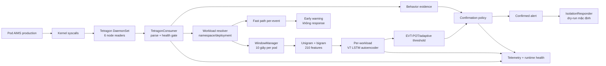

# Báo cáo trạng thái Sentinel V8

> Báo cáo kiến thức nền, kiến trúc, phương pháp thực nghiệm và tiến độ hiện tại
> của nhánh phát hiện runtime bằng Tetragon + ML trên Kubernetes.
>
> Bản paper rút gọn dùng one-window ML decision để nộp/trao đổi với giảng viên:
> [V8_ONE_WINDOW_PAPER.md](V8_ONE_WINDOW_PAPER.md).


## 1. Tóm tắt điều hành

Sentinel V8 hiện đã hoàn thành phần khó nhất của một thí nghiệm runtime-security
có khả năng tái lập:

- thu 24 phase normal thật trên AIMS production, gồm bốn chế độ traffic và sáu
  run độc lập;
- đóng băng vai trò dữ liệu trước khi train: run-01 chỉ dùng fit, run-02 đến
  run-06 chỉ dùng đánh giá;
- train tám model theo workload với 24.152 cửa sổ fit và vocabulary 210 chiều;
- đánh giá normal độc lập 24 giờ với 122.603 cửa sổ quyết định hợp lệ, không có
  alert ở full policy;
- chạy blind attack 200 scenario-interval trên tám workload, phát hiện 195/200;
- đo fast-path early warning riêng với confirmed-ML path;
- hoàn thành các baseline Tetragon, Falco, Isolation Forest, LSTM-only,
  EVT-POT và full V7 trên cùng paired evidence;
- khóa protocol, binary attack, seed, rate, split và model bằng SHA-256;
- cài systemd handoff để ablation, overhead và stable finalizer chạy nối tiếp,
  không phụ thuộc phiên SSH.
- đóng terminal matrix 11 phương pháp và đủ 55 paired comparison với checksum
  machine-verified.

Trạng thái hiện tại chưa đủ để gọi là production-stable hoặc world-class paper
hoàn chỉnh vì:

- full policy phát hiện 195/200, thấp hơn promotion contract 200/200;
- hoàn thành overhead A/B đủ sáu thứ tự, 18 phase và 180/180 lượt `wrk`, tất cả
  quality gate đều pass với 0 failed request;
- tạo stable-release decision terminal, checksum-bound và kiểm tra idempotent;
- phạm vi V8 chỉ cover tám stateless AIMS workload, chưa cover payment,
  notification và stateful infrastructure;
- Agent Runtime/MCP/GAT là research track riêng, chưa thuộc bằng chứng V8
  syscall được trình bày trong tài liệu này.

Nếu phần còn lại hoàn tất sạch, finalizer hiện tại chỉ có thể kết luận
`research_stable_dry_run_only`, không được tự động promote, bởi recall gate đã
đóng băng ở 1,0 còn kết quả quan sát là 0,975.

---

## 2. Bài toán nghiên cứu

### 2.1 Mục tiêu

Phát hiện hành vi bất thường trong container Kubernetes theo thời gian thực từ
chuỗi system call quan sát ở kernel, đồng thời cân bằng ba yêu cầu:

- độ nhạy đủ cao với attack chưa được dùng để train;
- false alert đủ thấp dưới nhiều chế độ traffic hợp lệ;
- latency và overhead đủ nhỏ để chạy liên tục trên production-like cluster.

### 2.2 Threat model

V8 giả định attacker đã thực thi được process trong container và tạo ra hành vi
runtime khác baseline, ví dụ:

- thử namespace/privilege operation;
- process fan-out;
- chuyển identity/capability;
- local socket beacon;
- burst đọc credential-like resource.

V8 quan sát syscall và metadata pod/node. Nó không đọc payload mạng, secret
content hoặc command argument vào frozen feature dataset.

## 3. Kiến thức nền tảng

### 3.1 eBPF và Tetragon

eBPF cho phép chạy chương trình kiểm soát trong kernel để quan sát sự kiện mà
không phải sửa source ứng dụng. Tetragon dùng eBPF/kprobe để xuất các sự kiện
như `execve`, `connect`, `openat`, `mount`, `ptrace`, `capset`, `unshare`,
`clone`, `accept`, `read`, `write` kèm pod, namespace, process và node.

Tetragon chạy dạng DaemonSet nên mỗi node có một sensor. Detector đọc đồng thời
mọi Tetragon stream; health gate từ chối evidence khi thiếu reader, queue
backpressure, stream gap hoặc membership không đúng.

### 3.2 Syscall window

Một syscall riêng lẻ thường chưa đủ ngữ cảnh. V8 gom event theo pod vào cửa sổ
event-time 10 giây. Mỗi cửa sổ được chuyển thành vector gồm:

- unigram frequency: tần suất từng syscall;
- bigram frequency: tần suất cặp syscall liên tiếp;
- event count và syscall count phục vụ quality/behavior gate.

Vector được chuẩn hóa theo tổng số event, vì vậy biểu diễn tập trung vào phân bố
hành vi thay vì chỉ tải tuyệt đối. Vocabulary V8 có đúng 210 feature và được
khóa bằng SHA-256
`62c492b4881e66d602b33eeb83e1774bd88f077434de402edfe73b4d266e92c4`.

### 3.3 LSTM autoencoder

LSTM autoencoder là deep-learning model học cách tái tạo vector normal:

```text
vector syscall -> LSTM encoder -> latent z -> LSTM decoder -> vector tái tạo
```

Sai số tái tạo cao nghĩa là input khác phân bố normal đã học. Kiến trúc hiện
tại có:

- encoder LSTM hai layer, hidden size 32;
- latent size 16;
- decoder LSTM hai layer;
- decoder nhận zero token thay vì input thật để tránh identity shortcut;
- MSE reconstruction error;
- deterministic seed theo SHA-256 của workload key.

Do đó project **có deep learning**, không chỉ machine learning cổ điển.
Isolation Forest vẫn tồn tại để làm baseline/diagnostic nhưng không quyết định
full-policy score.

Một giới hạn cần nói thẳng: tensor hiện có shape
`(batch, seq_len=1, feature_dim)`. LSTM không học chuỗi nhiều cửa sổ liên tiếp;
thứ tự ngắn hạn chủ yếu nằm trong bigram của một cửa sổ, còn tính liên tục giữa
cửa sổ do two-window confirmation xử lý. Vì vậy recurrent capacity của LSTM
chưa được khai thác đầy đủ. V9 có thể so sánh công bằng với MLP autoencoder và
sequence model nhận nhiều window để chứng minh LSTM thực sự cần thiết.

### 3.4 Robust-tail score

Raw reconstruction error không thể dùng trực tiếp giữa các workload. V7 lấy
đuôi phân bố normal bằng p99 và MAD, rồi ánh xạ robust normal tail về score gần
0,20. Threshold tối thiểu là 0,80.

Score 0,15 hay 0,20 không có nghĩa là xác suất attack 15% hoặc 20%. Đây là
**normalized anomaly score**, chỉ có ý nghĩa khi so với threshold và contract
của chính model đó.

### 3.5 EVT-POT và adaptive threshold

POT, Peaks Over Threshold, fit Generalized Pareto Distribution trên phần đuôi
score normal để suy ra threshold hiếm theo workload. Khi mẫu không đủ, code dùng
empirical quantile fallback. Runtime threshold không được thấp hơn 0,80.

Online calibration chỉ nhận cửa sổ sạch:

- score thấp hơn baseline threshold;
- observed behavior gate không kích hoạt;
- cửa sổ đủ event và không vi phạm collection-quality guard.

Điều này giảm nguy cơ attack tự đầu độc baseline.

### 3.6 Behavior gate

Behavior gate là bằng chứng kernel độc lập với neural score. Nó so tần suất các
syscall nhạy cảm với giới hạn đã học riêng cho workload, dùng cận dưới Wilson để
tránh kết luận quá mạnh từ cửa sổ có rất ít event.

Full policy không hành động chỉ vì ML score cao. Quyết định cần corroboration
như behavior gate hoặc extreme-volume path đúng contract. Đây là thành phần
quan trọng nhất giúp giảm false positive trong dữ liệu hiện tại.

### 3.7 Two-window confirmation

Full policy yêu cầu hai cửa sổ liên tiếp thỏa điều kiện. Với window 10 giây,
confirmed latency thường gần 17-21 giây. Đây là đánh đổi có chủ đích:

- ưu điểm: triệt single-window spike và giảm false alert;
- nhược điểm: không thể đạt confirmed alert 1-2 giây.

### 3.8 Fast path

Fast path xử lý từng syscall event, không đợi feature window. Nó nhận diện các
chuỗi specificity cao như:

- `exec -> privilege syscall`;
- `exec của network-capable binary -> connect`.

Fast path chỉ phát **early warning**, không tự cách ly pod. Confirmed ML path
vẫn là quyết định chính. Đây là cách trình bày hợp lý cho paper:

> Fast path cung cấp cảnh báo sớm dưới một giây; ML path xác nhận có độ trễ lớn
> hơn nhưng bảo thủ với false positive.

### 3.9 False positive, false negative và zero observed alert

- False positive/false alert: normal traffic bị báo attack.
- False negative: attack trial không được phát hiện.
- Recall: `TP / (TP + FN)`.
- Zero observed alert không chứng minh xác suất false alert bằng 0; paper phải
  báo exposure và confidence interval.
- 195/200 tương ứng recall 0,975, không được viết thành 100%.

### 3.10 Holdout, blind set và data leakage

- Fit set dùng để train model và fit calibration.
- Offline holdout trong run-01 chỉ dùng development/early stopping, không phải
  independent test.
- Independent normal run-02 đến run-06 không được train hoặc tune.
- Blind attack labels không được train, tune threshold hoặc retry chỉ vì miss.
- Nếu sửa candidate sau khi xem blind result thì phải tạo campaign và blind set
  mới.

### 3.11 Paired replay và ablation

Replay = lấy cùng một dữ liệu runtime đã capture trước đó rồi chạy detector trên nó.
Paired replay chạy nhiều phương pháp trên cùng frozen capture, cùng trial,
workload, seed và rate. Nó giảm nhiễu do mỗi method nhìn dữ liệu khác nhau.

Ablation study = cố tình bỏ một thành phần của hệ thống để xem thành phần đó đóng góp bao nhiêu.
Ablation bỏ từng thành phần để đo đóng góp của chính thành phần đó, ví dụ bỏ
behavior gate hoặc bỏ two-window confirmation. Một ablation hợp lệ chỉ thay một
biến. Lượt `without_behavior_gate` đầu đã bị loại vì cờ bypass vô tình thay cả
calibration; artifact được giữ trong `rejected-partials/` và replay lại từ đầu.

### 3.12 Counterbalanced overhead

Benchmark overhead có ba phase:

1. không tracing;
2. chỉ Tetragon;
3. Tetragon + full ML pipeline.

Sáu hoán vị phase đều được chạy để giảm order effect. Mỗi phase dùng 10 lần
`wrk`, mỗi lần 30 giây, sau 60 giây settle. Metrics gồm throughput, socket/
HTTP errors, response latency, CPU và RAM. Đây là bằng chứng overhead tốt hơn
một lần chạy `ab` hoặc `wrk` đơn lẻ.

---

## 4. Kiến trúc tổng thể



### 4.1 Hai lane latency

| Lane | Input | Đơn vị xử lý | Vai trò | Latency quan sát |
|---|---|---|---|---|
| Fast path | Từng syscall event | Chuỗi event ngắn | Early warning | median 0,398 s |
| Confirmed ML | Feature window | 10 s × hai-window policy | Quyết định xác nhận | median 18,435 s |
| Model inference | Vector 210 chiều | Một forward pass | Thành phần ML | median khoảng 17 ms |

Không cộng hoặc thay thế ba số này cho nhau. Kernel/event-to-warning,
injection-to-confirmation và model inference đo ba đoạn pipeline khác nhau.

---

## 5. Workload identity và model resolution

Model được định danh bằng `namespace/workload`, không khóa vào tên pod có suffix
thay đổi sau restart.

```text
production/catalog-service-65db98f7f9-xq2ab
                 -> production/catalog-service
```

Thứ tự resolver:

1. exact model-key match;
2. bỏ ReplicaSet hash 8-10 ký tự và pod suffix 5 ký tự;
3. với StatefulSet, bỏ ordinal cuối như `postgresql-0 -> postgresql`;
4. không có model thì bỏ event trước khi tạo buffer và tăng `pods_no_model`.

Fast path và ML path dùng cùng resolver nên không bị lệch workload identity.
Shared-workload ablation vẫn giữ tám routing key riêng nhưng cùng trỏ tới
checkpoint `shared/workload`; behavior limit/calibration state vẫn tách theo
workload.

Hạn chế: resolver hiện suy luận theo tên. Hướng production chắc chắn hơn là
label `sentinel.ai/model-key` hoặc Kubernetes owner-reference resolution từ
Pod đến ReplicaSet/Deployment/StatefulSet.

---

## 6. Cluster production-like đã xác minh

Snapshot SSH lúc 09:46 ICT ngày 14-08-2026:

| Node | IP | Role | Kubernetes | Trạng thái |
|---|---|---|---|---|
| `k8s-master.local` | 10.1.16.234 | control-plane | v1.34.10 | Ready |
| `k8s-master2.local` | 10.1.16.235 | control-plane | v1.34.10 | Ready |
| `k8s-master3.local` | 10.1.16.236 | control-plane | v1.34.10 | Ready |
| `k8s-worker1.local` | 10.1.16.237 | worker | v1.34.10 | Ready |
| `k8s-worker4.local` | 10.1.16.238 | worker | v1.34.10 | Ready |
| `k8s-worker3.local` | 10.1.16.239 | worker | v1.34.10 | Ready |

Namespace `production` có 40/40 pod ở trạng thái `Running`; không có pod lỗi.
Sau khi benchmark kết thúc, exit trap đã phục hồi runtime production:

```text
sentinel-detector.service                = active/running, NRestarts=0
aims-candidate-runtime-benchmark.service = inactive/dead, NRestarts=0
sentinel-aims-syscalls policy            = present
response mode                            = dry-run/audit
```

Tetragon DaemonSet vẫn chạy trên cluster. Namespaced tracing policy đã được
phục hồi sau các phase bật/tắt có chủ đích. Finalizer chạy lại lần hai vẫn
`Result=success`, xác nhận quyết định terminal là idempotent.

Service này vẫn load frozen release tại `/home/dat/ml-service/models` (V7).
Candidate V8 nằm riêng trong
`aims-v8-derived-v8-paired-replay-20260811/models-v8-candidate` và chưa ghi đè
production release.

Tên worker không tăng tuần tự theo IP là lịch sử hostname của cluster, không
ảnh hưởng role/IP hiện tại.

---

## 7. Workload coverage V8

### 7.1 Đã có model

1. `production/aims-frontend`
2. `production/api-gateway`
3. `production/auth-service`
4. `production/cart-service`
5. `production/catalog-service`
6. `production/inventory-service`
7. `production/order-service`
8. `production/security-telemetry-service`

## 8. Dataset và training V8

### 8.1 Capture contract

Mỗi phase dài 72 phút. Có bốn traffic regime:

- `steady`: tải ổn định;
- `burst`: tải tăng đột biến;
- `recovery`: giai đoạn trở về sau burst/scale change;
- `toolmix`: phối hợp nhiều đường nghiệp vụ và tool/load pattern.

Có sáu run:

- run-01: `candidate_fit`, tổng 4,8 giờ;
- run-02 đến run-06: `independent_evaluation`, tổng khoảng 24 giờ.

Split unit là toàn bộ run trước khi feature-window construction. Không trộn
cửa sổ cùng run giữa train và independent evaluation.

### 8.2 Candidate fit

| Thuộc tính | Giá trị |
|---|---:|
| Workload models | 8 |
| Fit windows | 24.152 |
| Feature dimension | 210 |
| Epoch yêu cầu tối đa | 200 |
| Early stopping | Có |
| Tổng training wall time ghi trong report | 781,147 s, khoảng 13 phút |
| Dataset role | `candidate_fit` |
| Offline gate | 8/8 model accepted |

Training không cần nhiều ngày vì dataset chỉ có khoảng 24 nghìn vector 210
chiều và model nhỏ. Phần mất thời gian chủ yếu là thu normal exposure độc lập,
blind attack, paired replay và overhead, không phải gradient training.

### 8.3 Offline holdout theo workload

| Workload | Rows | Epoch | Median score | p95 | Max | Median inference |
|---|---:|---:|---:|---:|---:|---:|
| aims-frontend | 3.361 | 200 | 0,0850 | 0,1447 | 1,0000 | 11,961 ms |
| api-gateway | 3.388 | 110 | 0,0842 | 0,0935 | 0,9993 | 14,720 ms |
| auth-service | 3.356 | 170 | 0,0842 | 0,1071 | 0,3176 | 14,886 ms |
| cart-service | 2.758 | 174 | 0,0842 | 0,1142 | 0,8404 | 14,567 ms |
| catalog-service | 3.387 | 140 | 0,0842 | 0,1045 | 0,9975 | 14,370 ms |
| inventory-service | 3.390 | 163 | 0,0842 | 0,1082 | 0,7559 | 14,708 ms |
| order-service | 2.160 | 122 | 0,0842 | 0,1222 | 0,9268 | 14,323 ms |
| security-telemetry-service | 2.352 | 200 | 0,0843 | 0,1387 | 0,9985 | 14,705 ms |

Một số max score cao nhưng không tạo actionable pair/behavior crossing trong
offline gate. Điều này cho thấy không nên claim LSTM score riêng đã zero-FP;
full decision policy mới là đối tượng release.

---

## 9. Protocol blind attack

### 9.1 V8 vẫn dùng MITRE ATT&CK như thế nào?

V8 **không bỏ MITRE ATT&CK**, nhưng tách ba khái niệm vốn bị trộn trong prototype
cũ:

1. **ATT&CK technique** là taxonomy mô tả mục tiêu/hành vi của adversary.
2. **Safe scenario** là chương trình tạo observable syscall có liên quan, nhưng
   không gây hậu quả thật.
3. **Detector label** của V8 chỉ là `normal` hoặc scenario ID; detector không
   phân loại ATT&CK technique.

Bộ legacy từng gọi trực tiếp năm profile là reverse shell, container escape,
cryptomining, privilege escalation và data exfiltration rồi tính
`MITRE Accuracy`. Cách gọi này quá mạnh: thấy `clone` không đủ kết luận có
cryptomining; thấy `openat + connect` không đủ kết luận đã exfiltrate; một
`mount` thất bại không có nghĩa container đã escape.

V8 vì vậy đổi tên thành các **behavioral safety probe** trung tính. ATT&CK vẫn
được dùng để giải thích threat coverage, nhưng không dùng như ground truth nếu
scenario chưa thực hiện đầy đủ kỹ thuật. Frozen V8 blind contract hiện chưa ghi
ATT&CK ID; đây là khoảng trống documentation/coverage declaration. Không sửa
ngược contract sau khi đã xem outcome. Bảng dưới là mapping hậu kiểm phục vụ
diễn giải, không phải preregistered classification result.

| V8 scenario | Syscall/observable thật | ATT&CK alignment | Mức claim hợp lệ |
|---|---|---|---|
| `local_socket_beacon` | TCP `socket/connect` chỉ tới loopback, port 9--16; đôi lúc tạo một child | C2/beacon-like primitive; chưa đủ gán [T1071 Application Layer Protocol](https://attack.mitre.org/techniques/T1071/) hoặc [T1095 Non-Application Layer Protocol](https://attack.mitre.org/techniques/T1095/) | Chỉ claim phát hiện network-beacon-like deviation, không claim C2 thật |
| `namespace_probe` | `unshare` với invalid flags, `mount` invalid source/target/filesystem và `ptrace(-1)` | Attempt-level alignment mạnh với [T1611 Escape to Host](https://attack.mitre.org/techniques/T1611/); MITRE cũng nêu `unshare`/`mount` trong detection strategy | Claim safe emulation của escape-attempt telemetry; không có host escape thành công |
| `process_fanout` | `fork` 1--3 child, phép tính nhỏ, `_exit`, parent `waitpid` | Primitive alignment với [T1106 Native API](https://attack.mitre.org/techniques/T1106/) vì GNU `fork()` tạo process | Không claim T1496/cryptomining: không miner, không mining pool, không resource hijacking kéo dài |
| `identity_transition_probe` | `setresuid/setresgid` về chính UID/GID hiện tại; `capset` dùng ABI invalid | Privilege-transition signal liên quan họ [T1548 Abuse Elevation Control Mechanism](https://attack.mitre.org/techniques/T1548/) | Không claim privilege escalation; cũng không gán chính xác T1548.001 vì scenario không abuse setuid/setgid bit |
| `credential_read_burst` | Đọc `/etc/passwd` và `/proc/self/status`, bỏ toàn bộ bytes; chỉ connect loopback | Access-pattern analogue của [T1552.001 Credentials In Files](https://attack.mitre.org/techniques/T1552/001/) | Không đọc secret thật và không exfiltrate; không claim T1041 |

Do đó kết quả `195/200` có nghĩa là phát hiện 195 trong 200 **safe behavioral
scenario-interval**, không có nghĩa cover 97,5% toàn bộ MITRE ATT&CK, cũng không
phải MITRE mapping accuracy 97,5%.

### 9.2 Binary thực thi chính xác những gì?

Source canonical là
[`sentinel/benchmarks/runtime_attack_blind.c`](sentinel/benchmarks/runtime_attack_blind.c).
Binary được compile static với `-O2 -Wall -Wextra -Werror -static`, giúp copy vào
nhiều container mà không phụ thuộc dynamic library trong image. Source và
binary được khóa trước candidate training:

```text
source SHA-256 = eed8ef73168d58d2d5d0b7d44e3b79d4fe259857153cc46d3c805547fe767003
binary SHA-256 = a4d68d79b1c1722e7b0a53cc95135ebe8a236116ecf06246c0957e259f77dd0d
```

Mỗi scenario chạy 45 giây. Tham số rate 6, 12 hoặc 24 là **số vòng scenario
mỗi giây**, không phải chính xác số syscall/giây: một vòng `namespace_probe`
gọi ba primitive, còn một vòng `process_fanout` có thể tạo 1--3 child. Seed chỉ
thay đổi port/order/count trong biên an toàn; seed không bật external network
hoặc thao tác phá hoại.

Safety-by-construction:

- network destination luôn `127.0.0.1`;
- không gửi payload và không giữ bytes đã đọc;
- `unshare`, `mount`, `ptrace` được truyền input bảo đảm thất bại;
- UID/GID chỉ được set về giá trị hiện tại;
- `capset` dùng version invalid nên không đổi capability;
- không ghi file bền vững;
- child process kết thúc ngay và được `waitpid`, tránh orphan;
- duration/rate có giới hạn cứng.

Điều được kiểm thử là đường dữ liệu thật:

```text
binary trong container
  -> kernel syscall
  -> Tetragon eBPF event
  -> all-node collector
  -> 10-second feature window
  -> workload model + behavior policy
  -> detection telemetry
```

Nó không phải Python chèn vector giả vào model, nhưng cũng không phải malware
thật gây hại.

### 9.3 Vì sao tổng là 200?

Với mỗi workload có năm cặp seed/rate:

| Seed | Rate (scenario loop/s) |
|---:|---:|
| 1901 | 6 |
| 3203 | 12 |
| 4703 | 24 |
| 6701 | 6 |
| 9001 | 12 |

Một grouped trial được định danh bởi `(workload, seed, rate)` và lần lượt chạy
năm scenario. Vì vậy:

```text
8 workload x 5 grouped trial/workload = 40 grouped trials
40 grouped trials x 5 scenario          = 200 scenario-intervals
```

Mỗi scenario vì thế có 40 interval; mỗi workload có 25 interval. Schedule được
shuffle bằng seed riêng của harness để giảm order bias. Rate không cân bằng đều:
mỗi workload có hai trial ở 6/s, hai ở 12/s và một ở 24/s; paper phải ghi đúng
phân bố này thay vì chỉ nói “ba rate”.

### 9.4 “Blind” nghĩa là gì?

Blind ở đây là **evaluation blindness**, không phải double-blind clinical
experiment:

- scenario source/binary, seed và rate được freeze trước candidate fit;
- model chỉ train trên normal run-01;
- run-02--06 và attack interval không được train/calibrate/tune;
- labels không đi vào feature vector hoặc threshold;
- sau khi thấy năm miss, không được sửa V8 rồi chấm lại trên cùng blind set;
- candidate mới phải có release ID, source/binary/seed mới và blind campaign
  mới.

Detection miss hợp lệ được giữ nguyên. Chỉ trial hỏng vì infrastructure mới
được chạy lại, và phải có evidence như missing acknowledgement, non-zero attack
exit, sensor gap, detector crash hoặc incomplete interval. Artifact hỏng được
chuyển vào `rejected/`, không xóa để che dấu.

### 9.5 Vai trò ATT&CK trong V9/paper cuối

V9 nên freeze trước blind run một coverage manifest gồm:

- ATT&CK version/date;
- technique/sub-technique ID;
- `full_emulation`, `attempt_emulation` hay `telemetry_surrogate`;
- expected syscall/process/network observable;
- success/failure semantics;
- safety deviation so với kỹ thuật thật;
- detector nào được kỳ vọng phát hiện: rule, fast path hay confirmed ML.

Như vậy paper có thể claim “ATT&CK-aligned evaluation” minh bạch, nhưng không
biến primitive an toàn thành bằng chứng rằng attack hậu quả thật đã xảy ra.

---

## 10. Kết quả terminal hiện có

### 10.1 Independent normal full policy

| Metric | Kết quả |
|---|---:|
| Independent runs | 5 |
| Traffic phases | 20 |
| Captured exposure | khoảng 24 giờ |
| Feature windows | 122.639 |
| Eligible decision windows | 122.603 |
| Alerts | 0 |
| Detections | 0 |
| Evaluation status | `complete`, `passed=true` |

Đây là zero **observed** false alert trên phạm vi đo, không phải đảm bảo toán
học zero false-positive probability.

### 10.2 Blind attack full policy

| Metric | Kết quả |
|---|---:|
| Trials | 200 |
| Detected | 195 |
| Missed | 5 |
| Recall | 0,975 |
| Wilson 95% CI | [0,943; 0,989] |

Năm miss đều là `namespace_probe` trên
`production/security-telemetry-service`, ở tất cả seed/rate. Vì miss tập trung
theo một workload-scenario, đây là dấu hiệu coverage/generalization gap có cấu
trúc, không phải năm lỗi ngẫu nhiên độc lập.

### 10.3 Latency live blind campaign

| Metric | n | Min | Median | p95 | p99 | Max |
|---|---:|---:|---:|---:|---:|---:|
| Fast-path warning | 75 | 0,015 s | 0,398 s | 0,690 s | 0,725 s | 0,734 s |
| Confirmed ML alert | 195 | 7,395 s | 18,435 s | 20,506 s | 20,814 s | 20,852 s |
| Trial-median inference | 200 | 13,239 ms | 17,074 ms | 18,729 ms | 19,182 ms | 19,273 ms |

Paired replay của full policy cho confirmation median 18,255 giây, p95 19,991
giây và max 20,013 giây. Chênh lệch nhỏ với live campaign là runtime timing
variation, không phải thay model.

### 10.4 Baseline và accounting replay

| Phương pháp | Normal false alerts | Attack detection | Recall | Diễn giải |
|---|---:|---:|---:|---|
| Falco rule-only | 0 event alert/24 h | 40/200 | 0,200 | Specific rule coverage thấp |
| Tetragon sensitive-rule | 0 | 75/200 | 0,375 | Rule chỉ cover sensitive syscall |
| Isolation Forest | 69.855 | 200/200 | 1,000 | Recall cao nhưng false alert không dùng được |
| LSTM-only | 513 | 195/200 | 0,975 | Tốt hơn IF nhưng chưa production-grade |
| EVT-POT/adaptive calibration, no behavior gate | 523 | 195/200 | 0,975 | Canonical replay; adaptive subsystem chưa đủ suppress FP |
| Full policy | 0 | 195/200 | 0,975 | Trade-off tốt nhất hiện tại |
| Without fast path | 0 | 195/200 | 0,975 | Xác nhận fast path không đổi confirmed outcome |
| Without behavior gate | 41 | 195/200 | 0,975 | Behavior gate suppress FP mà không đổi recall trên V8 |
| Without extreme-volume gate | 0 | 195/200 | 0,975 | Null result trên frozen V8 evidence |
| One-window confirmation | 0 | 195/200 | 0,975 | Giảm đúng 10 s latency, không đổi outcome trên V8 |

Tetragon rule-only latency trong replay sử dụng vị trí tương đối trong captured
window nên chỉ là ước lượng; không được thay thế live kernel timestamp metric.

Ngày 13-08-2026, audit phát hiện evaluator cũ không cộng confirmed-detection
window vào `eligible_decision_windows`: alert path emit `detection` thay vì
`decision`, làm denominator giảm đúng bằng số alert. Riêng accounting fix không
đổi feature window, alert, score, latency hoặc attack result; tuy nhiên
false-alert-per-window Wilson denominator sẽ bị bias. Khi đó matrix chưa
terminal, nên các normal baseline report cũ
đã được lưu vào `rejected-partials/normal-accounting-denominator-v1-20260813T085500Z/`
và đang replay bằng evaluator đã sửa. Isolation Forest, LSTM-only, EVT-POT và
full V7 trong bảng đã được xác nhận lại bằng canonical report 20/20; các normal
method còn lại chỉ dùng canonical report mới cho statistics cuối.

Canonical LSTM-only có FPR/eligible-window `513 / 119.306 = 0,004300`, tức
khoảng 0,43% cơ hội quyết định normal sinh false alert. Attack replay phát hiện
195/200 với confirmation median 8,255 giây và p95 9,991 giây. Latency thấp hơn
full policy vì baseline này dùng một window confirmation, nhưng false alert
cao nên không phải cấu hình production phù hợp.

Tên đầy đủ của `evt_pot` trong bảng paper là **LSTM + EVT-POT/adaptive
calibration**. Khi bật adaptive threshold, `StreamingThreshold.observe()` cập
nhật cả score tail lẫn deque event count dùng cho lower/upper volume guard.
Vì vậy phép so sánh với LSTM-only đo đóng góp của toàn bộ adaptive calibration
subsystem, không được diễn giải hẹp thành causal effect riêng của GPD/EVT. Đây
là giới hạn thiết kế đã frozen; V8 chỉ làm rõ claim, không sửa protocol sau khi
đã nhìn kết quả.

Canonical EVT-POT có 523 alert trên 122.603 eligible windows,
FPR/eligible-window 0,004266. Report cũ có 513 alert nhưng loại 3.333 window;
canonical report chỉ loại 36. Chênh 10 alert xuất hiện vì replay mới đồng thời
mang bản sửa sạch-calibration của behavior-gate ablation đã thực hiện trước đó,
không phải vì tune threshold sau khi xem holdout. Canonical artifact thay thế
hoàn toàn số 513 cũ cho EVT-POT.

Protocol V8 frozen yêu cầu xuất precision và F1, nhưng công thức hiện trộn TP
đếm theo 200 attack interval với FP đếm theo normal window trong khoảng 24 giờ.
Hai phía khác sampling unit và exposure, nên đây chỉ là **protocol-mixed
descriptive precision/F1**, không phải deployment precision/F1. Artifact và
bảng paper đã gắn cờ `deployment_precision_claim_valid=false`; claim chính dùng
recall theo attack interval và false-alert rate theo normal exposure riêng.
Matrix validator từ chối artifact có precision/F1 mà thiếu cờ hoặc thiếu mô tả
khác sampling unit, nên cảnh báo này là machine-enforced chứ không chỉ là chú
thích trong tài liệu.

---

## 11. Trạng thái terminal của V8

Snapshot tiến độ 09:46 ICT ngày 14-08-2026:

| Hạng mục | Trạng thái |
|---|---|
| Normal capture 24/24 phase | Hoàn tất |
| Fit dataset + 8 candidate models | Hoàn tất |
| Fit-only calibration | Hoàn tất |
| Independent normal full policy | Hoàn tất, pass |
| Blind attack 200 intervals | Hoàn tất, 195 detected |
| Falco paired evidence | Hoàn tất |
| Tetragon paired replay | Hoàn tất |
| Attack replay IF/LSTM/EVT/full/no-fast-path | Cả 5 report self-bound terminal; IF 200/200, bốn method còn lại 195/200 |
| Canonical normal baseline/ablation replay | IF, LSTM-only, EVT-POT, full V7 và without-fast-path terminal |
| `without_behavior_gate` | Terminal: normal 41 alert; attack 195/200 |
| Remaining policy ablations | Hoàn tất, gồm shared-workload evaluation-only |
| 11-method matrix | Terminal, validator `valid=true` |
| 55 paired comparisons | Terminal |
| Counterbalanced overhead | Terminal: 6/6 permutation, 18/18 phase, 180/180 lượt `wrk` |
| Stable finalizer | Terminal, `Result=success`, kiểm tra idempotent pass |
| Production promotion V8 | Không được phép tự động |

Checkpoint cũ `without_behavior_gate` đạt 16/20 phase, 97.461 windows và 33
alert trước khi bị archive. Alert tập trung ở burst/transition phase, nhưng
checkpoint này không được dùng làm kết quả paper vì evaluator-source identity
và denominator chưa đúng. Evaluator mới:

- tính eligible opportunities bằng eligible decision rows cộng confirmed
  detection rows đúng một lần;
- fail nếu số callback alert khác số detection telemetry;
- bind checkpoint với SHA-256 của evaluator source, không cho resume qua code
  version khác;
- đã qua `177 passed, 9 skipped` local full suite và 11/11 focused VM tests
  ngay sau evaluator fix.

Matrix reporting cũng đã được nối với accounting mới:

- ML result bắt buộc xuất `eligible_windows` và
  `false_alert_rate_per_eligible_window`;
- assembler đối chiếu tổng eligible theo 20 phase và từ chối khi alert lớn hơn
  eligible opportunities;
- validator kiểm lại FPR thay vì tin số đã serialize;
- bảng Markdown/CSV phân biệt feature window, eligible window và event/hour;
- rule-only không bị gán FPR/window giả vì đơn vị quan sát của rule khác ML;
- local focused test 23/23, local full suite 177 passed/9 skipped và VM
  integration/focused suite gần nhất 18/18 pass;
- runtime tree và immutable staging tree trên VM đã khớp checksum.

Canonical Isolation Forest report terminal 20/20 phase có 122.639 feature
windows, 119.306 eligible opportunities, 69.855 alert/detection windows và
3.333 quality/startup skip. False-alert rate theo eligible opportunity là
0,585511. Invariant `eligible + non-eligible skip = feature windows` đúng;
`alerts = detections` cũng đúng. Cả 20 normal phase đều fail baseline gate,
đúng với vai trò negative baseline của IF. Evaluator source SHA-256 là
`d7f4912930c466926f074203dc5c4a5c0ddbd40f92c5d68f1c19b48f556a4895`.
Canonical LSTM-only report terminal 20/20 có cùng 122.639 feature windows,
119.306 eligible opportunities và 3.333 quality/startup skip; có 513
alert/detection, FPR/eligible-window 0,004300. Cả 20 phase fail baseline normal
gate. Runner đã verify attack report 200 trial rồi tự chuyển sang EVT-POT.
Canonical EVT-POT report terminal 20/20 có 122.639 feature windows, 122.603
eligible opportunities, 523 alert/detection và 36 quality skip. Canonical full
V7 trên cùng tập có 0 alert, 507 score outlier bị behavior gate chặn, 122.096
normal decision và 36 quality skip. Cả hai report đều qua invariant theo từng
phase, bind evaluator SHA và blind attack report 200 trial tương ứng.

Canonical without-fast-path report terminal 20/20 có 122.639 windows, 122.603
eligible, 0 alert và 36 quality skip. Attack replay giữ nguyên 195/200,
confirmation median 18,255 giây và p95 19,991 giây. Nó có cùng confirmed policy
với full V7; khác biệt fast path chỉ nằm ở early-warning lane, vốn không được
replay thành confirmed decision. Kết quả paired này xác nhận fast path không
làm đổi confirmed outcome trong V8; giá trị của nó là live early-warning
latency dưới một giây.

Corrected without-behavior-gate đã terminal 20/20 với 122.639 feature windows,
122.603 eligible opportunities, 41 alert/detection và 36 quality skip;
FPR/eligible-window là 0,000334. Invariant
`eligible + non-eligible = feature windows` và `alerts = detections` đều đúng.
Alert tập trung ở burst/transition traffic: frontend 3, API gateway 8, auth 9,
cart 2, inventory 6, order 7 và security-telemetry 6; catalog không phát alert.
So với full V7 có 0 alert trên chính frozen normal evidence này, behavior gate
cho thấy đóng góp rõ vào specificity. Attack replay tương ứng đã terminal
195/200, cùng năm miss `namespace_probe` như full V7. So sánh paired theo
`injection_id` cho thấy 0/200 trial đổi detection endpoint, không trial nào đổi
confirmation latency; aggregate latency, scenario và workload breakdown cũng
bằng nhau. Trên frozen V8 evidence, bỏ behavior gate vì vậy chỉ làm xấu normal
specificity mà không cải thiện recall hoặc latency. Đây là kết quả ablation,
không phải tuyên bố behavior gate luôn vô hại trên mọi attack tương lai.

`without_extreme_volume_gate` đã terminal 20/20: 122.639 feature windows,
122.603 eligible, 36 quality skip và 0 alert/detection. Attack replay cũng
terminal 195/200. Paired comparison với full V7 cho thấy aggregate recall,
latency, breakdown scenario/workload và mọi detection endpoint của 200 trial
đều bằng nhau. Trên frozen V8 evidence, extreme-volume gate chưa tạo khác biệt
quan sát được; đây là null ablation result hợp lệ, không phải bằng chứng rằng
gate vô dụng với mọi volume attack tương lai.

`without_two_window_confirmation` đã terminal 20/20 với 122.639 feature
windows, 122.603 eligible, 36 quality skip và 0 alert/detection. Attack replay
terminal 195/200, giữ nguyên năm miss `namespace_probe`. Confirmation median
giảm từ 18,255 xuống 8,255 giây; p95 từ 19,991 xuống 9,991 giây. Trên cả 195
trial cùng được phát hiện, paired delta chính xác -10,000 giây; 0/200 trial đổi
detection endpoint và scenario/workload breakdown giữ nguyên. Đây là bằng
chứng mạnh rằng second-window policy tạo thêm đúng một window latency trên V8.
Nó chưa đạt mục tiêu confirmed 1–2 giây vì feature window vẫn dài 10 giây, và
chưa được dùng để sửa frozen full-policy result sau khi đã xem blind evidence.
Shared-workload evaluation-only ablation đã terminal 20/20: 122.639 feature
windows, 122.603 eligible, 0 alert và blind attack 195/200; latency bằng full
V7. Development gate ghi rõ `accepted=false`,
`rejected_shared_ablation_evaluation_only=true` và
`automatic_promotion=false`; kết quả này chỉ được phép làm baseline/ablation
vì shared candidate không qua offline development gate. Nó không chứng minh
shared model đủ điều kiện production dù independent replay quan sát tốt.

Matrix assembler ban đầu fail-closed ở hai schema/pairing inconsistency. Thứ
nhất, Tetragon outcome không lặp top-level `start/end`; assembler mới join hai
trường này theo `injection_id` từ frozen interval metadata thay vì tự suy diễn.
Thứ hai, Falco áp dụng next-same-pod-injection guard nên 156/200 trial có censor
boundary ngắn hơn horizon 30 giây; toàn bộ 11 method nay dùng chính canonical
boundary này cho restricted time-to-detection. Detection và latency riêng của
từng method không bị sửa. Tetragon/full/Falco có cùng đủ 200 injection ID;
adapter fix qua `177 passed, 9 skipped`, runtime/staging checksum pass. Matrix
sau đó terminal `valid=true`, `completed_experiments=11`, statistics có đúng
55 comparison và toàn bộ `SHA256SUMS` pass.

Audit provenance tiếp theo phát hiện attack replay JSON cũ khóa capture,
candidate, calibration, contract và protocol nhưng chưa tự lưu SHA của source
`evaluate_aims_attack_replay.py`. Code mới thêm
`evaluator_source_sha256` vào checkpoint identity; matrix assembler bắt buộc
normal và attack report khớp SHA evaluator hiện tại. Runner không xóa report
cũ: nó chuyển nguyên vẹn vào
`rejected-partials/attack-evaluator-unbound-v1/` với SHA report trong tên rồi
replay cùng frozen 200 trial. Isolation Forest provenance replay đã terminal
200/200 và tự bind SHA
`724543a58387f51c9b8521093279c225e0e91a67ddf6e07a5a9f88b0323609f5`.
So sánh bản archive với bản mới cho thấy `completed_trials`, `detected_trials`,
recall, latency, breakdown scenario/workload và 17 trường deterministic của
từng trial đều bằng nhau; chỉ metadata/runtime measurement và report SHA đổi.
LSTM provenance replay sau đó cũng terminal 195/200 và qua cùng phép so sánh
deterministic.

EVT-POT self-bound replay terminal 195/200; aggregate recall, latency,
scenario/workload breakdown và mọi detection endpoint giữ nguyên. Tuy nhiên
37/200 trial đổi riêng `decision_counts`: một số
`collection_quality_skip` chuyển thành `pending_confirmation`. Đây là ảnh hưởng
mong đợi của bản sửa clean-calibration đã nêu ở trên: ablation bỏ behavior gate
không còn vô tình tắt adaptive event-count state. Vì vậy không được mô tả EVT
rerun là “chỉ đổi metadata”; canonical report mới thay report cũ, dù primary
detection outcomes không đổi.

Quá trình này không đổi model, frozen policy/contract/dataset và không tune
theo blind outcome. Report cũ được giữ nguyên trong archive thay vì bị xóa.
Full V7 và without-fast-path self-bound replay sau đó đều terminal 195/200.
So với archive cũ, hai report giữ nguyên toàn bộ aggregate chính và cả 17
trường deterministic trên đủ 200 trial; chỉ provenance/runtime metadata đổi.
Như vậy cả năm attack report cần cho checkpoint hiện tại đã bind evaluator SHA
`724543a58387f51c9b8521093279c225e0e91a67ddf6e07a5a9f88b0323609f5`.
Runner đã tự resume corrected without-behavior normal từ checkpoint 17/20,
không restart lại các phase đã được evaluator hiện tại xác minh.

### 11.1 Background orchestration

```text
aims-v8-normal-ablation.service = inactive/dead, success
aims-v8-overhead.service         = inactive/dead, success
aims-v8-release-finalize.path   = active/waiting
aims-v8-release-finalize.service = inactive/dead, success
```

Khi ablation runner đóng đủ 11 phương pháp, nó tạo
`NORMAL_ABLATION_REPLAY_COMPLETE`. Path unit tự khởi động overhead. Khi overhead
tạo `V8_OVERHEAD_COMPLETE`, finalizer kiểm toàn bộ checksum/gate và ghi stable
decision. Không cần giữ SSH mở.

### 11.2 Stable decision cuối

Artifact `v8-stable-release-decision.json` được tạo lúc 09:46 ICT, SHA-256
`1ce95f916e7ead1c505c45a1bbdf98992b0c15563936dd22814bc120da85abb4`:

| Thuộc tính | Kết quả |
|---|---|
| Evidence complete | `true` |
| Status | `research_stable_dry_run_only` |
| Normal | 122.639 feature windows, 24,005 giờ, 0 alert |
| Blind attack | 195/200, recall 0,975 |
| Gate fail | `blind_attack` |
| Manual production promotion eligible | `false` |
| Automatic promotion | `false` |

V8 đã **xong theo nghĩa research-stable**: mọi evidence yêu cầu đều terminal
và checksum-bound. Nó không phải `production_promoted`, vì promotion contract
đã frozen yêu cầu recall 1,0. Không hạ gate sau khi xem năm blind miss.

### 11.3 Overhead A/B cuối

Thiết kế gồm sáu phase-order block, mỗi block chạy ba cấu hình, mỗi cấu hình 10
lượt; tổng 180 lượt và không có failed request. Point estimate là median theo
sáu block; CI là block-bootstrap 95%:

| So sánh | Throughput loss median [95% CI] | p99 latency increase median [95% CI] |
|---|---:|---:|
| Tetragon so với no tracing | -0,574% [-3,985%; 3,165%] | 3,386% [-1,303%; 8,999%] |
| Full pipeline so với no tracing | 2,576% [-7,493%; 4,345%] | 3,116% [-1,789%; 8,755%] |
| ML detector tăng thêm so với Tetragon | 1,172% [-5,026%; 4,610%] | 1,036% [-3,448%; 1,613%] |

Median tài nguyên detector ở sáu full-pipeline block là 24,952% của một CPU
core và 431,495 MiB RAM. Các CI hiệu năng đều cắt qua 0; vì vậy paper chỉ được
claim overhead point estimate nhỏ và chưa chứng minh khác 0 trên một campaign
cluster, không được claim “không có overhead”.

---

## 12. Luồng code runtime

### 12.1 Khởi động

1. `anomaly_detector2.py` load vocabulary trước.
2. `ModelManager` load mọi `*_bundle.pkl` và LSTM checkpoint.
3. Fail closed nếu model dimension khác vocabulary.
4. Khởi tạo fast path, WindowManager, TetragonConsumer và responder.
5. Production service dùng dry-run trừ khi truyền `--live-response` rõ ràng.

### 12.2 Event path

1. Tetragon reader đọc mọi ready sensor.
2. Parser chuyển JSON thành `SyscallEvent`.
3. Event không có pod hoặc syscall không nằm trong policy bị bỏ.
4. Resolver kiểm workload có model trước khi cấp buffer.
5. Fast path nhận event ngay lập tức.
6. WindowManager thêm event theo event timestamp.
7. Đủ 10 giây hoặc idle flush thì tạo FeatureVector.

### 12.3 Inference path

1. Resolve full pod name sang deployment model key.
2. Chuẩn hóa vector bằng scaler fit-only.
3. Clip feature vào `[-10, 10]`.
4. LSTM reconstruct và tính MSE.
5. Robust-tail transform thành score `[0,1]`.
6. Tính behavior evidence và event-volume guard.
7. Lấy per-workload adaptive threshold.
8. Áp dụng startup grace, quality gate, behavior/extreme gate và confirmation.
9. Emit inference/decision/detection telemetry.
10. Nếu confirmed alert, gọi IsolationResponder bất đồng bộ.

### 12.4 Response path

Responder thiết kế bốn bước:

1. cordon node;
2. patch `quarantine=true`;
3. apply Cilium deny-all policy;
4. evict pod.

V8 hiện chạy audit/dry-run nên các bước chỉ được log, không thực sự thay đổi
cluster. Đây là trạng thái an toàn đúng với evidence chưa đạt promotion gate.

---

## 13. Map code quan trọng

| Thành phần | File |
|---|---|
| Main detector | [`ml-service/anomaly_detector2.py`](ml-service/anomaly_detector2.py) |
| Workload resolver | [`ml-service/workload_identity.py`](ml-service/workload_identity.py) |
| Feature windows/ngram | [`ml-service/feature_engineering.py`](ml-service/feature_engineering.py) |
| LSTM/IF model | [`ml-service/ml_models.py`](ml-service/ml_models.py) |
| EVT-POT threshold | [`ml-service/adaptive_threshold.py`](ml-service/adaptive_threshold.py) |
| Tetragon parser/reader | [`ml-service/tetragon_consumer.py`](ml-service/tetragon_consumer.py) |
| Fast path | [`sentinel/fast_path.py`](sentinel/fast_path.py) |
| Response | [`ml-service/isolation_responder.py`](ml-service/isolation_responder.py) |
| Fit dataset builder | [`ml-service/build_phase_dataset.py`](ml-service/build_phase_dataset.py) |
| Candidate training | [`ml-service/train_candidate.py`](ml-service/train_candidate.py) |
| Normal evaluator | [`ml-service/evaluate_aims_normal_split.py`](ml-service/evaluate_aims_normal_split.py) |
| Blind live matrix | [`ml-service/run_aims_blind_matrix.py`](ml-service/run_aims_blind_matrix.py) |
| Paired attack evaluator | [`ml-service/evaluate_aims_attack_replay.py`](ml-service/evaluate_aims_attack_replay.py) |
| V8 ablation runner | [`ml-service/run_v8_normal_ablation_matrix.sh`](ml-service/run_v8_normal_ablation_matrix.sh) |
| Matrix assembler | [`ml-service/assemble_syscall_evaluation_matrix.py`](ml-service/assemble_syscall_evaluation_matrix.py) |
| Paired statistics | [`ml-service/paper_statistics.py`](ml-service/paper_statistics.py) |
| Overhead campaign | [`sentinel/benchmarks/run_v8_overhead_counterbalanced.sh`](sentinel/benchmarks/run_v8_overhead_counterbalanced.sh) |
| Stable decision | [`ml-service/finalize_v8_stable_release.py`](ml-service/finalize_v8_stable_release.py) |
| Release contract | [`ml-service/aims_release_contract.json`](ml-service/aims_release_contract.json) |
| Split contract | [`ml-service/v8_capture_split_contract.json`](ml-service/v8_capture_split_contract.json) |
| Blind contract | [`ml-service/v8_blind_attack_contract.json`](ml-service/v8_blind_attack_contract.json) |
| Evaluation protocol | [`ml-service/syscall_evaluation_protocol.json`](ml-service/syscall_evaluation_protocol.json) |

---

## 14. Chạy lại từ đầu

### 14.1 Local regression

```bash
cd ~/Downloads/eBPF-project
python3 -m pytest -q tests
```

Suite gần nhất trước snapshot đạt `177 passed, 9 skipped`. Skip phụ thuộc môi
trường/toolchain phải được giải thích, không đổi thành pass giả.

### 14.2 Preflight cluster

```bash
kubectl get --raw=/readyz
kubectl get nodes -o wide
kubectl get pods -A
kubectl get ds -n kube-system
kubectl top pods -A
```

Yêu cầu: sáu node Ready, sensor coverage đủ node, metrics hoạt động, không có
queue/stream gap trong accepted phase.

### 14.3 Apply Tetragon policy và traffic

```bash
kubectl apply -f /home/dat/ml-service/tetragon-aims-policies.yaml
kubectl apply -f /home/dat/ml-service/aims-sentinel-loadgen.yaml
/home/dat/ml-service/set_aims_traffic_regime.sh steady
```

### 14.4 Thu V8 capture

```bash
sudo systemctl start aims-v8-capture.service
systemctl status aims-v8-capture.service --no-pager
journalctl -u aims-v8-capture.service -f
```

Capture phải đủ 24 phase, giữ cả `rejected/`, manifest và `SHA256SUMS`.

### 14.5 Build, train, calibration và independent normal

```bash
sudo systemctl start aims-v8-post-capture.service
journalctl -u aims-v8-post-capture.service -f
```

Wrapper `run_v8_post_capture.sh` tự:

- verify capture checksum/contract;
- build run-01 fit dataset;
- train candidate;
- fit calibration chỉ từ clean fit rows;
- replay run-02 đến run-06;
- tạo `POST_CAPTURE_COMPLETE` nếu mọi prerequisite hợp lệ.

### 14.6 Blind attack

```bash
sudo systemctl start aims-v8-blind-attack.service
journalctl -u aims-v8-blind-attack.service -f
```

Không đổi binary, seed, rate, candidate hoặc threshold sau khi mở blind set.

### 14.7 Baseline và ablation

```bash
sudo systemctl start aims-v8-normal-ablation.service
journalctl -u aims-v8-normal-ablation.service -f
```

Runner resumable kiểm report terminal trước khi skip. False alert làm method
không pass nhưng vẫn là evidence hoàn chỉnh; chỉ provenance/infrastructure error
mới làm runner retry.

### 14.8 Overhead và finalizer

Hai path unit tự chạy sau marker. Có thể kiểm tra:

```bash
systemctl status aims-v8-overhead.path --no-pager
systemctl status aims-v8-release-finalize.path --no-pager
journalctl -u aims-v8-overhead.service --no-pager
journalctl -u aims-v8-release-finalize.service --no-pager
```

### 14.9 Kiểm tra terminal artifacts

```bash
DERIVED=/home/dat/ml-service/aims-v8-derived-v8-paired-replay-20260811

test -e "$DERIVED/NORMAL_ABLATION_REPLAY_COMPLETE"
test -e /home/dat/ml-service/aims-overhead-v8-final/V8_OVERHEAD_COMPLETE
python3 -m json.tool "$DERIVED/v8-stable-release-decision.json"
```

Không tự tạo marker bằng `touch` để làm gate xanh. Marker chỉ hợp lệ khi runner
đã kiểm artifact và checksum bên trong.

---

## 15. Reproducibility và provenance

V8 đã có các control cần thiết cho research-grade artifact:

- deterministic seed theo workload;
- vocabulary và dataset manifest SHA-256;
- source/binary attack SHA-256;
- split contract đóng băng trước candidate fit;
- holdout và attack không dùng để tune;
- candidate/calibration digest giống nhau giữa evaluator;
- checkpoint resume bind identity và policy knobs;
- rejected evidence được giữ lại thay vì xóa;
- paired replay dùng cùng frozen capture;
- Wilson 95% CI và block/bootstrap path;
- automatic promotion bị cấm trong contract.

Các artifact chính trên VM:

```text
/home/dat/ml-service/aims-v8-capture-v8-paired-replay-20260811/
/home/dat/ml-service/aims-v8-derived-v8-paired-replay-20260811/
/home/dat/ml-service/aims-v8-blind-attack-v8-paired-replay-20260811/
/home/dat/ml-service/aims-overhead-v8-final/
```

---

## 16. Kế hoạch hoàn tất V8 stable

Thứ tự runner đã đóng băng và không được đảo:

1. Hoàn tất canonical normal replay cho LSTM-only, EVT-POT, full V7,
   without-fast-path và corrected without-behavior-gate; attack report tương
   ứng đã terminal nên được verify rồi skip.
2. Chạy `without_extreme_volume_gate`.
3. Chạy `without_two_window_confirmation`.
4. Chạy shared-workload ablation đã fit riêng.
5. Assemble 11 method, 55 paired comparison và checksum bundle.
6. Chạy sáu-order overhead A/B.
7. Chạy stable finalizer.
8. Cập nhật report terminal và freeze V8.
9. Không sửa V8 theo năm miss; mở V9 bằng dataset/blind contract mới nếu muốn
   cải thiện recall hoặc workload coverage.

V9 nên ưu tiên:

- owner-reference/model-label resolver;
- model cho stateful infrastructure và operator;
- unseen workload/cross-cluster split;
- namespace-probe coverage cho security-telemetry-service;
- cân nhắc early-warning rule mới nhưng đánh giá normal specificity độc lập;
- chỉ nghiên cứu conditional normalization/embedding/flow khi dataset đủ lớn.

---

## 17. Kết luận

Sentinel V8 đã chứng minh được một kết quả có giá trị: neural score đơn lẻ chưa
đủ ổn định, nhưng per-workload robust-tail LSTM kết hợp behavior corroboration,
event-quality guard và two-window confirmation có thể giữ zero observed alert
trên 24 giờ normal AIMS trong khi vẫn phát hiện 97,5% blind attack intervals.

Fast path giải quyết nhu cầu cảnh báo sớm dưới một giây; confirmed path bảo toàn
tính thận trọng với false positive. Đây là kiến trúc hai tầng hợp lý hơn việc
ép một model vừa cực nhanh vừa tự động response.

V8 đã hoàn tất ablation, overhead và final decision. Vì recall 195/200, release
được đóng ở `research_stable_dry_run_only` theo contract hiện hành. Đây là kết
luận đúng phương pháp và đáng tin cậy hơn việc hạ gate sau khi đã xem blind
result. Cải thiện năm miss phải chuyển sang campaign mới với blind set mới.
