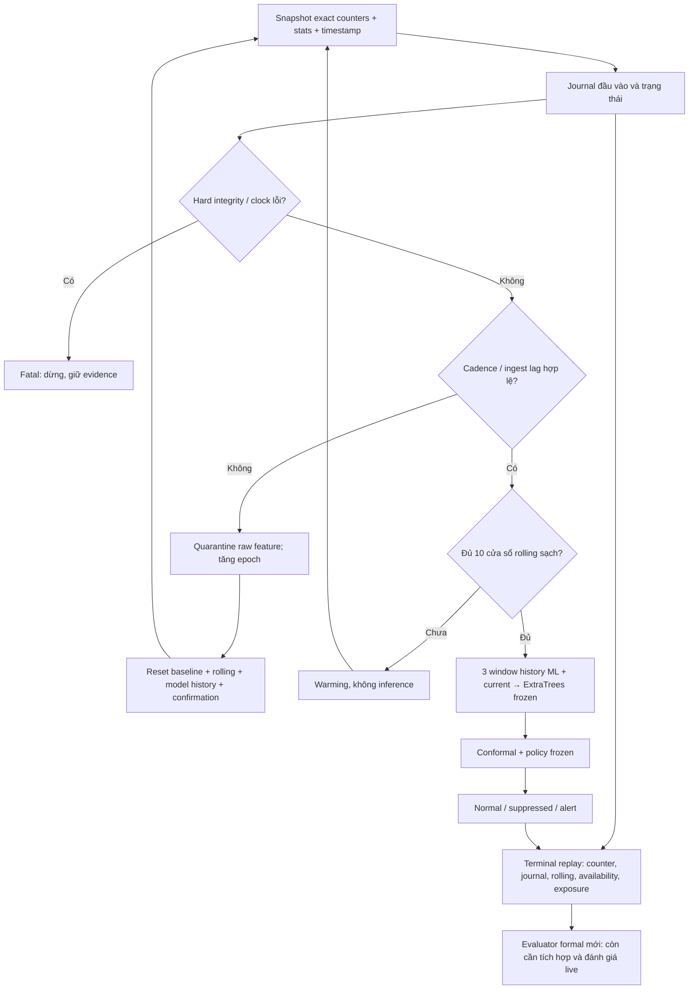

# Sentinel Pulse: phục hồi telemetry mà không xóa bằng chứng lỗi

Cập nhật ngày **05/10/2026**, giờ ICT (UTC+7). Đây là phần mở rộng **opt-in**
của tầng thu thập/kiểm tra dữ liệu, không phải model mới hoặc kết quả formal
soak đã đạt. Model ExtraTrees, calibration, alpha và semantic policy giữ nguyên.

## Trạng thái hiện hành

Cập nhật ngày **05/10/2026**, theo SSH và receipt có checksum. Chỉ sửa mục
hiện hành; giữ riêng evidence và verdict cũ, không nối thêm checkpoint lịch sử.

**Đang chạy ngầm:** formal recovery soak `pulse-recovery-formal-c1-20261005`,
đăng ký **09:06:19 ICT**, **89.880 s/node** (24 giờ58 phút), `diagnostic_only=false`.
Coordinator/systemd trên master234; ba worker237/238/239 đã active, tail ready,
detector restart0, health không degraded tại receipt START. Scope16/19/15 key,
union **21/21 model key**; không suy thành50 workload độc lập.
Chưa có terminal hoặc formal PASS; startup unavailable không tính normal.

Runtime source vẫn **`1c03987`**, 21 model ExtraTrees, feature249, cadence500ms,
history3, alpha0,001 và policy frozen **không đổi**. Crash/resume cùng marker
và single-writer theo run đã kiểm chứng trước đó, không restage run terminal.

Thêm **guard dung lượng riêng**, source SHA`bc5c3ea6…`, không sửa coordinator
frozen hoặc gate đánh giá: preregister trước launch, bind marker thật, probe
hai filesystem/3 worker mỗi30 s. Budget mới available>0/used<90%, unknown≤60 s;
không reserve cố định64 GiB, không xóa dữ liệu, không sửa marker cũ max85%.
Nếu vượt, chỉ dừng coordinator child đang sở hữu; guard không cấp formal PASS.

**Đã đo:** diagnostic dùng guard `pulse-recovery-capacity-diagnostic-c1-20261005`,
180 s/node, terminal **09:04:50 ICT**: integrity gate đạt, node report3/3 valid,
seal coordinator12/12 +guard4/4 khớp. **23.413 decision /19.812 scored /0 alert**;
giữ433 suppressed,2.791 telemetry-degraded,810 warming. Union valid exposure
**0,93272273 workload-hour**, không đủ24h/key; 0 alert không chứng minh FPR=0.
Regression main+guard: subset168/168 host/VM; full host892 passed/7skip/+20subtest,
VM933 passed/+20subtest; số khác do dependency tùy chọn.

**Kỳ vọng, chưa đo:** kernel-to-alert1–2 s. Formal đang chạy là normal exposure,
không blind attack/recall/precision/kernel-to-alert. Không tự mở blind/promote,
không chỉnh model/policy theo holdout. Có thể nhắc tiếp tục khoảng
**10:40 ICT ngày06/10/2026** để kiểm tra terminal và scored exposure thật; đây
là lịch dự kiến có slack finalization, không đảm bảo PASS.

[Toàn bộ luồng và ví dụ log thật](SENTINEL_PULSE_LUONG_VA_MINH_CHUNG.md),
[receipt START formal](validation-evidence/recovery-formal-c1-20261005/START_REMOTE_RECEIPT.json),
[terminal diagnostic guard](validation-evidence/recovery-capacity-c1-20261005/TERMINAL_REMOTE_RECEIPT.json),
[test receipt](validation-evidence/recovery-capacity-c1-20261005/TEST_RECEIPT.json),
[checksum raw đã SSH đọc lại](validation-evidence/recovery-resume-c1-20261005/SOURCE_RECHECK.json).

## Minh chứng tích hợp trước đây — giữ nguyên verdict

**Checkpoint lịch sử22:17 ICT:** coordinator SSH/systemd đã nối ba worker, source frozen
`dd872e7`. Diagnostic600 s/node mới đăng ký22:16:03, union21/21 key; ba
worker active/tail ready,0 restart, coordinator monitoring, health không
degraded. Đã nối runtime probes, dependency journal và finalization streaming,
nhưng chưa có terminal end-to-end hoặc formal24h PASS. Dự kiến xem terminal
22:30 ICT04/10; không mở blind/promote, model/policy giữ nguyên.
[Chi tiết/receipt](PULSE_RECOVERY_LIFECYCLE_STATUS_20261004.md).

**Checkpoint lịch sử21:40–21:50 ICT:** fault diagnostic `.238` đã terminal18:49:02,
exit0; verify19+3+177 checksum và replay độc lập khớp.80.084 decision /
78.779 scored row/19 key/0 alert; một incident quarantine→clean recovery,
availability0,999437254 đạt floor0,999. Giữ769 degraded và536 warming.
Đầu window→sau policy p991,132 s là latency có điều kiện trên scored row,
không output flush/kernel-to-alert hoặc formal PASS. Không có job này còn chạy.
Code mới có bridge formal installer/worker launcher, host/VM557 test +20
subtest đạt; còn coordinator ba worker/end-to-end. Model/policy không đổi.
[Status](PULSE_RECOVERY_LIFECYCLE_STATUS_20261004.md).

## 1. Trạng thái triển khai thật

Đã triển khai và kiểm thử trên host và VM:

- State machine ghi journal cho **mọi snapshot**, kể cả không có feature row.
- Cách ly snapshot trễ, cadence không hợp lệ và dữ liệu backlog.
- Reset baseline delta, rolling mean/std, model history và temporal evidence.
- Detector không gọi model khi feature chưa đủ chất lượng/historical context.
- Validator replay journal và tính lại rolling mean/std từ exact counts.
- Watchdog phân biệt chờ phục hồi có giới hạn với lỗi phải dừng.
- Chặn dữ liệu đánh giá recovery đi vào training/dataset assembly.
- Bind profile JSON bytes/canonical hash vào collector START và detector;
  render worker unit opt-in, detector replay `--from-start`.
- Diagnostic runtime smoke riêng có evaluator giữ mọi alert; legacy
  starter/finalizer từ chối recovery, không tạo PASS bằng protocol cũ.
- Sửa launcher observer: gọi `/bin/bash`, xác minh **sample thật + sar data +
  checksum source** trước khi báo ready; không chỉ tin `systemd-run`.

Release code riêng trên VM:
`/home/dat/eBPF-project-telemetry-recovery-20261003`, commit
`936d3dfd03c345312913b611a5361ee97bc48948`. Host đã fetch branch này bằng Git,
không checkout đè worktree của người dùng. Các file thay đổi cũng đã đồng bộ
vào `/home/dat/eBPF-project-main-0aa73e2`.

Release worker deployment mới:
`/home/dat/eBPF-project-recovery-deploy-r2-20261004`, commit
`ef056f5742047781e46a761a8477e1f72e43c6a7`. Source trước `9bc3867` được giữ
bất biến sau lỗi root Git ownership; scoped trust chỉ áp dụng đúng source
leaf cho từng invocation, không thay Git global config.

Regression mới: **459 test + 20 subtest đạt trên host và VM release**.
Đợt core trước đạt435 +20 subtest, gồm36 test core mới.
VM cũng đã load/verify được cả **21 model frozen** với runtime recovery.
Đây là kiểm tra tính tương thích artifact/software, **không phải live recall**.

**Trạng thái mới04/10,22:17:** profile đã nối vào preregistration/supervisor/
finalizer/exposure evaluator riêng qua coordinator; diagnostic ba worker đang
chạy. Còn chờ terminal end-to-end và kiểm thử resume/failure live trước formal
24h. ML pressure C2 cũ đã reject và không bật `--recovery-profile`; không sửa
verdict hoặc relabel dữ liệu cũ. Diagnostic mới không được gọi là formal soak.
Không có `RECOVERY_PASS`, `NORMAL_PASS` hay promotion mới từ phần này.

**Terminal kiểm tra SSH04/10 từ11:03 ICT:** smoke C2 source`ef056f5` kết
thúc10:56:48,26.648 decision/19 workload scored/0 alert;17+3 checksum khớp.
Không có incident recovery. Audit phát hiện startup backlog p99 đầu
window→sau model12,551 s; sau120 s đầu còn1,907 s, vẫn có row>2 s. Đây
chưa phải kernel-to-alert. Đang xác minh processing-age gate opt-in riêng;
không thay profile capture, model/policy hoặc legacy lifecycle.
[Trạng thái formal lifecycle và latency](PULSE_RECOVERY_LIFECYCLE_STATUS_20261004.md).

## 2. Vì sao không chỉ tăng max gap hoặc bỏ rule?

Window kéo dài 14 giây không phải window 500 ms: count lớn có thể chỉ do thời
gian đo lớn hơn. Nếu đưa nó vào ML hoặc giữ rolling history bị nhiễm, detector
có thể báo bất thường không đúng hoặc dùng context sai sau outage.

Thiết kế mới giữ nguyên raw delta để chẩn đoán, nhưng đánh dấu **không đủ điều
kiện inference**. Đoạn mất dữ liệu là blind spot, không được ghi thành normal,
không dùng train/tune, và vẫn làm giảm availability cuối run.



## 3. Ngân sách recovery được đăng ký riêng

Profile: [`telemetry-recovery-v1.json`](sentinel_pulse/protocol/telemetry-recovery-v1.json).
Canonical JSON SHA-256:
`8490b7e2d570fe15fe5d27e97429912f6f00e9ef9dd8f90177eed2d1084fde23`.
SHA này là digest JSON đã chuẩn hóa, không phải checksum bytes của file JSON.

| Điều kiện | Profile recovery candidate |
|---|---|
| Window danh nghĩa | 500 ms; khoảng cadence sạch 350–800 ms |
| Một gap có thể cách ly | Tối đa 30 giây |
| Ingest lag được chấm điểm | Tối đa 1 giây |
| Recovery một incident, kể cả warm-up | Tối đa 60 giây |
| Incident trong run | Tối đa 12 |
| Tổng thời gian bị cách ly do snapshot incident | Tối đa 900 giây/node |
| Terminal availability | Vẫn ≥0,999 |
| Rolling warm-up | 10 window sạch trước current window |
| ML warm-up sau rolling | 3 history window theo manifest frozen |
| Exposure formal dự kiến | Ít nhất 24 scored hour hợp lệ/key, không cộng trùng replica |
| Wall-time tối đa | 90.000 giây, không kéo dài vô hạn |
| Blind / promote tự động | Không |

Các con số là **engineering budget cho protocol mới**, chưa được chứng minh
là acceptance budget tốt nhất bằng live evaluation. Không áp dụng ngược để
đổi các run đã reject thành PASS. Profile bất biến cần được bind vào marker
run mới trước khi bật. Formal v1 cũ vẫn dùng max gap 10 giây như trước.

Availability vẫn tính `observed / (observed + estimated_missing)`; số snapshot
mất được ước lượng từ gap/500 ms và không reset sau recovery. Đây không phải
phép đo chính xác số syscall mất. Exact counters có thể giữ count qua pause,
nhưng không khôi phục được phân bố thời gian 500 ms của khoảng đó.

Exclusion budget theo snapshot node không thay thế exposure theo workload.
Per-source sparse interval, warming, revision mismatch và dependency health
cũng phải loại khỏi scored exposure. Mọi alert phát sinh phải được giữ trong
tử số; không được xóa alert để đạt rate budget.

## 4. Reset và warm-up hoạt động thế nào?

Ví dụ cadence bình thường 500 ms, rồi gap 14 giây:

1. Ghi snapshot journal và raw feature delta 14 giây, `eligible=false`.
2. Giữ snapshot cuối gap làm baseline cumulative mới; bỏ rolling history cũ.
3. Thu 10 window sạch để xây lại lịch sử rate cho rolling mean/std.
4. Current window tiếp theo mới có 10 window rolling trước nó. Detector bắt
   đầu lấp lại 3 history window của model; không ghép với dữ liệu trước gap.
5. Window sau đó mới được inference và áp dụng policy bình thường.

Với stream có hoạt động liên tục, inference trở lại khoảng **7 giây sau cuối
gap**. Workload thưa event có thể cần lâu hơn; không bảo đảm warm-up cho mọi
container trong đúng 7 giây. Đây là **recovery downtime**, không phải latency
steady-state của một attack. Cần báo cáo hai đại lượng riêng.

`telemetry-degraded` không phải `suppressed`: suppressed đã có score ML nhưng
không đạt policy; degraded không chạy model do dữ liệu không đủ chất lượng.
Sau recovery, vector vẫn 249 chiều, thuật toán và policy không thay đổi.

## 5. File code và cách chạy ở môi trường thử riêng

| File | Trách nhiệm |
|---|---|
| `telemetry_recovery.py` | Profile, hash, state machine, replay, budget |
| `capture.py` | Journal, raw feature quarantine, reset builder |
| `features.py` | Đếm rolling history có sẵn; không đổi transform |
| `detect.py` | Replay journal; warming/degraded; reset confirmation/history |
| `validate_recovery_capture.py` | Kiểm tra toàn capture, tính lại rolling mean/std |
| `inspect_recovery_tail.py` | Watchdog nhẹ; không có quyền phát terminal PASS |
| `train.py`, `assemble_dataset.py` | Từ chối recovery evaluation data cho training |
| `start_node_pressure_diagnostic.sh` | Launcher observer có kiểm tra sample/checksum thật |
| `recovery_deployment.py` | Bind profile bytes/hash vào collector START và detector, render private units |
| `run_recovery_runtime_smoke.sh` | Diagnostic hữu hạn một worker, prereg source/model/policy/profile |
| `evaluate_recovery_smoke.py` | Replay capture + decision bindings, giữ mọi alert; không formal PASS |
| `tests/test_sentinel_pulse_telemetry_recovery.py` | Simulation và kiểm thử tính toàn vẹn, không đo recall |
| `detector_freshness.py` | Contract xử lý queue item ≤1 s tại processing start; gate riêng, không đổi capture profile |
| `audit_recovery_smoke_latency.py` | Read-only audit latency với raw SHA; không claim kernel-to-alert |

Các lệnh sau mô tả **CLI thử nghiệm**, không phải lệnh deploy các service
production đang chạy. Loader/resolver input phải được chuẩn bị trong một run
riêng. Không append vào evidence run cũ hoặc tự thay unit frozen bằng tay.

```bash
# Chuyển JSON stream của loader thành capture recovery riêng.
python -m sentinel_pulse.capture \
  --metadata-file /run/sentinel-pulse/cgroups.json \
  --output /path/to/NEW-RUN/features.jsonl \
  --rolling-windows 10 \
  --interval-min-seconds 0.35 --interval-max-seconds 0.8 \
  --nominal-interval-seconds 0.5 \
  --recovery-profile sentinel_pulse/protocol/telemetry-recovery-v1.json

# Detector phải replay journal từ đầu, không seek-to-tail để bỏ qua outage.
python -m sentinel_pulse.detect \
  --model-dir /path/to/FROZEN/model \
  --decision-policy /path/to/FROZEN/decision-policy.json \
  --features /path/to/NEW-RUN/features.jsonl \
  --decisions /path/to/NEW-RUN/decisions.jsonl \
  --alerts /path/to/NEW-RUN/alerts.jsonl --run-id NEW-RUN --from-start \
  --recovery-profile sentinel_pulse/protocol/telemetry-recovery-v1.json

# Watchdog: stale stream vượt 30 giây phải fail, dù row cũ ghi ready.
python -m sentinel_pulse.inspect_recovery_tail \
  --capture /path/to/NEW-RUN/features.jsonl \
  --recovery-profile sentinel_pulse/protocol/telemetry-recovery-v1.json

# Terminal validator không tự phát NORMAL_PASS / OPERATIONAL_PASS.
python -m sentinel_pulse.validate_recovery_capture \
  --capture /path/to/NEW-RUN/features.jsonl \
  --recovery-profile sentinel_pulse/protocol/telemetry-recovery-v1.json \
  --output /path/to/NEW-RUN/recovery-validation.json
```

Validator legacy từ chối capture có recovery journal. Runtime legacy từ chối
feature recovery; runtime recovery từ chối feature thiếu journal hoặc khác
profile/epoch/sequence. Không có đường tự hạ cấp protocol để làm run PASS.

## 6. Incident thật trong lượt diagnostic trước

Run `pulse-projected-pressure-c1-20261003T162000Z` bắt đầu **23:16:45 ICT**.
Lúc **23:29:27**, supervisor ghi worker4 unreachable và freeze cả run.
Sau freeze, worker4 finalize fail lúc **23:29:43**, max gap **16,484963 giây**,
availability **0,976313842**. Hard integrity counters đều 0. Chưa xác định
gap có trước hay bị ảnh hưởng bởi sự cố kết nối/teardown; không quy kết RCA.

`FAILED_SUMMARY.json` terminal ghi **90.343 decision, 0 alert**:
31.301 worker1, 30.116 worker3, 28.926 worker4. Đây là evidence bị reject,
**không phải normal gate, FPR=0, latency PASS hay dữ liệu train/tune**.
START **10/10** và FAILED_FINAL **77/77** checksum kiểm tra trên VM đạt.
Host giữ metadata; full feature/decision streams vẫn trên VM, không được
nói rằng host đã tự kiểm tra mọi raw checksum.

Observer cả ba node trước đó failed exit **126**. Journal worker4 ghi
`Permission denied` khi gọi trực tiếp script Git mode `100644`.
Vì vậy nhận định trước đó “observer đang thu PSI/clock” **không đúng trạng
thái thực tế**; không có số liệu observer từ lượt khởi chạy lỗi để dùng RCA.
Launcher mới gọi interpreter và đợi sample thật; không sửa evidence cũ.

Lượt observer mới `pulse-pressure-observer-c2-20261003T163600Z` đã xác minh
ready **23:36:11 / 23:36:15 / 23:36:20 ICT** trên worker1/worker3/worker4.
Observer readonly chạy 7.800 giây, dự kiến kết thúc khoảng **01:46 ICT 04/10**.
Lượt ML diagnostic mới cần xác minh START/ACTIVE riêng; không suy diễn từ
việc observer ready rằng model đã active hoặc canary đã PASS.

Checkpoint lịch sử: ML C2 đã có START thật **23:37:48,534 ICT**, run
`pulse-projected-pressure-c2-20261003T163700Z`, parent active/running ở
23:39:30 và danh sách ba worker đã được tạo. Source ML vẫn `5cac5cd`,
duration7.200 giây; profile recovery **không bật**. Cần kiểm tra terminal/
archive khoảng **02:10 ICT 04/10**; đây là lịch review, không phải hứa PASS.

Kiểm tra SSH lịch sử **23:41:33 ICT**: ACTIVE marker có mặt, START checksum **10/10**
khớp, supervisor active/running; ba worker đều báo active. Ba snapshot monitor
23:41:21–23:41:24 có tổng **19.460 decision, 0 alert**. Đây là checkpoint
bất đồng bộ của run đang chạy, không phải terminal score hoặc FPR.

### Terminal C2 đã kiểm tra lại

C2 reject **00:02:31 ICT04/10**:179.034 decision,1 alert Redis Sentinel.
Worker4 gap13,208959 s, availability0,990699; giữ alert và normal-alert verdict.
Observer độc lập trễ13,643 s trong incident, chưa offset-change/OOM/high-memory;
CPU pressure/throttling tăng nhưng chưa đủ RCA. Cả3 observer terminal thành
công01:46–01:47,23/23 checksum/node đạt. Lịch review02:10 đã hết hiệu lực.
[Timeline và giới hạn kết luận](docs/archive/PULSE_PRESSURE_C2_INCIDENT_20261004.md).

## 7. Công việc tiếp theo

**Checkpoint smoke lịch sử:** run `pulse-recovery-runtime-smoke-c2-20261004` trên
worker4`.238`, prereg **10:46:15,473 ICT04/10**, collector START
**10:46:22,205**. Source`ef056f5`; model/policy/profile hash verified trong
decision thật. Checkpoint **10:48:22,396**:5.033 decision (314 warming,
4.653 normal,66 suppressed),19 workload scored,0 alert; chưa terminal tại checkpoint.
Unit parent/collector/detector active, NRestarts0 tại kiểm tra10:47:26.
Chạy hữu hạn600 s, tự dừng/ghi report và checksum khoảng10:57; nhắc kiểm tra
**10:58 ICT04/10** là lịch review cũ: run thực tế đã terminal10:56:48,
26.648 decision/0 alert,17+3 checksum khớp. Không cần chờ train nhiều ngày.
[Development receipt](validation-evidence/recovery-deploy-dev-20261004/RECEIPT.json).

Freshness của capture không đồng nghĩa queue latency của detector đạt1–2 s.
Audit đã đo backlog: toàn run đầu window→sau model p9912,551 s; sau120 s
đầu p991,907 s, vẫn156 row>2 s. Thêm processing-age gate riêng và timestamp
sau policy; không dùng checkpoint0 alert hoặc smoke ngắn để claim FPR/recall.

1. Hoàn tất smoke runtime có binding mới; adjudicate alert C2 bằng process
   evidence nếu có. Không sửa verdict cũ hoặc train/tune trên failed run.
2. Tích hợp profile recovery vào formal marker, hash bundle, monitor,
   node finalizer và evaluator exposure; giữ default legacy strict.
3. Đăng ký run **mới**; thử gap có kiểm soát trong lab riêng, không cố gây lỗi
   storage của AIMS. Giữ toàn bộ alert và downtime trong báo cáo.
4. Chỉ sau canary mới mở operational recovery soak; tối thiểu 24 valid
   scored hour/key và availability ≥0,999. Không mở blind/promote tự động.

Phần recovery này giải quyết việc mất tiến độ do các cadence incident ngắn.
Nó **không** chứng minh latency kernel-to-alert 1–2 giây, recall, production
stable hay world-class paper. Các claim đó vẫn cần live/blind evidence riêng.
