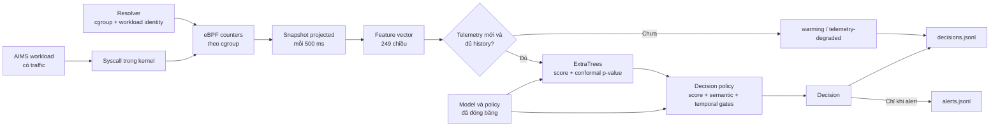
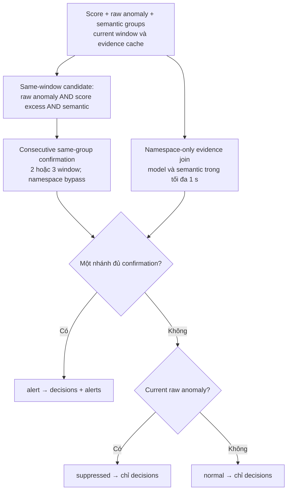
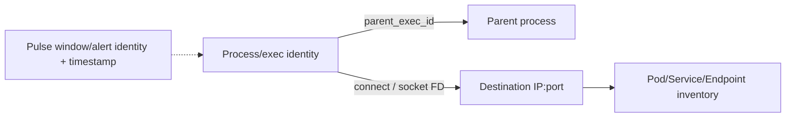

# Sentinel Pulse — toàn bộ luồng triển khai và minh chứng từ log thật

## 1. Phạm vi và cách đọc tài liệu

Đối chiếu source và SSH ngày **05/10/2026**, múi giờ ICT (UTC+7).
Tài liệu giải thích cả đường thu thập, xây dựng feature, train/calibration,
inference, decision policy, recovery, điều phối và kiểm chứng kết quả.

Các ví dụ số liệu trong tài liệu đều trích từ run thật
`pulse-recovery-resume-c1-20261005`. JSON được chọn trường để dễ đọc;
bản ghi gốc, đủ 249 giá trị và các decision đầy đủ lưu tại
[REAL_FLOW_EXAMPLE_WORKER_237.json](validation-evidence/recovery-resume-c1-20261005/REAL_FLOW_EXAMPLE_WORKER_237.json).
Checksum nguồn khớp node report trong
[TERMINAL_REMOTE_RECEIPT.json](validation-evidence/recovery-resume-c1-20261005/TERMINAL_REMOTE_RECEIPT.json).
Đã SSH đọc lại checksum file gốc ngày05/10:
[SOURCE_RECHECK.json](validation-evidence/recovery-resume-c1-20261005/SOURCE_RECHECK.json).
Bản đầy đủ `features.jsonl`/`decisions.jsonl` vẫn ở worker; host lưu bản trích
JSON và receipt, không giả nhận đã tải toàn bộ raw stream về đây.

Run là diagnostic kiểm thử crash/resume của **coordinator**, không phải một
đợt tấn công bảo mật. Collector trên worker vẫn chạy trong lúc coordinator
được dừng có kiểm soát. Có **0 alert thực tế**; tài liệu không dựng một bản ghi
alert để thay thế bằng chứng chưa có.

Trạng thái hiện hành được cập nhật tại
[SENTINEL_PULSE_REPORT.md](SENTINEL_PULSE_REPORT.md); tài liệu này không phải
nhật ký checkpoint theo thời gian.

### 1.1 Phân loại số liệu

| Nhãn | Cách hiểu |
|---|---|
| **Đã đo/quan sát** | Lấy từ log hoặc receipt thật, có run ID, timestamp và checksum đối chiếu |
| **Tính từ log thật** | Phép tính từ dữ liệu đã quan sát, như delta thời gian, log1p và ratio; không phải một phép đo attack mới |
| **Cấu hình/ngưỡng** | Tham số code, manifest hoặc policy, như cadence500ms, alpha0,001, budget30s; không phải kết quả đạt được |
| **Kỳ vọng, chưa đo** | Mục tiêu hoặc số dự kiến; không được dùng làm minh chứng recall, precision, FPR hoặc latency thực nghiệm |

Nếu bổ sung số liệu từ mô phỏng hoặc ước tính về sau, chúng được ghi ở nhóm
**kỳ vọng**, tách khỏi số liệu đã đo. Các ví dụ window và bảng kết quả của
run trong tài liệu hiện tại đều lấy từ log thật.

## 2. Kiến trúc đang dùng

| Thành phần | Cấu hình đối chiếu |
|---|---|
| Runtime source | `1c039878faa5c24cacafa4b2f7882c56ef2fb057` |
| Checkout runtime | `/home/dat/eBPF-project-recovery-coordinator-r3-20261005` |
| Model | 21 model `PulseExtraTrees`, một model/workload-container key |
| Model manifest SHA-256 | `6ddf7cf9b03cb783b82c23272f7046bafa7ab1412b0545b60a2821d1f441cc21` |
| Decision policy SHA-256 | `602165bd48d81f549d3bfb65e5bdb319a11252678cbf484d739afcf2e5bc8143` |
| Telemetry | Exact syscall-entry counters từ eBPF; collector projected |
| Cadence | 500 ms danh định; thời gian thực lấy từ timestamp từng window |
| Feature | 249 chiều/window, schema SHA `879e33f8c33774c50d848524b78c0fa2398b9855971982e5a41a12f9259f5ae2` |
| Context của model | 3 window trước + hiện tại, tổng 996 chiều/temporal example |
| Rolling statistics | Tối đa 10 window trước, khoảng 5 giây nếu cadence đều |
| Alpha đang freeze | `0.001`; không lấy default `1e-4` của constructor làm cấu hình live |
| Gap liên tục của model | Manifest đang dùng `1.25 s`; khác default `1.5 s` trong source |
| Chế độ | Audit-only: ghi decision/alert, không tự kill process hoặc chặn AIMS |

Release runtime này bổ sung bảo vệ resume, **không train lại hay đổi model**.
Pulse là ML cây quyết định tập hợp; LSTM/GAT, MCP và LLM Agent không nằm trong
đường inference đang minh chứng ở đây.

### 2.1 Cụm Kubernetes

SSH ngày 05/10 xác nhận sáu node Ready, Kubernetes `v1.34.10`.

| IP | Hostname thực tế | Role |
|---|---|---|
| 10.1.16.234 | k8s-master.local | Control plane; chạy coordinator |
| 10.1.16.235 | k8s-master2.local | Control plane |
| 10.1.16.236 | k8s-master3.local | Control plane |
| 10.1.16.237 | k8s-worker1.local | Worker; mẫu RabbitMQ trong tài liệu |
| 10.1.16.238 | k8s-worker4.local | Worker |
| 10.1.16.239 | k8s-worker3.local | Worker |

Tên worker3/worker4 phản ánh hostname hiện có, không suy tên từ thứ tự IP.
Workload ở namespace `production`; collector và detector Pulse chạy bằng
**systemd trên worker**, không phải container trong pod ứng dụng.

### 2.2 Sơ đồ tóm tắt luồng đang chạy



Luồng chính là: workload → syscall/counter → snapshot 500 ms → vector 249
chiều → kiểm tra độ mới và history → ExtraTrees → policy → decision/alert.
Resolver cung cấp danh tính cgroup; bundle đã đóng băng cung cấp model và
policy cho bước inference. Các bước train và đánh giá lifecycle được giải
thích ở những mục riêng bên dưới, không nằm trong sơ đồ online này.

## 3. Workload identity và chọn model

Resolver nối container runtime với cgroup Linux rồi gán:

```text
namespace/controller:container
```

Ví dụ thực:

```text
production/aims-rabbitmq-server:rabbitmq
```

Cgroup `3112263` thuộc pod `aims-rabbitmq-server-2`, container
`rabbitmq`, trên `k8s-worker1.local`.
Pod UID và revision cũng được lưu trong feature/decision.

Replica của cùng workload-container dùng chung model, nhưng rolling/context/
confirmation được giữ riêng theo identity gồm workload, node, pod UID,
container và cgroup. Không nối history của hai pod thành một chuỗi.

Model manifest có 21 key, **không có nghĩa là 21 service business**:
Kafka operator có hai container key; MinIO có main container và sidecar;
các dependency như PostgreSQL, Kafka, RabbitMQ, Redis và waypoint cũng được tính.

## 4. Luồng kernel → snapshot

1. Task của ứng dụng đi vào syscall; hook `raw_tp/sys_enter` đọc cgroup ID.
2. Chỉ cgroup nằm trong map allow-list và syscall ID được collector hỗ trợ
   mới được đếm. Mapping tường minh hiện là Linux x86_64; giới hạn ID trong
   code là dưới 1024.
3. Counter tăng trong kernel, không xuất một JSON event cho mỗi `read/write`.
4. Với task có previous syscall, cùng cgroup và khoảng cách không quá 5 giây,
   collector tăng adjacent-transition bin.
5. Loader đọc/gộp map theo CPU và cgroup; kiểm tra các invariant và failure
   counters trước khi phát snapshot.
6. Projected variant đếm riêng tracked syscalls và bins của syscall còn lại,
   rồi reconstruct total và histogram thống nhất ở loader.
7. `capture.py` nối snapshot với metadata/revision, kiểm tra cadence, ghi
   recovery snapshot journal và chuyển vào feature builder.

“Exact” là số syscall **entry đã được hook quan sát trong phạm vi đó**.
Nó không nói syscall thành công, không phải HTTP request count, không chứa
return value, byte payload hoặc mọi hoạt động của mọi process trong cluster.
Map/attribution/integrity failure vẫn phải ghi nhận; không thể bỏ qua vì tên
counter là exact.

### 4.1 Count, hash bins và thứ tự syscall

29 syscall có counter riêng. Các syscall khác vẫn ảnh hưởng `other`,
`exact_total` và 64 syscall bins. Hash:

```text
syscall_bin = uint32(syscall_id × 2654435761) >> 26
transition_bin = uint32((previous_id × 31 + current_id) × 2654435761) >> 26
```

Hai syscall hoặc hai transition có thể cùng bin. Histogram giữ dấu hiệu
phân phối và adjacent order, **không phục hồi được toàn bộ event sequence**.
Các transition được nối trong cùng task/thread, không tùy tiện ghép syscall
của hai process chạy song song.

Counter `seccomp_denied` là một chiều schema, nhưng hook `sys_enter` hiện
không tự xác nhận mọi seccomp denial. Không suy `seccomp_denied=0` thành
“không syscall nào bị từ chối”.

## 5. Snapshot → feature 249 chiều

Hai snapshot cumulative xác định một window:

```text
dt = window_end - window_start
count_s = current_counter_s - previous_counter_s
rate_s = count_s / dt
```

Snapshot đầu chưa có delta nên không emit feature. Window không có hoạt động
không được thay bằng zero/filler row. Reset/identity/gap được lifecycle xử lý;
không dùng một delta âm như lưu lượng hợp lệ.

| Index, bắt đầu từ 0 | Nhóm | Chiều | Công thức |
|---|---|---:|---|
| 0–28 | log_count của 29 syscall | 29 | ln(1 + count) |
| 29–57 | ratio của 29 syscall | 29 | count / total |
| 58–62 | other/log_total/sensitive_ratio/seccomp_denied | 5 | Theo định nghĩa schema |
| 63–126 | syscall bins | 64 | Count bin / total |
| 127–190 | transition bins | 64 | Count bin / tổng transition |
| 191–219 | rolling mean | 29 | ln(1 + mean(rate trước đó)) |
| 220–248 | rolling std | 29 | ln(1 + std(rate trước đó, ddof=0)) |
| | Tổng | **249** | 29 + 29 + 5 + 64 + 64 + 29 + 29 |

29 syscall theo thứ tự:

```text
read, write, open, close, mmap, mprotect, socket, connect, accept,
sendto, recvfrom, clone, execve, chmod, ptrace, setuid, setgid, capset,
pivot_root, mount, openat, unshare, accept4, recvmmsg, sendmmsg,
setns, seccomp, execveat, clone3
```

`sensitive_ratio` dùng tập riêng trong
[features.py](sentinel_pulse/features.py); `connect` không nằm trong tập này
dù có nhóm semantic riêng. Metadata/node/pod/timestamp không làm tăng số chiều.

### 5.1 Hai loại history

- **Rolling feature history:** tối đa 10 rate-window trước; sinh mean/std trong
  mỗi vector. Chưa đưa current window vào mean/std của chính nó.
- **ML context history:** ba vector trước, ghép thêm current thành 996 chiều.

Rolling bao phủ khoảng 5 giây không có nghĩa mỗi lần detection phải đợi thêm
5 giây sau anomaly. Khi đã warm, pipeline trượt liên tục theo window 500 ms.
Sau reset, các điều kiện warm-up vẫn phải được đáp ứng lại.

## 6. Minh chứng một window RabbitMQ thật

Nguồn: worker `10.1.16.237`, run đã terminal và seal.
Window thực: **05/10/2026, 08:45:02 → 05/10/2026, 08:45:03 ICT**;
timestamp số giữ độ chính xác dưới giây trong JSON.

```json
{
  "schema": "sentinel-pulse-feature-v1",
  "node_name": "k8s-worker1.local",
  "pod_name": "aims-rabbitmq-server-2",
  "pod_uid": "cf6db097-3801-4a50-939d-1ada52624ef9",
  "container_name": "rabbitmq",
  "cgroup_id": 3112263,
  "workload_key": "production/aims-rabbitmq-server:rabbitmq",
  "workload_revision": "aims-rabbitmq-server-6579bff56b",
  "window_start": 1791164702.8981464,
  "window_end": 1791164703.4059176,
  "exact_total": 144,
  "exact_counts": {
    "accept": 0,
    "accept4": 0,
    "capset": 0,
    "chmod": 0,
    "clone": 0,
    "clone3": 0,
    "close": 1,
    "connect": 0,
    "execve": 0,
    "execveat": 0,
    "mmap": 0,
    "mount": 0,
    "mprotect": 0,
    "open": 0,
    "openat": 1,
    "other": 102,
    "pivot_root": 0,
    "ptrace": 0,
    "read": 20,
    "recvfrom": 10,
    "recvmmsg": 0,
    "seccomp": 0,
    "sendmmsg": 0,
    "sendto": 0,
    "setgid": 0,
    "setns": 0,
    "setuid": 0,
    "socket": 0,
    "unshare": 0,
    "write": 10
  },
  "vector_dim": 249,
  "feature_schema_sha256": "879e33f8c33774c50d848524b78c0fa2398b9855971982e5a41a12f9259f5ae2",
  "emitted_at": 1791164703.4321506,
  "telemetry_recovery": {
    "eligible": true,
    "epoch": 0,
    "profile_sha256": "8490b7e2d570fe15fe5d27e97429912f6f00e9ef9dd8f90177eed2d1084fde23",
    "reason": "ready",
    "rolling_history_before": 10,
    "snapshot_sequence": 591
  }
}
```

Tổng đối chiếu từ counter: read20 + write10 + close1 + recvfrom10 + openat1
+ other102 = **144**. Các counter còn lại trong window này bằng 0;
đó là số đo của window cụ thể, không nói RabbitMQ không bao giờ gọi chúng.

### 6.1 Phép tính được kiểm chứng từ vector thật

| Trường | Giá trị trong vector/log | Giải thích |
|---|---:|---|
| Window thực | 507.771254 ms | Không ép thành đúng 500 ms |
| read count | 20 | Số tự nhiên từ counter delta |
| log_count:read | 3.044522523880005 | float32 của ln(21), không phải count |
| ratio:read | 0.1388888955116272 | 20/144 |
| log_count:other | 4.634728908538818 | ln(103) |
| ratio:other | 0.7083333134651184 | 102/144 |
| log_total | 4.976733684539795 | ln(145) |
| sensitive_ratio | 0 | Nhóm sensitive không tăng trong window này |
| rolling_mean:read | 3.9589908123016357 | ln(1 + mean của 10 rate trước) |
| rolling_std:read | 3.86833119392395 | ln(1 + std của 10 rate trước) |

Mười read-rate thật trước current, đơn vị syscall/giây:

```json
[
  90.65948675875556,
  0,
  55.14084329814426,
  3.9463861052867295,
  83.15110343714274,
  0,
  51.30282628709981,
  0,
  90.94589336866751,
  138.89764196734217
]
```

Mean rate thực là **51.404418122243875**, std rate thực là
**46.86244074948561**. Script trích xuất đã kiểm tra `np.isclose`
giữa log1p của hai đại lượng này và vector được giải mã.

### 6.2 Compact encoding không làm mất 249 giá trị

JSONL lưu `vector_f32_zlib_b64`: float32 little-endian → zlib → base64.
Schema record riêng khóa tên/thứ tự 249 cột bằng SHA-256. Detector giải mã
và kiểm tra schema trước khi score. Đây là **nén dữ liệu**, không giảm chiều
hay sampling event.

Toàn bộ 249 giá trị của window này có trong phụ lục ở cuối tài liệu và
JSON evidence được liên kết ở mục 1.

## 7. Luồng offline: normal → train → calibration → freeze

### 7.1 Admit dữ liệu

`validate_capture.py`, `assemble_dataset.py`, traffic/revision gates kiểm tra
nguồn thu, finite vector, schema, workload identity, cadence và integrity.
Dữ liệu được tách theo workload/container; chuỗi bị gián đoạn hoặc đổi
revision/regime không được nối tùy tiện.

Dataset normal cần bao phủ steady, high-load/peak, burst, recovery và các
hoạt động dependency. Ratio không tự loại được rủi ro false positive khi tải
cao chưa xuất hiện trong baseline.

### 7.2 Temporal examples

`PulseExtraTrees` tạo context:

```text
[x(t-3), x(t-2), x(t-1), x(t)]
```

Với mẫu RabbitMQ vừa lấy, ba row history và current có timestamp/tổng count
thật sau:

| Row | window_start | window_end | exact_total | Feature dim |
|---|---:|---:|---:|---:|
| t-3 | 1791164701.3786356 | 1791164701.888383 | 72 | 249 |
| t-2 | 1791164701.888383 | 1791164702.3941782 | 220 | 249 |
| t-1 | 1791164702.3941782 | 1791164702.8981464 | 806 | 249 |
| t | 1791164702.8981464 | 1791164703.4059176 | 144 | 249 |

Model không phải LSTM và không đọc chuỗi syscall thô. Nó đọc bảng feature
được ghép theo thứ tự window, cộng các histogram transition trong feature.

### 7.3 Self-supervised ExtraTrees

Training chỉ dùng normal data. Nhãn 0 là temporal example normal;
nhãn 1 tạo bằng corruption của **current row**, giữ history của example đó:

- Khoảng 15% ô current được thay bằng giá trị từ donor row.
- Khoảng 8% ô được scale bằng hệ số **log-uniform** trong [0,25;4].
- Random seed khóa khả năng tái lập; không dùng blind attack để tạo negatives.

ExtraTrees có 192 cây, max_depth16, min_samples_leaf4,
max_features=sqrt, class_weight=balanced, random_state73021.
Training dùng nhiều worker; estimator được chuyển `n_jobs=1` cho inference
một live window.

Score là `predict_proba(class=corrupted)`: dùng xếp hạng khác biệt temporal,
**không phải xác suất một attack có thật**. Các thông số này nằm trong
[model.py](sentinel_pulse/model.py).

### 7.4 Calibration và đóng băng

Code mặc định chia theo thời gian train_fraction0,7 trong mỗi sequence.
Calibration dùng current windows holdout; ba history row sát boundary cung
cấp context, không phải blind attack labels. Manifest/artifact của candidate
mới là nguồn cấu hình live, không suy từ default CLI.

Calibration lưu phân phối score normal và chuyển score live thành:

```text
p = (số calibration score >= score live + 1) / (n_calibration + 1)
raw_model_anomalous = p <= alpha
```

Alpha live=0,001 cần ít nhất 999 calibration examples để có thể biểu diễn
p≤alpha. Conformal p nhỏ biểu thị bất thường so với calibration, không phải
attack probability và không bảo đảm FPR production=alpha khi drift hoặc dữ
liệu temporal phụ thuộc.

Bundle freeze lưu manifest, model artifact checksum, feature schema,
software provenance, approved workload revisions và policy. Runtime phải
kiểm tra binding trước khi load; đổi revision không tự động được coi normal.
Không lấy run diagnostic đang minh chứng để train/tune candidate frozen.

## 8. Luồng online và policy quyết định

### 8.1 Admission trước score

`detect.py` đọc JSONL hoàn chỉnh, không đưa dòng đang ghi dở vào model.
Nó kiểm tra schema, model của workload, revision, recovery eligibility và
freshness. History/context/confirmation thuộc từng source identity.

Queue age được kiểm tra tại **bắt đầu xử lý**; contract hiện tại cho tối đa
1 giây. Dữ liệu quá cũ bị ghi degraded và reset context, không score giả là
mới, cũng không xóa dấu vết backlog.

### 8.2 Mẫu normal RabbitMQ đã được model xử lý

```json
{
  "schema": "sentinel-pulse-decision-v1",
  "run_id": "pulse-recovery-resume-c1-20261005",
  "status": "normal",
  "workload_key": "production/aims-rabbitmq-server:rabbitmq",
  "cgroup_id": "3112263",
  "window_start": 1791164702.8981464,
  "window_end": 1791164703.4059176,
  "score": 0.46558810748967033,
  "conformal_p": 0.11502435369052079,
  "raw_model_anomalous": false,
  "calibration_score_max": 0.6851524075328793,
  "score_excess_over_calibration_max": -0.21956430004320898,
  "minimum_score_excess": 0.01,
  "semantic_corroborated": false,
  "score_corroborated": false,
  "same_window_corroborated": false,
  "temporal_confirmation_corroborated": false,
  "bounded_event_time_corroborated": false,
  "inference_ms": 18.023522570729256,
  "detector_freshness": {
    "checked_at": 1791164703.772655,
    "contract_sha256": "a5ca1b229e1c27c43750e8ecaec13f603bee88012c1a197f8424f195b943b3ba",
    "decision_completed_at": 1791164703.790941,
    "eligible": true,
    "feature_age_at_processing_start_seconds": 0.36673736572265625,
    "reason": "fresh",
    "schema": "sentinel-pulse-detector-freshness-v1",
    "window_end_to_decision_completed_seconds": 0.3850233554840088
  }
}
```

p=0.11502435369052079 > alpha0,001 nên raw anomaly=false.
Score excess=-0.21956430004320898, thấp hơn margin0,01.
Nhóm `credential_open` quan sát openat1, normal_max39, excess=-38,
không đạt minimum_excess4. Những phép kiểm này khớp decision thật,
không suy ngược từ việc alert file trống.

### 8.3 Các gate trong policy frozen

| Gate | Ý nghĩa |
|---|---|
| Raw model anomaly | p≤alpha |
| Score corroboration | score - calibration_max ≥0,01 |
| Semantic envelope | Ít nhất một security signal group vượt normal envelope của workload |
| Temporal confirmation | Các window liên tiếp của cùng identity có bằng chứng cùng nhóm |
| Bounded model/semantic join | Chỉ nhóm namespace_probe được join chứng cứ khác window trong tối đa 1 giây |

Khi envelope tồn tại như policy live, không chỉ cần “có một syscall nhạy cảm”
hoặc security_activity_mass≥1. Semantic trigger dựa trên **group excess**.

| Semantic group | Fields | Excess tối thiểu | Confirmation |
|---|---|---:|---|
| local_socket_beacon | socket + connect | 4 | 3 window |
| process_fanout | clone + clone3 | 4 | 2 window |
| identity_transition | setuid + setgid + capset | 4 | 2 window |
| credential_open | openat | 4 | 3 window |
| namespace_probe | ptrace + pivot_root + mount + unshare + setns + execveat | 1 | Có immediate bypass và bounded join đã khóa |

Hai hoặc ba window confirmation **không phải ba history window của model**.
Immediate bypass vẫn yêu cầu model/score/semantic phù hợp; không biến thành
rule-only độc lập. Bounded join vẫn giới hạn tuổi evidence, không nối lịch sử
bất kỳ, và evidence được consume theo policy khi alert.

Luồng policy:



Sơ đồ biểu diễn các điều kiện của đường xử lý dữ liệu eligible. Các lỗi
schema/revision/recovery/freshness đi qua admission riêng ở mục 8.1.
Bounded join có thể dùng model evidence còn hợp lệ từ window trước, nên
current raw=false không tự hủy một join đã đủ điều kiện; trạng thái cuối
do logic trong `detect.py` quyết định.

### 8.4 Minh chứng suppressed thật

```json
{
  "run_id": "pulse-recovery-resume-c1-20261005",
  "status": "suppressed",
  "pod_name": "aims-redis-sentinel-sentinel-0",
  "workload_key": "production/aims-redis-sentinel-sentinel:aims-redis-sentinel-sentinel",
  "window_start": 1791164433.8811364,
  "window_end": 1791164434.3870516,
  "score": 0.5162790435919503,
  "conformal_p": 0.0005620082427875609,
  "raw_model_anomalous": true,
  "calibration_score_max": 0.5478767331661631,
  "score_excess_over_calibration_max": -0.03159768957421283,
  "minimum_score_excess": 0.01,
  "semantic_corroborated": false,
  "score_corroborated": false,
  "same_window_corroborated": false,
  "temporal_confirmation_corroborated": false,
  "bounded_event_time_corroborated": false
}
```

Đây là Redis Sentinel trên worker1. p=0.0005620082427875609≤0,001:
model đánh dấu raw anomaly, nhưng score excess âm và semantic envelope không
trigger. Decision vì vậy là **suppressed**, không phải alert đã phát rồi bị xóa.
Run còn giữ cả 358 suppressed decision, không dùng chúng làm bằng chứng
recall tốt hoặc tự gán ground-truth false positive.

### 8.5 Minh chứng degraded và warming thật

```json
{
  "run_id": "pulse-recovery-resume-c1-20261005",
  "status": "telemetry-degraded",
  "workload_key": "production/inventory-service:app",
  "window_start": 1791164404.483714,
  "window_end": 1791164404.988857,
  "telemetry_reason": "detector_queue_stale",
  "detector_freshness": {
    "checked_at": 1791164423.824895,
    "contract_sha256": "a5ca1b229e1c27c43750e8ecaec13f603bee88012c1a197f8424f195b943b3ba",
    "decision_completed_at": 1791164423.8251462,
    "eligible": false,
    "feature_age_at_processing_start_seconds": 18.8360378742218,
    "reason": "detector_queue_stale",
    "schema": "sentinel-pulse-detector-freshness-v1",
    "window_end_to_decision_completed_seconds": 18.836289167404175
  }
}
```

Row này có queue age **18.8360378742218 giây**,
reason `detector_queue_stale`. Nó thuộc backlog khi detector khởi động,
không được score như realtime. Đây là lý do không lấy availability snapshot=1
để nói mọi inference đều không có lag.

Sau khi trở lại dữ liệu fresh:

```json
{
  "run_id": "pulse-recovery-resume-c1-20261005",
  "status": "warming",
  "workload_key": "production/inventory-service:app",
  "window_start": 1791164422.7317226,
  "window_end": 1791164423.2511203,
  "warming_reason": "history_fill",
  "detector_freshness": {
    "checked_at": 1791164423.9505556,
    "contract_sha256": "a5ca1b229e1c27c43750e8ecaec13f603bee88012c1a197f8424f195b943b3ba",
    "decision_completed_at": 1791164423.9506447,
    "eligible": true,
    "feature_age_at_processing_start_seconds": 0.6994352340698242,
    "reason": "fresh",
    "schema": "sentinel-pulse-detector-freshness-v1",
    "window_end_to_decision_completed_seconds": 0.6995244026184082
  }
}
```

`warming_reason=history_fill` nghĩa model đang nạp lại ba vector trước.
Các trạng thái khác trong code:

| Status | Cách đọc |
|---|---|
| normal | Đã score; không đủ điều kiện alert |
| suppressed | Raw anomaly nhưng policy chưa xác nhận |
| alert | Policy xác nhận; ghi thêm alerts.jsonl |
| warming | Chưa đủ history/recovery warm-up; không phải kết quả model normal |
| telemetry-degraded | Queue hoặc telemetry không đủ điều kiện score |
| collect-only | Chưa có model candidate cho workload |
| rebaseline-required | Revision không được model freeze approve |

Diagnostic này có ví dụ thật của bốn trạng thái đầu vào normal/suppressed/
warming/telemetry-degraded. Không có alert, collect-only hoặc rebaseline-required
để trích làm ví dụ live.

## 9. Output và ý nghĩa các timestamp

`decisions.jsonl` giữ mọi trạng thái. `alerts.jsonl` chỉ nhận `status=alert`.
Detector flush sau khi ghi; timestamp `decision_completed_at` được lấy sau
policy nhưng **trước** ghi/flush file.

Tên `alerted_at` tồn tại ngay cả trong normal/suppressed decision. Trong code,
nó được lấy ngay sau model.predict, trước phần policy; **không được dùng tên
field này để kết luận đã phát alert hoặc đo xong toàn bộ pipeline**.

Từ window RabbitMQ thật:

| Khoảng đo | Giá trị tính từ timestamp thật |
|---|---:|
| window_start → window_end | 507.771254 ms |
| window_end → feature emitted | 26.232958 ms |
| emitted → processing check | 340.504408 ms |
| model inference | 18.023523 ms |
| window_end → decision_completed_at, sau policy | 385.023355 ms |
| window_start → decision_completed_at | 892.794609 ms |

Đây là **một normal decision**, không phải p99, không phải attack detection
latency và chưa bao gồm output flush. Window_start không thay được timestamp
kernel của attack. **Kỳ vọng, chưa đo trong run này: kernel-to-alert1–2 giây**
còn cần kernel/injection
ground truth, alert matching, clock discipline, latency CDF và blind evaluation.

## 10. Recovery telemetry và các ranh giới fail-closed

Profile recovery giữ cadence0,5s, interval eligible0,35–0,8s,
ingest lag≤1s, max recoverable gap30s, max incident60s,
maximum12 incidents, maximum900 excluded seconds và availability≥0,999.

Gap/lag có thể phục hồi trong budget không bắt buộc bỏ toàn bộ run.
Các window incident/recovery/warming bị loại khỏi valid scored exposure;
cumulative counters sau gap không được coi là một feature500ms bình thường.
Rolling/history/confirmation reset rồi chỉ score lại khi đủ dữ liệu sạch.

Integrity/source/revision/profile mismatch hoặc vượt budget vẫn phải
fail-closed. Không đổi policy hoặc threshold của run đã đăng ký để chuyển
một failure thành PASS. Availability và alert numerator không được làm đẹp
bằng việc bỏ các đoạn lỗi.

## 11. Lifecycle: đăng ký → chạy → resume → seal → evaluate

1. Coordinator trên master preflight source/model/policy, worker artifacts,
   scope/revision và dependency health.
2. Nó ghi marker **trước capture**, bind source commit/files, model/policy,
   recovery/freshness contract, ba worker và operational health scope.
3. Worker xác nhận marker/source/model trước khi cài collector/detector.
4. `COLLECTOR_RUNTIME_START.json` ghi actual systemd execution anchor;
   không lấy timestamp của setup receipt làm điểm đầu timeout.
5. Worker private collector và detector chạy; control collector/resolver
   vẫn được giữ. Parallel SSH/API supervision ghi journal, không fake healthy
   khi không đọc được hệ thống.
6. Khóa flock giữ **một coordinator writer/run**. Resume replay journal và
   xác minh executable, clean source, bundle, policy, profile và CLI identity.
7. Worker hữu hạn dừng sạch, giữ raw streams và checksum seals.
8. Coordinator dùng cùng health journal, verify seal, evaluate từng node và
   aggregate union scored intervals.
9. Report/terminal và coordinator seal được ghi; không mở blind/promotion.

### 11.1 Minh chứng crash/resume thật

Registration marker: `81584635cc9898f10ab250bcd0bfd5fa26c8f9be1ae37e614be4f762f30553a8`.

- Marker đăng ký: **05/10/2026, 08:39:45 ICT**.
- Duplicate writer bị từ chối với exit1, reason “another coordinator owns this run”.
- Main process của coordinator riêng bị SIGKILL qua pidfd:
  **05/10/2026, 08:40:24 ICT**.
- Runtime resume ghi cùng marker và source, không stage worker lại.
- Gap supervision lớn nhất toàn diagnostic: **10.71122121810913 s**,
  dưới budget30s. Đây không phải gap snapshot hoặc latency detection.
- Terminal: **05/10/2026, 08:45:25 ICT**, diagnostic integrity gate đạt.
- Primary unit có `Result=signal/ExecMainStatus=9` là **fault được đăng ký để
  kiểm thử**, không phải detector bị crash. Resumed unit kết thúc exit0.

Minh chứng:
[CONTRACT.json](validation-evidence/recovery-resume-c1-20261005/proof/CONTRACT.json),
[DUPLICATE_WRITER_REJECTED.json](validation-evidence/recovery-resume-c1-20261005/proof/DUPLICATE_WRITER_REJECTED.json),
[FAULT_RESERVED.json](validation-evidence/recovery-resume-c1-20261005/proof/FAULT_RESERVED.json),
[FAULT_EVENT.json](validation-evidence/recovery-resume-c1-20261005/proof/FAULT_EVENT.json),
[terminal review](validation-evidence/recovery-resume-c1-20261005/TERMINAL_REMOTE_RECEIPT.json).

### 11.2 Kết quả cuối có seal

| Worker IP | Decisions | Scored | Normal | Suppressed | Degraded | Warming |
|---|---:|---:|---:|---:|---:|---:|
| 10.1.16.237 | 12808 | 11964 | 11936 | 28 | 778 | 66 |
| 10.1.16.238 | 13288 | 12287 | 12181 | 106 | 885 | 116 |
| 10.1.16.239 | 12899 | 12068 | 11844 | 224 | 744 | 87 |
| Tổng | **38995** | **36319** | **35961** | **358** | **2407** | **269** |

Ba node report valid; **13/13 file của coordinator seal được kiểm tra khớp**.
Snapshot capture availability từng node=1, không có recovery incident của
collector; coordinator crash không làm worker loader mất snapshot.
Degraded decisions vẫn tồn tại do freshness/admission, nên không thể nói
“mọi row đều realtime” từ availability này.

Aggregate: **21 key, 0 alert, 1.633749680320422
valid workload-hour**. Formal recovery PASS=false do đây là diagnostic300s,
không đủ24h/key; không suy FPR=0 từ 0 alert trong khoảng ngắn.

| Workload-container key | Valid scored hours, union replica/node | Alert |
|---|---:|---:|
| `production/aims-frontend:web` | 0.076799 | 0 |
| `production/aims-kafka-dual-role:kafka` | 0.078266 | 0 |
| `production/aims-kafka-entity-operator:topic-operator` | 0.077073 | 0 |
| `production/aims-kafka-entity-operator:user-operator` | 0.077073 | 0 |
| `production/aims-minio-pool-0:minio` | 0.076009 | 0 |
| `production/aims-minio-pool-0:sidecar` | 0.075989 | 0 |
| `production/aims-postgres-cnpg:postgres` | 0.078266 | 0 |
| `production/aims-rabbitmq-server:rabbitmq` | 0.078266 | 0 |
| `production/aims-redis-sentinel-sentinel:aims-redis-sentinel-sentinel` | 0.078266 | 0 |
| `production/aims-redis:aims-redis` | 0.078266 | 0 |
| `production/aims-waypoint:istio-proxy` | 0.078266 | 0 |
| `production/api-gateway:app` | 0.078266 | 0 |
| `production/auth-service:app` | 0.077878 | 0 |
| `production/cart-service:app` | 0.078266 | 0 |
| `production/catalog-service:app` | 0.078266 | 0 |
| `production/inventory-service:app` | 0.077878 | 0 |
| `production/notification-service:app` | 0.077928 | 0 |
| `production/order-service:app` | 0.078266 | 0 |
| `production/payment-service:app` | 0.077928 | 0 |
| `production/search-recommendation-service:app` | 0.078266 | 0 |
| `production/security-telemetry-service:app` | 0.078266 | 0 |

Không cộng16+19+15 key per-node thành50 model. Exposure của replica cùng key
giao nhau về thời gian được union; valid exposure cũng loại warming,
freshness failure và health exclusions.

## 12. Evidence, đường dẫn và lệnh kiểm tra lại

### 12.1 Chuỗi bằng chứng

```text
source + frozen model/policy
    → START / CONFIG / worker attestation
    → collector actual timing receipt
    → features.jsonl / decisions.jsonl / alerts.jsonl
    → worker seals / terminal
    → shared health journal
    → NODE_REPORT_<worker>.json
    → REPORT.json / TERMINAL.json / SHA256.json
```

Hai checksum file nguồn của ví dụ RabbitMQ:

```text
features.jsonl  fd39d6c9119785a4bae94a5d52da3dcbff01753a2bce96facf24c53bf15174e8
decisions.jsonl 240beda6cab9db744c8fe9ef34d54a1923faff5a51a1b30d7588970bcb1c05e2
```

Model manifest và policy checksum có ở mục2. Node report trong terminal
receipt bind hai file nguồn trên; script trích xuất giải mã và đối chiếu cả
rolling mean/std. Regression results của release lưu tại
[TEST_RECEIPT.json](validation-evidence/recovery-resume-c1-20261005/TEST_RECEIPT.json): subset147/147 host/VM;
full host871 passed/7skip/+20subtests, VM912 passed/+20subtests.
Đây là test code, tách biệt với minh chứng live ở mục11.

### 12.2 Lệnh trên worker237

```bash
ssh dat@10.1.16.237
RUN=pulse-recovery-resume-c1-20261005
ROOT=/var/lib/sentinel-pulse-500ms/runs/$RUN

# Xem record compact và trạng thái: chỉ đọc, không khởi chạy lại dịch vụ.
sudo head -n 2 "$ROOT/features.jsonl"
sudo tail -n 3 "$ROOT/decisions.jsonl"
sudo wc -l "$ROOT/alerts.jsonl"
sudo sha256sum "$ROOT/features.jsonl" "$ROOT/decisions.jsonl"
sudo sh -c 'cd "$1" && sha256sum -c FORMAL_WORKER_SHA256SUMS' sh "$ROOT"

# Script này đã được dùng để lấy ví dụ thật của tài liệu.
sudo /usr/bin/env PYTHONDONTWRITEBYTECODE=1 \
  PYTHONPATH=/home/dat/eBPF-project-recovery-coordinator-r3-20261005 \
  /opt/sentinel-pulse/runtime-venv/bin/python \
  /home/dat/pulse-flow-example-20261005.py
```

[Source của script trích xuất](validation-evidence/recovery-resume-c1-20261005/EXTRACTION_SCRIPT.py)
được lưu cùng evidence. Script trả feature/decision cùng window, ba history row, mười read-rate
rolling, toàn bộ249 giá trị theo tên và checksum file nguồn. Không sửa model,
không inject attack và không gọi `kubectl logs` thay cho feature telemetry.

### 12.3 Lệnh trên master234

```bash
ssh dat@10.1.16.234
ROOT=/home/dat/sentinel-pulse-recovery-coordinator-runs/pulse-recovery-resume-c1-20261005

jq . "$ROOT/TERMINAL.json"
jq '{all_alerts,total_valid_workload_hours,diagnostic_integrity_gate,
     formal_recovery_pass,workloads}' "$ROOT/REPORT.json"
tail -n 1 "$ROOT/SUPERVISION.jsonl"
cat "$ROOT/RESUME.jsonl"
systemctl show sentinel-pulse-recovery-resumed-c1-20261005.service \
  -p ActiveState -p Result -p ExecMainStatus -p NRestarts
```

Các lệnh trên kiểm tra run đã kết thúc; không được hiểu đó là service detector
production đang chạy vĩnh viễn. Control collector/resolver là dịch vụ riêng.
Các ví dụ mục11–12 là snapshot diagnostic đã seal, trước khi mở formal mới.
Run đang chạy hay đã terminal xem mục trạng thái hiện hành trong
[SENTINEL_PULSE_REPORT.md](SENTINEL_PULSE_REPORT.md).

### 12.4 Guard dung lượng cho lượt dài

[`recovery_capacity_guard.py`](sentinel_pulse/recovery_capacity_guard.py) chạy
riêng trên master, dùng coordinator con từ checkout frozen. Nó đăng ký SHA
source/config và budget storage trước khi launch, rồi bind marker coordinator
thật; không thay model/policy, alpha hoặc các gate exposure/telemetry/alert.
Đọc filesystem capture và detector trên3 worker mỗi30 s; used≥90%, available≤0,
đổi device hoặc unknown quá60 s sẽ dừng đúng child đang sở hữu. Không xóa dữ
liệu hoặc dừng pod AIMS, không giữ dự trữ cố định64 GiB, không đổi verdict cũ.
Đây là safety guard ngoài formal evaluator; guard không tự mint formal PASS.
Budget và lệnh tại [OPERATIONAL_SOAK_RUNBOOK.md](OPERATIONAL_SOAK_RUNBOOK.md).

## 13. Tetragon và mở rộng RCA

Pulse biết “window/cgroup này có bao nhiêu syscall, profile/transition thay
đổi ra sao”. Nó không trả lời đầy đủ “connect do PID nào gọi, tới đâu và gửi
nội dung gì” chỉ từ249 số.

Tetragon detailed event có thể bổ sung process/parent/binary, PID/UID,
socket FD và sockaddr destination nếu policy thu được. `rca_connect.py`
chuẩn hóa edge, nối destination với Pod/Service/EndpointSlice inventory.



Đây là nền tảng **connect-edge enrichment**, chưa tự suy ra RCA tree hoàn chỉnh.
Syscall connect không có HTTP body/SQL/query payload; adapter hiện ghi
`application_content.captured=false`. Không khẳng định thu được plaintext
TLS từ counter hay connect event. Nội dung L7 cần nguồn ứng dụng/proxy/tracing
riêng và chính sách bảo vệ thông tin nhạy cảm; không đưa payload vào hot path
ML hiện tại.

## 14. Minh chứng này đủ và chưa đủ cho điều gì?

Đã có minh chứng thực cho thu exact feature, schema249, model routing,
normal/suppressed/degraded/warming decisions, checksum binding,
single-writer rejection và coordinator crash/resume không restage worker.

Chưa có trong run này: live alert bảo mật, blind attack recall/precision,
kernel-to-alert CDF, normal exposure24h/key hoặc A/B workload overhead.
Không dùng snapshot ngắn0 alert, inference18ms của một window hay test suite
để thay các phép đánh giá đó.

Bước còn lại của hướng triển khai: formal recovery soak độc lập, giữ nguyên
model/policy; adjudicate mọi alert; blind evaluation không dùng để train/tune;
đo latency đúng timestamp và overhead có lặp. Không hạ gate sau khi biết
kết quả holdout để làm đẹp số liệu.

## 15. Bản đồ code theo luồng

| Module | Vai trò và dữ liệu chính |
|---|---|
| [cgroup_resolver.py](sentinel_pulse/cgroup_resolver.py) | CRI/cgroup → metadata và allowed targets |
| [pulse_counter.bpf.c](sentinel_pulse/ebpf/pulse_counter.bpf.c) | Syscall-entry counters và transition state |
| [pulse_counter_loader.c](sentinel_pulse/ebpf/pulse_counter_loader.c) | Read/gộp map, projected reconstruction và snapshot integrity |
| [capture.py](sentinel_pulse/capture.py) | Snapshot → feature/journal, cadence và metadata |
| [features.py](sentinel_pulse/features.py) | Delta, feature249, rate, rolling |
| [encoding.py](sentinel_pulse/encoding.py) | Stable schema và compact vector encoding |
| [assemble_dataset.py](sentinel_pulse/assemble_dataset.py) | Admit/assemble normal dataset |
| [train.py](sentinel_pulse/train.py) | Per-workload training và manifest |
| [model.py](sentinel_pulse/model.py) | Temporal examples, corruption, ExtraTrees, conformal score |
| [decision_policy.py](sentinel_pulse/decision_policy.py) | Validate policy và semantic envelope |
| [detect.py](sentinel_pulse/detect.py) | Tail, admission, history, predict, policy, outputs |
| [detector_freshness.py](sentinel_pulse/detector_freshness.py) | Queue-age gate và post-policy timestamp |
| [telemetry_recovery.py](sentinel_pulse/telemetry_recovery.py) | Snapshot recovery state machine |
| [recovery_deployment.py](sentinel_pulse/recovery_deployment.py) | Bind profile và render worker units |
| [run_recovery_formal_worker.sh](sentinel_pulse/run_recovery_formal_worker.sh) | Worker attestation, install, finite run, seal |
| [recovery_worker_probe.py](sentinel_pulse/recovery_worker_probe.py) | Preflight/stage/runtime probe/stop/finalize |
| [recovery_coordinator.py](sentinel_pulse/recovery_coordinator.py) | Parallel supervision, locked resume, health journal, terminal |
| [recovery_formal.py](sentinel_pulse/recovery_formal.py) | Marker/timing validation, node evaluation, union exposure |
| [operational_soak.py](sentinel_pulse/operational_soak.py) | Dependency binding và health exclusions |
| [rca_connect.py](sentinel_pulse/rca_connect.py) | Separate Tetragon connect-edge enrichment |

## Phụ lục: đầy đủ 249 giá trị của window RabbitMQ đã lấy

Các giá trị dưới đây được giải mã từ `vector_f32_zlib_b64` của chính window
ở mục6, theo schema SHA đã kiểm tra. Không phải vector mẫu được điền thủ công.

| Index | Tên feature | Giá trị float32 đã decode |
|---:|---|---:|
| 0 | `log_count:accept` | 0 |
| 1 | `log_count:accept4` | 0 |
| 2 | `log_count:capset` | 0 |
| 3 | `log_count:chmod` | 0 |
| 4 | `log_count:clone` | 0 |
| 5 | `log_count:clone3` | 0 |
| 6 | `log_count:close` | 0.6931471824645996 |
| 7 | `log_count:connect` | 0 |
| 8 | `log_count:execve` | 0 |
| 9 | `log_count:execveat` | 0 |
| 10 | `log_count:mmap` | 0 |
| 11 | `log_count:mount` | 0 |
| 12 | `log_count:mprotect` | 0 |
| 13 | `log_count:open` | 0 |
| 14 | `log_count:openat` | 0.6931471824645996 |
| 15 | `log_count:other` | 4.634728908538818 |
| 16 | `log_count:pivot_root` | 0 |
| 17 | `log_count:ptrace` | 0 |
| 18 | `log_count:read` | 3.044522523880005 |
| 19 | `log_count:recvfrom` | 2.397895336151123 |
| 20 | `log_count:recvmmsg` | 0 |
| 21 | `log_count:seccomp` | 0 |
| 22 | `log_count:sendmmsg` | 0 |
| 23 | `log_count:sendto` | 0 |
| 24 | `log_count:setgid` | 0 |
| 25 | `log_count:setns` | 0 |
| 26 | `log_count:setuid` | 0 |
| 27 | `log_count:socket` | 0 |
| 28 | `log_count:unshare` | 0 |
| 29 | `log_count:write` | 2.397895336151123 |
| 30 | `log_total` | 4.976733684539795 |
| 31 | `ratio:accept` | 0 |
| 32 | `ratio:accept4` | 0 |
| 33 | `ratio:capset` | 0 |
| 34 | `ratio:chmod` | 0 |
| 35 | `ratio:clone` | 0 |
| 36 | `ratio:clone3` | 0 |
| 37 | `ratio:close` | 0.0069444444961845875 |
| 38 | `ratio:connect` | 0 |
| 39 | `ratio:execve` | 0 |
| 40 | `ratio:execveat` | 0 |
| 41 | `ratio:mmap` | 0 |
| 42 | `ratio:mount` | 0 |
| 43 | `ratio:mprotect` | 0 |
| 44 | `ratio:open` | 0 |
| 45 | `ratio:openat` | 0.0069444444961845875 |
| 46 | `ratio:other` | 0.7083333134651184 |
| 47 | `ratio:pivot_root` | 0 |
| 48 | `ratio:ptrace` | 0 |
| 49 | `ratio:read` | 0.1388888955116272 |
| 50 | `ratio:recvfrom` | 0.0694444477558136 |
| 51 | `ratio:recvmmsg` | 0 |
| 52 | `ratio:seccomp` | 0 |
| 53 | `ratio:sendmmsg` | 0 |
| 54 | `ratio:sendto` | 0 |
| 55 | `ratio:setgid` | 0 |
| 56 | `ratio:setns` | 0 |
| 57 | `ratio:setuid` | 0 |
| 58 | `ratio:socket` | 0 |
| 59 | `ratio:unshare` | 0 |
| 60 | `ratio:write` | 0.0694444477558136 |
| 61 | `rolling_mean:accept` | 0 |
| 62 | `rolling_mean:accept4` | 0 |
| 63 | `rolling_mean:capset` | 0 |
| 64 | `rolling_mean:chmod` | 0 |
| 65 | `rolling_mean:clone` | 0 |
| 66 | `rolling_mean:clone3` | 0 |
| 67 | `rolling_mean:close` | 0.94868004322052 |
| 68 | `rolling_mean:connect` | 0 |
| 69 | `rolling_mean:execve` | 0 |
| 70 | `rolling_mean:execveat` | 0 |
| 71 | `rolling_mean:mmap` | 0 |
| 72 | `rolling_mean:mount` | 0 |
| 73 | `rolling_mean:mprotect` | 0 |
| 74 | `rolling_mean:open` | 0 |
| 75 | `rolling_mean:openat` | 0.94868004322052 |
| 76 | `rolling_mean:pivot_root` | 0 |
| 77 | `rolling_mean:ptrace` | 0 |
| 78 | `rolling_mean:read` | 3.9589908123016357 |
| 79 | `rolling_mean:recvfrom` | 3.0692508220672607 |
| 80 | `rolling_mean:recvmmsg` | 0 |
| 81 | `rolling_mean:seccomp` | 0 |
| 82 | `rolling_mean:sendmmsg` | 0 |
| 83 | `rolling_mean:sendto` | 0 |
| 84 | `rolling_mean:setgid` | 0 |
| 85 | `rolling_mean:setns` | 0 |
| 86 | `rolling_mean:setuid` | 0 |
| 87 | `rolling_mean:socket` | 0 |
| 88 | `rolling_mean:unshare` | 0 |
| 89 | `rolling_mean:write` | 3.2847464084625244 |
| 90 | `rolling_std:accept` | 0 |
| 91 | `rolling_std:accept4` | 0 |
| 92 | `rolling_std:capset` | 0 |
| 93 | `rolling_std:chmod` | 0 |
| 94 | `rolling_std:clone` | 0 |
| 95 | `rolling_std:clone3` | 0 |
| 96 | `rolling_std:close` | 1.0038141012191772 |
| 97 | `rolling_std:connect` | 0 |
| 98 | `rolling_std:execve` | 0 |
| 99 | `rolling_std:execveat` | 0 |
| 100 | `rolling_std:mmap` | 0 |
| 101 | `rolling_std:mount` | 0 |
| 102 | `rolling_std:mprotect` | 0 |
| 103 | `rolling_std:open` | 0 |
| 104 | `rolling_std:openat` | 1.0038141012191772 |
| 105 | `rolling_std:pivot_root` | 0 |
| 106 | `rolling_std:ptrace` | 0 |
| 107 | `rolling_std:read` | 3.86833119392395 |
| 108 | `rolling_std:recvfrom` | 0.8368367552757263 |
| 109 | `rolling_std:recvmmsg` | 0 |
| 110 | `rolling_std:seccomp` | 0 |
| 111 | `rolling_std:sendmmsg` | 0 |
| 112 | `rolling_std:sendto` | 0 |
| 113 | `rolling_std:setgid` | 0 |
| 114 | `rolling_std:setns` | 0 |
| 115 | `rolling_std:setuid` | 0 |
| 116 | `rolling_std:socket` | 0 |
| 117 | `rolling_std:unshare` | 0 |
| 118 | `rolling_std:write` | 3.19586181640625 |
| 119 | `seccomp_denied` | 0 |
| 120 | `sensitive_ratio` | 0 |
| 121 | `syscall_bin:0` | 0.1388888955116272 |
| 122 | `syscall_bin:1` | 0 |
| 123 | `syscall_bin:10` | 0 |
| 124 | `syscall_bin:11` | 0 |
| 125 | `syscall_bin:12` | 0 |
| 126 | `syscall_bin:13` | 0 |
| 127 | `syscall_bin:14` | 0 |
| 128 | `syscall_bin:15` | 0 |
| 129 | `syscall_bin:16` | 0 |
| 130 | `syscall_bin:17` | 0 |
| 131 | `syscall_bin:18` | 0 |
| 132 | `syscall_bin:19` | 0 |
| 133 | `syscall_bin:2` | 0 |
| 134 | `syscall_bin:20` | 0 |
| 135 | `syscall_bin:21` | 0 |
| 136 | `syscall_bin:22` | 0 |
| 137 | `syscall_bin:23` | 0.0833333358168602 |
| 138 | `syscall_bin:24` | 0.1666666716337204 |
| 139 | `syscall_bin:25` | 0 |
| 140 | `syscall_bin:26` | 0 |
| 141 | `syscall_bin:27` | 0 |
| 142 | `syscall_bin:28` | 0 |
| 143 | `syscall_bin:29` | 0 |
| 144 | `syscall_bin:3` | 0 |
| 145 | `syscall_bin:30` | 0 |
| 146 | `syscall_bin:31` | 0.0416666679084301 |
| 147 | `syscall_bin:32` | 0 |
| 148 | `syscall_bin:33` | 0 |
| 149 | `syscall_bin:34` | 0 |
| 150 | `syscall_bin:35` | 0 |
| 151 | `syscall_bin:36` | 0 |
| 152 | `syscall_bin:37` | 0 |
| 153 | `syscall_bin:38` | 0 |
| 154 | `syscall_bin:39` | 0.0694444477558136 |
| 155 | `syscall_bin:4` | 0 |
| 156 | `syscall_bin:40` | 0 |
| 157 | `syscall_bin:41` | 0 |
| 158 | `syscall_bin:42` | 0 |
| 159 | `syscall_bin:43` | 0 |
| 160 | `syscall_bin:44` | 0 |
| 161 | `syscall_bin:45` | 0 |
| 162 | `syscall_bin:46` | 0 |
| 163 | `syscall_bin:47` | 0.02083333395421505 |
| 164 | `syscall_bin:48` | 0.3333333432674408 |
| 165 | `syscall_bin:49` | 0 |
| 166 | `syscall_bin:5` | 0.0069444444961845875 |
| 167 | `syscall_bin:50` | 0 |
| 168 | `syscall_bin:51` | 0.0694444477558136 |
| 169 | `syscall_bin:52` | 0 |
| 170 | `syscall_bin:53` | 0.0625 |
| 171 | `syscall_bin:54` | 0.0069444444961845875 |
| 172 | `syscall_bin:55` | 0 |
| 173 | `syscall_bin:56` | 0 |
| 174 | `syscall_bin:57` | 0 |
| 175 | `syscall_bin:58` | 0 |
| 176 | `syscall_bin:59` | 0 |
| 177 | `syscall_bin:6` | 0 |
| 178 | `syscall_bin:60` | 0 |
| 179 | `syscall_bin:61` | 0 |
| 180 | `syscall_bin:62` | 0 |
| 181 | `syscall_bin:63` | 0 |
| 182 | `syscall_bin:7` | 0 |
| 183 | `syscall_bin:8` | 0 |
| 184 | `syscall_bin:9` | 0 |
| 185 | `transition_bin:0` | 0.0972222238779068 |
| 186 | `transition_bin:1` | 0 |
| 187 | `transition_bin:10` | 0 |
| 188 | `transition_bin:11` | 0 |
| 189 | `transition_bin:12` | 0 |
| 190 | `transition_bin:13` | 0 |
| 191 | `transition_bin:14` | 0 |
| 192 | `transition_bin:15` | 0.013888888992369175 |
| 193 | `transition_bin:16` | 0 |
| 194 | `transition_bin:17` | 0 |
| 195 | `transition_bin:18` | 0 |
| 196 | `transition_bin:19` | 0.0694444477558136 |
| 197 | `transition_bin:2` | 0 |
| 198 | `transition_bin:20` | 0.0069444444961845875 |
| 199 | `transition_bin:21` | 0.0069444444961845875 |
| 200 | `transition_bin:22` | 0 |
| 201 | `transition_bin:23` | 0 |
| 202 | `transition_bin:24` | 0 |
| 203 | `transition_bin:25` | 0 |
| 204 | `transition_bin:26` | 0.0069444444961845875 |
| 205 | `transition_bin:27` | 0 |
| 206 | `transition_bin:28` | 0 |
| 207 | `transition_bin:29` | 0 |
| 208 | `transition_bin:3` | 0 |
| 209 | `transition_bin:30` | 0 |
| 210 | `transition_bin:31` | 0.0416666679084301 |
| 211 | `transition_bin:32` | 0 |
| 212 | `transition_bin:33` | 0 |
| 213 | `transition_bin:34` | 0.0416666679084301 |
| 214 | `transition_bin:35` | 0 |
| 215 | `transition_bin:36` | 0 |
| 216 | `transition_bin:37` | 0 |
| 217 | `transition_bin:38` | 0 |
| 218 | `transition_bin:39` | 0.02777777798473835 |
| 219 | `transition_bin:4` | 0 |
| 220 | `transition_bin:40` | 0.013888888992369175 |
| 221 | `transition_bin:41` | 0.02777777798473835 |
| 222 | `transition_bin:42` | 0.1666666716337204 |
| 223 | `transition_bin:43` | 0 |
| 224 | `transition_bin:44` | 0 |
| 225 | `transition_bin:45` | 0 |
| 226 | `transition_bin:46` | 0 |
| 227 | `transition_bin:47` | 0.013888888992369175 |
| 228 | `transition_bin:48` | 0.013888888992369175 |
| 229 | `transition_bin:49` | 0 |
| 230 | `transition_bin:5` | 0 |
| 231 | `transition_bin:50` | 0 |
| 232 | `transition_bin:51` | 0 |
| 233 | `transition_bin:52` | 0 |
| 234 | `transition_bin:53` | 0.02083333395421505 |
| 235 | `transition_bin:54` | 0.0416666679084301 |
| 236 | `transition_bin:55` | 0.1805555522441864 |
| 237 | `transition_bin:56` | 0.02083333395421505 |
| 238 | `transition_bin:57` | 0 |
| 239 | `transition_bin:58` | 0.0833333358168602 |
| 240 | `transition_bin:59` | 0 |
| 241 | `transition_bin:6` | 0.0486111119389534 |
| 242 | `transition_bin:60` | 0.0416666679084301 |
| 243 | `transition_bin:61` | 0.013888888992369175 |
| 244 | `transition_bin:62` | 0 |
| 245 | `transition_bin:63` | 0 |
| 246 | `transition_bin:7` | 0 |
| 247 | `transition_bin:8` | 0 |
| 248 | `transition_bin:9` | 0 |
