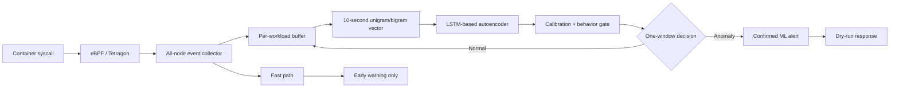

# Sentinel V8: Phát hiện bất thường syscall thời gian chạy trên Kubernetes bằng eBPF/Tetragon và ML một cửa sổ


## Tóm tắt

Sentinel V8 là hệ thống giám sát hành vi container trên Kubernetes bằng
eBPF/Tetragon kết hợp mô hình học máy theo workload. Event syscall được gom
thành cửa sổ 10 giây, biểu diễn bằng vector tần suất unigram/bigram 210 chiều,
sau đó chấm điểm bằng autoencoder dựa trên LSTM và kiểm tra thêm bằng behavior
gate. Báo cáo này chọn cấu hình **một cửa sổ** từ ablation terminal của V8:
một window bất thường đủ điều kiện có thể tạo ML alert, không yêu cầu hai
window liên tiếp. Fast path vẫn tồn tại nhưng chỉ phát early warning, không
được tính là ML confirmation.

Mô hình được fit trên 24.152 normal window thuộc 8 workload AIMS. Tập normal
độc lập gồm 122.639 feature window trong khoảng 24 giờ; cấu hình one-window
quan sát 0 alert. Blind attack gồm 200 scenario-interval, trong đó hệ thống
phát hiện 195, tương ứng recall 0,975 và Wilson 95% CI [0,943; 0,989]. So với
full policy hai cửa sổ, one-window giữ nguyên toàn bộ detection endpoint nhưng
giảm confirmation latency đúng 10 giây: median từ 18,255 xuống 8,255 giây và
p95 từ 19,991 xuống 9,991 giây. Kết quả cho thấy cửa sổ xác nhận thứ hai không
tăng recall trên evidence V8, nhưng feature window 10 giây vẫn là giới hạn
chính khiến hệ thống chưa đạt latency 1–2 giây.


---

## 1. Bài toán và mục tiêu

Các rule bảo mật truyền thống phát hiện tốt hành vi đã biết nhưng khó bao phủ
biến thể mới và hành vi phụ thuộc workload. Sentinel V8 nghiên cứu câu hỏi:

> Có thể học baseline syscall bình thường theo workload, phát hiện attack
> runtime với false-alert thấp và đo được latency/overhead trên traffic
> production-like hay không?

Báo cáo tập trung vào ba mục tiêu:

1. Đánh giá recall trên blind attack chưa dùng để train hoặc tune.
2. Đánh giá false alert trên normal traffic độc lập theo thời gian.
3. Giảm latency bằng one-window ML decision trong khi giữ nguyên outcome.

Phạm vi chỉ gồm tám stateless AIMS workload. Payment, notification và hạ tầng
stateful như Kafka, RabbitMQ, Redis, PostgreSQL, MinIO không thuộc claim V8.

## 2. Kiến trúc hệ thống



### 2.1 Hai loại cảnh báo

- **Fast-path warning:** xử lý một số sequence syscall nhạy cảm ngay khi event
  đến. Đây là rule/semantic warning, không phải kết quả ML.
- **Confirmed ML alert:** được tạo khi một feature window đủ điều kiện có ML
  score vượt threshold và qua behavior/quality gate.

Hai loại latency được báo riêng. Fast path không được dùng để làm đẹp latency
của ML path.

### 2.2 One-window decision

Cấu hình được trình bày trong báo cáo bỏ điều kiện “hai window bất thường liên
tiếp”. Một window có thể tạo detection khi đồng thời thỏa mãn:

- đủ tối thiểu 10 event;
- không nằm trong startup grace hoặc sensor-quality gap;
- anomaly score vượt threshold đã calibration;
- behavior evidence và volume guard hợp lệ.

Không có threshold nào được thay đổi sau khi xem blind result.

### 2.3 Testbed Kubernetes

Thực nghiệm được triển khai trên Kubernetes v1.34.10 gồm ba control plane và
ba worker. Cấu hình phần cứng đồng nhất theo node:

| Thành phần | Mỗi node | Toàn cụm 6 node |
|---|---:|---:|
| vCPU | 32 | 192 |
| RAM | 64 GB | 384 GB |
| Disk | 400 GB | 2.400 GB dung lượng thô |

Mỗi node chạy một Tetragon DaemonSet pod để quan sát workload cục bộ trên node
đó. Các con số toàn cụm là tổng tài nguyên thô; không đồng nghĩa toàn bộ disk
được hợp nhất thành một storage pool hoặc đều khả dụng cho workload.

Topology được xác minh gần nhất ngày 14-08-2026:

| Hostname Kubernetes | Internal IP | Role | Kubernetes | Trạng thái |
|---|---|---|---|---|
| `k8s-master.local` | `10.1.16.234` | control-plane | v1.34.10 | Ready |
| `k8s-master2.local` | `10.1.16.235` | control-plane | v1.34.10 | Ready |
| `k8s-master3.local` | `10.1.16.236` | control-plane | v1.34.10 | Ready |
| `k8s-worker1.local` | `10.1.16.237` | worker | v1.34.10 | Ready |
| `k8s-worker4.local` | `10.1.16.238` | worker | v1.34.10 | Ready |
| `k8s-worker3.local` | `10.1.16.239` | worker | v1.34.10 | Ready |

Tên `worker3/worker4` phản ánh lịch sử join node và không theo thứ tự IP, nhưng
role và địa chỉ trong bảng là trạng thái thực tế. Tại snapshot hậu benchmark,
cụm có 6/6 node Ready, namespace `production` có 40/40 pod Running,
`sentinel-detector.service` active/running và namespaced Tetragon policy
`sentinel-aims-syscalls` hiện diện.

## 3. Biểu diễn dữ liệu và mô hình

### 3.1 Feature vector

Trong mỗi window, hệ thống giữ thứ tự event nhận được và tạo:

- unigram: tần suất từng syscall;
- bigram: tần suất cặp syscall liên tiếp, ví dụ `execveat|connect`;
- vector chuẩn hóa theo tổng số event, kích thước 210.

Bigram giữ được thứ tự cục bộ `A → B`, nhưng không giữ đầy đủ chuỗi dài, khoảng
thời gian giữa event hoặc quan hệ theo từng PID.

### 3.2 Mô hình hiện tại

Mỗi workload có scaler và autoencoder riêng. Input train có dạng
`(n_windows, 210)`, sau đó được đổi thành tensor:

```text
(batch, sequence_length=1, input_dim=210)
```

Do `sequence_length=1`, recurrent state của LSTM không học chuỗi nhiều window.
Tên gọi chính xác hơn là **LSTM-based nonlinear autoencoder trên vector
unigram/bigram**, không phải temporal LSTM đầy đủ. Đây là giới hạn quan trọng:
với representation tabular và lượng dữ liệu nhỏ, Random Forest, ExtraTrees,
MLP hoặc autoencoder thường là baseline phù hợp cần so sánh trong nghiên cứu
tiếp theo.

### 3.3 Anomaly score

Model reconstruct vector normal. Reconstruction error được chuẩn hóa theo
robust normal tail để tạo score `[0,1]`. Threshold và scaler chỉ được fit trên
fit data. Independent normal và blind attack không tham gia gradient,
calibration hoặc threshold selection.

## 4. Thiết kế thực nghiệm

### 4.1 Workload

Tám workload thuộc namespace `production`:

1. aims-frontend;
2. api-gateway;
3. auth-service;
4. cart-service;
5. catalog-service;
6. inventory-service;
7. order-service;
8. security-telemetry-service.

### 4.2 Normal data

Traffic được chia thành bốn regime: steady, burst, recovery và tool-mix.

- Run-01: fit/development only, tổng 24.152 window dùng train tám model.
- Run-02 đến run-06: independent normal evaluation, không train/tune.
- Independent evidence: 20 phase, khoảng 24,005 giờ và 122.639 feature
  window; 122.603 window đủ điều kiện quyết định.

Temporal/run split được đóng trước đánh giá để tránh leakage.

### 4.3 Blind attack

Năm safe behavioral scenario:

| Scenario | Hành vi mô phỏng an toàn |
|---|---|
| `local_socket_beacon` | Socket/connect chỉ tới loopback |
| `namespace_probe` | Attempt `unshare`, `mount`, `ptrace` với input bảo đảm thất bại |
| `process_fanout` | Fork 1–3 child ngắn hạn rồi wait |
| `identity_transition_probe` | Set UID/GID về chính nó và gọi capability transition không hợp lệ |
| `credential_read_burst` | Đọc file public như `/etc/passwd`, không giữ hoặc exfiltrate dữ liệu |

Mỗi scenario được chạy trên tám workload với năm seed/rate trial:

```text
8 workload × 5 trial/workload × 5 scenario = 200 scenario-interval
```

Rate gồm 6, 12 và 24 scenario-loop/giây. Binary, seed, rate, model, vocabulary
và protocol đã được khóa bằng SHA-256 trước evaluation. Detection miss hợp lệ
được giữ nguyên; chỉ infrastructure failure có evidence mới được reject.

## 5. Chỉ số đánh giá

- **Recall:** detected attack intervals / total attack intervals.
- **False alert:** số alert quan sát trên independent normal exposure.
- **Confirmation latency:** từ attack acknowledgement tới confirmed ML alert.
- **Inference time:** thời gian forward pass và score một feature vector.
- **Overhead:** throughput, p99 HTTP latency, CPU và RAM.

Không công bố deployment precision bằng cách ghép 195 attack interval với
normal window vì hai phía có sampling unit và exposure khác nhau. Claim chính
dùng recall và false-alert/workload-time riêng. Precision deployment cần mixed
timeline với alert episode matching.

## 6. Kết quả

### 6.1 Independent normal

| Metric | One-window V8 |
|---|---:|
| Independent runs | 5 |
| Traffic phases | 20 |
| Exposure | khoảng 24,005 giờ |
| Feature windows | 122.639 |
| Eligible decision windows | 122.603 |
| Observed alerts | 0 |

Kết quả là **zero observed alert** trong phạm vi đo, không phải bảo đảm xác suất
false positive bằng 0.

### 6.2 Blind attack

| Metric | Kết quả |
|---|---:|
| Total intervals | 200 |
| Detected | 195 |
| Missed | 5 |
| Recall | 0,975 |

Bốn scenario đạt 40/40. Năm miss đều là `namespace_probe` trên
`security-telemetry-service`; post-hoc observability audit cho thấy các attempt
này bị seccomp chặn trước điểm kprobe đang quan sát. Primary result vẫn giữ
195/200, không relabel thành 195/195.

### 6.3 One-window latency

| Metric | Two-window full policy | One-window policy |
|---|---:|---:|
| Detected | 195/200 | 195/200 |
| Median | 18,255 s | 8,255 s |
| p95 | 19,991 s | 9,991 s |
| p99 | 19,995 s | 9,995 s |
| Maximum | 20,013 s | 10,013 s |

Trên 195 trial cùng được phát hiện, paired latency delta là chính xác
`-10,000 giây`; 0/200 trial đổi detection endpoint. Như vậy window xác nhận
thứ hai chỉ cộng thêm một window latency trên evidence V8 và không tăng recall.

Inference model ở mức khoảng 10–20 ms mỗi vector, nhỏ hơn nhiều so với thời
gian chờ đóng feature window. Muốn đạt confirmed latency 1–2 giây cần thay đổi
feature cadence/window, không chỉ tối ưu forward pass.

### 6.4 Fast path

Fast path tạo 75 warning trên 200 attack interval:

| Metric | Fast-path latency |
|---|---:|
| Minimum | 0,015 s |
| Median | 0,398 s |
| p95 | 0,690 s |
| p99 | 0,725 s |
| Maximum | 0,734 s |

Kết quả này chứng minh đường truyền kernel → Tetragon → collector có khả năng
sub-second, nhưng coverage 75/200 không đủ thay thế confirmed ML path.

### 6.5 Baseline chính

| Phương pháp | Normal alerts | Attack detection | Nhận xét |
|---|---:|---:|---|
| Falco rule-only | 0 event alert | 40/200 | Precision-oriented nhưng coverage thấp |
| Tetragon sensitive rule | 0 | 75/200 | Phù hợp early warning, không đủ recall |
| Isolation Forest | 69.855 | 200/200 | Recall cao nhưng false alert không sử dụng được |
| LSTM-only | 513 | 195/200 | Behavior gate cần thiết để suppress false alert |
| V8 one-window full policy | 0 | 195/200 | Trade-off tốt nhất trên evidence hiện có |

### 6.6 Overhead hệ thống

Campaign overhead gồm sáu phase-order block, 18 phase và 180 lượt `wrk`; không
có failed request. So với no tracing, full pipeline có:

- throughput loss median 2,576%, block-bootstrap 95% CI [-7,493%; 4,345%];
- p99 HTTP latency increase median 3,116%, 95% CI [-1,789%; 8,755%];
- detector median khoảng 24,952% một CPU core và 431,495 MiB RAM.

Các confidence interval đều cắt qua 0. Có thể báo point estimate nhỏ trên một
cluster campaign, nhưng không được kết luận overhead bằng 0. Campaign đo full
V8 pipeline; one-window chưa có một overhead campaign độc lập, dù khác biệt
confirmation state dự kiến nhỏ so với collector/model cost.


## 8. Hướng tiếp theo

Giữ V8 one-window làm baseline và xây candidate mới, không tune lại trên blind
set V8:

1. Thu exact eBPF counters theo cgroup mỗi giây cho syscall tần suất cao.
2. Bổ sung seccomp-denial telemetry để quan sát blocked attempts.
3. Tạo transition/rolling feature theo PID và workload.
4. So sánh Random Forest, ExtraTrees, Logistic Regression và LSTM.
5. Dùng window một giây hoặc rolling lookback, inference mỗi 250–500 ms.
6. Đánh giá bằng temporal split và blind attack set mới.
7. Chỉ chấp nhận candidate nếu recall không thấp hơn V8, false-alert không tăng
   và p99 kernel-to-alert không quá 2 giây.

Transfer learning chỉ có ý nghĩa nếu tái sử dụng representation từ nguồn dữ
liệu lớn hơn; federated learning chỉ phù hợp khi có nhiều cluster không thể
chia sẻ raw telemetry. Hai hướng này không tự giải quyết latency.

## 9. Kết luận

Sentinel V8 one-window phát hiện 195/200 blind scenario-interval và quan sát 0
alert trên khoảng 24 giờ normal evaluation. So với policy hai cửa sổ, cấu hình
này giữ nguyên outcome nhưng giảm confirmation latency đúng 10 giây, còn median
8,255 giây. Fast path cung cấp early warning sub-second cho 75/200 interval,
nhưng không thay thế ML confirmation.

Kết quả chứng minh second-window confirmation không cần thiết trên evidence V8;
đồng thời chỉ ra rằng feature window 10 giây, observability gap và representation
`seq_len=1` mới là ba hạn chế cần giải quyết. Hướng tiếp theo phù hợp là ML
tabular một giây với exact counters, transition features và blind evaluation
mới, thay vì tiếp tục tăng độ phức tạp của LSTM trên dữ liệu nhỏ.

---
