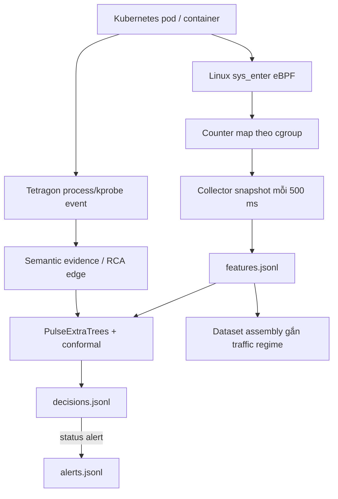

# Log telemetry của workload — Sentinel Pulse

Tài liệu này mô tả log Sentinel Pulse theo dõi cho từng
workload/container trong namespace `production`. Đây không chỉ là application
log: hệ thống có eBPF counter, Tetragon event, ML decision và artifact thí
nghiệm riêng.

Mốc tham chiếu là `pulse500-data-20260928T142929Z` (R4): archive đã
`COMPLETE`, validation có **391.454 feature row**, đủ **21 workload/container
key**, telemetry availability `1.0`, không missing snapshot và không cadence
violation. Đó là bằng chứng capture/dataset hợp lệ, **không phải** claim
precision, recall hay model pass.



## 1. Workload được theo dõi

`workload_key` có dạng `namespace/controller:container`. Đây là khóa
baseline/model; `pod_name`, `pod_uid`, `cgroup_id` xác định replica cụ thể.

| Nhóm | `workload_key` |
|---|---|
| Frontend / mesh | `production/aims-frontend:web`, `production/aims-waypoint:istio-proxy` |
| AIMS microservice | `production/api-gateway:app`, `production/auth-service:app`, `production/cart-service:app`, `production/catalog-service:app`, `production/inventory-service:app`, `production/notification-service:app`, `production/order-service:app`, `production/payment-service:app`, `production/search-recommendation-service:app`, `production/security-telemetry-service:app` |
| Kafka | `production/aims-kafka-dual-role:kafka`, `production/aims-kafka-entity-operator:topic-operator`, `production/aims-kafka-entity-operator:user-operator` |
| Data service | `production/aims-postgres-cnpg:postgres`, `production/aims-rabbitmq-server:rabbitmq`, `production/aims-redis:aims-redis`, `production/aims-redis-sentinel-sentinel:aims-redis-sentinel-sentinel` |
| Object storage | `production/aims-minio-pool-0:minio`, `production/aims-minio-pool-0:sidecar` |

Load generator chỉ tạo traffic; không nằm trong baseline/model R4 để tránh học
nhầm hành vi của công cụ kiểm thử thành hành vi business của AIMS.

## 2. Vị trí log

| Loại | Khi đang chạy | Archive R4 |
|---|---|---|
| eBPF feature stream trên worker | `/var/lib/sentinel-pulse-500ms/runs/${RUN_ID}-${NODE}/features.jsonl` | `.../pulse500-data-20260928T142929Z/nodes/${NODE}/features.jsonl` |
| Dataset đã lọc theo contract | Chưa có trước finalize | `.../pulse500-data-20260928T142929Z/dataset/features.jsonl` |
| Protocol/quality/integrity | Không áp dụng | `PROTOCOL.json`, `capture-contract.json`, `dataset/VALIDATION.json`, `SHA256SUMS` |
| Decision và alert khi detector candidate bật | Đường dẫn `--decisions`, `--alerts` của service | `decisions.jsonl`, `alerts.jsonl` trong evidence run tương ứng |
| Tetragon raw event | `kubectl -n kube-system logs pod/tetragon-... -c export-stdout` | Archive riêng khi protocol/evidence yêu cầu |

R4 dùng `RUN_ID=pulse500-data-20260928T142929Z`; các node là
`k8s-worker1.local`, `k8s-worker3.local`, `k8s-worker4.local`.

Ví dụ đọc feature cuối của API gateway:

```bash
RUN=pulse500-data-20260928T142929Z
ROOT=/home/dat/sentinel-pulse-evidence/dataset-r10/$RUN
jq -c 'select(.schema == "sentinel-pulse-feature-v1" and
              .workload_key == "production/api-gateway:app") |
       {workload_key,pod_name,node_name,container_name,window_start,window_end,
        exact_total,exact_counts,collector_telemetry_availability}' \
  "$ROOT"/nodes/k8s-worker3.local/features.jsonl | tail -n 1
```

## 3. eBPF feature log: `features.jsonl`

Mỗi dòng là JSON. eBPF giữ counter tích luỹ theo cgroup; collector lấy delta
giữa hai snapshot liên tiếp. Vì vậy `exact_counts` là số syscall trong một
window gần 500 ms, không phải tổng từ lúc pod start.

### Header schema

Header thật của R4 có schema hash
`879e33f8c33774c50d848524b78c0fa2398b9855971982e5a41a12f9259f5ae2`, 249
chiều và encoding nén:

```json
{
  "schema": "sentinel-pulse-feature-schema-v1",
  "feature_schema_sha256": "879e33f8...f5ae2",
  "vector_dim": 249,
  "encoding": "float32-le+zlib-1+base64",
  "columns": ["log_count:read", "log_count:write", "log_count:open", "..."]
}
```

Runtime chỉ infer khi `feature_schema_sha256` khớp manifest model; sai thứ tự
cột hoặc sai schema sẽ bị từ chối.

### Feature record rút gọn

Ví dụ đã rút ngắn ID/vector, lấy từ record thật R4 của `api-gateway` trên
`k8s-worker3.local`:

```json
{
  "schema": "sentinel-pulse-feature-v1",
  "cgroup_id": 4997645,
  "workload_key": "production/api-gateway:app",
  "pod_name": "api-gateway-5b79675d85-...",
  "pod_uid": "cf079b68-...",
  "node_name": "k8s-worker3.local",
  "container_name": "app",
  "workload_revision": "5b79675d85",
  "window_start": 1790605977.519368,
  "window_end": 1790605978.024023,
  "feature_schema_sha256": "879e33f8...f5ae2",
  "vector_dim": 249,
  "vector_f32_zlib_b64": "eJ...",
  "exact_counts": {
    "read": 0, "write": 0, "open": 0, "close": 0,
    "socket": 0, "connect": 0, "execve": 0, "ptrace": 0,
    "setuid": 0, "capset": 0, "mount": 0, "openat": 0,
    "unshare": 0, "seccomp": 0, "clone3": 0, "other": 20
  },
  "exact_total": 20,
  "emitted_at": 1790605978.0442543,
  "snapshot_read_seconds": 0.003076553,
  "collector_snapshot_interval_seconds": 0.504655123,
  "collector_stats": {
    "task_state_update_fail": 0,
    "snapshot_consistency_retry_exhausted": 0,
    "target_snapshot_gap": 0
  },
  "collector_telemetry_availability": {
    "schema": "sentinel-pulse-telemetry-availability-v1",
    "observed_snapshots": 357,
    "estimated_missing_snapshots": 0,
    "availability": 1.0,
    "maximum_snapshot_interval_seconds": 0.519590139,
    "minimum_snapshot_interval_seconds": 0.503457546,
    "short_interval_events": 0,
    "cadence_violation_events": 0
  }
}
```

Kafka cùng thời điểm có `exact_total=621`, `read=30`, `write=34`, `other=557`.
Đó là khác biệt workload bình thường; hệ thống dùng baseline/model theo
`workload_key`, không so raw total của Kafka với API gateway.

| Field | Ý nghĩa | Vai trò |
|---|---|---|
| `cgroup_id`, pod/node/container | Định danh instance phát sinh telemetry | Tách history theo instance |
| `workload_key` | `namespace/controller:container` | Chọn baseline/model |
| `workload_revision` | Revision controller | Khác manifest → `rebaseline-required` |
| `window_start`, `window_end` | Ranh giới event-time | Continuity và latency |
| `exact_counts`, `exact_total` | Delta syscall dễ đọc | Semantic corroboration/giải thích |
| `vector_f32_zlib_b64` | 249 float32 được nén | Input PulseExtraTrees |
| `collector_stats` | Lỗi capture/integrity | Quality gate, không phải ML signal |
| `collector_telemetry_availability` | Cadence/gap/missing snapshot | Dataset gate, không phải anomaly score |

## 4. Vector 249 chiều

| Thành phần | Số chiều | Nội dung |
|---|---:|---|
| `log_count:<syscall>` | 29 | `log(1 + count)` cho syscall được theo dõi |
| `ratio:<syscall>` | 29 | Tỷ trọng syscall trong window |
| Aggregate | 5 | `other`, ratio other, log total, sensitive ratio, seccomp denied |
| `syscall_bin:*` | 64 | Hash histogram của mọi syscall |
| `transition_bin:*` | 64 | Hash histogram cặp syscall kề nhau |
| `rolling_mean:*` | 29 | Trung bình rate các window trước của cùng cgroup |
| `rolling_std:*` | 29 | Độ dao động rate các window trước |

Tổng là `29 + 29 + 5 + 64 + 64 + 29 + 29 = 249`.

Counter delta giữ tỷ lệ syscall tốt hơn một stream Tetragon có thể bị
sampling/rate-limit. Dù vậy vector là telemetry aggregate theo window, không
phải audit trail để khôi phục toàn bộ thứ tự của từng syscall.

`traffic_regime` không nằm trong raw feature record. Khi tạo dataset,
`assemble_dataset.py` gắn `steady`, `toolmix`, `peak`, `burst`, `recovery` từ
`capture-contract.json` và timestamp. Regime vì vậy là nhãn protocol độc lập,
không phải feature làm lộ nhãn cho model.

## 5. Tetragon event: process và kết nối

Tetragon là kênh semantic/RCA, dùng để biết process nào gọi syscall gì, ở
pod/container nào và (với `connect`) tới địa chỉ/port nào. Ví dụ đã rút gọn từ
production:

```json
{
  "time": "2026-09-28T14:33:44.517193527Z",
  "node_name": "k8s-worker1.local",
  "process_kprobe": {
    "policy_name": "sentinel-aims-syscalls",
    "function_name": "__x64_sys_connect",
    "process": {
      "binary": "/usr/local/bin/uvicorn",
      "pid": 3813904,
      "uid": 10001,
      "pod": {"namespace": "production", "name": "payment-service-...",
              "container": {"name": "app"}}
    },
    "args": [
      {"label": "socket_fd", "int_arg": 18},
      {"sockaddr_arg": {"family": "AF_INET", "addr": "10.96.0.10", "port": 53}}
    ]
  }
}
```

`rca_connect.py` chuyển event như vậy thành `sentinel-pulse-rca-connect-edge-v1`:
source gồm pod/container/binary/PID/exec ID; destination gồm address/port và
Kubernetes target nếu resolve được. Trường `application_content.captured=false`
theo thiết kế: syscall `connect` không có HTTP body, SQL query hay Kafka message.
Muốn lấy nội dung request phải join access log/trace đã redact của Envoy/Istio
hoặc application instrumentation bằng timestamp, pod và trace/request ID.

## 6. Decision và alert log

Khi candidate detector được bật, nó follow `features.jsonl` và ghi một dòng
`sentinel-pulse-decision-v1` cho mỗi feature hợp lệ. `alerts.jsonl` chỉ chứa
tập con có `status="alert"`.

```json
{
  "schema": "sentinel-pulse-decision-v1",
  "run_id": "candidate-run-id",
  "status": "suppressed",
  "workload_key": "production/payment-service:app",
  "node_name": "k8s-worker1.local",
  "window_start": 1790606000.0,
  "window_end": 1790606000.5,
  "alerted_at": 1790606000.55,
  "post_window_processing_seconds": 0.05,
  "score": 0.62,
  "conformal_p": 0.0002,
  "raw_model_anomalous": true,
  "score_corroborated": true,
  "semantic_corroborated": false,
  "semantic_signal_groups": {
    "namespace_probe": {"observed": 0, "normal_max": 0, "triggered": false}
  },
  "inference_ms": 8.4
}
```

Các số trong ví dụ decision chỉ minh họa **format**, không phải kết quả R4.

| `status` | Nghĩa |
|---|---|
| `warming` | Chưa đủ history cho cgroup/pod/container |
| `normal` | Model không coi window là bất thường |
| `suppressed` | Raw model anomaly nhưng thiếu semantic/score/temporal confirmation |
| `alert` | Đủ model anomaly và confirmation policy; được ghi cả decision và alert file |
| `collect-only` | Chưa có model cho workload; chỉ thu telemetry |
| `rebaseline-required` | Revision workload lạ; không infer lén trên rollout mới |

Alert đầy đủ còn có `security_activity_mass`, `security_activity_fields`,
`score_excess_over_calibration_max`, `temporal_confirmation_count`,
`bounded_event_time_corroborated` và `inference_ms`, giúp giải thích vì sao
alert được phát thay vì chỉ có một score.

## 7. Chọn log theo câu hỏi

| Câu hỏi | Nguồn cần xem |
|---|---|
| Pod nào tăng syscall/load? | `features.jsonl`: `exact_total`, `exact_counts`, timestamp |
| Có mất telemetry khi high load? | `collector_telemetry_availability`, `collector_stats`, `dataset/VALIDATION.json` |
| Model quyết định gì và infer mất bao lâu? | `decisions.jsonl`: score, p-value, status, `inference_ms` |
| Vì sao score cao nhưng không alert? | `status=suppressed` và semantic/temporal fields |
| Process nào connect tới đâu? | Tetragon raw event → `rca_connect.py` edge |
| Có tin provenance/quality artifact không? | `PROTOCOL.json`, revision evidence, `SHA256SUMS`, `VALIDATION.json` |

## 8. Lưu ý khi đọc

- Không dùng `exact_total` của Kafka để so trực tiếp với API gateway.
- `suppressed` không tự động là false positive; false alert chỉ là
  `status=alert` trong normal evidence đạt integrity/coverage contract.
- Tetragon event không phải vector ML; vector đến từ eBPF counter delta.
- R4 chưa được dùng để công bố chất lượng model trước khi có training contract,
  candidate, normal soak độc lập và blind evaluation.
- Không xuất raw stream có pod UID, cgroup ID, internal IP hoặc trace data ra
  ngoài phạm vi vận hành nếu chưa redact phù hợp.
