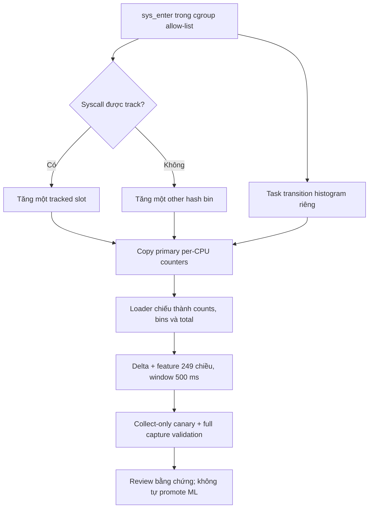

# Sentinel Pulse — canary projected counters ngày 02/10/2026

**Terminal ML kiểm tra lại 03/10, 11:50:47 ICT:** canary projected tiếp theo
đã hoàn tất, aggregate valid, 114.984 decision, 21/21 key, 0 alert/restart.
Candidate đã dừng; chưa có operational PASS hoặc recall/kernel-to-alert claim.
[Receipt](../../validation-evidence/projected-ml-c1-20261003/TERMINAL_RECEIPT_20261003.json).
Đoạn ACTIVE 10:15 phía dưới là lịch sử.

**Bước kế tiếp đã mở ngày 03/10, 10:15 ICT:** sau collector safety review 3/3,
[ML canary projected](PROJECTED_ML_CANARY_20261003.md) đã active cả ba worker.
Các câu "ML inactive" dưới đây là checkpoint 10:02 trước lượt ML mới, không
phải trạng thái hiện tại. Collector safety evidence vẫn giữ nguyên.

## 1. Trạng thái và lý do thay đổi

Checkpoint **10:02 ICT ngày 03/10/2026**, lấy trực tiếp qua SSH.
Canary worker1 ngày 02/10 đã terminal **đạt collector safety review**:
38.505 feature row, 1.776 snapshot, 16/16 key được kỳ vọng trên node;
measured span 899,007 s trong duration đăng ký 900 s (slack khởi động 2 s).
Capture và 11 artifact/source hash đã đăng ký khớp. Đây là collect-only,
**không phải lượt đánh giá ML hay bằng chứng production stable**.

Hai canary worker3/worker4 start **09:44:12 ICT ngày 03/10**, đã terminal
**09:59:16–09:59:17 ICT**, full capture validation valid, checksum khớp.
Timer safety review đã hoàn tất exit 0 trên hai node: source/capture hash
khớp, duration đạt slack 2 s, coverage 15/15 và 19/19 key, không missing hoặc
unexpected key. **3/3 collector safety review đạt**, union 21 key; không phải
ML hoặc operational normal PASS.
Control collector vẫn chạy, ML candidate vẫn inactive.

Operational run `sentinel-pulse-operational-r10-c3-20261002T040300Z` bắt đầu
11:08 ICT nhưng đã **infrastructure-reject lúc 11:37:15 ICT** vì
`collector_integrity_violation` trên `10.1.16.237`:

- `snapshot_consistency_retry_exhausted=1`, `target_snapshot_gap=1`.
- Cohort thiếu tại snapshot lỗi có identity
  `production/aims-rabbitmq-server:rabbitmq|aims-rabbitmq-server-2|3112263`.
- Loader legacy đọc các trường được kernel cập nhật riêng biệt; 32 retry không
  thu được bộ số đếm thỏa kiểm tra nhất quán. Đây là lỗi telemetry, không phải
  kết quả phát hiện attack hoặc normal-pass.
- Archive hoàn tất 11:38:33 ICT; checksum được kiểm tra lại thành công lúc
  17:18 ICT. Ba control collector được phục hồi, Pulse ML candidate đã dừng.

Snapshot monitor cuối trên ba worker là **212.949 decision, 0 alert** cộng từ
ba checkpoint bất đồng bộ. Không phải số exposure terminal hợp lệ; không dùng
lượt bị loại này để train/tune hoặc công bố false-positive rate.
[Receipt terminal](../../validation-evidence/operational-soak-v1-20261002/TERMINAL_INTEGRITY_RECEIPT_20261002.json)
giữ disposition và bằng chứng gốc. Lịch finalize 12:03 ICT ngày 03/10 của C3
đã mất hiệu lực; canary mới không resume C3.

## 2. Thiết kế projected counters

Mỗi syscall entry chỉ tăng **một primary syscall counter**:

- Nếu thuộc 29 syscall được track: tăng `tracked[slot]` tương ứng.
- Nếu không: tăng một trong 64 `other_syscall_bins` bằng hàm hash ID cũ.
- Transition histogram 64 bin tiếp tục được thu riêng theo task.

Sau khi copy primary counters của từng CPU, loader tính:

```text
syscall_bin[b] = other_syscall_bin[b]
              + sum(tracked[i] với hash(syscall_id[i]) == b)
total = sum(tracked) + sum(other_syscall_bins)
```

Không còn ba bản đếm `total`, `tracked`, `syscall_bins` độc lập cùng tăng cho
một entry. `total` và histogram được suy ra từ cùng dữ liệu đã copy, thay vì
dùng retry để hy vọng các trường dư thừa khớp nhau khi map vẫn đang được ghi.
Phép chiếu giữ nguyên mapping syscall/hash và input schema 249 chiều.



**Giới hạn:** phép chiếu không tạo snapshot nguyên tử toàn bộ CPU, cgroup hay
syscall/transition fields. Map vẫn được cập nhật trong lúc đọc; khoảng thời
gian copy vẫn phải được đo, cadence/gap/loss vẫn phải kiểm tra. Tính nhất quán
đại số không tự chứng minh cut thời gian chính xác tại một timestamp.
Per-CPU map có vùng giá trị riêng cho CPU; xem
[Linux kernel — BPF hash maps](https://docs.kernel.org/bpf/map_hash.html).
Giới hạn snapshot đồng thời ở đây được suy ra từ cách loader đọc trong code.

## 3. Code, tương thích và kiểm chứng

| Thành phần | Thay đổi |
|---|---|
| `sentinel_pulse/ebpf/pulse_counter_ids.h` | Bảng syscall ID/slot dùng chung |
| `sentinel_pulse/ebpf/pulse_counter_projection.h` | Primary layout, phép chiếu và kiểm tra overflow uint64 |
| `sentinel_pulse/ebpf/pulse_counter.bpf.c` | Nhánh opt-in `PULSE_PROJECTED_COUNTERS`; legacy giữ nguyên |
| `sentinel_pulse/ebpf/pulse_counter_loader.c` | Chiếu snapshot; kiểm tra ABI trước attach; lỗi chiếu fail-closed |
| `sentinel_pulse/ebpf/Makefile` | `make projected` riêng; target mặc định vẫn legacy |
| `validate_capture.py`, `inspect_feature_tail.py` | `snapshot_projection_fail` là hard integrity error |
| `run_projected_counter_canary.sh` | Thu riêng, từ chối overlap candidate/experiment, không cài vào `/opt` |

Map ABI legacy **1.264 byte**, projected **1.256 byte**. Loader phải khớp
object/layout; không trộn executable và BPF object giữa hai nhánh.

Regression trên VM main đạt **355 passed, 20 subtests passed trong 34,90 s**.
Test C thực thi kiểm tra mapping **1.024 syscall ID × 4 CPU**, zero input và
overflow; tests khác kiểm tra guard loss và ABI. Cả hai nhánh build bằng BTF
worker1 thành công; projected object đã qua verifier và attach thật lúc
17:19:02 ICT. Đây không thay thế canary runtime đầy đủ.

Model R10-C1, calibration, policy và schema hash không đổi. Không train model
mới từ archive C3. Tương thích đại số được test không đồng nghĩa đã chứng minh
ML performance sau thay collector.

Bổ sung `evaluate_projected_counter_canary.py` ngày 03/10 để quét lại toàn bộ
raw capture, bind source/capture checksum, terminal codes, duration thực và
node coverage kỳ vọng rõ ràng. Regression mới cả host và VM đạt **370 passed,
20 subtests passed** (host 27,49 s; VM 34,31 s). Có test canary thiếu duration
vẫn đủ 100 row, missing/unexpected key, source/capture tamper và terminal mâu
thuẫn; tất cả phải bị reject. Bổ sung kiểm tra expectation phải là JSON list,
không chấp nhận string/object. Source reviewer timer đã freeze ở bản trước
hardening JSON list (SHA có receipt); expectation thực tế đều là list hợp lệ.
Không sửa script/source readonly của run đang chạy.

## 4. Canary ba worker đã terminal

| Thuộc tính | Giá trị |
|---|---|
| Node | `10.1.16.237`, `k8s-worker1.local` |
| Run | `pulse-projected-counter-c1-20261002T101900Z` |
| Unit | `sentinel-pulse-projection-canary-20261002.service` |
| START receipt | **17:19:02 ICT**, duration đăng ký **900 giây** |
| Source riêng readonly | `/home/dat/pulse-counter-projection-canary-20261002` |
| Evidence node | `/var/lib/sentinel-pulse-projection-canary/pulse-projected-counter-c1-20261002T101900Z/` |
| Mode | Collect-only, không ML, không automatic promotion |
| Control collector/resolver | Active, không thay binaries chuẩn trong `/opt` |
| ML candidate | Inactive sau khi C3 bị loại |
| Terminal thực tế | **17:34:06 ICT ngày 02/10**, capture/validation exit 0; xác minh lại ngày 03/10 |

[START và checkpoint SSH](../../validation-evidence/projected-counter-c1-20261002/START_AND_CHECKPOINT.json)
ghi tại **17:25:08 ICT**: 722 observed snapshots, telemetry availability 1,0,
maximum snapshot interval **0,568274 s**, tất cả hard loss/integrity counters
bằng 0, cadence violation 0; tail valid. Đây là checkpoint giữa run, **không
phải PASS**. Số cgroup loader attach không được gọi là số workload/model.

Kết quả terminal và review lại từ raw:

- [Terminal receipt](../../validation-evidence/projected-counter-c1-20261002/TERMINAL_RECEIPT_20261003.json):
  full validation valid; hard counters 0; p99 interval **0,512997 s**, p99
  ingest lag **0,039203 s**, p99 window-start-to-emit **0,546570 s**.
- [Safety review](../../validation-evidence/projected-counter-c1-20261002/SAFETY_REVIEW_20261003.json):
  duration và 16/16 expected node keys đạt, không missing/unexpected key.
  Expectation lấy từ start metadata giao với 21 frozen model keys, không lấy
  danh sách observed rows để tự định nghĩa coverage.
- [Post-terminal audit](../../validation-evidence/projected-counter-c1-20261002/POST_TERMINAL_AUDIT_20261003.json):
  source hashes không đổi và measured span; toàn bộ pod-slice parent được liệt
  kê trong metadata không đồng nghĩa phải có model/feature row.

Fleet C2 run `pulse-projected-counter-c2-20261003T024600Z` dùng cùng code trên
`.239` và `.238`, unit `sentinel-pulse-projection-canary-20261003.service`.
Source readonly riêng `/home/dat/pulse-counter-projection-canary-20261003`;
evidence `/var/lib/sentinel-pulse-projection-canary/<run_id>/` trên từng node.
Run ID mang thời điểm đăng ký, start thực tế là timestamp START.json 09:44:12.
[Receipts C2 lịch sử](../../validation-evidence/projected-counter-c2-20261003/START_CHECKPOINT_10.1.16.239.json)
và [worker4](../../validation-evidence/projected-counter-c2-20261003/START_CHECKPOINT_10.1.16.238.json)
giữ checkpoint giữa run; không sửa chúng thành terminal PASS. Kết quả mới:

| Worker | Full capture rows | Snapshots | Node key observed | P99 window-start → feature emit |
|---|---:|---:|---:|---:|
| .237, C1 ngày 02/10 | 38.505 | 1.776 | 16 | 0,546570 s |
| .239, C2 ngày 03/10 | 38.832 | 1.776 | 15 | 0,544774 s |
| .238, C2 ngày 03/10 | 40.075 | 1.775 | 19 | 0,542088 s |

Ba full capture có **117.412 row**, observed union 21 key, hard counters và
cadence violation đều 0. Các lượt không đồng thời trên cả ba worker; không
gộp chúng thành một normal soak hoặc tự suy ra fleet percentile.
Worker3/4 terminal receipts và safety reviews nằm trong thư mục C2. Đây chưa
phải metric inference/ML alert.

Khi xong phải đọc `TERMINAL.json`, `VALIDATION.json`, exit status của unit,
coverage và duration thực; kiểm tra checksum source/artifact/raw capture.
Không lấy riêng một dòng tail tốt để kết luận cả run tốt.

Đã đăng ký expectation trước terminal: worker3 **15 key**, worker4 **19 key**;
giao với node metadata và frozen manifest, union kỳ vọng cả ba worker **21 key**.
Đây là expected coverage, chưa phải observed fleet PASS. Các JSON expectation
được lưu cùng receipts C2 và dùng cho review tự động.

Timer `sentinel-pulse-projection-review-20261003.timer` trên hai node sẽ chạy
full evaluator khoảng **10:00:57–10:00:58 ICT ngày 03/10**, sau deadline canary.
Output riêng là `SAFETY_REVIEW.json` trong run directory; output chỉ tạo mới,
không ghi đè. Source reviewer riêng readonly, SHA được lưu trong receipts
`REVIEW_TIMER_*.json`; không đổi source đang thu, không tự promote/start ML.
Review được đọc qua SSH lúc 10:01:28 ICT, hai unit exit 0 và inactive.
Không còn review/canary chờ chạy ngầm tại checkpoint 10:02.

## 5. Latency đã đo và những việc tiếp theo

Sample cuối 3.000 decision/node của C3 cho inference p99 khoảng **29,8–33,6 ms**.
`window_start → post-model timestamp` p99 trên worker1/3/4 lần lượt
**1,031 / 1,025 / 1,955 s**, worker4 max **2,166 s**. Receipt ở
[bounded live timing](../../validation-evidence/operational-soak-v1-20261002/BOUNDED_LIVE_TIMING_20261002.json).
Timestamp legacy nằm sau inference, trước policy/output: **không phải latency
kernel-to-alert đầy đủ**. Run đã bị loại; các số này chỉ phục vụ diagnostics.

Thứ tự triển khai tiếp:

1. Worker1 collector safety review đã đạt; giữ raw/checksum và disposition.
2. Hai canary worker3/4 cũng đã review đạt; observed union 21 key. Giữ nguyên
   receipts; đây chưa phải rollout collector production.
3. Chạy lại ML canary 21 key với bundle frozen và một run ID mới.
4. Đăng ký operational soak mới; không sửa/restart archive C3.
5. Đánh giá blind attack độc lập, paired kernel/event-to-alert timing và A/B
   overhead. Chưa công bố đạt kernel-to-alert 1–2 s, recall hay production stable.

Snapshot cụm SSH **17:21 ICT**: 6/6 node Ready v1.34.10, 67/67 pod namespace
production Ready, 29 volume Longhorn healthy. Đây là health snapshot, không
phải chứng minh hạ tầng không có biến động suốt một soak dài.

SSH **09:43 ICT ngày 03/10** xác nhận lại 6/6 Ready v1.34.10, 67/67 production
pod Ready và 29 Longhorn volume healthy. Không thay workload/traffic AIMS trong
lượt collector canary này.
