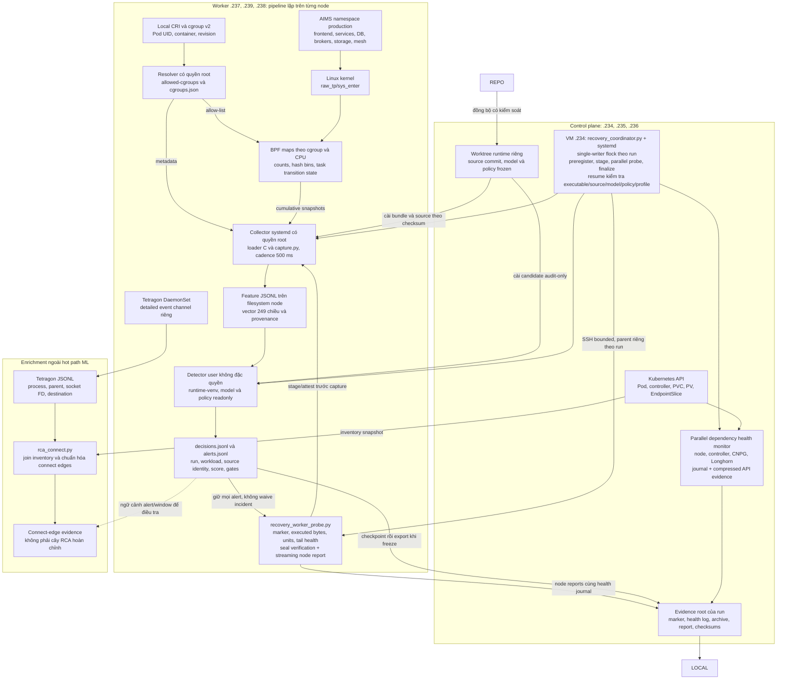
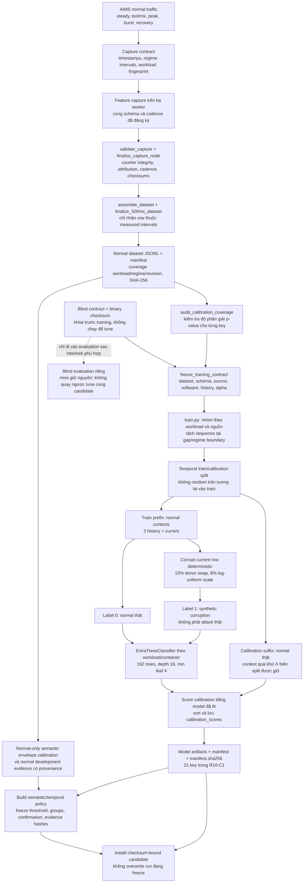
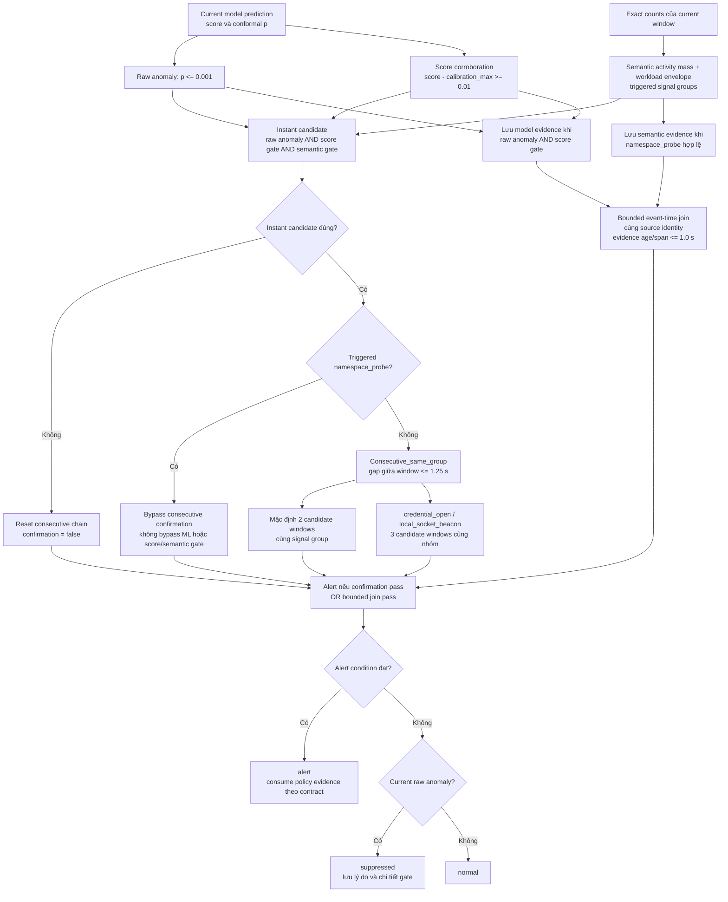
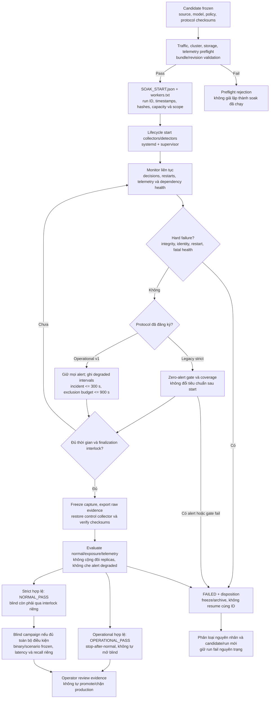
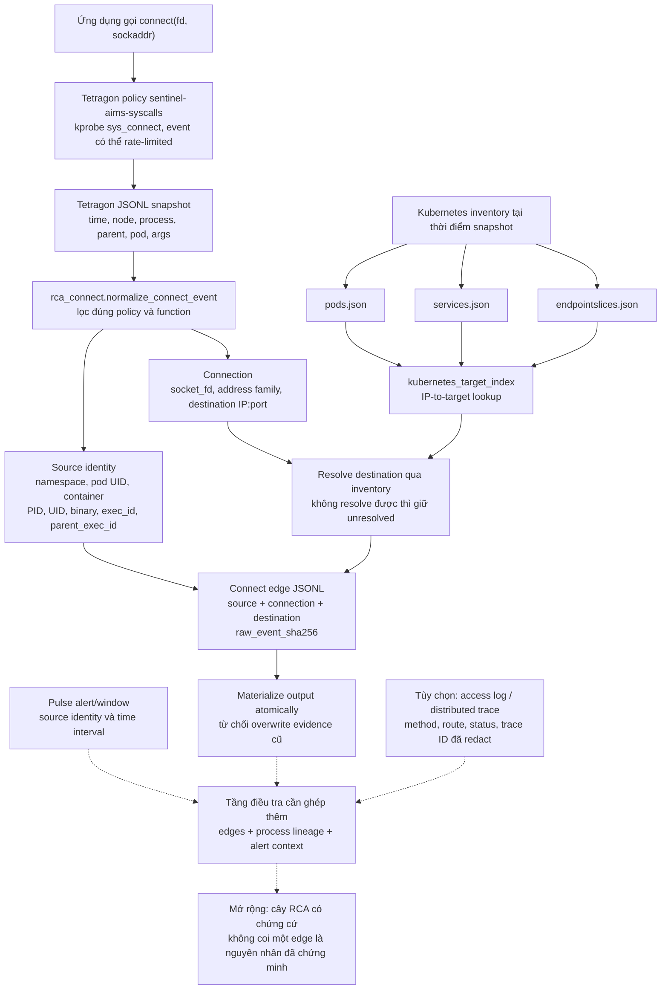

# Sentinel Pulse

## Trạng thái hiện hành

Cập nhật ngày **05/10/2026**, theo SSH và receipt có checksum. Chỉ sửa mục
hiện hành; giữ riêng evidence và verdict cũ, không nối thêm checkpoint lịch sử.

**Đang chạy ngầm:** formal recovery soak `pulse-recovery-formal-c1-20261005`,
đăng ký **09:06:19 ICT**, **89.880 s/node** (24 giờ58 phút), `diagnostic_only=false`.
Coordinator/systemd trên master234; ba worker237/238/239 đã active, tail ready,
detector restart0, health không degraded tại receipt START. Scope16/19/15 key,
union **21/21 model key**; không suy thành50 workload độc lập.
Chưa có terminal hoặc formal PASS; startup unavailable không tính normal.

Runtime source vẫn **`1c03987`**, 21 model ExtraTrees, feature249, cadence500ms,
history3, alpha0,001 và policy frozen **không đổi**. Crash/resume cùng marker
và single-writer theo run đã kiểm chứng trước đó, không restage run terminal.

Thêm **guard dung lượng riêng**, source SHA`bc5c3ea6…`, không sửa coordinator
frozen hoặc gate đánh giá: preregister trước launch, bind marker thật, probe
hai filesystem/3 worker mỗi30 s. Budget mới available>0/used<90%, unknown≤60 s;
không reserve cố định64 GiB, không xóa dữ liệu, không sửa marker cũ max85%.
Nếu vượt, chỉ dừng coordinator child đang sở hữu; guard không cấp formal PASS.

**Đã đo:** diagnostic dùng guard `pulse-recovery-capacity-diagnostic-c1-20261005`,
180 s/node, terminal **09:04:50 ICT**: integrity gate đạt, node report3/3 valid,
seal coordinator12/12 +guard4/4 khớp. **23.413 decision /19.812 scored /0 alert**;
giữ433 suppressed,2.791 telemetry-degraded,810 warming. Union valid exposure
**0,93272273 workload-hour**, không đủ24h/key; 0 alert không chứng minh FPR=0.
Regression main+guard: subset168/168 host/VM; full host892 passed/7skip/+20subtest,
VM933 passed/+20subtest; số khác do dependency tùy chọn.

**Kỳ vọng, chưa đo:** kernel-to-alert1–2 s. Formal đang chạy là normal exposure,
không blind attack/recall/precision/kernel-to-alert. Không tự mở blind/promote,
không chỉnh model/policy theo holdout. Có thể nhắc tiếp tục khoảng
**10:40 ICT ngày06/10/2026** để kiểm tra terminal và scored exposure thật; đây
là lịch dự kiến có slack finalization, không đảm bảo PASS.

[Toàn bộ luồng và ví dụ log thật](SENTINEL_PULSE_LUONG_VA_MINH_CHUNG.md),
[receipt START formal](validation-evidence/recovery-formal-c1-20261005/START_REMOTE_RECEIPT.json),
[terminal diagnostic guard](validation-evidence/recovery-capacity-c1-20261005/TERMINAL_REMOTE_RECEIPT.json),
[test receipt](validation-evidence/recovery-capacity-c1-20261005/TEST_RECEIPT.json),
[checksum raw đã SSH đọc lại](validation-evidence/recovery-resume-c1-20261005/SOURCE_RECHECK.json).
## 1. Mục tiêu

Mục tiêu chính:

- phát hiện bất thường ở runtime, không chỉ kiểm tra manifest trước deploy;
- giảm thời gian chờ telemetry từ cửa sổ 10 giây của V8 xuống 1 giây hoặc
  candidate 500 ms;
- giữ ML path đủ nhẹ để chạy liên tục trên worker;
- giảm false positive do tải, probe, backup, reconnect và rollout;
- tách dữ liệu normal dùng train khỏi blind attack dùng evaluation;
- cung cấp provenance và checksum đủ mạnh để tái lập kết quả paper;
- tạo nền tảng cho RCA mà không đưa thu thập payload vào hot path.


## 2. Testbed gần nhất đã xác minh

| IP | Hostname | Vai trò |
|---|---|---|
| 10.1.16.234 | k8s-master.local | control plane |
| 10.1.16.235 | k8s-master2.local | control plane |
| 10.1.16.236 | k8s-master3.local | control plane |
| 10.1.16.237 | k8s-worker1.local | worker |
| 10.1.16.239 | k8s-worker3.local | worker |
| 10.1.16.238 | k8s-worker4.local | worker |

Snapshot gần nhất ghi nhận mỗi node 24 vCPU, khoảng 128 GB RAM và disk 600 GB.

## 3. Luồng tổng thể

Phần này mô tả cả **data plane** trên worker, **learning plane** offline và
**control/evaluation plane**. Không chỉ có đường từ syscall đến classifier:
identity, calibration, policy, health gate và evidence đều là thành phần của
kiến trúc.

Đối chiếu code và SSH ngày **05/10/2026** xác nhận bundle candidate frozen là
R10-C1, đã dùng trong R10-C3 và hiện dùng cho formal recovery ba worker mới:
**21 model ExtraTrees**, window danh định
**500 ms**, history **3 window**, `alpha=0,001`, temporal gap tối đa **1,25 s**.
Policy live là `sentinel-pulse-r10-r4-c1-temporal-transfer`, schema v3; không
phải mọi nhóm đều quyết định chỉ trong một window. Giá trị trong bundle frozen
được ưu tiên hơn default của constructor hoặc ví dụ lịch sử trong README.

### 3.1 Kiến trúc triển khai trên cụm



Coordinator đã hoàn tất **diagnostic crash/resume300 s/node**, integrity gate đạt;
không có formal24h đang chạy hoặc formal PASS mới.
Finalizer tổng hợp union scored exposure giữa replica/node, không cộng trùng;
mọi alert vẫn nằm trong numerator. Khởi động/resume và shutdown không được
đổi source/model/policy/profile/marker hoặc hồi sinh một run đã terminal.
Chi tiết adapter, paths, thời gian và receipt ở
[trạng thái recovery lifecycle](PULSE_RECOVERY_LIFECYCLE_STATUS_20261004.md).

Collector và detector Pulse được triển khai bằng **systemd trên worker**, không phải
một Deployment nằm trong pod AIMS. Tetragon là DaemonSet độc lập. Kubernetes
API phục vụ orchestration, health và inventory; detector ML không cần quyền
RBAC để liệt kê hoặc sửa tài nguyên cụm.

Run R10-C3 đã chạy ở chế độ **audit-only**: ghi nhận decision/alert, không tự kill process,
chặn network, sửa RBAC hay rollback AIMS. Đồng bộ repo main không đồng nghĩa
thay source của worktree runtime đang freeze.

### 3.2 Hai kênh telemetry và ranh giới dữ liệu

| Kênh | Dữ liệu | Nơi sử dụng | Không được hiểu thành |
|---|---|---|---|
| Exact Pulse counters | Cumulative count của syscall trong cgroup được chọn; histogram syscall và transition | Delta, feature 249 chiều, model và semantic gate | Raw event sequence hoặc nội dung network |
| Tetragon detailed events | Event có process/pod, exec/parent, đối số connect và timestamp khi policy thu được | Điều tra connect, RCA enrichment, latency evidence phù hợp | Exact count của mọi syscall |
| Kubernetes/CRI metadata | Pod UID, container, revision, controller name, IP/Service, dependency | Identity binding, model routing, health và inventory join | Feature attack được học trực tiếp |
| Traffic/injection marker | Regime, interval, seed/rate và injection identity | Dataset admission và evaluation | Input attack được đưa vào training |

**Tetragon không được cộng vào exact counter hoặc vector 249 chiều.** Giảm
rate limit export event của Tetragon không làm counter Pulse chính xác hơn;
counter Pulse có hook và BPF maps riêng. Hai đường chỉ có thể được liên hệ ở
tầng evidence/điều tra theo identity và thời gian.

"Exact" ở đây là số lần **syscall entry** được hook quan sát trong cgroup
allow-listed, với syscall ID nằm trong phạm vi collector hỗ trợ. Nó không
chứng minh syscall thành công, không đo return value, byte read/write hoặc
HTTP request count. Map/attribution/integrity failure vẫn phải được ghi và
loại theo contract; không biến mất nhờ tên gọi "exact".

### 3.3 Luồng realtime từ syscall đến decision và alert

```mermaid
flowchart TB
    CRI["crictl pods/containers + cgroup v2"] --> RES["cgroup_resolver.py<br/>refresh mặc định 15 s, ghi metadata atomically"]
    RES --> ALLOW["allowed-cgroups<br/>namespace production, loại actor loadgen/attack-runner/Pulse"]
    RES --> META["cgroups.json<br/>node, pod UID, container, workload, revision"]
    CALL["Task trong pod gọi syscall"] --> HOOK["pulse_counter.bpf.c<br/>raw_tp/sys_enter"]
    ALLOW --> LOOKUP{"cgroup có trong BPF map?"}
    HOOK --> LOOKUP
    LOOKUP -->|"Không"| IGNORE["Không thu vào Pulse"]
    LOOKUP -->|"Có và ID hợp lệ"| COUNT["Per-CPU cumulative counters<br/>total + 29 tracked + 64 syscall bins"]
    COUNT --> PAIR["Previous syscall theo pid_tgid<br/>cùng cgroup, gap tối đa 5 s<br/>cập nhật 64 transition bins"]
    PAIR --> SNAP["pulse_counter_loader.c<br/>refresh targets, gộp per-CPU, đọc snapshot"]
    SNAP --> INTEGRITY["Kiểm tra total/bin consistency<br/>bounded retry, stats và snapshot_end"]
    INTEGRITY --> CAP["capture.py: assemble snapshot<br/>join cgroup metadata, theo dõi cadence/availability"]
    META --> CAP
    CAP --> DELTA["features.py<br/>delta giữa hai cumulative snapshots"]
    DELTA --> EMIT{"Có baseline trước và delta total dương?"}
    EMIT -->|"Không"| NONE["Chưa emit feature<br/>không chèn zero/filler row"]
    EMIT -->|"Có"| FEAT["249 float32<br/>counts/ratios, hash bins, rolling mean/std"]
    FEAT --> ENC["encoding.py<br/>schema SHA + vector_f32_zlib_b64"]
    ENC --> FILE["Feature JSONL<br/>emitted_at, exact_counts, revision, collector stats"]
    FILE --> FOLLOW["RotatingJsonlFollower<br/>đọc tăng dần, nhận biết replace/truncate"]
    BUNDLE["Frozen manifest + model artifacts<br/>policy + software versions"] --> LOAD["PulseRuntime: verify checksum,<br/>artifact size, metadata và môi trường"]
    LOAD --> ROUTE
    FOLLOW --> ROUTE{"Schema hợp lệ và model key tồn tại?"}
    ROUTE -->|"Schema sai hoặc integrity lỗi"| ERROR["Fail closed / lỗi runtime<br/>monitor xử lý, không gọi là normal"]
    ROUTE -->|"Không có model"| CO["collect-only"]
    ROUTE -->|"Có model"| REV{"Revision đã approve?"}
    REV -->|"Chưa"| RB["rebaseline-required<br/>clear history và policy evidence"]
    REV -->|"Đã approve"| HIST["History riêng theo nguồn<br/>workload + node + pod UID + container + cgroup"]
    HIST --> CONT{"Window monotonic và liền mạch?"}
    CONT -->|"Không monotonic"| ERROR
    CONT -->|"Gap hoặc đổi regime"| RESET["Clear history và evidence<br/>warm-up lại"]
    CONT -->|"Liền mạch"| READY{"Đủ 3 previous windows?"}
    RESET --> READY
    READY -->|"Chưa"| WARM["warming<br/>append current row, chưa score"]
    READY -->|"Đủ"| X["Flatten 3 history + current<br/>4 x 249 = 996 input dimensions"]
    X --> MODEL["PulseExtraTrees.predict<br/>score class corrupted + conformal p-value"]
    MODEL --> POLICY["Decision policy<br/>score + exact-count semantics + temporal evidence"]
    POLICY --> RESULT["normal / suppressed / alert<br/>kèm score và chi tiết từng gate"]
    CO --> DECFILE["decisions.jsonl<br/>mọi trạng thái trả về, flush mỗi record"]
    RB --> DECFILE
    WARM --> DECFILE
    RESULT --> DECFILE
    RESULT --> ISALERT{"status = alert?"}
    ISALERT -->|"Có"| ALERTFILE["alerts.jsonl<br/>flush; attach injection marker nếu có match"]
    ALERTFILE -.-> RCA["Điều tra/RCA ngoài hot path<br/>Tetragon + inventory snapshot"]
```



Các bước quan trọng không được bỏ qua:

1. Resolver đọc CRI cục bộ, suy ra tên workload ổn định từ tên pod và lấy
   revision từ label/annotation Deployment, Rollout, StatefulSet, Strimzi hoặc
   CNPG. Đây không phải graph owner-reference hoàn chỉnh từ Kubernetes API.
2. BPF map là allow-list: không có entry thì hook bỏ qua cgroup. Loader không
   tự fallback sang thu toàn host nếu allow-list rỗng. Parent pod slice và
   container descendants có thể cùng nằm trong inventory, nhưng syscall được
   gán theo cgroup thực tế của task, không nhân đôi lên mọi ancestor.
3. Hook tăng counters, không export JSON cho từng syscall. `pulse_cgroups` là
   per-CPU hash map tối đa 1.024 cgroup; `pulse_last_syscall` là LRU map tối đa
   131.072 task state. Transition sketch không phải raw trace và có giới hạn
   bộ nhớ/LRU; task-state update failure là tín hiệu integrity cần kiểm tra.
4. Snapshot có thể giao với cập nhật kernel. Loader kiểm tra consistency và
   retry hữu hạn; retry thành công không đồng nghĩa mất dữ liệu. Retry exhausted
   hoặc thiếu target snapshot là hard integrity failure, không được miễn bằng
   ngân sách availability.
5. `capture.py` tính delta và ghi feature theo nguồn. Snapshot đầu chưa có
   baseline; interval không tăng hoặc total delta bằng 0 không emit feature.
   Không suy từ "không có row" rằng pod chắc chắn an toàn.
6. Rolling statistics dùng **rate = count / interval thực tế**, trước khi
   áp dụng `log1p`. Profile 500 ms giữ tối đa **10 previous feature windows**
   cho rolling (~5 s khi liên tục); đây khác **3 previous windows** của model.
   Khi chưa có rolling history, builder dùng rate hiện tại làm điểm khởi tạo.
7. Model chia sẻ giữa các replica cùng workload/container key, nhưng history
   và confirmation state được tách theo nguồn pod/cgroup. Không ghép history
   của RabbitMQ replica 0 với replica 2 để tạo chuỗi giả.
8. Detector score một current window khi history sẵn có. History 3 không có
   nghĩa mỗi decision phải chờ thêm 3 window mới; chỉ start/reset cần warming.
   Tuy nhiên policy confirmation có thể thực sự phải chờ window tương lai.
9. Runtime không online-fit, tự đổi alpha hay tự approve revision mới. Rollout
   chưa approve đi vào `rebaseline-required`, không được gán normal hoặc attack.

### 3.4 Luồng train, calibration và đóng băng artifact



Split model mặc định dùng khoảng **70% prefix để fit, 30% suffix để calibration**
trong từng sequence hợp lệ. Calibration current rows không được dùng để fit;
context của các example đầu calibration có thể lấy history ngay trước split
vì đó là thông tin quá khứ hợp lệ. Calibration không phải independent live
normal soak và không phải blind attack set.

ExtraTrees học xếp hạng **temporal corruption**. Synthetic negative có thể không
bảo toàn mọi ràng buộc vật lý của một vector syscall thật; vì vậy phân biệt tốt
normal/corrupted không tự chứng minh recall attack. Phải đánh giá độc lập.

Trong training, trees có thể dùng nhiều CPU (`n_jobs=-1`); artifact được chuyển
về `n_jobs=1` cho prediction một window để tránh tạo thread pool trong hot path.
Manifest bind feature schema, history/gap contract, workload revisions, artifact
size/hash và software versions. Policy là artifact riêng, hash riêng; thay
policy cũng tạo một cấu hình candidate mới dù model weights không đổi.

### 3.5 Luồng decision policy đầy đủ của candidate live



Hai cơ chế temporal khác nhau:

- **Consecutive confirmation** đòi hỏi các instant candidate ở các window liên
  tiếp cùng signal group; không đủ điều kiện hoặc quá gap thì chain bị đứt.
  Nhóm `credential_open` và `local_socket_beacon` cần 3 window; các nhóm còn lại
  mặc định 2, riêng `namespace_probe` được bypass confirmation này.
- **Bounded join** cho phép model evidence và semantic evidence nằm ở hai
  window gần nhau của cùng source. Policy live chỉ cho nhóm `namespace_probe`,
  không cho mọi nhóm; tuổi evidence và khoảng cách tối đa đều 1 s. Đây không
  phải cơ chế chờ Tetragon event để làm input cho ML.

Với bounded join, current window không nhất thiết raw-anomalous: model evidence
của window trước vẫn còn hợp lệ có thể kết hợp semantic evidence hiện tại để
alert. Vì thế công thức "alert luôn bằng raw anomaly hiện tại AND semantic hiện
tại" chỉ đúng cho instant candidate, **không đủ để mô tả policy live**.

Tên `temporal-transfer` ở policy là chuyển cấu trúc confirmation đã kiểm chứng
trên normal development evidence sang candidate; không có nghĩa Pulse đang
dùng neural transfer learning hoặc federated learning.

### 3.6 Lifecycle vận hành, health và evidence



Profile operational đăng ký trước: ít nhất **24 h valid scored exposure/key**,
fleet alert rate không quá **0,01/workload-hour**, per-key không quá **0,05/h**.
Health-only degraded interval trong ngân sách bị loại khỏi valid exposure,
nhưng alert của interval đó vẫn nằm trong tử số. Telemetry hard gates vẫn giữ
availability ≥0,999, max gap ≤10 s và không có hard integrity drop.

Detector gap/history reset và health exclusion là hai cơ chế khác nhau:
history reset xảy ra trong ML runtime theo source windows; health exclusion
do evaluator phân đoạn exposure, không tự sửa score hay runtime state.
Supervisor bảo vệ lifecycle; observer CPU/disk/clock hỗ trợ chẩn đoán hạ tầng,
không thay thế normal soak hoặc chứng minh detection performance.

Run R10-C3 bắt đầu **11:08 ICT 02/10/2026**, bị loại **11:37:15 ICT** vì
`collector_integrity_violation` trên worker1. Archive hoàn tất 11:38:33 ICT,
checksum được kiểm tra lại; lifecycle failed, supervisor inactive, control
collector phục hồi. Lịch finalize **12:03 ICT 03/10 không còn hiệu lực**.
Worktree/source và archive run fail giữ nguyên, không dùng để train/tune.

Canary projected counters worker1 bắt đầu **17:19:02 ICT ngày 02/10**, đã
terminal 17:34:06 và safety review lại ngày 03/10 đạt: 38.505 row, hard counters
0, 16/16 expected node keys. Hai lượt collect-only worker3/4 start
**09:44 ICT ngày 03/10**, terminal 09:59, full validation valid;
safety review duration/source/coverage cũng đã đạt cả hai node lúc 10:01.
Tổng ba capture có 117.412 row, union 21 key; không chạy ML.

Sau safety review, ML run mới `pulse-projected-ml-c1-20261003T031200Z` đã
active 3/3 worker tại checkpoint 10:15: 9.172 decision từ ba snapshot bất đồng
bộ, 0 alert/restart. Collector projected dùng binaries riêng theo run ID,
control collector/resolver vẫn active; không thay model/policy hoặc binary
control. Lượt ML này khác ba collector-only safety captures kể trên, duration
900 s/node và finalizer/supervisor tự chạy. Xem
[PROJECTED_ML_CANARY_20261003.md](docs/archive/PROJECTED_ML_CANARY_20261003.md).
Nhánh `make projected` không thay mặc định legacy; total/histogram
được suy ra từ primary counters đã copy, không phải snapshot nguyên tử toàn
CPU. Chi tiết thiết kế, ABI, bằng chứng và điều kiện rollout tiếp ở
[PROJECTED_COUNTER_CANARY.md](docs/archive/PROJECTED_COUNTER_CANARY.md).

### 3.7 Bản đồ module, dữ liệu vào/ra và quyền

| Thành phần | Code chính | Input → output | Quyền/ranh giới |
|---|---|---|---|
| Identity resolver | `cgroup_resolver.py` | CRI + cgroup v2 → allow-list + metadata | Root node; không học revision thành feature |
| Kernel counter | `ebpf/pulse_counter.bpf.c` | Syscall entry → per-CPU counters/task sketch | BPF hook; bounded maps; không thu payload |
| Snapshot loader | `ebpf/pulse_counter_loader.c` | Maps + allow-list → cumulative snapshot JSONL + stats | Root collector; kiểm tra consistency |
| Capture/feature | `capture.py`, `features.py`, `encoding.py` | Snapshot + metadata → compact feature JSONL | 249 chiều; `exact_counts` vẫn ở metadata record |
| Dataset admission | `validate_capture.py`, `assemble_dataset.py`, `finalize_500ms_dataset.py` | Capture + measured intervals → normal dataset/manifest | Không nhận attack làm normal training |
| Training provenance | `audit_calibration_coverage.py`, `freeze_training_contract.py`, `train.py` | Frozen normal dataset → per-key artifacts/manifest | Offline; kiểm tra regime và revision coverage |
| Classifier/calibration | `model.py` | 996 context values → score, conformal p, inference_ms | ExtraTrees, không LSTM/GAT trong Pulse path |
| Policy construction | `calibrate_semantic_envelope.py`, `build_semantic_policy.py`, `build_temporal_policy.py`, `build_prior_confirmation_policy.py` | Normal evidence → frozen decision policy | Tách policy khỏi model; có provenance |
| Runtime policy | `detect.py`, `decision_policy.py` | Feature + bundle → decision/alert JSONL | Detector user không đặc quyền; audit-only |
| Run orchestration | `run_500ms_candidate_lifecycle.sh`, `start_500ms_normal_soak.sh`, `monitor_500ms_normal_soak.sh`, `supervise_500ms_candidate_lifecycle.sh` | Frozen artifacts + preflight → monitored run | SSH/systemd có kiểm soát; không sửa candidate giữa run |
| Health/evaluation | `cluster_health.py`, `storage_health.py`, `operational_soak.py`, `evaluate_operational_soak.py`, `finalize_500ms_normal_soak.sh` | Marker + logs + raw decisions → terminal report/checksums | Operational pass khác strict pass |
| Attack evaluation | `start_500ms_blind_matrix.sh`, `verify_distributed_injections.py`, `evaluate_latency.py`, `evaluate_operational_latency.py` | Independent injections/events + alerts → recall/latency evidence | Không tune bằng outcome của cùng blind set |
| RCA enrichment | `rca_connect.py` | Tetragon events + inventory → connect edges | Đường ngoài ML; không tự tái dựng payload/cây nhân quả |

Các đường dẫn artifact node tiêu biểu:

```text
/run/sentinel-pulse/allowed-cgroups       # danh sách cgroup được thu
/run/sentinel-pulse/cgroups.json          # metadata resolver, replace atomically
/opt/sentinel-pulse/                     # collector/source/runtime được cài
/var/lib/sentinel-pulse-500ms/            # finite feature captures, theo run
/var/lib/sentinel-pulse-detector/runs/    # decision/alert theo identity bundle + run
/home/dat/sentinel-pulse-evidence/operational/  # evidence orchestration trên VM
```

Đường feature/model cụ thể được installer bind trong EnvironmentFile của unit;
không đoán file "mới nhất" rồi chạy detector với bundle khác run. Credential
SSH/sudo không đưa vào model manifest, feature record hoặc tài liệu Git.

### 3.8 Những tích hợp không nằm trong hot path hiện tại

- **Fast path Tetragon/rule:** có thể cung cấp early warning riêng, nhưng không
  đi qua ExtraTrees và không dùng latency rule để đại diện latency ML.
- **RCA:** đã có normalizer/materializer connect edges; nối alert với events
  và xây cây nhân quả hoàn chỉnh là tầng điều tra cần evidence riêng, không
  được vẽ như auto-response đã chạy production.
- **Payload/HTTP/SQL/TLS:** syscall `connect` và hash bins không cung cấp nội
  dung; muốn enrichment tầng ứng dụng cần log/trace đã redact và kiểm soát quyền.
- **MCP/LLM agent/GAT:** không nằm trong dependency của Pulse inference loop;
  không có lệnh gọi LLM/MCP cho mỗi feature window.
- **Kafka/RabbitMQ:** là workload AIMS được theo dõi, không mặc định là queue
  chuyển feature từ collector đến detector. Đường live hiện tại dùng local JSONL.
- **Tự phản ứng/promotion:** chưa được lifecycle tự động cho phép. Soak pass
  không tương đương bật kill/quarantine hoặc tuyên bố model production-stable.

### 3.9 Chi tiết kiến trúc enrichment/RCA ngoài ML



Đường solid đến connect-edge materialization đã có code. Các đường dashed ở
tầng correlation/cây RCA là hướng ghép evidence, **không tuyên bố module
`rca_connect.py` tự join Pulse alert hoặc tự kết luận root cause**. Module nhận
events và inventory, không nhận alert file làm đối số. IP lookup dựa trên
inventory snapshot nên có thể lỗi thời sau rollout; địa chỉ chưa resolve phải
giữ nguyên, không bịa Service đích.

Một `sys_connect` event thể hiện **attempt** với đối số syscall, không tự
chứng minh TCP handshake thành công, request L7 hợp lệ hoặc dữ liệu đã được
truyền. `exec_id`/`parent_exec_id` tạo điểm nối process lineage; cần event/history
bổ sung để dựng cây đầy đủ. Cả exact counters và detailed events đều không
thể giải mã TLS hoặc khôi phục HTTP body từ `connect`.

## 4. Feature vector 249 chiều

Pulse theo dõi tường minh 29 syscall. Vector gồm:

| Nhóm | Số chiều | Ý nghĩa |
|---|---:|---|
| `log_count` của 29 syscall | 29 | Độ lớn, nén bằng `log1p` |
| `ratio` của 29 syscall | 29 | Tỷ trọng trong tổng syscall |
| Other/total/sensitive/seccomp | 5 | Long-tail, tổng tải, tỷ lệ nhạy cảm, deny |
| Syscall hash bins | 64 | Phân phối của toàn bộ syscall ID |
| Transition hash bins | 64 | Phân phối cặp syscall liền kề |
| Rolling mean của 29 syscall | 29 | Baseline tốc độ gần đây |
| Rolling std của 29 syscall | 29 | Mức biến động gần đây |
| *Tổng* | *249* | |

Danh sách syscall, index 0–248, công thức từng nhóm và ví dụ giải mã:
[SENTINEL_PULSE_FEATURES_249.md](SENTINEL_PULSE_FEATURES_249.md).
Ví dụ một record thật và giải mã đủ 249 giá trị:
[example.md](example.md).

Slot `seccomp_denied` có trong schema, nhưng collector BPF hiện không có hook
đưa seccomp-denial event vào slot này; `PulseSnapshot` mặc định bằng 0.
Đếm syscall `seccomp` không đồng nghĩa đếm số syscall bị seccomp chặn.
Không dùng một slot chưa được cấp telemetry làm bằng chứng enforcement.

### 4.1 Vì sao vừa có count vừa có ratio?

- Ratio giúp phân biệt hình dạng workload và giảm nhạy với scale.
- Count/log-total giữ tín hiệu volume; nếu bỏ toàn bộ count, attack dạng burst
  có thể bị che mất.
- Kết hợp cả hai cho phép phân biệt “cùng tỷ lệ nhưng tăng tải” và “đổi hành vi”.

### 4.2 `other` là gì?

`other` là số syscall không thuộc 29 syscall theo dõi tường minh. Nó giữ tổng
khối lượng long-tail, nhưng không phải nguồn thông tin duy nhất vì toàn bộ
syscall vẫn đi vào 64 hash bins.

### 4.3 Sensitive ratio

`sensitive_ratio` là tỷ lệ của nhóm syscall nhạy cảm trên tổng syscall. Nó hữu
ích để nhận biết hành vi privilege/namespace/process bất thường mà không phụ
thuộc hoàn toàn vào traffic volume.

## 5. Syscall hash bins dùng để làm gì?

### 5.1 Mục đích

Kernel có hàng trăm syscall. Tạo một cột cho mọi syscall và mọi cặp syscall sẽ
làm map/vector lớn, phụ thuộc architecture và khó giữ bounded. Hash bins chiếu
không gian lớn vào 64 chiều cố định.

Code hiện tại dùng phép nhân hashing ổn định:

```text
syscall_bin = ((syscall_id * 2654435761) & 0xffffffff) >> 26
transition_bin = (((previous_id * 31 + current_id) * 2654435761) & 0xffffffff) >> 26
```

Sau đó từng histogram được chuẩn hóa theo tổng count của nhóm.

### 5.2 Hash bin giữ được gì?

- hình dạng phân phối long-tail;
- sự xuất hiện của syscall không có cột tường minh;
- thay đổi tương đối giữa các nhóm syscall;
- một phần cấu trúc thứ tự qua transition bins;
- kích thước map và vector cố định.

### 5.3 Hash bin mất gì?

- nhiều syscall/cặp có thể collision;
- không thể giải ngược chính xác bucket thành syscall;
- transition bin chỉ cho biết histogram cặp, không giữ toàn bộ chuỗi;
- không giữ process lineage, destination hoặc nội dung network.

Vì vậy syscall nhạy cảm vẫn có exact counter riêng, còn RCA dùng event channel
khác.

## 6. Transition bins và “thứ tự syscall”

Pulse lưu syscall trước đó theo **`pid_tgid` (process + thread)**. Khi cùng task
và cùng cgroup gọi syscall tiếp theo trong tối đa 5 giây, cặp
`(previous, current)` được hash vào transition bin. Không ghép thứ tự của hai
thread chỉ vì chúng thuộc cùng pod/process.

Pulse vì vậy thấy thứ tự cục bộ bậc một, ví dụ xu hướng:

```text
openat → read
socket → connect
clone → execve
```

Pulse không giữ raw sequence dài như LSTM. Ưu điểm là chi phí thấp và dữ liệu
tabular; nhược điểm là mất thứ tự dài hạn và có hash collision.
Ví dụ `clone → execve` chỉ là adjacent pair nếu hai entry được ghi cho cùng
task theo điều kiện trên; không tự suy ra edge cha-con từ việc child gọi
`execve` sau khi parent gọi `clone`.

## 7. Workload identity và model per-workload

Khóa model có dạng:

```text
namespace/controller:container
```

Ví dụ:

```text
production/catalog-service:app
production/aims-minio-pool-0:sidecar
production/aims-kafka-entity-operator:topic-operator
```


## 8. Self-supervised learning

Training chỉ nhận normal windows. Từ current row bình thường, code tạo negative
giả bằng hai phép biến đổi deterministic:

- khoảng 15% phần tử được thay bằng giá trị từ donor row khác;
- khoảng 8% phần tử được nhân hệ số ngẫu nhiên.

Classifier học phân biệt:

```text
class 0 = history + current normal thật
class 1 = history + current bị corrupt
```

Điểm class 1 được dùng làm anomaly score.

Đây là self-supervised anomaly ranking, không phải classifier được train bằng
nhãn attack.

## 9. Conformal calibration

Model tạo raw score `s`. Calibration split gồm các normal score đã sắp xếp.
Conformal p-value được tính:

```text
p = (số calibration_score ≥ s + 1) / (n_calibration + 1)
```

Raw anomaly xảy ra khi:

```text
p ≤ alpha
```

### 9.1 p-value không phải xác suất attack

`p=0,001` không có nghĩa “99,9% là attack”. Nó cho biết score hiện tại cực
đoan thế nào so với normal calibration distribution dưới các giả định trao đổi
được của conformal prediction.

### 9.2 Độ phân giải calibration

p-value nhỏ nhất là:

```text
1 / (n_calibration + 1)
```

Do đó:

- `alpha=10^-3` cần ít nhất 999 calibration examples;
- `alpha=10^-4` cần ít nhất 9.999 calibration examples.

Trainer fail-closed nếu không đủ sample; không được hạ alpha hoặc đổi split sau
khi xem attack outcome.

## 10. Từ anomaly score đến alert

### 10.1 Score corroboration

Score phải vượt `calibration_max` một margin tối thiểu. Mục đích là loại các
điểm chỉ vừa chạm đuôi calibration.

### 10.2 Semantic corroboration

Exact count của các nhóm bảo mật được so với normal envelope riêng cho từng
workload. Các nhóm lịch sử gồm:

- `local_socket_beacon`: `socket + connect`;
- `process_fanout`: `clone + clone3`;
- `identity_transition`: `setuid + setgid + capset`;
- `credential_open`: `openat`;
- `namespace_probe`: `ptrace`, `pivot_root`, `mount`, `unshare`, `setns`,
  `execveat`.


### 10.3 Xác thực trong cùng một cửa sổ

ML anomaly, score excess và semantic signal phải cùng xuất hiện trong window
nếu policy dùng same-window mode. Cách này giữ latency thấp nhưng có thể bỏ lỡ
tấn công trải tín hiệu qua hai window.

### 10.4 Temporal confirmation

Một số nhóm noisy phải lặp trong 2–3 window liên tiếp cùng nhóm mới alert.
Nhóm `namespace_probe` có thể bypass để giảm latency cho hành vi hiếm và nhạy
cảm. Confirmation giảm false positive nhưng tăng latency và có thể giảm recall
cho attack rất ngắn.


## 11. Các trạng thái runtime

| Trạng thái | Ý nghĩa |
|---|---|
| `warming` | Chưa đủ history sau start/reset |
| `collect-only` | Chưa có model cho workload key |
| `rebaseline-required` | Revision live chưa được model approve |
| `normal` | Current window không raw-anomalous và không có policy alert |
| `suppressed` | Có model anomaly nhưng thiếu corroboration |
| `alert` | Qua toàn bộ decision policy |

`suppressed` không đồng nghĩa normal tuyệt đối. Nó là candidate anomaly bị
policy chặn. Số suppressed cần được báo cáo để audit threshold và recall.
Trong policy bounded join, `alert` có thể dùng model evidence hợp lệ của window
trước, nên không bắt buộc `raw_model_anomalous=true` ngay trong current window.
Lỗi schema/counter/monotonicity không phải trạng thái `normal`: runtime có thể
raise/exit và monitor phải nhận diện lỗi đó.

## 12. High load và nguy cơ false positive

Nếu training chỉ có low/medium load, model có thể học:

```text
low/medium ≈ normal
high load ≈ abnormal
```

Ratio và hash-bin giảm nhạy với scale nhưng không loại bỏ rủi ro vì vector vẫn
có `log_count`, `log_total`, rolling mean/std, process/network activity.

### 12.1 Năm normal traffic regime

| Regime | Base | East-west sleep | Ingress interval | Mục đích |
|---|---:|---:|---:|---|
| steady | 1/0/1 | 1 s | 0,22 s | tải ổn định |
| toolmix | 2/4/2 | 1 s | 0,22 s | đa dạng endpoint/read path |
| peak | 4/2/3 | 0,25 s | 0,08 s | mô phỏng giờ cao điểm 20:00 |
| burst | 6/2/3 | 0 s | 0,04 s | stress hợp lệ, mạnh hơn peak |
| recovery | 1/0/1 | 2 s | 0,44 s | hạ tải và hồi phục |

`peak` là nhãn bối cảnh mô phỏng, không khẳng định campaign thực sự bắt đầu lúc
20:00 theo đồng hồ.

### 12.2 Coverage fail-closed

Dataset manifest ghi:

- `required_regimes`;
- `rows_by_regime`;
- `rows_by_workload_regime`.

Trainer từ chối candidate nếu bất kỳ workload/container nào thiếu một regime,
đặc biệt là peak.


## 13. Latency được đo như thế nào?

### 13.1 Các timestamp

Phải phân biệt field thực có trong live JSONL với timestamp mục tiêu cần đo:

| Timestamp | Nguồn/ý nghĩa thực tế |
|---|---|
| `window_start`, `window_end` | Biên delta giữa hai snapshot userspace; loader dùng wall clock, không phải timestamp riêng của từng syscall |
| `emitted_at` | `capture.py` lấy timestamp khi chuẩn bị feature record, trước batch write/flush của snapshot |
| `alerted_at` | Trong `detect.py` hiện tại, lấy ngay sau `model.predict`, **trước** semantic/confirmation policy và trước ghi JSONL; có cả trên decision normal/suppressed |
| `inference_ms` | `perf_counter` trong `model.predict`: gồm score + conformal p, không gồm toàn bộ policy và output |
| `injected_at` | Marker orchestrator; có thể attach vào alert match với injection, không tự xuất hiện ở mọi normal decision |
| Kernel event timestamp | Event channel độc lập khi có event và mapping injection hợp lệ; không nằm sẵn trong mỗi feature vector |
| Full decision/output timestamp | Cần instrumentation riêng sau policy/ghi output; không được giả định live record đã có `decision_at` hoặc timestamp alert flush |

Tên `feature_emitted_at`, `attack_injected_at`, `kernel_event_at` có thể dùng
trong mô tả khái niệm/evaluation, nhưng không phải tất cả đều là tên field sẵn
có của raw Pulse JSONL. Khi truy vấn terminal phải dùng đúng schema record.

### 13.2 Các metric khác nhau

```text
observed window span        = window_end - window_start
feature preparation lag     = emitted_at - window_end
model inference + conformal = inference_ms / 1000
post-inference window lag   = alerted_at - window_start
post-window processing      = alerted_at - window_end

true kernel-to-alert        = actual_alert_output_at - matched_kernel_event_at
true injection-to-alert     = actual_alert_output_at - injected_at
```

Các metric live dùng `alerted_at` hiện chưa bao phủ policy/output. Code hiện
ghi `injection_command_to_alert_seconds` theo `alerted_at - injected_at`; cần
giữ tên field để audit tương thích nhưng mô tả giới hạn timestamp này khi công
bố. `flush()` của Python stream cũng không tự tương đương durable `fsync()`.

Không được gọi `window_start → post-inference` là true kernel-to-alert, hoặc
lấy timestamp snapshot làm thời điểm syscall attack đầu tiên. Cần kernel
event gốc đã match, timestamp output đúng và kiểm tra clock khi so sánh qua node.

### 13.3 Ngân sách mục tiêu

Với profile 500 ms, mục tiêu thiết kế:

| Thành phần | Ngân sách p99 tham chiếu |
|---|---:|
| Chờ window | 0,500 s |
| Snapshot/resolve/feature | 0,300 s |
| ExtraTrees + calibration | 0,050 s |
| Queue/output/corroboration | 0,350 s |
| **Kernel-to-alert mục tiêu** | **≤ 2,000 s** |

Đây là budget, không phải kết quả tự động.
Budget trên không loại bỏ thời gian confirmation: với nhóm cần 2–3 consecutive
windows 500 ms, có thể thêm khoảng 0,5–1 s danh định sau instant candidate đầu,
chưa kể window không trigger làm chain reset. History 3 đã warm không tạo wait
đó, nhưng confirmation có. Không bảo đảm mọi attack sẽ alert trong 1–2 s.

### 13.4 Bằng chứng lịch sử hiện có

- Prospective normal canary: p99 `window-start → decision` 0,858 giây,
  517.459 decision và 0 alert; đây là normal engineering evidence.
- normal canary: p99 khoảng 0,841 giây.
- Pilot attack-latency: 10 alert/15 trial, 5 miss; với chín alert R6,
  p50 0,718 giây nhưng p99 5,332 giây.

Các report lịch sử gọi metric là `window-start → decision`; cần đọc định nghĩa
timestamp của source tương ứng, không đổi nó thành full alert-output latency.
Số liệu cho thấy normal post-inference path có thể dưới 1 giây ở p99 trong một
số canary; chưa chứng minh blind attack kernel-to-alert p99 ≤2 giây và chưa đủ
recall để claim mục tiêu đã đạt.

## 14. Fast path và ML path

Fast path là rule/event hiếm từ Tetragon hoặc policy bảo mật, có thể cảnh báo
sớm mà không chờ feature window ML. Latency cụ thể vẫn cần đo trên event/output
thực tế. ML path đánh giá pattern thống kê và generalization.

Paper phải báo cáo tách:

- fast-path early warning latency/precision;
- ML confirmation latency/precision/recall;
- combined policy;
- ablation bỏ fast path.

Không được lấy timestamp fast path để quảng cáo latency ML.

## 15. Normal soak, canary và blind attack

### 15.1 Canary

Canary là run ngắn để phát hiện lỗi triển khai, coverage, restart và false alert
rõ ràng. Canary pass không chứng minh FPR dài hạn.

### 15.2 Formal normal soak

Normal soak độc lập thường yêu cầu:

- model/policy đã freeze;
- 24 giờ hoặc dài hơn;
- tất cả các ứng dụng/workload phải đạt đủ độ bao phủ dữ liệu theo từng giây độc lập.;
- zero alert nếu contract đăng ký zero-alert gate;
- khả năng cung cấp dữ liệu giám sát (telemetry) phải đạt mức giới hạn yêu cầu.;
- evidence hash-valid: Toàn bộ các bằng chứng ghi nhận phải hợp lệ về mặt mã băm (checksum).

### 15.3 Blind attack set

Attack set được khóa checksum trước training và không dùng tune. Pulse lịch sử
đăng ký 18 workload × 5 scenario × 5 seed/rate = 450 injection; đây khác ma
trận 200 trial của V8. Contract R10 hiện đăng ký **19 controller × 5 scenario
× 5 trial = 475 injection**, không phải 21 model × 25: một controller có thể
có nhiều container/model key.

Contract: `sentinel_pulse/protocol/development-r10/blind-attack-contract-r10.json`.
Năm scenario R10 là `anonymous_mprotect_churn`, `child_ptrace_handshake`,
`invalid_setns_burst`, `seccomp_api_probe`, `execveat_resolution_probe`.
Đây là behavioral probes có safety contract, không khẳng định bao phủ toàn bộ
MITRE ATT&CK. Miss phải giữ nguyên; infrastructure rerun cần evidence.

Operational R10-C3 dùng `STOP_AFTER_NORMAL`: dù có `OPERATIONAL_PASS`, lifecycle
không tự mở bộ 475 injection. Kết quả phải được review với interlock evaluation
phù hợp, không coi operational pass là legacy `NORMAL_PASS`.


## 16. AIMS production simulation

AIMS cung cấp traffic thực tế hơn nginx/redis đơn lẻ:

- frontend và microservices;
- PostgreSQL CNPG;
- Kafka + entity operators;
- RabbitMQ;
- Redis + Sentinel;
- MinIO;
- Istio waypoint/ingress;
- các load generator north-south, east-west, readmix và dependency.

Mục tiêu của AIMS không chỉ tạo nhiều syscall mà tạo nhiều role khác nhau:
HTTP stateless, JVM/operator, database, broker, object storage và service mesh.

Loadgen phải được loại khỏi model workload fingerprint để actor sinh tải không
trở thành đối tượng được train như ứng dụng production.

## 17. RCA: process nào connect tới đâu?

RCA không nằm trong vector ML 249 chiều. Đây là enrichment path riêng để không
đưa event cardinality cao và dữ liệu nhạy cảm vào hot path của model:

```text
Pulse alert/window
      + Tetragon connect event
      + Kubernetes inventory snapshot
      → process/pod → socket FD → destination IP:port → Pod/Service
```

Policy `sentinel-aims-syscalls` thu tại `sys_connect`:

- process binary, PID, `exec_id` và `parent_exec_id`;
- namespace, pod, container và node;
- socket FD dạng integer;
- `sockaddr` gồm address, port và address family.

`sentinel_pulse.rca_connect` chuẩn hóa event thành edge JSONL, ánh xạ IP qua
Pod, Service và EndpointSlice snapshot, chỉ lưu checksum của raw record và từ
chối ghi đè evidence cũ. Ví dụ materialize offline:

```bash
python -m sentinel_pulse.rca_connect \
  --events tetragon.jsonl \
  --pods pods.json \
  --services services.json \
  --endpoint-slices endpointslices.json \
  --output connect-edges.jsonl
```

`connect(2)` không chứa HTTP body, SQL statement hay nội dung TLS. Vì vậy Pulse
không tuyên bố đọc “nội dung connect”. Nếu cần method/route/status cho RCA thì
join thêm log Istio/Envoy hoặc distributed trace đã redact; mặc định không thu
request body, token hay credential.

Smoke test live ngày 23-09-2026 đọc 709 Tetragon record và materialize 92
connect edge; 90 đích resolve thành Kubernetes Service, 2 đích giữ
`unresolved`. Request kiểm tra thật trên `api-gateway` trả HTTP 200 và tạo 7
event của đúng pod với binary `uvicorn`. Đây là bằng chứng pipeline RCA hoạt
động, không phải metric precision/recall của model.

## 18. Evidence gần nhất và giới hạn claim

Peak pilot `pulse500-data-pilot-20260916T173948Z` đã terminal `success`, có
`COMPLETE` và checksum hợp lệ. Dataset gồm 195.336 row, 21 workload/container
key, và mỗi key đều có `steady`, `toolmix`, `peak`, `burst`, `recovery`.
Telemetry 500 ms có p99 `window_start → feature_emit` 0,54651 giây, ingest-lag
p99 0,03910 giây, không có cadence violation hoặc hard drop.

R8 revision observer cũng đã terminal thành công và checksum hợp lệ, nhưng chỉ
approve revision tại thời điểm R8. Sau các rollout AIMS, pipeline đã thực hiện
fingerprint/training R10 riêng; candidate R10-C1 hiện có 21 model và tập revision
approve trong manifest; operational R10-C3 đã bị loại vì integrity collector,
chưa đạt normal gate. Không dùng
observer R8 để tự approve một rollout mới hoặc thay evidence R10.

Checkpoint mới ngày 03/10: collector projected safety review 3/3 đạt rồi mở
ML canary non-formal R10-C1 với cùng bundle frozen. ML candidate đang chạy
audit-only, chưa terminal/pass/promote; không lấy collector p99 feature emit
làm kernel-to-alert hoặc lấy checkpoint 0 alert làm FPR=0.

Kiến trúc/current policy xem phần 3; tiến độ và evidence cụ thể xem
[SENTINEL_PULSE_REPORT.md](SENTINEL_PULSE_REPORT.md),
[TIEN_DO_SENTINEL_PULSE_TU_2026-09-18.md](TIEN_DO_SENTINEL_PULSE_TU_2026-09-18.md)
và [OPERATIONAL_SOAK_RUNBOOK.md](OPERATIONAL_SOAK_RUNBOOK.md).
## Formal recovery lifecycle hiện hành

Đã tích hợp preregistration, worker attestation, freshness gate, coordinator
SSH/systemd ba worker, health supervision, seal verification, node evaluation
và aggregate union scored exposure. Diagnostic crash/resume300s của release
`1c03987` đã terminal hợp lệ; **chưa đủ formal24h/key, chưa NORMAL_PASS**. Không có formal
recovery soak chạy ngầm. Model/policy frozen giữ nguyên; cần kiểm thử live
failure/resume và exposure dài hạn. [Status/evidence](PULSE_RECOVERY_LIFECYCLE_STATUS_20261004.md).
